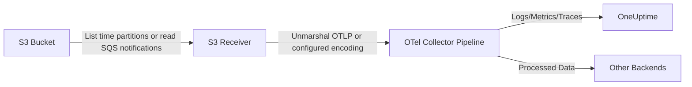

# How to Configure the AWS S3 Receiver in the OpenTelemetry Collector

Author: [nawazdhandala](https://www.github.com/nawazdhandala)

Tags: OpenTelemetry, Collector, AWS, S3, Log, Observability, Cloud Storage

Description: Configure the AWS S3 Receiver in OpenTelemetry Collector to ingest logs and telemetry data from S3 buckets with real YAML examples, IAM policies, and production-ready patterns.

---

> Have telemetry data sitting in S3 buckets but no way to analyze it? The AWS S3 Receiver transforms cold storage into live observability data by pulling logs and metrics directly from S3 into your OpenTelemetry pipeline.

The AWS S3 Receiver is a specialized OpenTelemetry Collector component that reads telemetry data stored in Amazon S3 buckets. This receiver is particularly useful for ingesting archived logs, batch processing telemetry data, or building data pipelines that consolidate multiple data sources into a unified observability platform.

---

## What is the AWS S3 Receiver?

The AWS S3 Receiver connects to Amazon S3 to read telemetry data files (logs, traces, metrics) and feed them into the OpenTelemetry Collector pipeline. It is commonly used with data previously written by the OpenTelemetry AWS S3 Exporter, but it can process any S3 objects that contain supported telemetry encodings. Unlike receivers that accept streaming data over the network, the S3 receiver operates on stored files, making it ideal for:

- **Historical data analysis**: Import past logs and metrics for trend analysis
- **Batch processing**: Process large volumes of telemetry data efficiently
- **Data migration**: Move telemetry from one system to another
- **Compliance and auditing**: Analyze archived logs for security investigations
- **Cost optimization**: Store telemetry in cheap S3 storage and process on-demand

### How It Works

The receiver has two supported retrieval modes. In time range mode, it lists and downloads objects whose keys match a configured S3 prefix and partition format between `starttime` and `endtime`. In SQS mode, it reads S3 object-created notifications from an SQS queue and downloads the referenced objects. It then unmarshals the object content as OTLP JSON, OTLP Protocol Buffers, or a configured encoding extension, and sends the resulting OpenTelemetry signals through your collector pipeline.


```mermaid
graph LR
    A[S3 Bucket] -->|List time partitions or read SQS notifications| B[S3 Receiver]
    B -->|Unmarshal OTLP or configured encoding| C[OTel Collector Pipeline]
    C -->|Logs/Metrics/Traces| D[OneUptime]
    C -->|Processed Data| E[Other Backends]
```

---

## Prerequisites

Before configuring the S3 receiver, ensure you have:

1. **AWS Account** with an S3 bucket containing telemetry data
2. **IAM Permissions** to list and read from the S3 bucket
3. **OpenTelemetry Collector Contrib** distribution or a custom Collector build that includes the `awss3receiver` component
4. **AWS Credentials** configured through the AWS SDK default credential chain, such as environment variables, IAM role, or credentials file
5. **Data format knowledge** - The receiver supports OTLP JSON (`.json`) and OTLP Protocol Buffers (`.binpb`) by default, with optional custom decoding through Collector encoding extensions

---

## Required IAM Permissions

The OpenTelemetry Collector needs specific IAM permissions to read from S3. Create an IAM policy with these permissions:

```json
{
  "Version": "2012-10-17",
  "Statement": [
    {
      "Effect": "Allow",
      "Action": [
        "s3:GetObject",
        "s3:ListBucket"
      ],
      "Resource": [
        "arn:aws:s3:::your-telemetry-bucket",
        "arn:aws:s3:::your-telemetry-bucket/*"
      ]
    },
    {
      "Effect": "Allow",
      "Action": [
        "s3:GetBucketLocation"
      ],
      "Resource": "arn:aws:s3:::your-telemetry-bucket"
    }
  ]
}
```

If you enable object tagging with `tag_object_after_ingestion` or `skip_ingesting_tagged_objects`, add these permissions:

```json
{
  "Effect": "Allow",
  "Action": [
    "s3:GetObjectTagging",
    "s3:PutObjectTagging"
  ],
  "Resource": "arn:aws:s3:::your-telemetry-bucket/*"
}
```

For SQS notification mode, the Collector also needs permission to receive and delete messages from the queue:

```json
{
  "Effect": "Allow",
  "Action": [
    "sqs:ReceiveMessage",
    "sqs:DeleteMessage"
  ],
  "Resource": "arn:aws:sqs:us-east-1:123456789012:telemetry-events"
}
```

Attach these policies to the IAM role used by your collector. If running on EC2 or ECS, use instance profiles or task roles. For external deployments, create an IAM user with access keys.

---

## Basic Configuration

Here's a minimal configuration to read OTLP JSON logs from an S3 bucket for a fixed time range:

```yaml
# Configure the S3 receiver to read log files

receivers:
  # The awss3 receiver pulls telemetry data from S3 buckets
  awss3:
    # Read objects from this time range
    starttime: "2026-02-05 00:00"
    endtime: "2026-02-06 00:00"

    s3downloader:
      # AWS region where the bucket is located
      region: us-east-1

      # S3 bucket containing your telemetry data
      s3_bucket: my-telemetry-logs

      # S3 key prefix to filter files
      s3_prefix: logs/application

      # Partition format used in the object keys
      s3_partition_format: "year=%Y/month=%m/day=%d/hour=%H"
      s3_partition_timezone: "UTC"

      # File prefix used by the writer, such as the awss3 exporter
      file_prefix: otel
      file_prefix_include_telemetry_type: true

# Configure where to send the processed logs
exporters:
  # Export to OneUptime
  otlphttp:
    endpoint: https://oneuptime.com/otlp
    headers:
      x-oneuptime-token: ${ONEUPTIME_TOKEN}

# Define the logs pipeline
service:
  pipelines:
    logs:
      receivers: [awss3]
      exporters: [otlphttp]
```

This basic configuration reads matching S3 objects between the configured start and end times, unmarshals `.json` objects as OTLP JSON logs, and sends the logs to OneUptime.

---

## Production Configuration with Processing

For production environments, add batching, enrichment, filtering, and object-ingestion checkpointing. This configuration demonstrates production best practices:

```yaml
receivers:
  awss3:
    starttime: "2026-02-05T00:00:00Z"
    endtime: "2026-02-06T00:00:00Z"

    # S3 bucket configuration
    s3downloader:
      region: us-west-2
      s3_bucket: production-telemetry-logs
      s3_prefix: logs/prod
      s3_partition_format: "year=%Y/month=%m/day=%d/hour=%H/minute=%M"
      s3_partition_timezone: "UTC"
      file_prefix: otel
      file_prefix_include_telemetry_type: true

      # Mark successfully ingested objects with otel-collector:status=ingested
      tag_object_after_ingestion: true

      # Skip objects that already have the ingested tag
      skip_ingesting_tagged_objects: true

processors:
  # Protect collector from memory issues
  memory_limiter:
    limit_mib: 1024
    spike_limit_mib: 256
    check_interval: 5s

  # Add resource attributes to identify source
  resource:
    attributes:
      - key: source.type
        value: s3
        action: insert
      - key: cloud.provider
        value: aws
        action: insert
      - key: s3.bucket
        value: production-telemetry-logs
        action: insert

  # Filter out unnecessary logs to reduce costs
  filter/noise:
    error_mode: ignore
    log_conditions:
      - 'log.attributes["log.level"] == "DEBUG"'
      - 'IsMatch(log.body, ".*/health.*|.*/healthz.*|.*/ping.*")'

  # Batch logs before exporting
  batch:
    timeout: 10s
    send_batch_size: 1000
    send_batch_max_size: 2000

  # Add metadata if needed
  attributes/enrich:
    actions:
      # Add collector version
      - key: otel.collector.version
        value: "0.153.0"
        action: insert

exporters:
  # Primary export to OneUptime
  otlphttp/oneuptime:
    endpoint: https://oneuptime.com/otlp
    headers:
      x-oneuptime-token: ${ONEUPTIME_TOKEN}
    compression: gzip
    timeout: 30s
    retry_on_failure:
      enabled: true
      initial_interval: 5s
      max_interval: 30s
      max_elapsed_time: 300s

  # Backup to file for debugging
  file:
    path: /var/log/otel/processed-logs.json
    rotation:
      max_megabytes: 100
      max_backups: 3

service:
  # Enable collector telemetry
  telemetry:
    logs:
      level: info
    metrics:
      readers:
        - pull:
            exporter:
              prometheus:
                host: 0.0.0.0
                port: 8888

  pipelines:
    logs:
      receivers: [awss3]
      processors:
        - memory_limiter
        - resource
        - filter/noise
        - attributes/enrich
        - batch
      exporters:
        - otlphttp/oneuptime
        - file
```

This production configuration includes:

- **Compressed file support**: Processes `.json.gz` and `.binpb.gz` objects, and also supports `.zst` compression
- **Time-based reads**: Processes telemetry for an explicit time range
- **Tagging processed files**: Marks files as ingested without deletion
- **Filtering**: Removes debug logs and health checks
- **Enrichment**: Adds metadata about processing
- **Error handling**: Retries and fallback to file export

---

## Parsing Different Log Formats

The S3 receiver supports OTLP JSON and OTLP Protocol Buffers by default. For other formats, use an encoding extension that can unmarshal the content into OpenTelemetry data.

### OTLP JSON Logs

Most OpenTelemetry-native pipelines that write to S3 use OTLP JSON. Configuration for OTLP JSON:

```yaml
receivers:
  awss3:
    starttime: "2026-02-05"
    endtime: "2026-02-06"
    s3downloader:
      region: us-east-1
      s3_bucket: json-logs-bucket
      s3_prefix: logs
      s3_partition_format: "year=%Y/month=%m/day=%d/hour=%H"
      file_prefix: otel
      file_prefix_include_telemetry_type: true
```

Objects ending in `.json` are unmarshaled as OTLP JSON for the signal type of the pipeline that uses the receiver.

### OTLP Protocol Buffers

For more compact telemetry files, store OTLP Protocol Buffer payloads:

```yaml
receivers:
  awss3:
    starttime: "2026-02-05T00:00:00Z"
    endtime: "2026-02-06T00:00:00Z"
    s3downloader:
      region: us-east-1
      s3_bucket: proto-telemetry-bucket
      s3_prefix: telemetry
      s3_partition_format: "year=%Y/month=%m/day=%d/hour=%H/minute=%M"
      file_prefix: otel
      file_prefix_include_telemetry_type: true
```

Objects ending in `.binpb` are unmarshaled as OTLP Protocol Buffers. Files compressed as `.binpb.gz` or `.binpb.zst` are decompressed before unmarshaling.

### Custom Encodings

For custom formats, configure an encoding extension and map it to a suffix:

```yaml
extensions:
  text_encoding:
    encoding: utf8
    unmarshaling_separator: "\n"

receivers:
  awss3:
    starttime: "2026-02-05"
    endtime: "2026-02-06"
    s3downloader:
      region: us-east-1
      s3_bucket: text-logs-bucket
      s3_prefix: logs
      s3_partition_format: "year=%Y/month=%m/day=%d/hour=%H"
    encodings:
      - extension: text_encoding
        suffix: ".log.gz"

exporters:
  otlphttp:
    endpoint: https://oneuptime.com/otlp
    headers:
      x-oneuptime-token: ${ONEUPTIME_TOKEN}

service:
  extensions: [text_encoding]
  pipelines:
    logs:
      receivers: [awss3]
      exporters: [otlphttp]
```

The extension must be included in the Collector build and enabled under `service.extensions`.

---

## Processing S3 Event Notifications

For near-real-time processing, configure S3 to send event notifications when new files are uploaded. The collector reads the notifications from SQS and downloads the referenced S3 objects:

```yaml
receivers:
  awss3:
    s3downloader:
      s3_bucket: realtime-logs-bucket
      region: us-east-1
      s3_prefix: logs/

    # Enable S3 event notifications via SQS
    sqs:
      queue_url: https://sqs.us-east-1.amazonaws.com/123456789012/telemetry-events
      region: us-east-1

      # Maximum messages to receive per SQS request
      max_number_of_messages: 10

      # Wait time for SQS long polling
      wait_time_seconds: 20

exporters:
  otlphttp:
    endpoint: https://oneuptime.com/otlp
    headers:
      x-oneuptime-token: ${ONEUPTIME_TOKEN}

service:
  pipelines:
    logs:
      receivers: [awss3]
      exporters: [otlphttp]
```

### Setting Up S3 Event Notifications

1. Create an SQS queue for event notifications
2. Configure S3 bucket to send events to the queue:

```json
{
  "QueueConfigurations": [
    {
      "QueueArn": "arn:aws:sqs:us-east-1:123456789012:telemetry-events",
      "Events": ["s3:ObjectCreated:*"],
      "Filter": {
        "Key": {
          "FilterRules": [
            {
              "Name": "prefix",
              "Value": "logs/"
            },
            {
              "Name": "suffix",
              "Value": ".json"
            }
          ]
        }
      }
    }
  ]
}
```

3. Update SQS queue policy to allow S3 notifications:

```json
{
  "Version": "2012-10-17",
  "Statement": [
    {
      "Effect": "Allow",
      "Principal": {
        "Service": "s3.amazonaws.com"
      },
      "Action": "sqs:SendMessage",
      "Resource": "arn:aws:sqs:us-east-1:123456789012:telemetry-events",
      "Condition": {
        "ArnLike": {
          "aws:SourceArn": "arn:aws:s3:::realtime-logs-bucket"
        }
      }
    }
  ]
}
```

---

## Multi-Bucket Configuration

Process telemetry from multiple S3 buckets by defining multiple receivers:

```yaml
receivers:
  # Application logs from production
  awss3/prod_logs:
    starttime: "2026-02-05"
    endtime: "2026-02-06"
    s3downloader:
      region: us-east-1
      s3_bucket: prod-app-logs
      s3_prefix: logs
      s3_partition_format: "year=%Y/month=%m/day=%d/hour=%H"
      file_prefix: otel
      file_prefix_include_telemetry_type: true

  # Application logs from staging
  awss3/staging_logs:
    starttime: "2026-02-05"
    endtime: "2026-02-06"
    s3downloader:
      region: us-east-1
      s3_bucket: staging-app-logs
      s3_prefix: logs
      s3_partition_format: "year=%Y/month=%m/day=%d/hour=%H"
      file_prefix: otel
      file_prefix_include_telemetry_type: true

  # Archived metrics from data warehouse
  awss3/metrics_archive:
    starttime: "2026-02-05"
    endtime: "2026-02-06"
    s3downloader:
      region: us-west-2
      s3_bucket: metrics-archive
      s3_prefix: metrics
      s3_partition_format: "year=%Y/month=%m/day=%d/hour=%H"
      file_prefix: otel
      file_prefix_include_telemetry_type: true

processors:
  # Tag production logs
  resource/prod:
    attributes:
      - key: deployment.environment
        value: production
        action: insert

  # Tag staging logs
  resource/staging:
    attributes:
      - key: deployment.environment
        value: staging
        action: insert

exporters:
  otlphttp:
    endpoint: https://oneuptime.com/otlp
    headers:
      x-oneuptime-token: ${ONEUPTIME_TOKEN}

service:
  pipelines:
    # Production logs pipeline
    logs/prod:
      receivers: [awss3/prod_logs]
      processors: [resource/prod]
      exporters: [otlphttp]

    # Staging logs pipeline
    logs/staging:
      receivers: [awss3/staging_logs]
      processors: [resource/staging]
      exporters: [otlphttp]

    # Metrics pipeline
    metrics:
      receivers: [awss3/metrics_archive]
      exporters: [otlphttp]
```

---

## Deployment Patterns

### Pattern 1: Scheduled Batch Processing

Run the collector on a schedule (cron job, ECS scheduled task, or Kubernetes CronJob) to process logs periodically:

```yaml
receivers:
  awss3:
    # Process a fixed batch window
    starttime: "2026-02-05 00:00"
    endtime: "2026-02-06 00:00"
    s3downloader:
      region: us-east-1
      s3_bucket: batch-logs
      s3_prefix: logs
      s3_partition_format: "year=%Y/month=%m/day=%d/hour=%H"
      file_prefix: otel
      file_prefix_include_telemetry_type: true
      tag_object_after_ingestion: true

exporters:
  otlphttp:
    endpoint: https://oneuptime.com/otlp
    headers:
      x-oneuptime-token: ${ONEUPTIME_TOKEN}

service:
  pipelines:
    logs:
      receivers: [awss3]
      exporters: [otlphttp]
```

Deploy as a containerized scheduled task and pass the time window in the generated Collector configuration before startup.

### Pattern 2: Continuous Processing

Run the collector as a long-running service (ECS, Kubernetes, EC2) with SQS event notifications for near-real-time processing:

```yaml
receivers:
  awss3:
    s3downloader:
      region: us-east-1
      s3_bucket: continuous-logs
      s3_prefix: logs/
      skip_ingesting_tagged_objects: true
      tag_object_after_ingestion: true
    sqs:
      queue_url: https://sqs.us-east-1.amazonaws.com/123456789012/log-events
      region: us-east-1
      max_number_of_messages: 10
      wait_time_seconds: 20

exporters:
  otlphttp:
    endpoint: https://oneuptime.com/otlp
    headers:
      x-oneuptime-token: ${ONEUPTIME_TOKEN}

service:
  pipelines:
    logs:
      receivers: [awss3]
      exporters: [otlphttp]
```

### Pattern 3: Data Migration

One-time migration of historical data from S3 to a new observability platform:

```yaml
receivers:
  awss3:
    # Process historical data for a specific range
    starttime: "2026-01-01"
    endtime: "2026-02-01"
    s3downloader:
      region: us-east-1
      s3_bucket: historical-telemetry
      s3_prefix: archive
      s3_partition_format: "year=%Y/month=%m/day=%d/hour=%H"
      s3_partition_timezone: "UTC"
      file_prefix: otel
      file_prefix_include_telemetry_type: true

exporters:
  otlphttp/oneuptime:
    endpoint: https://oneuptime.com/otlp
    headers:
      x-oneuptime-token: ${ONEUPTIME_TOKEN}
    timeout: 60s

processors:
  batch:
    timeout: 30s
    send_batch_size: 5000
    send_batch_max_size: 10000

service:
  pipelines:
    logs:
      receivers: [awss3]
      processors: [batch]
      exporters: [otlphttp/oneuptime]
```

---

## Monitoring and Troubleshooting

### Enable Collector Metrics

Monitor the S3 receiver's performance by exposing internal metrics:

```yaml
service:
  telemetry:
    logs:
      level: info
    metrics:
      readers:
        - pull:
            exporter:
              prometheus:
                host: 0.0.0.0
                port: 8888
                without_type_suffix: true
                without_units: true
```

Key metrics to monitor:

- `otelcol_receiver_accepted_log_records` - Logs successfully received
- `otelcol_receiver_refused_log_records` - Logs rejected due to errors
- `otelcol_exporter_sent_log_records` - Logs successfully exported
- `otelcol_exporter_send_failed_log_records` - Export failures

### Common Issues and Solutions

#### Issue: High Memory Usage

**Cause**: Processing large files or a large historical time range

**Solution**: Process a smaller time range and add memory limiter:

```yaml
receivers:
  awss3:
    starttime: "2026-02-05 00:00"
    endtime: "2026-02-05 06:00"

processors:
  memory_limiter:
    limit_mib: 512
    check_interval: 1s
```

#### Issue: Files Not Being Processed

**Cause**: IAM permissions, incorrect prefix, unsupported file suffix, or mismatched partition format

**Solution**: Enable debug logging and verify permissions:

```yaml
service:
  telemetry:
    logs:
      level: debug
```

Check logs for errors like:
- `AccessDenied` - IAM permissions issue
- `NoSuchBucket` - Bucket name incorrect
- `Unsupported file format` - Object suffix is not `.json`, `.binpb`, or a configured encoding suffix
- Empty reads for a partition prefix - Prefix, `s3_partition_format`, or time range does not match the object keys

#### Issue: Duplicate Data

**Cause**: Collector reprocessing same files

**Solution**: Enable processed file tagging:

```yaml
receivers:
  awss3:
    s3downloader:
      tag_object_after_ingestion: true
      skip_ingesting_tagged_objects: true
```

---

## Cost Optimization

S3 data transfer and API calls can add up. Optimize costs with these strategies:

### 1. Use S3 Lifecycle Policies

Automatically transition old logs to cheaper storage classes:

```json
{
  "Rules": [
    {
      "Id": "TransitionOldLogs",
      "Status": "Enabled",
      "Transitions": [
        {
          "Days": 30,
          "StorageClass": "STANDARD_IA"
        },
        {
          "Days": 90,
          "StorageClass": "GLACIER"
        }
      ]
    }
  ]
}
```

### 2. Process Smaller Time Ranges

For non-urgent data, process bounded time windows:

```yaml
receivers:
  awss3:
    starttime: "2026-02-05 00:00"
    endtime: "2026-02-05 01:00"
```

### 3. Filter Before Processing

Only download and process files under the prefixes you need:

```yaml
receivers:
  awss3:
    s3downloader:
      # Use specific prefix to limit files
      s3_prefix: logs/errors
      s3_partition_format: "year=%Y/month=%m/day=%d/hour=%H"
```

### 4. Use S3 Select (Future Enhancement)

S3 Select allows filtering data before download, reducing transfer costs. While not supported in the receiver, watch for this feature in future releases.

---

## Integration with OneUptime

OneUptime seamlessly ingests logs from the S3 receiver. Once configured, you can:

- **Search historical logs**: Query logs imported from S3 archives
- **Create dashboards**: Visualize trends from batch-processed data
- **Set up alerts**: Alert on patterns in archived logs
- **Correlate with live data**: Combine historical S3 data with real-time telemetry

Example OneUptime query for S3-sourced logs:

```text
source.type = "s3" AND log.level = "ERROR" AND s3.bucket = "production-logs"
```

---

## Related Resources

- [How to Configure AWS ECS Container Metrics Receiver](https://oneuptime.com/blog/post/2026-02-06-aws-ecs-container-metrics-receiver-opentelemetry-collector/view)
- [OpenTelemetry Collector: What It Is and When You Need It](https://oneuptime.com/blog/post/2025-09-18-what-is-opentelemetry-collector-and-why-use-one/view)
- [How to Structure Logs Properly in OpenTelemetry](https://oneuptime.com/blog/post/2025-08-28-how-to-structure-logs-properly-in-opentelemetry/view)

---

## Conclusion

The AWS S3 Receiver unlocks the value of telemetry data stored in S3 buckets. Whether you're performing historical analysis, migrating between observability platforms, or building batch processing pipelines, this receiver provides the flexibility to work with S3-based telemetry data.

Start with basic time range configuration for simple use cases, then add event-driven processing, multi-bucket support, and cost optimization as your needs grow. With proper IAM permissions, encoding configuration, and monitoring, you'll have a production-ready S3 ingestion pipeline that scales with your data volume.

The combination of cheap S3 storage with on-demand processing through OpenTelemetry provides a cost-effective approach to long-term telemetry retention and analysis.

---

**Need to process S3 telemetry data?** OneUptime provides native support for OpenTelemetry logs, metrics, and traces from any source, including S3. Start analyzing your archived telemetry today.
