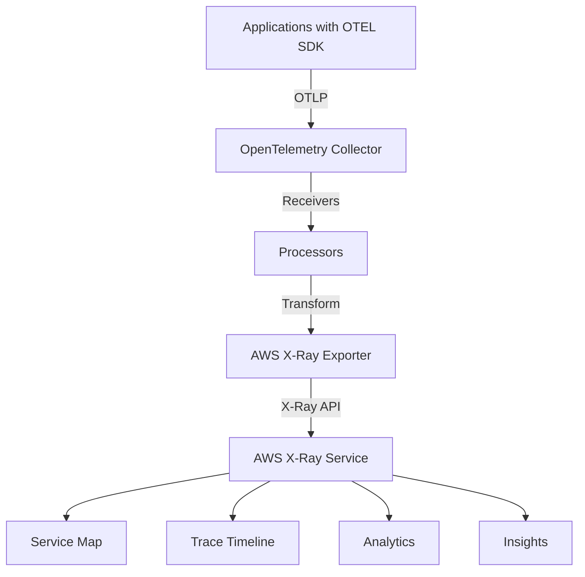

# How to Configure the AWS X-Ray Exporter in the OpenTelemetry Collector

Author: [nawazdhandala](https://www.github.com/nawazdhandala)

Tags: OpenTelemetry, Collector, Exporters, AWS, X-Ray, Distributed Tracing, Cloud

Description: Comprehensive guide to configuring the AWS X-Ray exporter in OpenTelemetry Collector for distributed tracing in AWS environments with IAM roles, VPC endpoints, and service graphs.

AWS X-Ray provides distributed tracing capabilities for applications running on AWS infrastructure. The OpenTelemetry Collector's X-Ray exporter enables you to send trace data collected through OpenTelemetry instrumentation to AWS X-Ray, allowing you to analyze request flows, identify performance bottlenecks, and troubleshoot issues across your AWS services.

## Why Use OpenTelemetry with AWS X-Ray

Integrating OpenTelemetry with AWS X-Ray offers several advantages:

- **Vendor-neutral instrumentation**: Use OpenTelemetry SDKs instead of AWS-specific libraries
- **Multi-backend support**: Send the same telemetry to X-Ray and other backends simultaneously
- **Enhanced processing**: Apply filters, sampling, and transformations before export
- **Unified collection**: Collect traces, metrics, and logs through a single pipeline
- **Cloud-native integration**: Seamlessly integrate with AWS services like ECS, EKS, Lambda, and EC2

## Architecture Overview

The X-Ray exporter transforms OpenTelemetry spans into X-Ray segment documents:



## Prerequisites

Before configuring the AWS X-Ray exporter, you need:

- OpenTelemetry Collector Contrib distribution
- AWS account with X-Ray enabled
- IAM credentials or role with X-Ray write permissions
- Network connectivity to AWS X-Ray endpoints (regional or VPC endpoint)

## IAM Permissions

Create an IAM policy with necessary X-Ray permissions:

```json
{
  "Version": "2012-10-17",
  "Statement": [
    {
      "Effect": "Allow",
      "Action": [
        "xray:PutTraceSegments",
        "xray:PutTelemetryRecords"
      ],
      "Resource": "*"
    }
  ]
}
```

For EC2 instances or ECS tasks, attach this policy to an IAM role and associate it with your compute resource. For local development, configure AWS credentials using the AWS CLI or environment variables.

## Basic Configuration

Here is a minimal configuration for sending traces to AWS X-Ray:

```yaml
# Basic AWS X-Ray exporter configuration
exporters:
  awsxray:
    # AWS region where X-Ray data should be sent
    region: us-east-1

receivers:
  otlp:
    protocols:
      grpc:
        endpoint: 0.0.0.0:4317

processors:
  batch:
    timeout: 10s
    send_batch_size: 50

service:
  pipelines:
    traces:
      receivers: [otlp]
      processors: [batch]
      exporters: [awsxray]
```

This configuration uses the default AWS credential chain, which checks:

1. Environment variables (AWS_ACCESS_KEY_ID, AWS_SECRET_ACCESS_KEY)
2. Shared credentials file (~/.aws/credentials)
3. IAM role for ECS tasks
4. IAM role for EC2 instances

## Configuration with Explicit Credentials

For non-production environments, you can specify credentials explicitly:

```yaml
exporters:
  awsxray:
    region: us-east-1

    # AWS credentials (not recommended for production)
    aws_auth:
      access_key_id: ${AWS_ACCESS_KEY_ID}
      secret_access_key: ${AWS_SECRET_ACCESS_KEY}

      # Optional session token for temporary credentials
      session_token: ${AWS_SESSION_TOKEN}

receivers:
  otlp:
    protocols:
      grpc:
        endpoint: 0.0.0.0:4317

processors:
  batch:
    timeout: 10s
    send_batch_size: 50

service:
  pipelines:
    traces:
      receivers: [otlp]
      processors: [batch]
      exporters: [awsxray]
```

For production, use IAM roles instead of hardcoded credentials.

## IAM Role Configuration

For EC2 instances or ECS tasks using IAM roles:

```yaml
exporters:
  awsxray:
    region: us-east-1

    # Specify IAM role ARN (optional, will use instance role if not specified)
    role_arn: arn:aws:iam::123456789012:role/OtelCollectorXRayRole

receivers:
  otlp:
    protocols:
      grpc:
        endpoint: 0.0.0.0:4317

processors:
  batch:
    timeout: 10s
    send_batch_size: 50

service:
  pipelines:
    traces:
      receivers: [otlp]
      processors: [batch]
      exporters: [awsxray]
```

## Advanced Configuration with Resource Attributes

Configure the exporter to properly map OpenTelemetry resource attributes to X-Ray fields:

```yaml
exporters:
  awsxray:
    region: us-east-1

    # Index all attributes for searchability in X-Ray
    indexed_attributes:
      - http.method
      - http.status_code
      - aws.operation
      - error
      - fault

    # Resource ARN for AWS resources
    resource_arn: arn:aws:ecs:us-east-1:123456789012:service/my-service

processors:
  # Add resource attributes
  resource:
    attributes:
      - key: cloud.provider
        value: aws
        action: insert
      - key: cloud.platform
        value: aws_ecs
        action: insert
      - key: cloud.region
        value: us-east-1
        action: insert
      - key: service.name
        value: api-gateway
        action: insert
      - key: service.namespace
        value: production
        action: insert

  batch:
    timeout: 10s
    send_batch_size: 50

receivers:
  otlp:
    protocols:
      grpc:
        endpoint: 0.0.0.0:4317

service:
  pipelines:
    traces:
      receivers: [otlp]
      processors: [resource, batch]
      exporters: [awsxray]
```

The `indexed_attributes` configuration makes these attributes searchable in the X-Ray console filter expressions.

## ECS and EKS Configuration

For containerized environments, configure the exporter with cloud resource detection:

```yaml
extensions:
  # ECS resource detection
  ecs_observer:
    refresh_interval: 10s

processors:
  # Detect AWS resource attributes
  resourcedetection:
    detectors:
      - env
      - system
      - ecs
      - ec2
    timeout: 5s
    override: false

  # Transform attributes for X-Ray
  attributes:
    actions:
      # Map container ID
      - key: aws.ecs.container.id
        from_attribute: container.id
        action: upsert

      # Map cluster name
      - key: aws.ecs.cluster.name
        from_attribute: cloud.resource_id
        action: upsert

      # Map task ARN
      - key: aws.ecs.task.arn
        from_attribute: aws.ecs.task.arn
        action: upsert

  batch:
    timeout: 10s
    send_batch_size: 50

exporters:
  awsxray:
    region: us-east-1

    indexed_attributes:
      - aws.ecs.cluster.name
      - aws.ecs.task.arn
      - http.method
      - http.status_code

receivers:
  otlp:
    protocols:
      grpc:
        endpoint: 0.0.0.0:4317

service:
  extensions: [ecs_observer]

  pipelines:
    traces:
      receivers: [otlp]
      processors: [resourcedetection, attributes, batch]
      exporters: [awsxray]
```

## VPC Endpoint Configuration

For private subnets without internet access, use VPC endpoints:

```yaml
exporters:
  awsxray:
    region: us-east-1

    # Custom endpoint for VPC endpoint
    endpoint: https://vpce-1234567-abcdefg.xray.us-east-1.vpce.amazonaws.com

    # Disable endpoint resolution
    no_verify_ssl: false

receivers:
  otlp:
    protocols:
      grpc:
        endpoint: 0.0.0.0:4317

processors:
  batch:
    timeout: 10s
    send_batch_size: 50

service:
  pipelines:
    traces:
      receivers: [otlp]
      processors: [batch]
      exporters: [awsxray]
```

Create the X-Ray VPC endpoint in your AWS Console:

```bash
aws ec2 create-vpc-endpoint \
  --vpc-id vpc-12345678 \
  --service-name com.amazonaws.us-east-1.xray \
  --route-table-ids rtb-12345678 \
  --subnet-ids subnet-12345678 subnet-87654321
```

## Multi-Region Configuration

Deploy collectors in multiple regions, each sending to their regional X-Ray endpoint:

```yaml
exporters:
  # US East 1
  awsxray/us-east-1:
    region: us-east-1

  # US West 2
  awsxray/us-west-2:
    region: us-west-2

  # EU West 1
  awsxray/eu-west-1:
    region: eu-west-1

processors:
  # Route based on region attribute
  routing:
    from_attribute: cloud.region
    table:
      - value: us-east-1
        exporters: [awsxray/us-east-1]
      - value: us-west-2
        exporters: [awsxray/us-west-2]
      - value: eu-west-1
        exporters: [awsxray/eu-west-1]
    default_exporters: [awsxray/us-east-1]

  batch:
    timeout: 10s
    send_batch_size: 50

receivers:
  otlp:
    protocols:
      grpc:
        endpoint: 0.0.0.0:4317

service:
  pipelines:
    traces:
      receivers: [otlp]
      processors: [batch, routing]
      exporters: [awsxray/us-east-1, awsxray/us-west-2, awsxray/eu-west-1]
```

## Complete Production Configuration

A comprehensive configuration for production deployments:

```yaml
extensions:
  health_check:
    endpoint: 0.0.0.0:13133

  pprof:
    endpoint: localhost:1777

receivers:
  otlp:
    protocols:
      grpc:
        endpoint: 0.0.0.0:4317
        max_recv_msg_size_mib: 32
      http:
        endpoint: 0.0.0.0:4318

processors:
  # Memory protection
  memory_limiter:
    check_interval: 1s
    limit_mib: 1024
    spike_limit_mib: 256

  # AWS resource detection
  resourcedetection:
    detectors:
      - env
      - system
      - ecs
      - ec2
      - eks
    timeout: 5s
    override: false

  # Transform for X-Ray compatibility
  transform:
    trace_statements:
      - context: span
        statements:
          # Convert HTTP status codes to X-Ray conventions
          - set(status.code, 1) where attributes["http.status_code"] >= 400 and attributes["http.status_code"] < 500
          - set(status.code, 2) where attributes["http.status_code"] >= 500

          # Set error flag
          - set(attributes["error"], true) where attributes["http.status_code"] >= 400

          # Set fault flag for 5xx errors
          - set(attributes["fault"], true) where attributes["http.status_code"] >= 500

  # Add standard attributes
  resource:
    attributes:
      - key: deployment.environment
        value: production
        action: insert
      - key: telemetry.sdk.name
        value: opentelemetry
        action: insert

  # Sampling for cost control
  tail_sampling:
    decision_wait: 10s
    num_traces: 100000
    policies:
      # Always sample errors
      - name: errors
        type: status_code
        status_code:
          status_codes: [ERROR]

      # Sample slow traces
      - name: slow-traces
        type: latency
        latency:
          threshold_ms: 1000

      # Probabilistic sampling
      - name: probabilistic
        type: probabilistic
        probabilistic:
          sampling_percentage: 10

  # Batch for efficiency
  batch:
    timeout: 10s
    send_batch_size: 50
    send_batch_max_size: 100

exporters:
  awsxray:
    region: us-east-1

    # Indexed attributes for filtering in X-Ray console
    indexed_attributes:
      - http.method
      - http.status_code
      - http.url
      - http.target
      - error
      - fault
      - aws.operation
      - aws.service
      - aws.region
      - db.system
      - db.name
      - messaging.system
      - rpc.service

    # Telemetry configuration
    telemetry:
      enabled: true
      include_metadata: true

    # Retry configuration
    retry_on_failure:
      enabled: true
      initial_interval: 5s
      max_interval: 30s
      max_elapsed_time: 300s

    # Queue configuration
    sending_queue:
      enabled: true
      num_consumers: 10
      queue_size: 1000

service:
  extensions: [health_check, pprof]

  telemetry:
    logs:
      level: info
      output_paths:
        - stdout
        - /var/log/otel-collector.log

    metrics:
      level: detailed
      address: 0.0.0.0:8888

  pipelines:
    traces:
      receivers: [otlp]
      processors:
        - memory_limiter
        - resourcedetection
        - resource
        - transform
        - tail_sampling
        - batch
      exporters: [awsxray]
```

## Lambda Function Configuration

For AWS Lambda, use the Lambda layer and configure the exporter:

```yaml
exporters:
  awsxray:
    region: us-east-1

    # Lambda-specific configuration
    telemetry:
      enabled: true

receivers:
  otlp:
    protocols:
      grpc:
        endpoint: localhost:4317

processors:
  batch:
    timeout: 1s
    send_batch_size: 10

service:
  pipelines:
    traces:
      receivers: [otlp]
      processors: [batch]
      exporters: [awsxray]
```

Deploy the collector as a Lambda layer or sidecar container in your Lambda function.

## Service Graph Configuration

X-Ray automatically generates service graphs from trace data. Ensure proper service naming:

```yaml
processors:
  # Ensure consistent service naming
  resource:
    attributes:
      - key: service.name
        from_attribute: aws.ecs.service.name
        action: insert

      # Add service namespace
      - key: service.namespace
        value: production
        action: insert

exporters:
  awsxray:
    region: us-east-1

    # Include service graph data
    telemetry:
      enabled: true
      include_metadata: true

service:
  pipelines:
    traces:
      receivers: [otlp]
      processors: [resource, batch]
      exporters: [awsxray]
```

## Hybrid Configuration with Multiple Backends

Send traces to both X-Ray and another observability backend:

```yaml
exporters:
  # AWS X-Ray
  awsxray:
    region: us-east-1
    indexed_attributes:
      - http.method
      - http.status_code

  # Additional backend (e.g., Elasticsearch)
  otlphttp:
    endpoint: https://observability.example.com:4318
    tls:
      insecure: false

processors:
  batch:
    timeout: 10s
    send_batch_size: 50

receivers:
  otlp:
    protocols:
      grpc:
        endpoint: 0.0.0.0:4317

service:
  pipelines:
    traces:
      receivers: [otlp]
      processors: [batch]
      # Send to both exporters
      exporters: [awsxray, otlphttp]
```

## Monitoring and Troubleshooting

Monitor the X-Ray exporter using metrics on port 8888:

- `otelcol_exporter_sent_spans`: Successfully exported spans
- `otelcol_exporter_send_failed_spans`: Failed exports
- `otelcol_exporter_queue_size`: Current queue size

Common issues and solutions:

**Access Denied errors**: Verify IAM role has `xray:PutTraceSegments` permission

**Timeout errors**: Check network connectivity to X-Ray endpoints and consider using VPC endpoints

**Missing traces**: Verify batch size is not too small, causing excessive API calls and throttling

**High costs**: Implement tail sampling to reduce trace volume

## X-Ray Console Queries

Once data is flowing, query traces in the X-Ray console:

```
# Find slow requests
responsetime > 3

# Find errors
error = true

# Filter by HTTP method
http.method = "POST"

# Filter by service
service(id(name: "api-gateway", type: "AWS::ECS::Service"))

# Composite filters
http.status_code >= 500 AND responsetime > 1
```

## Cost Optimization

Reduce X-Ray costs with these strategies:

- **Implement sampling**: Use tail sampling to keep only valuable traces
- **Filter health checks**: Remove noisy endpoints before export
- **Use indexed attributes wisely**: Only index attributes you'll query frequently
- **Set appropriate batch sizes**: Reduce API call frequency
- **Monitor usage**: Use AWS Cost Explorer to track X-Ray costs

## Integration with AWS Services

The X-Ray exporter automatically correlates with AWS services:

- **API Gateway**: View API request traces
- **Lambda**: Trace function executions and cold starts
- **DynamoDB**: See database operation latencies
- **SNS/SQS**: Track message propagation
- **ECS/EKS**: Monitor container performance

Ensure your OpenTelemetry instrumentation includes AWS SDK instrumentation for full correlation.

## Conclusion

The AWS X-Ray exporter enables you to leverage OpenTelemetry's vendor-neutral instrumentation while benefiting from X-Ray's deep AWS integration. This configuration provides a scalable foundation for distributed tracing in AWS environments, with the flexibility to send data to multiple backends.

By centralizing trace collection in the OpenTelemetry Collector, you gain powerful processing capabilities, cost optimization through sampling and filtering, and the ability to correlate telemetry across your entire AWS infrastructure. The service graphs and analytics in X-Ray provide valuable insights into your application's behavior and dependencies.

For information about other AWS exporters, see our guides on the [AWS CloudWatch Logs exporter](https://oneuptime.com/blog/post/aws-cloudwatch-logs-exporter-opentelemetry-collector/view) and [AWS Kinesis exporter](https://oneuptime.com/blog/post/aws-kinesis-exporter-opentelemetry-collector/view).
