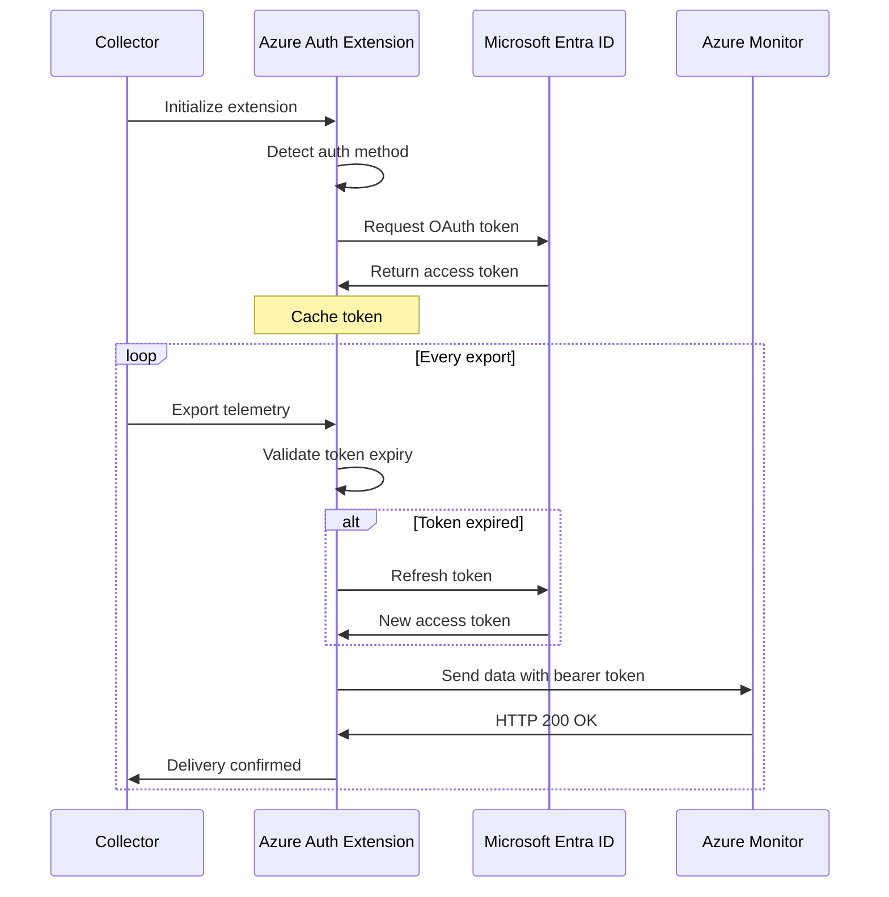

# How to Configure Azure Auth Extension in the OpenTelemetry Collector

Author: [nawazdhandala](https://www.github.com/nawazdhandala)

Tags: OpenTelemetry, Collector, Extensions, Azure, Authentication, Microsoft, Cloud Security

Description: Complete guide to configuring Azure authentication extension in OpenTelemetry Collector for secure access to Azure Monitor and other Microsoft cloud services.

Authenticating with Azure services from your OpenTelemetry Collector requires proper configuration of Azure Active Directory credentials. The Azure Auth extension provides a streamlined way to authenticate using managed identities, service principals, and Azure CLI credentials.

## Understanding the Azure Auth Extension

The Azure Auth extension enables the OpenTelemetry Collector to authenticate with Azure services using Azure Active Directory (now Microsoft Entra ID). This extension is particularly important when exporting telemetry data to Azure Monitor, Application Insights, or other Azure observability services.

The extension implements Microsoft's authentication protocols and automatically manages token acquisition and refresh, ensuring your collector maintains authenticated connections without manual intervention.

## Supported Authentication Methods

The Azure Auth extension supports multiple authentication mechanisms to accommodate different deployment scenarios:

**Managed Identity**: The recommended approach for Azure-hosted resources like Virtual Machines, AKS, App Service, and Azure Functions. Eliminates the need to manage credentials.

**Service Principal with Client Secret**: Uses an application ID and secret for authentication, suitable for non-Azure environments or CI/CD pipelines.

**Service Principal with Certificate**: More secure than client secrets, uses X.509 certificates for authentication.

**Azure CLI Credentials**: Leverages credentials from the local Azure CLI installation, useful for development and testing.

## Basic Configuration with Managed Identity

When running on Azure infrastructure, managed identity is the simplest and most secure authentication method.

```yaml
# collector-config.yaml
extensions:
  # Configure Azure auth with system-assigned managed identity
  azureauth:
    # Resource to authenticate against (typically Azure Monitor)
    resource: "https://monitor.azure.com"

    # Use system-assigned managed identity (default behavior)
    # No additional credentials needed

receivers:
  otlp:
    protocols:
      grpc:
        endpoint: 0.0.0.0:4317

processors:
  batch:
    timeout: 10s
    send_batch_size: 1024

exporters:
  # Azure Monitor exporter using the auth extension
  azuremonitor:
    auth:
      authenticator: azureauth
    instrumentation_key: "your-instrumentation-key"

    # Optional: specify endpoint
    endpoint: "https://dc.services.visualstudio.com/v2/track"

service:
  extensions: [azureauth]
  pipelines:
    traces:
      receivers: [otlp]
      processors: [batch]
      exporters: [azuremonitor]
    metrics:
      receivers: [otlp]
      processors: [batch]
      exporters: [azuremonitor]
```

This configuration automatically uses the system-assigned managed identity attached to your Azure resource. Ensure the managed identity has the "Monitoring Metrics Publisher" role on the target resources.

## Using User-Assigned Managed Identity

For environments with multiple managed identities, specify which user-assigned identity to use:

```yaml
extensions:
  azureauth:
    resource: "https://monitor.azure.com"

    # Specify a user-assigned managed identity
    client_id: "12345678-1234-1234-1234-123456789abc"

receivers:
  otlp:
    protocols:
      grpc:
        endpoint: 0.0.0.0:4317

processors:
  batch:
    timeout: 10s

  # Add resource attributes for better observability
  resource:
    attributes:
      - key: deployment.environment
        value: "production"
        action: upsert
      - key: cloud.provider
        value: "azure"
        action: upsert

exporters:
  azuremonitor:
    auth:
      authenticator: azureauth
    instrumentation_key: "your-instrumentation-key"

service:
  extensions: [azureauth]
  pipelines:
    traces:
      receivers: [otlp]
      processors: [resource, batch]
      exporters: [azuremonitor]
```

The `client_id` identifies the specific user-assigned managed identity to use for authentication. You can find this ID in the Azure portal under the managed identity resource.

## Service Principal Authentication

For collectors running outside Azure or in environments without managed identity support, use service principal authentication:

```yaml
extensions:
  azureauth:
    resource: "https://monitor.azure.com"

    # Service principal credentials
    tenant_id: "your-tenant-id"
    client_id: "your-app-id"

    # Option 1: Client secret (less secure, easier to set up)
    client_secret: "your-client-secret"

receivers:
  otlp:
    protocols:
      grpc:
        endpoint: 0.0.0.0:4317
      http:
        endpoint: 0.0.0.0:4318

processors:
  batch:
    timeout: 10s
    send_batch_size: 1024

  # Add memory limiter to prevent OOM
  memory_limiter:
    check_interval: 1s
    limit_mib: 512

exporters:
  azuremonitor:
    auth:
      authenticator: azureauth
    instrumentation_key: "your-instrumentation-key"

service:
  extensions: [azureauth]
  pipelines:
    traces:
      receivers: [otlp]
      processors: [memory_limiter, batch]
      exporters: [azuremonitor]
    metrics:
      receivers: [otlp]
      processors: [memory_limiter, batch]
      exporters: [azuremonitor]
```

To create a service principal and obtain credentials:

```bash
# Create service principal
az ad sp create-for-rbac --name "otel-collector-sp" \
  --role "Monitoring Metrics Publisher" \
  --scopes /subscriptions/YOUR_SUBSCRIPTION_ID

# Output will contain tenant_id, client_id (appId), and client_secret (password)
```

## Certificate-Based Authentication

For enhanced security, use certificate-based authentication instead of client secrets:

```yaml
extensions:
  azureauth:
    resource: "https://monitor.azure.com"

    # Service principal with certificate
    tenant_id: "your-tenant-id"
    client_id: "your-app-id"

    # Option 2: Client certificate (more secure)
    client_certificate_path: "/path/to/certificate.pem"
    # Optional: if certificate is password-protected
    client_certificate_password: "cert-password"

receivers:
  otlp:
    protocols:
      grpc:
        endpoint: 0.0.0.0:4317

processors:
  batch:
    timeout: 10s

exporters:
  azuremonitor:
    auth:
      authenticator: azureauth
    instrumentation_key: "your-instrumentation-key"

service:
  extensions: [azureauth]
  pipelines:
    traces:
      receivers: [otlp]
      processors: [batch]
      exporters: [azuremonitor]
```

To configure certificate authentication, first create and upload a certificate to your service principal in the Azure portal.

## Authentication Flow Architecture

Here's how the Azure Auth extension manages the authentication lifecycle:



## Multi-Resource Authentication

Configure separate authenticators for different Azure resources or subscriptions:

```yaml
extensions:
  # Authentication for Azure Monitor
  azureauth/monitor:
    resource: "https://monitor.azure.com"
    tenant_id: "tenant-1"
    client_id: "client-1"
    client_secret: "${AZURE_CLIENT_SECRET_1}"

  # Authentication for Azure Event Hubs
  azureauth/eventhub:
    resource: "https://eventhubs.azure.net"
    tenant_id: "tenant-2"
    client_id: "client-2"
    client_secret: "${AZURE_CLIENT_SECRET_2}"

receivers:
  otlp:
    protocols:
      grpc:
        endpoint: 0.0.0.0:4317

processors:
  batch:
    timeout: 10s

exporters:
  # Export metrics to Azure Monitor
  azuremonitor:
    auth:
      authenticator: azureauth/monitor
    instrumentation_key: "your-instrumentation-key"

  # Export logs to Event Hubs
  azureeventhubs:
    auth:
      authenticator: azureauth/eventhub
    connection_string: "Endpoint=sb://your-namespace.servicebus.windows.net/;EntityPath=your-hub"

service:
  extensions: [azureauth/monitor, azureauth/eventhub]
  pipelines:
    metrics:
      receivers: [otlp]
      processors: [batch]
      exporters: [azuremonitor]
    logs:
      receivers: [otlp]
      processors: [batch]
      exporters: [azureeventhubs]
```

This configuration demonstrates how to authenticate with multiple Azure services simultaneously, each potentially using different credentials or tenants.

## Using Environment Variables for Secrets

Store sensitive credentials in environment variables instead of hardcoding them:

```yaml
extensions:
  azureauth:
    resource: "https://monitor.azure.com"
    tenant_id: "${AZURE_TENANT_ID}"
    client_id: "${AZURE_CLIENT_ID}"
    client_secret: "${AZURE_CLIENT_SECRET}"

receivers:
  otlp:
    protocols:
      grpc:
        endpoint: 0.0.0.0:4317

processors:
  batch:
    timeout: 10s

exporters:
  azuremonitor:
    auth:
      authenticator: azureauth
    instrumentation_key: "${AZURE_INSTRUMENTATION_KEY}"

service:
  extensions: [azureauth]
  pipelines:
    traces:
      receivers: [otlp]
      processors: [batch]
      exporters: [azuremonitor]
```

Set the environment variables before starting the collector:

```bash
export AZURE_TENANT_ID="your-tenant-id"
export AZURE_CLIENT_ID="your-client-id"
export AZURE_CLIENT_SECRET="your-client-secret"
export AZURE_INSTRUMENTATION_KEY="your-instrumentation-key"

# Start the collector
./otelcol --config=collector-config.yaml
```

## Kubernetes Deployment with Azure Workload Identity

For collectors running on Azure Kubernetes Service (AKS), use Azure Workload Identity:

```yaml
# collector-config.yaml
extensions:
  azureauth:
    resource: "https://monitor.azure.com"
    # Workload Identity automatically provides credentials
    # No client_id or client_secret needed

receivers:
  otlp:
    protocols:
      grpc:
        endpoint: 0.0.0.0:4317

processors:
  batch:
    timeout: 10s

  # Detect and add Azure resource attributes
  resourcedetection:
    detectors: [azure]
    timeout: 5s

exporters:
  azuremonitor:
    auth:
      authenticator: azureauth
    instrumentation_key: "your-instrumentation-key"

service:
  extensions: [azureauth]
  pipelines:
    traces:
      receivers: [otlp]
      processors: [resourcedetection, batch]
      exporters: [azuremonitor]
```

Configure the Kubernetes service account with Azure Workload Identity annotations:

```yaml
apiVersion: v1
kind: ServiceAccount
metadata:
  name: otel-collector
  namespace: monitoring
  annotations:
    azure.workload.identity/client-id: "your-managed-identity-client-id"
    azure.workload.identity/tenant-id: "your-tenant-id"
---
apiVersion: apps/v1
kind: Deployment
metadata:
  name: otel-collector
  namespace: monitoring
spec:
  template:
    metadata:
      labels:
        azure.workload.identity/use: "true"
    spec:
      serviceAccountName: otel-collector
      containers:
      - name: otel-collector
        image: otel/opentelemetry-collector-contrib:latest
        volumeMounts:
        - name: config
          mountPath: /etc/otel
      volumes:
      - name: config
        configMap:
          name: otel-collector-config
```

## Security Best Practices

Follow these guidelines to secure your Azure authentication:

**Prefer Managed Identity**: When running on Azure, always use managed identity to avoid managing credentials.

**Rotate secrets regularly**: If using service principals with secrets, implement a rotation policy (recommended every 90 days).

**Use certificate authentication**: When service principals are necessary, prefer certificates over client secrets.

**Apply least privilege**: Grant only the minimum required Azure RBAC roles to your identities.

**Store secrets securely**: Use Azure Key Vault, Kubernetes Secrets, or environment variables instead of hardcoding credentials.

**Monitor authentication failures**: Set up alerts in Azure Monitor for authentication errors.

## Troubleshooting Common Issues

**"Authentication failed" errors**: Verify your tenant_id, client_id, and credentials are correct. Check Azure AD audit logs for details.

**"Insufficient permissions" errors**: Ensure the service principal or managed identity has the required RBAC roles (typically "Monitoring Metrics Publisher").

**Token refresh failures**: Check network connectivity to Azure AD endpoints. Ensure no firewall rules block access to `login.microsoftonline.com`.

**Certificate validation errors**: Verify the certificate path is correct and the collector process has read permissions. Check certificate expiration dates.

**Managed identity not found**: Ensure managed identity is enabled on the Azure resource and that you're using the correct client_id for user-assigned identities.

## Integration with Azure Services

The Azure Auth extension works with various Azure services:

```yaml
extensions:
  azureauth:
    resource: "https://monitor.azure.com"

receivers:
  otlp:
    protocols:
      grpc:
        endpoint: 0.0.0.0:4317

processors:
  batch:
    timeout: 10s

exporters:
  # Azure Monitor for metrics and traces
  azuremonitor:
    auth:
      authenticator: azureauth
    instrumentation_key: "your-instrumentation-key"

  # Application Insights for logs
  azureapplicationinsights:
    auth:
      authenticator: azureauth
    instrumentation_key: "your-instrumentation-key"

service:
  extensions: [azureauth]
  pipelines:
    traces:
      receivers: [otlp]
      processors: [batch]
      exporters: [azuremonitor]
    metrics:
      receivers: [otlp]
      processors: [batch]
      exporters: [azuremonitor]
    logs:
      receivers: [otlp]
      processors: [batch]
      exporters: [azureapplicationinsights]
```

## Conclusion

The Azure Auth extension simplifies authentication between your OpenTelemetry Collector and Azure services. By supporting multiple authentication methods and handling token lifecycle automatically, it enables secure and reliable telemetry export to Azure Monitor and other Microsoft cloud services.

For related authentication topics, see guides on [Google Client Auth](https://oneuptime.com/blog/post/2026-02-06-google-client-auth-extension-opentelemetry-collector/view) and [OpAMP extension for remote management](https://oneuptime.com/blog/post/2026-02-06-opamp-extension-remote-collector-management/view).
