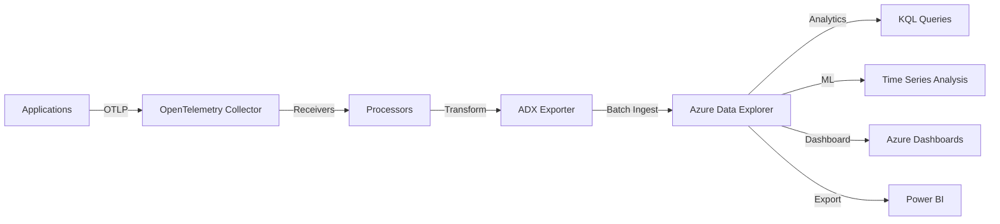

# How to Configure the Azure Data Explorer Exporter in the OpenTelemetry Collector

Author: [nawazdhandala](https://www.github.com/nawazdhandala)

Tags: OpenTelemetry, Collector, Exporter, Azure, Azure Data Explorer, ADX, Kusto, Observability

Description: Learn how to configure the Azure Data Explorer exporter in the OpenTelemetry Collector for high-performance analytics and long-term telemetry data storage.

Azure Data Explorer (ADX), also known as Kusto, is a fast and highly scalable data analytics service optimized for time-series data and log analytics. The OpenTelemetry Collector's Azure Data Explorer exporter enables you to send traces, metrics, and logs to ADX for advanced analytics, long-term retention, and custom data exploration.

## Understanding the Azure Data Explorer Exporter

Azure Data Explorer excels at handling massive volumes of telemetry data with sub-second query response times. The ADX exporter ingests OpenTelemetry data into ADX tables, where you can perform sophisticated analytics using Kusto Query Language (KQL). This makes it ideal for scenarios requiring complex queries, long-term data retention, or integration with machine learning pipelines.

The exporter supports OpenTelemetry exporter helper settings such as batching through the batch processor, retries, queues, and timeouts, making it suitable for high-throughput production environments.

## Architecture Overview

Here's how the Azure Data Explorer exporter fits into your observability pipeline:


```mermaid
graph LR
    A[Applications] -->|OTLP| B[OpenTelemetry Collector]
    B -->|Receivers| C[Processors]
    C -->|Transform| D[ADX Exporter]
    D -->|Batch Ingest| E[Azure Data Explorer]
    E -->|Analytics| F[KQL Queries]
    E -->|ML| G[Time Series Analysis]
    E -->|Dashboard| H[Azure Dashboards]
    E -->|Export| I[Power BI]
```

## Prerequisites

Before configuring the Azure Data Explorer exporter, you need:

- An Azure subscription
- An Azure Data Explorer cluster and database
- Service principal credentials with ingestion permissions
- OpenTelemetry Collector Contrib installed (version 0.80.0 or later)

## Setting Up Azure Data Explorer

Create an ADX cluster and database:

```bash
# Create ADX cluster (this takes several minutes)

az kusto cluster create \
  --name myadxcluster \
  --resource-group my-resource-group \
  --location eastus \
  --enable-streaming-ingest true \
  --sku name="Standard_L8s" capacity=2 tier="Standard"

# Create a database
az kusto database create \
  --cluster-name myadxcluster \
  --database-name telemetry \
  --resource-group my-resource-group \
  --read-write-database soft-delete-period=P365D hot-cache-period=P31D
```

Create a service principal for authentication:

```bash
# Create service principal
az ad sp create-for-rbac \
  --name otel-collector-sp \
  --role Contributor \
  --scopes /subscriptions/{subscription-id}/resourceGroups/my-resource-group/providers/Microsoft.Kusto/Clusters/myadxcluster

# Output will include:
# - appId (client ID)
# - password (client secret)
# - tenant (tenant ID)
```

Grant ingestion permissions:

```kql
// Connect to your ADX database and run:
.add database telemetry ingestors ('aadapp=<client-id>;<tenant-id>') 'OpenTelemetry Collector'
```

## Creating Tables for Telemetry Data

Create tables in ADX for storing traces, metrics, and logs:

```kql
// Create traces table
.create-merge table OTELTraces (TraceID:string, SpanID:string, ParentID:string, SpanName:string, SpanStatus:string, SpanKind:string, StartTime:datetime, EndTime:datetime, ResourceAttributes:dynamic, TraceAttributes:dynamic, Events:dynamic, Links:dynamic)

// Add optional span status message column
.alter-merge table OTELTraces (SpanStatusMessage:string)

// Create metrics table
.create-merge table OTELMetrics (Timestamp:datetime, MetricName:string, MetricType:string, MetricUnit:string, MetricDescription:string, MetricValue:real, Host:string, ResourceAttributes:dynamic, MetricAttributes:dynamic)

// Create logs table
.create-merge table OTELLogs (Timestamp:datetime, ObservedTimestamp:datetime, TraceID:string, SpanID:string, SeverityText:string, SeverityNumber:int, Body:string, ResourceAttributes:dynamic, LogsAttributes:dynamic)

// Enable streaming ingestion for low latency
.alter table OTELTraces policy streamingingestion enable
.alter table OTELMetrics policy streamingingestion enable
.alter table OTELLogs policy streamingingestion enable
```

## Basic Configuration

Here's a minimal configuration for the Azure Data Explorer exporter:

```yaml
# OpenTelemetry Collector configuration for Azure Data Explorer
receivers:
  otlp:
    protocols:
      grpc:
        endpoint: 0.0.0.0:4317
      http:
        endpoint: 0.0.0.0:4318

processors:
  batch:
    # Batch data for efficient ingestion
    timeout: 10s
    send_batch_size: 1024

exporters:
  azuredataexplorer:
    # ADX cluster URI
    cluster_uri: "https://myadxcluster.eastus.kusto.windows.net"

    # Database name
    db_name: "telemetry"

    # Authentication using service principal
    tenant_id: "${AZURE_TENANT_ID}"
    application_id: "${AZURE_CLIENT_ID}"
    application_key: "${AZURE_CLIENT_SECRET}"

    # Table mappings for each signal type
    traces_table_name: "OTELTraces"
    metrics_table_name: "OTELMetrics"
    logs_table_name: "OTELLogs"

    # Ingestion type (managed streaming or queued)
    ingestion_type: "managed"

service:
  pipelines:
    traces:
      receivers: [otlp]
      processors: [batch]
      exporters: [azuredataexplorer]
    metrics:
      receivers: [otlp]
      processors: [batch]
      exporters: [azuredataexplorer]
    logs:
      receivers: [otlp]
      processors: [batch]
      exporters: [azuredataexplorer]
```

This configuration sets up three pipelines that ingest OpenTelemetry data into corresponding ADX tables.

## Advanced Configuration Options

For production deployments, customize additional parameters:

```yaml
exporters:
  azuredataexplorer:
    cluster_uri: "https://myadxcluster.eastus.kusto.windows.net"
    db_name: "telemetry"

    # Authentication
    tenant_id: "${AZURE_TENANT_ID}"
    application_id: "${AZURE_CLIENT_ID}"
    application_key: "${AZURE_CLIENT_SECRET}"

    # Alternative: Use managed identity
    # managed_identity_id: "system"

    # Table names
    traces_table_name: "OTELTraces"
    metrics_table_name: "OTELMetrics"
    logs_table_name: "OTELLogs"

    # Ingestion configuration
    ingestion_type: "managed"  # Options: managed, queued

    # Queue settings for handling bursts
    sending_queue:
      enabled: true
      num_consumers: 10
      queue_size: 10000

    # Retry configuration
    retry_on_failure:
      enabled: true
      initial_interval: 5s
      max_interval: 30s
      max_elapsed_time: 300s

    # Timeout for ingestion operations
    timeout: 60s

    # Custom mapping names (optional)
    traces_table_json_mapping: "OtelTracesMapping"
    metrics_table_json_mapping: "OtelMetricsMapping"
    logs_table_json_mapping: "OtelLogsMapping"
```

## Ingestion Mappings

Create ingestion mappings to transform OpenTelemetry data into your table schema:

```kql
// Create mapping for traces
.create table OTELTraces ingestion json mapping 'OtelTracesMapping'
@'
[
    {"column": "TraceID", "path": "$.TraceID", "datatype": "string"},
    {"column": "SpanID", "path": "$.SpanID", "datatype": "string"},
    {"column": "ParentID", "path": "$.ParentID", "datatype": "string"},
    {"column": "SpanName", "path": "$.SpanName", "datatype": "string"},
    {"column": "SpanStatus", "path": "$.SpanStatus", "datatype": "string"},
    {"column": "SpanStatusMessage", "path": "$.SpanStatusMessage", "datatype": "string"},
    {"column": "SpanKind", "path": "$.SpanKind", "datatype": "string"},
    {"column": "StartTime", "path": "$.StartTime", "datatype": "datetime"},
    {"column": "EndTime", "path": "$.EndTime", "datatype": "datetime"},
    {"column": "ResourceAttributes", "path": "$.ResourceAttributes", "datatype": "dynamic"},
    {"column": "TraceAttributes", "path": "$.TraceAttributes", "datatype": "dynamic"},
    {"column": "Events", "path": "$.Events", "datatype": "dynamic"},
    {"column": "Links", "path": "$.Links", "datatype": "dynamic"}
]
'

// Create mapping for metrics
.create table OTELMetrics ingestion json mapping 'OtelMetricsMapping'
@'
[
    {"column": "Timestamp", "path": "$.Timestamp", "datatype": "datetime"},
    {"column": "MetricName", "path": "$.MetricName", "datatype": "string"},
    {"column": "MetricType", "path": "$.MetricType", "datatype": "string"},
    {"column": "MetricUnit", "path": "$.MetricUnit", "datatype": "string"},
    {"column": "MetricDescription", "path": "$.MetricDescription", "datatype": "string"},
    {"column": "MetricValue", "path": "$.MetricValue", "datatype": "real"},
    {"column": "Host", "path": "$.Host", "datatype": "string"},
    {"column": "ResourceAttributes", "path": "$.ResourceAttributes", "datatype": "dynamic"},
    {"column": "MetricAttributes", "path": "$.MetricAttributes", "datatype": "dynamic"}
]
'

// Create mapping for logs
.create table OTELLogs ingestion json mapping 'OtelLogsMapping'
@'
[
    {"column": "Timestamp", "path": "$.Timestamp", "datatype": "datetime"},
    {"column": "ObservedTimestamp", "path": "$.ObservedTimestamp", "datatype": "datetime"},
    {"column": "TraceID", "path": "$.TraceID", "datatype": "string"},
    {"column": "SpanID", "path": "$.SpanID", "datatype": "string"},
    {"column": "SeverityText", "path": "$.SeverityText", "datatype": "string"},
    {"column": "SeverityNumber", "path": "$.SeverityNumber", "datatype": "int"},
    {"column": "Body", "path": "$.Body", "datatype": "string"},
    {"column": "ResourceAttributes", "path": "$.ResourceAttributes", "datatype": "dynamic"},
    {"column": "LogsAttributes", "path": "$.LogsAttributes", "datatype": "dynamic"}
]
'
```

Update your collector configuration to use these mappings:

```yaml
exporters:
  azuredataexplorer:
    cluster_uri: "https://myadxcluster.eastus.kusto.windows.net"
    db_name: "telemetry"
    tenant_id: "${AZURE_TENANT_ID}"
    application_id: "${AZURE_CLIENT_ID}"
    application_key: "${AZURE_CLIENT_SECRET}"

    traces_table_name: "OTELTraces"
    traces_table_json_mapping: "OtelTracesMapping"

    metrics_table_name: "OTELMetrics"
    metrics_table_json_mapping: "OtelMetricsMapping"

    logs_table_name: "OTELLogs"
    logs_table_json_mapping: "OtelLogsMapping"
```

## Streaming vs. Queued Ingestion

Choose the right ingestion type for your use case:

**Streaming Ingestion:**
- Low latency (seconds)
- Suitable for real-time monitoring
- Higher cost per operation
- Requires enabling streaming on tables

```yaml
exporters:
  azuredataexplorer:
    ingestion_type: "managed"
```

**Queued Ingestion:**
- Higher latency (minutes)
- Cost-effective for large volumes
- Better for batch processing
- Default ingestion method

```yaml
exporters:
  azuredataexplorer:
    ingestion_type: "queued"
```

For most production scenarios, streaming ingestion is recommended for operational monitoring.

## Data Partitioning and Retention

Configure partitioning and retention policies to optimize query performance and manage costs:

```kql
// Set data retention policy (365 days)
.alter-merge table OTELTraces policy retention softdelete = 365d

// Set caching policy (hot data for 31 days)
.alter table OTELTraces policy caching hot = 31d

// Create partitioning policy by date
.alter-merge table OTELTraces policy partitioning
@'
{
  "PartitionKeys": [
    {
      "ColumnName": "StartTime",
      "Kind": "UniformRange",
      "Properties": {
        "Reference": "2026-01-01T00:00:00",
        "RangeSize": "1.00:00:00",
        "OverrideCreationTime": false
      }
    }
  ]
}
'

// Set update policy to automatically aggregate data
.create-merge table TraceSummary (StartTime:datetime, ServiceName:string, Count:long, AvgDurationMs:real)

.alter table TraceSummary policy update
@'[{"IsEnabled": true, "Source": "OTELTraces", "Query": "OTELTraces | extend ServiceName=tostring(ResourceAttributes[\"service.name\"]), DurationMs= datetime_diff(''microsecond'', EndTime, StartTime) / 1000.0 | summarize Count=count(), AvgDurationMs=avg(DurationMs) by bin(StartTime, 5m), ServiceName", "IsTransactional": false, "PropagateIngestionProperties": false}]'
```

## Querying Telemetry Data in ADX

Use Kusto Query Language to analyze your telemetry:

```kql
// Query traces by service and operation
OTELTraces
| where StartTime > ago(1h)
| extend ServiceName = tostring(ResourceAttributes["service.name"])
| extend DurationMs = datetime_diff('microsecond', EndTime, StartTime) / 1000.0
| where ServiceName == "payment-service"
| summarize
    RequestCount = count(),
    AvgDurationMs = avg(DurationMs),
    P95DurationMs = percentile(DurationMs, 95),
    ErrorCount = countif(SpanStatus == "STATUS_CODE_ERROR")
  by SpanName
| order by RequestCount desc

// Analyze distributed traces
OTELTraces
| where TraceID == "abc123..."
| order by StartTime asc
| extend ServiceName = tostring(ResourceAttributes["service.name"])
| extend DurationMs = datetime_diff('microsecond', EndTime, StartTime) / 1000.0
| project StartTime, SpanName, DurationMs, ServiceName, TraceAttributes

// Query metrics with aggregation
OTELMetrics
| where Timestamp > ago(1h)
| where MetricName == "http.server.duration"
| extend ServiceName = tostring(ResourceAttributes["service.name"])
| summarize avg(MetricValue), percentile(MetricValue, 50), percentile(MetricValue, 95), percentile(MetricValue, 99)
  by bin(Timestamp, 5m), ServiceName
| render timechart

// Query logs with severity filtering
OTELLogs
| where Timestamp > ago(1h)
| where SeverityNumber >= 17  // Error and above
| extend ServiceName = tostring(ResourceAttributes["service.name"])
| where ServiceName == "payment-service"
| order by Timestamp desc
| take 100

// Join traces and logs for correlation
OTELTraces
| where StartTime > ago(1h)
| where SpanStatus == "STATUS_CODE_ERROR"
| join kind=inner (
    OTELLogs
    | where Timestamp > ago(1h)
  ) on TraceID, SpanID
| extend ServiceName = tostring(ResourceAttributes["service.name"])
| project StartTime, SpanName, ServiceName, Body, TraceAttributes
```

## Performance Optimization

Optimize ADX performance with these strategies:

**1. Use Materialized Views for Common Queries:**

```kql
.create materialized-view with (backfill=true) ServiceMetrics on table OTELTraces
{
    OTELTraces
    | extend ServiceName = tostring(ResourceAttributes["service.name"])
    | extend DurationMs = datetime_diff('microsecond', EndTime, StartTime) / 1000.0
    | summarize
        RequestCount = count(),
        AvgDurationMs = avg(DurationMs),
        ErrorCount = countif(SpanStatus == "STATUS_CODE_ERROR")
      by bin(StartTime, 5m), ServiceName
}
```

**2. Project Frequently Queried Dynamic Fields:**

```kql
// Store common dynamic attributes in materialized views or update-policy tables
OTELTraces
| extend ServiceName = tostring(ResourceAttributes["service.name"])
| summarize RequestCount = count() by bin(StartTime, 5m), ServiceName
```

**3. Use Extent Tags for Efficient Data Filtering:**

```kql
.alter-merge table OTELTraces policy extent_tags_retention
@'
{
  "TagPrefix": "drop-by:",
  "RetentionPeriod": "00:00:00"
}
'
```

**4. Optimize Batch Sizes:**

```yaml
processors:
  batch:
    # Larger batches reduce ingestion overhead
    timeout: 30s
    send_batch_size: 4096
```

## Multi-Database Configuration

For large deployments, separate data by environment or tenant:

```yaml
exporters:
  # Production environment
  azuredataexplorer/prod:
    cluster_uri: "https://prod.eastus.kusto.windows.net"
    db_name: "telemetry_prod"
    tenant_id: "${AZURE_TENANT_ID}"
    application_id: "${AZURE_CLIENT_ID}"
    application_key: "${AZURE_CLIENT_SECRET}"
    traces_table_name: "OTELTraces"
    metrics_table_name: "OTELMetrics"
    logs_table_name: "OTELLogs"

  # Staging environment
  azuredataexplorer/staging:
    cluster_uri: "https://staging.eastus.kusto.windows.net"
    db_name: "telemetry_staging"
    tenant_id: "${AZURE_TENANT_ID}"
    application_id: "${AZURE_CLIENT_ID}"
    application_key: "${AZURE_CLIENT_SECRET}"
    traces_table_name: "OTELTraces"
    metrics_table_name: "OTELMetrics"
    logs_table_name: "OTELLogs"

processors:
  # Route by environment attribute
  routing:
    from_attribute: "deployment.environment"
    table:
      - value: "production"
        exporters: [azuredataexplorer/prod]
      - value: "staging"
        exporters: [azuredataexplorer/staging]

service:
  pipelines:
    traces:
      receivers: [otlp]
      processors: [routing, batch]
      exporters: [azuredataexplorer/prod, azuredataexplorer/staging]
```

## Security Best Practices

Secure your ADX ingestion pipeline:

**1. Use Azure Key Vault for Credentials:**

```bash
# Store client secret in Key Vault
az keyvault secret set \
  --vault-name my-keyvault \
  --name adx-client-secret \
  --value "your-client-secret"

# Grant collector access
az keyvault set-policy \
  --name my-keyvault \
  --object-id <collector-managed-identity-id> \
  --secret-permissions get
```

**2. Use Managed Identity When Possible:**

```yaml
exporters:
  azuredataexplorer:
    cluster_uri: "https://myadxcluster.eastus.kusto.windows.net"
    db_name: "telemetry"
    managed_identity_id: "system"  # No need for client secrets
```

**3. Enable Private Endpoints:**

Configure private endpoints to keep traffic within your virtual network.

**4. Implement Row Level Security:**

```kql
.create-or-alter function with (folder="Security") FilterPaymentService()
{
    OTELTraces
    | where current_principal_is_member_of('aadgroup=payment-observers@example.com')
    | where tostring(ResourceAttributes["service.name"]) == "payment-service"
}

.alter table OTELTraces policy row_level_security enable "FilterPaymentService"
```

## Cost Management

ADX pricing is based on compute and storage. Optimize costs:

**1. Use Auto-Stop:**

```bash
az kusto cluster update \
  --name myadxcluster \
  --resource-group my-resource-group \
  --enable-auto-stop true
```

**2. Implement Data Sampling:**

```yaml
processors:
  probabilistic_sampler:
    sampling_percentage: 10  # Sample 10% of traces
```

**3. Configure Retention Policies:**

```kql
// Keep hot data for 7 days, total retention 90 days
.alter-merge table OTELTraces policy retention softdelete = 90d
.alter table OTELTraces policy caching hot = 7d
```

**4. Use Queued Ingestion for Non-Critical Data:**

```yaml
exporters:
  azuredataexplorer:
    ingestion_type: "queued"  # Lower cost than managed streaming
```

## Complete Production Example

Here's a comprehensive configuration for production use:

```yaml
receivers:
  otlp:
    protocols:
      grpc:
        endpoint: 0.0.0.0:4317
      http:
        endpoint: 0.0.0.0:4318

processors:
  # Add resource attributes
  resource:
    attributes:
      - key: service.name
        value: "${SERVICE_NAME}"
        action: upsert
      - key: deployment.environment
        value: "${ENVIRONMENT}"
        action: upsert

  # Filter health checks
  filter/healthcheck:
    traces:
      span:
        - 'attributes["http.target"] == "/health"'

  # Tail sampling for intelligent retention
  tail_sampling:
    decision_wait: 10s
    num_traces: 100000
    expected_new_traces_per_sec: 1000
    policies:
      - name: error-traces
        type: status_code
        status_code:
          status_codes: [ERROR]
      - name: slow-traces
        type: latency
        latency:
          threshold_ms: 1000
      - name: sampled-traces
        type: probabilistic
        probabilistic:
          sampling_percentage: 5

  # Batch for efficiency
  batch:
    timeout: 30s
    send_batch_size: 4096

exporters:
  azuredataexplorer:
    cluster_uri: "${ADX_CLUSTER_URI}"
    db_name: "${ADX_DATABASE}"
    tenant_id: "${AZURE_TENANT_ID}"
    application_id: "${AZURE_CLIENT_ID}"
    application_key: "${AZURE_CLIENT_SECRET}"

    traces_table_name: "OTELTraces"
    traces_table_json_mapping: "OtelTracesMapping"
    metrics_table_name: "OTELMetrics"
    metrics_table_json_mapping: "OtelMetricsMapping"
    logs_table_name: "OTELLogs"
    logs_table_json_mapping: "OtelLogsMapping"

    ingestion_type: "managed"

    sending_queue:
      enabled: true
      num_consumers: 10
      queue_size: 10000

    retry_on_failure:
      enabled: true
      initial_interval: 5s
      max_interval: 30s
      max_elapsed_time: 300s

    timeout: 60s

service:
  pipelines:
    traces:
      receivers: [otlp]
      processors: [resource, filter/healthcheck, tail_sampling, batch]
      exporters: [azuredataexplorer]

    metrics:
      receivers: [otlp]
      processors: [resource, batch]
      exporters: [azuredataexplorer]

    logs:
      receivers: [otlp]
      processors: [resource, batch]
      exporters: [azuredataexplorer]

  telemetry:
    logs:
      level: info
    metrics:
      address: 0.0.0.0:8888
```

## Troubleshooting Common Issues

**Issue: Ingestion failures with authentication errors**

Solutions:
- Verify service principal has ingestion permissions
- Check that client secret hasn't expired
- Ensure tenant ID and client ID are correct

**Issue: Slow query performance**

Optimize by:
- Projecting frequently queried dynamic attributes into materialized views or update-policy tables
- Using materialized views for common aggregations
- Implementing partitioning policies
- Adjusting cache policy for hot data

**Issue: High ingestion latency**

Solutions:
- Switch to streaming ingestion
- Increase batch size to reduce overhead
- Check network connectivity to ADX
- Verify cluster isn't throttling

## Conclusion

The Azure Data Explorer exporter provides a powerful solution for storing and analyzing OpenTelemetry data at scale. With its high-performance query engine and flexible data management capabilities, ADX is ideal for organizations requiring advanced analytics and long-term telemetry retention.

For more information on OpenTelemetry exporters, check out these related articles:
- https://oneuptime.com/blog/post/2026-02-06-azure-monitor-exporter-opentelemetry-collector/view
- https://oneuptime.com/blog/post/2026-02-06-google-cloud-operations-exporter-opentelemetry-collector/view

For detailed information about the Azure Data Explorer exporter configuration options, refer to the official OpenTelemetry Collector documentation.
