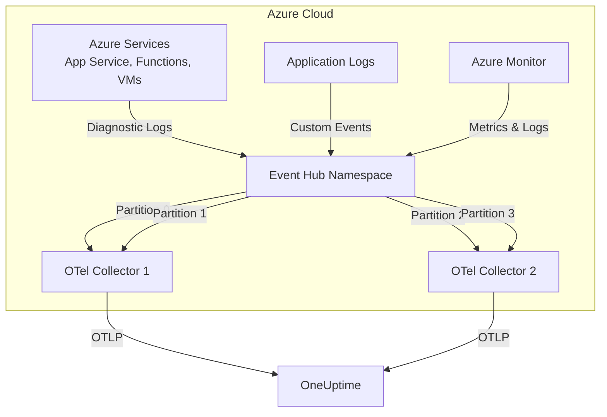

# How to Configure the Azure Event Hub Receiver in the OpenTelemetry Collector

Author: [nawazdhandala](https://www.github.com/nawazdhandala)

Tags: OpenTelemetry, Collector, Azure, Event Hub, Streaming, Observability, Cloud

Description: Configure the Azure Event Hub Receiver in OpenTelemetry Collector to ingest streaming telemetry data from Azure Event Hubs with complete YAML examples, authentication patterns, and production configurations.

---

> Streaming telemetry through Azure Event Hubs but struggling to get it into your observability platform? The Azure Event Hub Receiver bridges the gap, transforming event streams into OpenTelemetry signals with production-grade reliability.

Azure Event Hubs is a managed event streaming platform capable of processing millions of events per second. The Azure Event Hub Receiver in OpenTelemetry Collector allows you to consume telemetry data from Event Hubs and route it to any OpenTelemetry-compatible backend, providing a vendor-neutral path from Azure services to your observability stack.

---

## What is the Azure Event Hub Receiver?

The Azure Event Hub Receiver is an OpenTelemetry Collector component that consumes messages from Azure Event Hubs and converts them into OpenTelemetry logs, metrics, or traces. This receiver is essential for organizations that:

- Export Azure resource logs to Event Hubs
- Stream application telemetry through Event Hubs for processing
- Build event-driven observability pipelines
- Consolidate multiple Azure services' telemetry into a unified platform
- Need scalable, durable ingestion for high-volume telemetry

### Key Features

- **Consumer group support**: Multiple collectors can consume the same event stream
- **Checkpoint management**: Automatically tracks processing progress
- **Partitioning**: Scales horizontally across Event Hub partitions
- **Multiple authentication methods**: Connection strings, managed identities, service principals
- **Format flexibility**: Supports JSON, raw text, and custom parsing

---

## Architecture Overview

Here's how the Azure Event Hub Receiver integrates into your observability pipeline:



The receiver leverages Event Hub's partitioning model to enable horizontal scaling. Multiple collector instances can consume from different partitions in parallel, providing high throughput and fault tolerance.

---

## Prerequisites

Before configuring the receiver, ensure you have:

1. **Azure Event Hub Namespace** with at least one Event Hub
2. **Consumer group** created for the OpenTelemetry Collector (don't use $Default in production)
3. **Azure Storage Account** for checkpoint storage (required for offset management)
4. **Authentication credentials** - Connection string, managed identity, or service principal
5. **OpenTelemetry Collector** version 0.75.0 or later with azureeventhub receiver component

---

## Authentication Setup

The receiver supports three authentication methods:

### Method 1: Connection String (Simplest)

Get the connection string from Azure Portal:

1. Navigate to Event Hubs Namespace
2. Go to Shared access policies
3. Select RootManageSharedAccessKey (or create a custom policy with Listen permission)
4. Copy the connection string

### Method 2: Managed Identity (Recommended for Azure VMs)

Assign the managed identity these roles:
- `Azure Event Hubs Data Receiver` on the Event Hub
- `Storage Blob Data Contributor` on the checkpoint storage account

### Method 3: Service Principal

Create a service principal and assign:
- `Azure Event Hubs Data Receiver` role on Event Hub
- `Storage Blob Data Contributor` role on storage account

Store credentials as environment variables:
```bash
export AZURE_TENANT_ID="your-tenant-id"
export AZURE_CLIENT_ID="your-client-id"
export AZURE_CLIENT_SECRET="your-client-secret"
```

---

## Basic Configuration

Here's a minimal configuration to start consuming logs from Azure Event Hubs. This example uses connection string authentication:

```yaml
# Configure the Azure Event Hub receiver
receivers:
  # The azureeventhub receiver consumes from Event Hubs
  azureeventhub:
    # Event Hub connection string (use environment variable for security)
    connection: ${EVENTHUB_CONNECTION_STRING}

    # Name of the Event Hub to consume from
    eventhub: telemetry-logs

    # Consumer group (create dedicated group for OTel, don't use $Default)
    consumer_group: otel-collector

    # Storage account for checkpoints (tracks processing progress)
    storage:
      # Connection string for Azure Storage account
      connection: ${STORAGE_CONNECTION_STRING}
      # Container name for storing checkpoints
      container: otel-checkpoints

    # How to parse incoming messages
    format: json

    # Field mapping for log messages
    logs:
      # JSON field containing the log message
      body_field: message
      # JSON field containing timestamp
      timestamp_field: timestamp
      # Timestamp format
      timestamp_format: "2006-01-02T15:04:05.000Z"

# Configure where to send processed logs
exporters:
  otlphttp:
    endpoint: https://oneuptime.com/otlp
    headers:
      x-oneuptime-token: ${ONEUPTIME_TOKEN}

# Define the pipeline
service:
  pipelines:
    logs:
      receivers: [azureeventhub]
      exporters: [otlphttp]
```

This basic configuration connects to an Event Hub, consumes messages, parses them as JSON logs, and exports to OneUptime. The checkpoint storage ensures that if the collector restarts, it resumes from where it left off rather than reprocessing old messages.

---

## Production Configuration with Managed Identity

For production deployments on Azure infrastructure, use managed identity instead of connection strings. This configuration demonstrates best practices:

```yaml
receivers:
  azureeventhub:
    # Use managed identity authentication (no connection string needed)
    # Collector must run on Azure VM, AKS, or App Service with managed identity enabled
    auth:
      type: managed_identity

    # Event Hub details
    namespace: telemetry-namespace.servicebus.windows.net
    eventhub: production-logs
    consumer_group: otel-prod-collector

    # Checkpoint storage with managed identity
    storage:
      auth:
        type: managed_identity
      account_name: checkpointstorage
      container: prod-checkpoints

    # Message parsing configuration
    format: json

    # Advanced consumer settings
    consumer:
      # Maximum number of messages to receive per batch
      prefetch_count: 300
      # How long to wait for messages before checking for new ones
      receive_timeout: 60s
      # Maximum time to keep a partition lease before renewal
      partition_manager:
        lease_duration: 60s
        renewal_interval: 10s

    # Attribute mapping for better observability
    logs:
      body_field: message
      timestamp_field: time
      timestamp_format: "2006-01-02T15:04:05Z07:00"

      # Map JSON fields to OpenTelemetry attributes
      attributes:
        - source_key: resourceId
          target_key: azure.resource.id
        - source_key: category
          target_key: azure.log.category
        - source_key: operationName
          target_key: azure.operation.name
        - source_key: level
          target_key: severity_text
        - source_key: properties.serviceRequestId
          target_key: service.request.id

processors:
  # Protect collector memory
  memory_limiter:
    limit_mib: 2048
    spike_limit_mib: 512
    check_interval: 5s

  # Add resource attributes
  resource:
    attributes:
      - key: source.type
        value: azure_eventhub
        action: insert
      - key: cloud.provider
        value: azure
        action: insert
      - key: eventhub.namespace
        value: telemetry-namespace
        action: insert
      - key: eventhub.name
        value: production-logs
        action: insert

  # Parse Azure resource logs format
  attributes/azure:
    actions:
      # Extract resource type from Azure resource ID
      - key: azure.resource.type
        from_attribute: azure.resource.id
        action: extract
        pattern: "^/subscriptions/[^/]+/resourceGroups/[^/]+/providers/([^/]+)"

      # Normalize severity levels
      - key: severity_text
        from_attribute: severity_text
        action: upsert

  # Filter out noisy logs
  filter/noise:
    logs:
      exclude:
        match_type: regexp
        resource_attributes:
          - key: azure.log.category
            value: "AuditEvent"  # Example: exclude audit events
        body:
          - "healthcheck"
          - "keepalive"

  # Batch for efficiency
  batch:
    timeout: 10s
    send_batch_size: 1000
    send_batch_max_size: 2000

exporters:
  # Primary export to OneUptime
  otlphttp/oneuptime:
    endpoint: https://oneuptime.com/otlp
    headers:
      x-oneuptime-token: ${ONEUPTIME_TOKEN}
    compression: gzip
    timeout: 30s
    retry_on_failure:
      enabled: true
      initial_interval: 5s
      max_interval: 30s
      max_elapsed_time: 300s

  # Backup export to Azure Log Analytics
  azuremonitor:
    workspace_id: ${LOG_ANALYTICS_WORKSPACE_ID}
    instrumentation_key: ${APPLICATION_INSIGHTS_KEY}

service:
  # Enable collector self-monitoring
  telemetry:
    logs:
      level: info
    metrics:
      address: :8888
      level: detailed

  pipelines:
    logs:
      receivers: [azureeventhub]
      processors:
        - memory_limiter
        - resource
        - attributes/azure
        - filter/noise
        - batch
      exporters:
        - otlphttp/oneuptime
        - azuremonitor
```

This production configuration includes:

- **Managed identity authentication**: No secrets to manage
- **Resource attribution**: Tags all logs with source metadata
- **Azure-specific parsing**: Handles Azure diagnostic log format
- **Filtering**: Removes noisy logs to control costs
- **High throughput settings**: Optimized prefetch and batch sizes
- **Multiple exporters**: Primary and backup destinations
- **Comprehensive monitoring**: Exposes collector metrics

---

## Processing Azure Diagnostic Logs

Azure services export diagnostic logs to Event Hubs in a specific format. Here's a configuration optimized for Azure diagnostic logs:

```yaml
receivers:
  azureeventhub:
    auth:
      type: managed_identity
    namespace: diagnostics-hub.servicebus.windows.net
    eventhub: insights-logs-diagnostics
    consumer_group: otel-diagnostics

    storage:
      auth:
        type: managed_identity
      account_name: diagcheckpoints
      container: checkpoints

    format: json

    # Azure diagnostic logs have nested structure
    logs:
      # Records array contains the actual log entries
      body_field: records[*]
      timestamp_field: time
      timestamp_format: "2006-01-02T15:04:05.0000000Z"

      attributes:
        # Standard Azure diagnostic log fields
        - source_key: resourceId
          target_key: azure.resource.id
        - source_key: category
          target_key: azure.category
        - source_key: operationName
          target_key: azure.operation
        - source_key: resultType
          target_key: azure.result.type
        - source_key: level
          target_key: severity_text
        - source_key: location
          target_key: cloud.region
        # Properties object contains service-specific fields
        - source_key: properties
          target_key: azure.properties
          flatten: true

processors:
  # Transform Azure severity levels to OpenTelemetry conventions
  transform/severity:
    log_statements:
      - context: log
        statements:
          # Map Azure levels to OTel severity numbers
          - set(severity_number, 1) where severity_text == "Verbose"
          - set(severity_number, 5) where severity_text == "Informational"
          - set(severity_number, 9) where severity_text == "Warning"
          - set(severity_number, 13) where severity_text == "Error"
          - set(severity_number, 17) where severity_text == "Critical"

  # Extract subscription and resource group from resource ID
  attributes/resource:
    actions:
      - key: azure.subscription.id
        from_attribute: azure.resource.id
        action: extract
        pattern: "^/subscriptions/([^/]+)"
      - key: azure.resource.group
        from_attribute: azure.resource.id
        action: extract
        pattern: "^/subscriptions/[^/]+/resourceGroups/([^/]+)"

  batch:
    timeout: 10s
    send_batch_size: 1000

exporters:
  otlphttp:
    endpoint: https://oneuptime.com/otlp
    headers:
      x-oneuptime-token: ${ONEUPTIME_TOKEN}

service:
  pipelines:
    logs:
      receivers: [azureeventhub]
      processors:
        - transform/severity
        - attributes/resource
        - batch
      exporters: [otlphttp]
```

This configuration properly handles the nested structure of Azure diagnostic logs and maps Azure-specific fields to OpenTelemetry semantic conventions.

---

## Multiple Event Hubs Configuration

Process telemetry from multiple Event Hubs by defining multiple receivers:

```yaml
receivers:
  # Application logs
  azureeventhub/app_logs:
    auth:
      type: managed_identity
    namespace: app-telemetry.servicebus.windows.net
    eventhub: application-logs
    consumer_group: otel-app
    storage:
      auth:
        type: managed_identity
      account_name: appcheckpoints
      container: logs
    format: json

  # Infrastructure metrics
  azureeventhub/infra_metrics:
    auth:
      type: managed_identity
    namespace: app-telemetry.servicebus.windows.net
    eventhub: infrastructure-metrics
    consumer_group: otel-metrics
    storage:
      auth:
        type: managed_identity
      account_name: appcheckpoints
      container: metrics
    format: json

  # Security events
  azureeventhub/security:
    auth:
      type: managed_identity
    namespace: security-hub.servicebus.windows.net
    eventhub: security-events
    consumer_group: otel-security
    storage:
      auth:
        type: managed_identity
      account_name: seccheckpoints
      container: events
    format: json

processors:
  # Tag application logs
  resource/app:
    attributes:
      - key: telemetry.type
        value: application_logs
        action: insert

  # Tag infrastructure metrics
  resource/infra:
    attributes:
      - key: telemetry.type
        value: infrastructure_metrics
        action: insert

  # Tag security events
  resource/security:
    attributes:
      - key: telemetry.type
        value: security_events
        action: insert
      - key: priority
        value: high
        action: insert

  batch:
    timeout: 10s

exporters:
  # General observability data
  otlphttp/oneuptime:
    endpoint: https://oneuptime.com/otlp
    headers:
      x-oneuptime-token: ${ONEUPTIME_TOKEN}

  # Security events to SIEM
  otlphttp/siem:
    endpoint: https://siem.company.com/otlp
    headers:
      authorization: Bearer ${SIEM_TOKEN}

service:
  pipelines:
    # Application logs pipeline
    logs/app:
      receivers: [azureeventhub/app_logs]
      processors: [resource/app, batch]
      exporters: [otlphttp/oneuptime]

    # Infrastructure metrics pipeline
    metrics:
      receivers: [azureeventhub/infra_metrics]
      processors: [resource/infra, batch]
      exporters: [otlphttp/oneuptime]

    # Security events pipeline
    logs/security:
      receivers: [azureeventhub/security]
      processors: [resource/security, batch]
      exporters:
        - otlphttp/oneuptime
        - otlphttp/siem
```

This multi-hub configuration allows you to:
- Separate concerns by telemetry type
- Apply different processing rules per stream
- Route to different destinations based on data type
- Scale independently for different data volumes

---

## Scaling and High Availability

Event Hubs partitioning enables horizontal scaling. Deploy multiple collector instances to process partitions in parallel:

```yaml
# Deploy this configuration on multiple collector instances
receivers:
  azureeventhub:
    auth:
      type: managed_identity
    namespace: high-volume-hub.servicebus.windows.net
    eventhub: massive-logs  # Has 32 partitions
    consumer_group: otel-ha-cluster

    storage:
      auth:
        type: managed_identity
      account_name: hacheckpoints
      container: cluster

    # The partition manager automatically distributes partitions across instances
    consumer:
      # Each instance will claim available partitions
      # Event Hubs SDK handles load balancing automatically
      prefetch_count: 500
      receive_timeout: 30s
      partition_manager:
        lease_duration: 60s
        renewal_interval: 10s
        # Load balancing strategy
        load_balancing_strategy: balanced

processors:
  batch:
    timeout: 5s
    send_batch_size: 2000
    send_batch_max_size: 5000

exporters:
  otlphttp:
    endpoint: https://oneuptime.com/otlp
    headers:
      x-oneuptime-token: ${ONEUPTIME_TOKEN}

service:
  pipelines:
    logs:
      receivers: [azureeventhub]
      processors: [batch]
      exporters: [otlphttp]
```

### Deployment Pattern for High Availability

Deploy on Kubernetes with HPA (Horizontal Pod Autoscaler):

```yaml
apiVersion: apps/v1
kind: Deployment
metadata:
  name: otel-collector-eventhub
spec:
  replicas: 4  # Start with 4 instances for 32 partitions
  selector:
    matchLabels:
      app: otel-collector
  template:
    metadata:
      labels:
        app: otel-collector
    spec:
      serviceAccountName: otel-collector
      containers:
      - name: otel-collector
        image: otel/opentelemetry-collector-contrib:0.93.0
        args: ["--config=/conf/otel-config.yaml"]
        resources:
          requests:
            memory: "2Gi"
            cpu: "1000m"
          limits:
            memory: "4Gi"
            cpu: "2000m"
        volumeMounts:
        - name: config
          mountPath: /conf
      volumes:
      - name: config
        configMap:
          name: otel-collector-config
---
apiVersion: v1
kind: Service
metadata:
  name: otel-collector-metrics
spec:
  selector:
    app: otel-collector
  ports:
  - name: metrics
    port: 8888
    targetPort: 8888
---
apiVersion: autoscaling/v2
kind: HorizontalPodAutoscaler
metadata:
  name: otel-collector-hpa
spec:
  scaleTargetRef:
    apiVersion: apps/v1
    kind: Deployment
    name: otel-collector-eventhub
  minReplicas: 4
  maxReplicas: 32  # Max = number of partitions
  metrics:
  - type: Resource
    resource:
      name: cpu
      target:
        type: Utilization
        averageUtilization: 70
  - type: Resource
    resource:
      name: memory
      target:
        type: Utilization
        averageUtilization: 80
```

The Event Hub SDK automatically distributes partitions across all collector instances in the same consumer group, providing both scalability and fault tolerance.

---

## Monitoring Receiver Performance

Monitor the Event Hub receiver's health and performance:

```yaml
service:
  telemetry:
    logs:
      level: info
    metrics:
      address: :8888
      level: detailed

  # Enable pprof for performance debugging
  extensions: [pprof, health_check]

extensions:
  pprof:
    endpoint: localhost:1777

  health_check:
    endpoint: :13133
```

### Key Metrics to Monitor

Export collector metrics to OneUptime for monitoring:

- `otelcol_receiver_accepted_log_records_total` - Logs received from Event Hub
- `otelcol_receiver_refused_log_records_total` - Logs rejected due to errors
- `otelcol_exporter_sent_log_records_total` - Logs successfully exported
- `eventhub_receiver_partition_lag` - Message lag per partition
- `eventhub_receiver_checkpoint_age_seconds` - How old checkpoints are

Create alerts in OneUptime:

- **High partition lag**: Alert when lag exceeds threshold (indicates processing slowdown)
- **No messages received**: Alert when no messages received for 5+ minutes (potential connectivity issue)
- **High refusal rate**: Alert when refusal rate > 5% (parsing or validation errors)

---

## Troubleshooting Common Issues

### Issue: Duplicate Messages

**Cause**: Collector restarted before checkpointing progress

**Solution**: Ensure checkpoint storage is configured and accessible:

```yaml
receivers:
  azureeventhub:
    storage:
      auth:
        type: managed_identity
      account_name: checkpoints
      container: otel
      # Checkpoint more frequently
      checkpoint_interval: 30s
```

### Issue: High Memory Usage

**Cause**: Large batch sizes or high prefetch count

**Solution**: Tune consumer settings and add memory limiter:

```yaml
receivers:
  azureeventhub:
    consumer:
      prefetch_count: 100  # Reduce from default 300
      receive_timeout: 60s

processors:
  memory_limiter:
    limit_mib: 2048
    check_interval: 1s
```

### Issue: Authentication Failures

**Cause**: Incorrect credentials or missing role assignments

**Solution**: Verify managed identity has required roles:

```bash
# Check role assignments
az role assignment list \
  --assignee <managed-identity-id> \
  --scope /subscriptions/<sub-id>/resourceGroups/<rg>/providers/Microsoft.EventHub/namespaces/<namespace>
```

Required roles:
- `Azure Event Hubs Data Receiver` on Event Hub
- `Storage Blob Data Contributor` on Storage Account

### Issue: No Messages Received

**Cause**: Wrong consumer group, no data in Event Hub, or network issues

**Solution**: Enable debug logging and verify Event Hub has data:

```yaml
service:
  telemetry:
    logs:
      level: debug
```

Check Event Hub metrics in Azure Portal:
- Incoming messages
- Outgoing messages
- Consumer lag

---

## Cost Optimization

Event Hub costs scale with throughput units and data retention. Optimize costs:

### 1. Use Standard Tier for Development

Standard tier is cheaper for low volumes:

```yaml
# Development configuration
receivers:
  azureeventhub:
    namespace: dev-hub.servicebus.windows.net  # Standard tier
    consumer:
      prefetch_count: 50  # Lower for dev
```

### 2. Optimize Batch Sizes

Larger batches = fewer network calls = lower costs:

```yaml
processors:
  batch:
    timeout: 30s  # Wait longer to build larger batches
    send_batch_size: 2000
    send_batch_max_size: 5000
```

### 3. Filter Before Export

Remove unnecessary data early in the pipeline:

```yaml
processors:
  filter/cost:
    logs:
      exclude:
        match_type: regexp
        body:
          - "debug"
          - "trace"
        resource_attributes:
          - key: azure.log.category
            value: "Audit"  # If not needed
```

### 4. Adjust Retention Period

Configure Event Hub retention based on needs:
- Minimum: 1 day
- Maximum: 7 days (Standard tier)
- Use shorter retention if collector processes data quickly

---

## Integration with OneUptime

OneUptime natively supports OpenTelemetry logs from Azure Event Hubs. After configuration:

1. **View logs in real-time**: Search and filter Azure logs in OneUptime
2. **Create dashboards**: Build visualizations for Azure service health
3. **Set up alerts**: Alert on specific Azure events or error patterns
4. **Correlate with traces**: Link Azure logs with application traces

Example OneUptime query:

```
source.type = "azure_eventhub" AND
azure.resource.type = "Microsoft.Web/sites" AND
severity_text = "Error"
```

---

## Related Resources

- [How to Configure Azure Monitor Receiver in OpenTelemetry Collector](https://oneuptime.com/blog/post/2026-02-06-azure-monitor-receiver-opentelemetry-collector/view)
- [How to Configure AWS ECS Container Metrics Receiver](https://oneuptime.com/blog/post/2026-02-06-aws-ecs-container-metrics-receiver-opentelemetry-collector/view)
- [OpenTelemetry Collector: What It Is and When You Need It](https://oneuptime.com/blog/post/2025-09-18-what-is-opentelemetry-collector-and-why-use-one/view)

---

## Conclusion

The Azure Event Hub Receiver provides a scalable, reliable way to ingest streaming telemetry from Azure services into OpenTelemetry. By leveraging Event Hubs' partitioning and checkpoint management, you can build production-grade pipelines that handle millions of events per second while maintaining exactly-once processing semantics.

Start with managed identity authentication and basic parsing, then add processors for filtering, transformation, and enrichment as your needs grow. With proper monitoring and tuning, you'll have a robust Azure telemetry ingestion pipeline that scales with your infrastructure.

The combination of Azure Event Hubs for durable streaming and OpenTelemetry for vendor-neutral processing gives you the flexibility to analyze Azure telemetry in any backend without lock-in.

---

**Ready to stream Azure telemetry?** OneUptime provides seamless integration with OpenTelemetry, making it easy to analyze logs, metrics, and traces from Azure Event Hubs with powerful querying and alerting capabilities.
