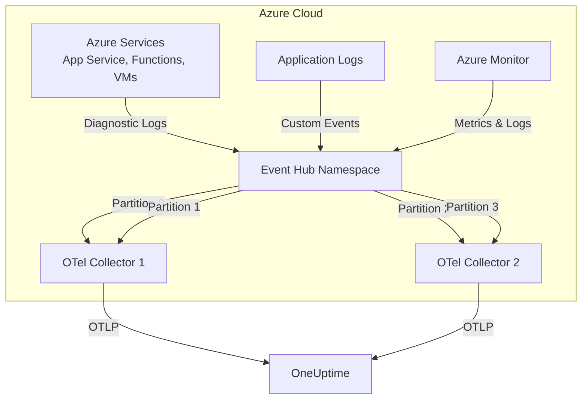

# How to Configure the Azure Event Hub Receiver in the OpenTelemetry Collector

Author: [nawazdhandala](https://www.github.com/nawazdhandala)

Tags: OpenTelemetry, Collector, Azure, Event Hub, Streaming, Observability, Cloud

Description: Configure the Azure Event Hub Receiver in OpenTelemetry Collector to ingest streaming telemetry data from Azure Event Hubs with complete YAML examples, authentication patterns.

---

> Streaming telemetry through Azure Event Hubs but struggling to get it into your observability platform? The Azure Event Hub Receiver bridges the gap, transforming event streams into OpenTelemetry signals with production-grade reliability.

Azure Event Hubs is a managed event streaming platform capable of processing millions of events per second. The Azure Event Hub Receiver in OpenTelemetry Collector allows you to consume telemetry data from Event Hubs and route it to any OpenTelemetry-compatible backend, providing a vendor-neutral path from Azure services to your observability stack.

---

## What is the Azure Event Hub Receiver?

The Azure Event Hub Receiver is an OpenTelemetry Collector component that consumes messages from Azure Event Hubs and converts them into OpenTelemetry logs, metrics, or traces. This receiver is essential for organizations that:

- Export Azure resource logs to Event Hubs
- Stream application telemetry through Event Hubs for processing
- Build event-driven observability pipelines
- Consolidate multiple Azure services' telemetry into a unified platform
- Need scalable, durable ingestion for high-volume telemetry

### Key Features

- **Consumer group support**: Multiple collectors can consume the same event stream
- **Checkpoint management**: Tracks processing progress with a storage extension or Azure Blob checkpoint store
- **Partitioning**: Scales horizontally across Event Hub partitions when using the Azure Blob checkpoint store
- **Multiple authentication methods**: Connection strings or Azure identity through the Azure Auth extension
- **Format flexibility**: Supports Azure Monitor payloads and raw log payloads

---

## Architecture Overview

Here's how the Azure Event Hub Receiver integrates into your observability pipeline:


```mermaid
graph TB
    subgraph Azure Cloud
        A[Azure Services<br/>App Service, Functions, VMs] -->|Diagnostic Logs| B[Event Hub Namespace]
        C[Application Logs] -->|Custom Events| B
        D[Azure Monitor] -->|Metrics & Logs| B
        B -->|Partition 0| E[OTel Collector 1]
        B -->|Partition 1| E
        B -->|Partition 2| F[OTel Collector 2]
        B -->|Partition 3| F
    end
    E -->|OTLP| G[OneUptime]
    F -->|OTLP| G
```

The receiver can leverage Event Hub's partitioning model to enable horizontal scaling. Multiple collector instances can consume from different partitions in parallel when configured with a shared Azure Blob checkpoint store, providing high throughput and fault tolerance.

---

## Prerequisites

Before configuring the receiver, ensure you have:

1. **Azure Event Hub Namespace** with at least one Event Hub
2. **Consumer group** created for the OpenTelemetry Collector (don't use $Default in production)
3. **Checkpoint storage** - either a Collector storage extension for restart persistence or an Azure Storage container for distributed partition ownership
4. **Authentication credentials** - Connection string or Azure identity through the Azure Auth extension
5. **OpenTelemetry Collector Contrib** version 0.149.0 or later with the `azure_event_hub` receiver component for the Azure Blob checkpoint store examples shown here

---

## Authentication Setup

The receiver supports two authentication patterns:

### Method 1: Connection String (Simplest)

Get the connection string from Azure Portal:

1. Navigate to Event Hubs Namespace
2. Go to Shared access policies
3. Select RootManageSharedAccessKey (or create a custom policy with Listen permission)
4. Copy the connection string, including the `EntityPath` for the Event Hub

### Method 2: Azure Auth Extension (Recommended for Azure Infrastructure)

Configure the `azure_auth` extension with managed identity, workload identity, service principal credentials, or default credentials. Assign the identity these roles:
- `Azure Event Hubs Data Receiver` on the Event Hub
- `Storage Blob Data Contributor` on the checkpoint storage account if you use `blob_checkpoint_store`

### Method 3: Service Principal

Create a service principal and assign:
- `Azure Event Hubs Data Receiver` role on Event Hub
- `Storage Blob Data Contributor` role on storage account if you use `blob_checkpoint_store`

Store credentials as environment variables:
```bash
export AZURE_TENANT_ID="your-tenant-id"
export AZURE_CLIENT_ID="your-client-id"
export AZURE_CLIENT_SECRET="your-client-secret"
```

---

## Basic Configuration

Here's a minimal configuration to start consuming Azure Monitor logs from Azure Event Hubs. This example uses connection string authentication and the `file_storage` extension for restart persistence:

```yaml
# Configure the Azure Event Hub receiver

receivers:
  # The azure_event_hub receiver consumes from Event Hubs
  azure_event_hub:
    # Event Hub connection string with EntityPath (use environment variable for security)
    connection: ${env:EVENTHUB_CONNECTION_STRING}

    # Consumer group (create dedicated group for OTel, don't use $Default)
    group: otel-collector

    # Persist offsets across collector restarts
    storage: file_storage

    # Parse Azure Monitor Event Hub payloads
    format: azure

extensions:
  file_storage:
    directory: /var/lib/otelcol/eventhub
    create_directory: true

# Configure where to send processed logs
exporters:
  otlphttp:
    endpoint: https://oneuptime.com/otlp
    headers:
      x-oneuptime-token: ${env:ONEUPTIME_TOKEN}

# Define the pipeline
service:
  extensions: [file_storage]
  pipelines:
    logs:
      receivers: [azure_event_hub]
      exporters: [otlphttp]
```

This basic configuration connects to an Event Hub, consumes messages, parses Azure Monitor records, and exports to OneUptime. The storage extension helps the receiver resume from stored offsets after a collector restart.

---

## Production Configuration with Managed Identity

For production deployments on Azure infrastructure, use the Azure Auth extension instead of connection strings. This configuration demonstrates best practices:

```yaml
extensions:
  azure_auth:
    # System-assigned managed identity. For user-assigned managed identity,
    # set managed_identity.client_id to the user-assigned identity client ID.
    managed_identity: {}

receivers:
  azure_event_hub:
    # Use Azure Auth extension authentication (no Event Hub connection string needed)
    # Collector must run on Azure infrastructure with managed identity enabled
    auth: azure_auth

    # Event Hub details
    event_hub:
      namespace: telemetry-namespace.servicebus.windows.net
      name: production-logs
    group: otel-prod-collector

    # Azure Blob checkpoint store for distributed partition ownership
    blob_checkpoint_store:
      storage_account_url: https://checkpointstorage.blob.core.windows.net
      container_name: prod-checkpoints

    # Message parsing configuration
    format: azure
    apply_semantic_conventions: true

    # Advanced polling settings
    max_poll_events: 300
    poll_rate: 5
    prefetch_count: 300

processors:
  # Protect collector memory
  memory_limiter:
    limit_mib: 2048
    spike_limit_mib: 512
    check_interval: 5s

  # Add resource attributes
  resource:
    attributes:
      - key: source.type
        value: azure_event_hub
        action: insert
      - key: cloud.provider
        value: azure
        action: insert
      - key: eventhub.namespace
        value: telemetry-namespace
        action: insert
      - key: eventhub.name
        value: production-logs
        action: insert

  # Normalize severity levels for Azure resource logs
  transform/severity:
    log_statements:
      - context: log
        statements:
          - set(severity_number, SEVERITY_NUMBER_DEBUG) where severity_text == "Verbose"
          - set(severity_number, SEVERITY_NUMBER_INFO) where severity_text == "Informational"
          - set(severity_number, SEVERITY_NUMBER_WARN) where severity_text == "Warning"
          - set(severity_number, SEVERITY_NUMBER_ERROR) where severity_text == "Error"
          - set(severity_number, SEVERITY_NUMBER_FATAL) where severity_text == "Critical"

  # Filter out noisy logs
  filter/noise:
    error_mode: ignore
    log_conditions:
      - log.attributes["azure.category"] == "AuditEvent"
      - IsString(log.body) and IsMatch(log.body, "healthcheck|keepalive")

  # Batch for efficiency
  batch:
    timeout: 10s
    send_batch_size: 1000
    send_batch_max_size: 2000

exporters:
  # Primary export to OneUptime
  otlphttp/oneuptime:
    endpoint: https://oneuptime.com/otlp
    headers:
      x-oneuptime-token: ${env:ONEUPTIME_TOKEN}
    compression: gzip
    timeout: 30s
    retry_on_failure:
      enabled: true
      initial_interval: 5s
      max_interval: 30s
      max_elapsed_time: 300s

  # Backup export to Azure Monitor
  azuremonitor:
    connection_string: ${env:APPLICATIONINSIGHTS_CONNECTION_STRING}

service:
  extensions: [azure_auth]

  # Enable collector self-monitoring
  telemetry:
    logs:
      level: info
    metrics:
      level: detailed
      readers:
        - pull:
            exporter:
              prometheus:
                host: 0.0.0.0
                port: 8888

  pipelines:
    logs:
      receivers: [azure_event_hub]
      processors:
        - memory_limiter
        - resource
        - transform/severity
        - filter/noise
        - batch
      exporters:
        - otlphttp/oneuptime
        - azuremonitor
```

This production configuration includes:

- **Managed identity authentication**: No secrets to manage
- **Resource attribution**: Tags all logs with source metadata
- **Azure-specific parsing**: Handles Azure diagnostic log format
- **Filtering**: Removes noisy logs to control costs
- **High throughput settings**: Optimized prefetch and batch sizes
- **Multiple exporters**: Primary and backup destinations
- **Comprehensive monitoring**: Exposes collector metrics

---

## Processing Azure Diagnostic Logs

Azure services export diagnostic logs to Event Hubs in a specific format. Here's a configuration optimized for Azure diagnostic logs:

```yaml
extensions:
  azure_auth:
    managed_identity: {}

receivers:
  azure_event_hub:
    auth: azure_auth
    event_hub:
      namespace: diagnostics-hub.servicebus.windows.net
      name: insights-logs-diagnostics
    group: otel-diagnostics

    blob_checkpoint_store:
      storage_account_url: https://diagcheckpoints.blob.core.windows.net
      container_name: checkpoints

    format: azure
    apply_semantic_conventions: true

processors:
  # Transform Azure severity levels to OpenTelemetry conventions
  transform/severity:
    log_statements:
      - context: log
        statements:
          # Map Azure levels to OTel severity numbers
          - set(severity_number, SEVERITY_NUMBER_DEBUG) where severity_text == "Verbose"
          - set(severity_number, SEVERITY_NUMBER_INFO) where severity_text == "Informational"
          - set(severity_number, SEVERITY_NUMBER_WARN) where severity_text == "Warning"
          - set(severity_number, SEVERITY_NUMBER_ERROR) where severity_text == "Error"
          - set(severity_number, SEVERITY_NUMBER_FATAL) where severity_text == "Critical"

  batch:
    timeout: 10s
    send_batch_size: 1000

exporters:
  otlphttp:
    endpoint: https://oneuptime.com/otlp
    headers:
      x-oneuptime-token: ${env:ONEUPTIME_TOKEN}

service:
  extensions: [azure_auth]
  pipelines:
    logs:
      receivers: [azure_event_hub]
      processors:
        - transform/severity
        - batch
      exporters: [otlphttp]
```

This configuration handles Azure diagnostic log records and maps Azure-specific fields to OpenTelemetry attributes. With `apply_semantic_conventions: true`, the receiver uses OpenTelemetry semantic convention attribute names where the receiver supports them.

---

## Multiple Event Hubs Configuration

Process telemetry from multiple Event Hubs by defining multiple receivers:

```yaml
extensions:
  azure_auth:
    managed_identity: {}

receivers:
  # Application logs
  azure_event_hub/app_logs:
    auth: azure_auth
    event_hub:
      namespace: app-telemetry.servicebus.windows.net
      name: application-logs
    group: otel-app
    blob_checkpoint_store:
      storage_account_url: https://appcheckpoints.blob.core.windows.net
      container_name: logs
    format: azure

  # Infrastructure metrics
  azure_event_hub/infra_metrics:
    auth: azure_auth
    event_hub:
      namespace: app-telemetry.servicebus.windows.net
      name: infrastructure-metrics
    group: otel-metrics
    blob_checkpoint_store:
      storage_account_url: https://appcheckpoints.blob.core.windows.net
      container_name: metrics
    format: azure

  # Security events
  azure_event_hub/security:
    auth: azure_auth
    event_hub:
      namespace: security-hub.servicebus.windows.net
      name: security-events
    group: otel-security
    blob_checkpoint_store:
      storage_account_url: https://seccheckpoints.blob.core.windows.net
      container_name: events
    format: azure

processors:
  # Tag application logs
  resource/app:
    attributes:
      - key: telemetry.type
        value: application_logs
        action: insert

  # Tag infrastructure metrics
  resource/infra:
    attributes:
      - key: telemetry.type
        value: infrastructure_metrics
        action: insert

  # Tag security events
  resource/security:
    attributes:
      - key: telemetry.type
        value: security_events
        action: insert
      - key: priority
        value: high
        action: insert

  batch:
    timeout: 10s

exporters:
  # General observability data
  otlphttp/oneuptime:
    endpoint: https://oneuptime.com/otlp
    headers:
      x-oneuptime-token: ${env:ONEUPTIME_TOKEN}

  # Security events to SIEM
  otlphttp/siem:
    endpoint: https://siem.company.com/otlp
    headers:
      authorization: Bearer ${env:SIEM_TOKEN}

service:
  extensions: [azure_auth]
  pipelines:
    # Application logs pipeline
    logs/app:
      receivers: [azure_event_hub/app_logs]
      processors: [resource/app, batch]
      exporters: [otlphttp/oneuptime]

    # Infrastructure metrics pipeline
    metrics:
      receivers: [azure_event_hub/infra_metrics]
      processors: [resource/infra, batch]
      exporters: [otlphttp/oneuptime]

    # Security events pipeline
    logs/security:
      receivers: [azure_event_hub/security]
      processors: [resource/security, batch]
      exporters:
        - otlphttp/oneuptime
        - otlphttp/siem
```

This multi-hub configuration allows you to:
- Separate concerns by telemetry type
- Apply different processing rules per stream
- Route to different destinations based on data type
- Scale independently for different data volumes

---

## Scaling and High Availability

Event Hubs partitioning enables horizontal scaling. Deploy multiple collector instances to process partitions in parallel:

```yaml
# Deploy this configuration on multiple collector instances
extensions:
  azure_auth:
    managed_identity: {}

receivers:
  azure_event_hub:
    auth: azure_auth
    event_hub:
      namespace: high-volume-hub.servicebus.windows.net
      name: massive-logs  # Has 32 partitions
    group: otel-ha-cluster

    # The blob checkpoint store coordinates partition ownership across instances
    blob_checkpoint_store:
      storage_account_url: https://hacheckpoints.blob.core.windows.net
      container_name: cluster

    # Event Hubs SDK polling settings
    max_poll_events: 500
    poll_rate: 5
    prefetch_count: 500

processors:
  batch:
    timeout: 5s
    send_batch_size: 2000
    send_batch_max_size: 5000

exporters:
  otlphttp:
    endpoint: https://oneuptime.com/otlp
    headers:
      x-oneuptime-token: ${env:ONEUPTIME_TOKEN}

service:
  extensions: [azure_auth]
  pipelines:
    logs:
      receivers: [azure_event_hub]
      processors: [batch]
      exporters: [otlphttp]
```

### Deployment Pattern for High Availability

Deploy on Kubernetes with HPA (Horizontal Pod Autoscaler):

```yaml
apiVersion: apps/v1
kind: Deployment
metadata:
  name: otel-collector-eventhub
spec:
  replicas: 4  # Start with 4 instances for 32 partitions
  selector:
    matchLabels:
      app: otel-collector
  template:
    metadata:
      labels:
        app: otel-collector
    spec:
      serviceAccountName: otel-collector
      containers:
      - name: otel-collector
        image: otel/opentelemetry-collector-contrib:0.153.0
        args: ["--config=/conf/otel-config.yaml"]
        resources:
          requests:
            memory: "2Gi"
            cpu: "1000m"
          limits:
            memory: "4Gi"
            cpu: "2000m"
        volumeMounts:
        - name: config
          mountPath: /conf
      volumes:
      - name: config
        configMap:
          name: otel-collector-config
---
apiVersion: v1
kind: Service
metadata:
  name: otel-collector-metrics
spec:
  selector:
    app: otel-collector
  ports:
  - name: metrics
    port: 8888
    targetPort: 8888
---
apiVersion: autoscaling/v2
kind: HorizontalPodAutoscaler
metadata:
  name: otel-collector-hpa
spec:
  scaleTargetRef:
    apiVersion: apps/v1
    kind: Deployment
    name: otel-collector-eventhub
  minReplicas: 4
  maxReplicas: 32  # Max = number of partitions
  metrics:
  - type: Resource
    resource:
      name: cpu
      target:
        type: Utilization
        averageUtilization: 70
  - type: Resource
    resource:
      name: memory
      target:
        type: Utilization
        averageUtilization: 80
```

The Event Hub SDK automatically distributes partitions across all collector instances in the same consumer group when they share the same blob checkpoint store, providing both scalability and fault tolerance.

---

## Monitoring Receiver Performance

Monitor the Event Hub receiver's health and performance:

```yaml
service:
  telemetry:
    logs:
      level: info
    metrics:
      level: detailed
      readers:
        - pull:
            exporter:
              prometheus:
                host: 0.0.0.0
                port: 8888

  # Enable pprof for performance debugging
  extensions: [pprof, health_check]

extensions:
  pprof:
    endpoint: localhost:1777

  health_check:
    endpoint: :13133
```

### Key Metrics to Monitor

Export collector metrics to OneUptime for monitoring:

- `otelcol_receiver_accepted_log_records` - Logs received from Event Hub
- `otelcol_receiver_refused_log_records` - Logs rejected due to errors
- `otelcol_exporter_sent_log_records` - Logs successfully exported
- `otelcol_receiver_accepted_metric_points` - Metric points received from Event Hub
- `otelcol_receiver_accepted_spans` - Spans received from Event Hub

When these metrics are exposed through a Prometheus reader, your backend may show counter names with a `_total` suffix.

Create alerts in OneUptime:

- **No messages received**: Alert when no messages received for 5+ minutes (potential connectivity issue)
- **High refusal rate**: Alert when refusal rate > 5% (parsing or validation errors)
- **Exporter backlog**: Alert when exporter queue metrics indicate sustained retry or queue growth

---

## Troubleshooting Common Issues

### Issue: Duplicate Messages

**Cause**: Collector restarted before checkpointing progress

**Solution**: Ensure checkpoint storage is configured and accessible:

```yaml
receivers:
  azure_event_hub:
    connection: ${env:EVENTHUB_CONNECTION_STRING}
    group: otel
    storage: file_storage

extensions:
  file_storage:
    directory: /var/lib/otelcol/eventhub
    create_directory: true

service:
  extensions: [file_storage]
```

### Issue: High Memory Usage

**Cause**: Large batch sizes or high prefetch count

**Solution**: Tune polling settings and add memory limiter:

```yaml
receivers:
  azure_event_hub:
    connection: ${env:EVENTHUB_CONNECTION_STRING}
    group: otel
    max_poll_events: 100
    prefetch_count: 100  # The SDK default is 300 when this is set to 0

processors:
  memory_limiter:
    limit_mib: 2048
    check_interval: 1s
```

### Issue: Authentication Failures

**Cause**: Incorrect credentials or missing role assignments

**Solution**: Verify managed identity has required roles:

```bash
# Check role assignments
az role assignment list \
  --assignee <managed-identity-id> \
  --scope /subscriptions/<sub-id>/resourceGroups/<rg>/providers/Microsoft.EventHub/namespaces/<namespace>
```

Required roles:
- `Azure Event Hubs Data Receiver` on Event Hub
- `Storage Blob Data Contributor` on Storage Account if you use `blob_checkpoint_store`

### Issue: No Messages Received

**Cause**: Wrong consumer group, no data in Event Hub, or network issues

**Solution**: Enable debug logging and verify Event Hub has data:

```yaml
service:
  telemetry:
    logs:
      level: debug
```

Check Event Hub metrics in Azure Portal:
- Incoming messages
- Outgoing messages
- Consumer lag

---

## Cost Optimization

Event Hub costs scale with throughput units and data retention. Optimize costs:

### 1. Use Standard Tier for Development

Standard tier is cheaper for low volumes:

```yaml
# Development configuration
receivers:
  azure_event_hub:
    connection: ${env:EVENTHUB_CONNECTION_STRING}
    group: otel-dev
    max_poll_events: 50
    prefetch_count: 50  # Lower for dev
```

### 2. Optimize Batch Sizes

Larger batches = fewer network calls = lower costs:

```yaml
processors:
  batch:
    timeout: 30s  # Wait longer to build larger batches
    send_batch_size: 2000
    send_batch_max_size: 5000
```

### 3. Filter Before Export

Remove unnecessary data early in the pipeline:

```yaml
processors:
  filter/cost:
    error_mode: ignore
    log_conditions:
      - IsString(log.body) and IsMatch(log.body, "(?i)debug|trace")
      - log.attributes["azure.category"] == "Audit"  # If not needed
```

### 4. Adjust Retention Period

Configure Event Hub retention based on needs:
- Minimum: 1 day
- Maximum: 7 days (Standard tier)
- Use shorter retention if collector processes data quickly

---

## Integration with OneUptime

OneUptime natively supports OpenTelemetry logs from Azure Event Hubs. After configuration:

1. **View logs in real-time**: Search and filter Azure logs in OneUptime
2. **Create dashboards**: Build visualizations for Azure service health
3. **Set up alerts**: Alert on specific Azure events or error patterns
4. **Correlate with traces**: Link Azure logs with application traces

Example OneUptime query:

```text
source.type = "azure_event_hub" AND
azure.resource.id contains "/providers/Microsoft.Web/sites/" AND
severity_text = "Error"
```

---

## Related Resources

- [How to Configure Azure Monitor Receiver in OpenTelemetry Collector](https://oneuptime.com/blog/post/2026-02-06-azure-monitor-receiver-opentelemetry-collector/view)
- [How to Configure AWS ECS Container Metrics Receiver](https://oneuptime.com/blog/post/2026-02-06-aws-ecs-container-metrics-receiver-opentelemetry-collector/view)
- [OpenTelemetry Collector: What It Is and When You Need It](https://oneuptime.com/blog/post/2025-09-18-what-is-opentelemetry-collector-and-why-use-one/view)

---

## Conclusion

The Azure Event Hub Receiver provides a scalable, reliable way to ingest streaming telemetry from Azure services into OpenTelemetry. By leveraging Event Hubs' partitioning and checkpoint management, you can build production-grade pipelines that handle millions of events per second while maintaining at-least-once processing behavior.

Start with managed identity authentication and Azure payload parsing, then add processors for filtering, transformation, and enrichment as your needs grow. With proper monitoring and tuning, you'll have a robust Azure telemetry ingestion pipeline that scales with your infrastructure.

The combination of Azure Event Hubs for durable streaming and OpenTelemetry for vendor-neutral processing gives you the flexibility to analyze Azure telemetry in any backend without lock-in.

---

**Ready to stream Azure telemetry?** OneUptime provides seamless integration with OpenTelemetry, making it easy to analyze logs, metrics, and traces from Azure Event Hubs with powerful querying and alerting capabilities.
