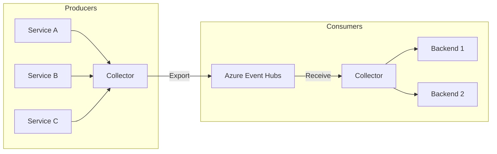
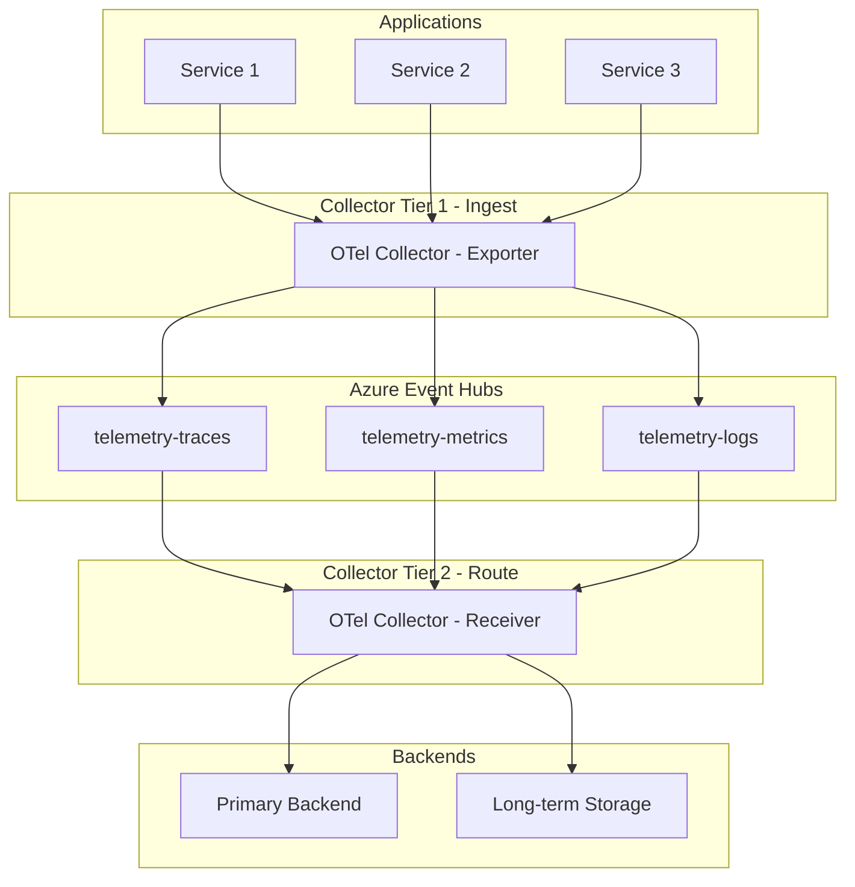

# How to Use Azure Event Hubs with OpenTelemetry Collector

Author: [nawazdhandala](https://www.github.com/nawazdhandala)

Tags: OpenTelemetry, Azure Event Hubs, OpenTelemetry Collector, Observability, Azure, Streaming, Telemetry Pipeline

Description: A step-by-step guide to using Azure Event Hubs as a receiver and exporter with the OpenTelemetry Collector for scalable telemetry pipelines.

---

> Azure Event Hubs is a high-throughput event streaming platform that can handle millions of events per second. When paired with the OpenTelemetry Collector, it becomes a powerful buffer and routing layer in your telemetry pipeline. This combination is especially useful in large-scale deployments where you need to decouple telemetry producers from consumers.

This guide covers two scenarios: using Azure Event Hubs as a receiver (ingesting telemetry data from Event Hubs) and as an exporter (sending telemetry data to Event Hubs). Both patterns have valid use cases, and you might even use them together in different parts of your infrastructure.

---

## Why Use Event Hubs in a Telemetry Pipeline?

Most OpenTelemetry setups use a direct connection from the Collector to a backend. That works fine at moderate scale. But when you have hundreds of services producing millions of spans per minute, a direct connection can become a bottleneck. Event Hubs solves this by acting as a durable buffer between producers and consumers.



The benefits of this architecture include:

- **Buffering**: Event Hubs absorbs traffic spikes without overwhelming your backend
- **Fan-out**: Multiple consumers can read from the same Event Hub independently
- **Durability**: Events are retained for a configurable period, so a downstream outage does not lose data
- **Decoupling**: Producers and consumers scale independently

---

## Prerequisites

- An Azure subscription
- An Azure Event Hubs namespace with at least one Event Hub created
- A shared access policy or managed identity for authentication
- Docker (for running the Collector) or the Collector binary
- The OpenTelemetry Collector Contrib distribution (the core distribution does not include the Event Hubs components)

---

## Setting Up Azure Event Hubs

First, create an Event Hubs namespace and an Event Hub if you do not already have one.

```bash
# Create a resource group for the Event Hubs resources
az group create --name otel-telemetry-rg --location eastus

# Create an Event Hubs namespace with Standard tier
# Standard tier supports consumer groups and partitions
az eventhubs namespace create \
  --name otel-telemetry-ns \
  --resource-group otel-telemetry-rg \
  --sku Standard \
  --location eastus

# Create an Event Hub with 4 partitions for parallel processing
# More partitions allow higher throughput
az eventhubs eventhub create \
  --name telemetry-traces \
  --namespace-name otel-telemetry-ns \
  --resource-group otel-telemetry-rg \
  --partition-count 4 \
  --message-retention 1

# Create a shared access policy with Send and Listen permissions
az eventhubs eventhub authorization-rule create \
  --name otel-collector-policy \
  --eventhub-name telemetry-traces \
  --namespace-name otel-telemetry-ns \
  --resource-group otel-telemetry-rg \
  --rights Send Listen
```

Grab the connection string for use in the Collector configuration.

```bash
# Get the connection string for the shared access policy
az eventhubs eventhub authorization-rule keys list \
  --name otel-collector-policy \
  --eventhub-name telemetry-traces \
  --namespace-name otel-telemetry-ns \
  --resource-group otel-telemetry-rg \
  --query primaryConnectionString \
  --output tsv
```

---

## Scenario 1: Exporting Telemetry to Event Hubs

In this pattern, the Collector receives telemetry from your applications via OTLP and forwards it to Azure Event Hubs. Another Collector (or any Event Hubs consumer) picks it up downstream.

### Collector Configuration for Export

```yaml
# otel-collector-export.yaml
# Collector configuration that exports traces to Azure Event Hubs

receivers:
  otlp:
    protocols:
      grpc:
        endpoint: 0.0.0.0:4317  # Receive OTLP from applications
      http:
        endpoint: 0.0.0.0:4318

processors:
  batch:
    timeout: 5s
    send_batch_size: 512  # Batch up to 512 spans before sending

  memory_limiter:
    check_interval: 1s
    limit_mib: 512        # Limit memory usage to 512 MB
    spike_limit_mib: 128  # Allow 128 MB spike headroom

exporters:
  azureeventhub:
    # Connection string with the Event Hub name appended
    connection_string: "Endpoint=sb://otel-telemetry-ns.servicebus.windows.net/;SharedAccessKeyName=otel-collector-policy;SharedAccessKey=YOUR_KEY;EntityPath=telemetry-traces"
    # Format for serializing telemetry data
    # "otlp_proto" preserves the full OTLP structure
    format: otlp_proto

service:
  pipelines:
    traces:
      receivers: [otlp]
      processors: [memory_limiter, batch]
      exporters: [azureeventhub]
    metrics:
      receivers: [otlp]
      processors: [memory_limiter, batch]
      exporters: [azureeventhub]
    logs:
      receivers: [otlp]
      processors: [memory_limiter, batch]
      exporters: [azureeventhub]
```

### Running the Export Collector

```bash
# Run the Collector with the export configuration
# Use the contrib image which includes the Azure Event Hubs components
docker run -d \
  --name otel-collector-export \
  -p 4317:4317 \
  -p 4318:4318 \
  -v $(pwd)/otel-collector-export.yaml:/etc/otelcol-contrib/config.yaml \
  otel/opentelemetry-collector-contrib:latest
```

---

## Scenario 2: Receiving Telemetry from Event Hubs

In this pattern, the Collector reads telemetry from Azure Event Hubs and forwards it to one or more backends. This is the consumer side of the pipeline.

### Collector Configuration for Receive

```yaml
# otel-collector-receive.yaml
# Collector configuration that reads traces from Azure Event Hubs

receivers:
  azureeventhub:
    # Connection string for consuming from the Event Hub
    connection_string: "Endpoint=sb://otel-telemetry-ns.servicebus.windows.net/;SharedAccessKeyName=otel-collector-policy;SharedAccessKey=YOUR_KEY;EntityPath=telemetry-traces"
    # Format must match what the exporter used
    format: otlp_proto
    # Consumer group for this Collector instance
    # Use different groups for different consumers
    group: "$Default"

processors:
  batch:
    timeout: 10s
    send_batch_size: 1024

  resource:
    attributes:
      - key: pipeline.stage
        value: "post-eventhub"
        action: upsert  # Mark telemetry that passed through Event Hubs

exporters:
  otlphttp:
    # Forward to your observability backend
    endpoint: "https://your-backend.example.com/otlp"
    headers:
      Authorization: "Bearer your-api-token"

  logging:
    # Also log a summary to stdout for debugging
    loglevel: info

service:
  pipelines:
    traces:
      receivers: [azureeventhub]
      processors: [batch, resource]
      exporters: [otlphttp, logging]
    metrics:
      receivers: [azureeventhub]
      processors: [batch, resource]
      exporters: [otlphttp]
    logs:
      receivers: [azureeventhub]
      processors: [batch, resource]
      exporters: [otlphttp]
```

---

## Full Pipeline: End-to-End Architecture

Combining both scenarios, you get a full telemetry pipeline with Event Hubs in the middle.



---

## Using Separate Event Hubs for Each Signal

For better isolation and independent scaling, create separate Event Hubs for traces, metrics, and logs. The Collector supports multiple exporter and receiver instances.

```yaml
# otel-collector-multi.yaml
# Configuration with separate Event Hubs for each telemetry signal

receivers:
  otlp:
    protocols:
      grpc:
        endpoint: 0.0.0.0:4317

exporters:
  # Separate exporter for each signal type
  azureeventhub/traces:
    connection_string: "Endpoint=sb://otel-telemetry-ns.servicebus.windows.net/;SharedAccessKeyName=policy;SharedAccessKey=KEY;EntityPath=telemetry-traces"
    format: otlp_proto

  azureeventhub/metrics:
    connection_string: "Endpoint=sb://otel-telemetry-ns.servicebus.windows.net/;SharedAccessKeyName=policy;SharedAccessKey=KEY;EntityPath=telemetry-metrics"
    format: otlp_proto

  azureeventhub/logs:
    connection_string: "Endpoint=sb://otel-telemetry-ns.servicebus.windows.net/;SharedAccessKeyName=policy;SharedAccessKey=KEY;EntityPath=telemetry-logs"
    format: otlp_proto

processors:
  batch:
    timeout: 5s

service:
  pipelines:
    # Each pipeline routes to its own Event Hub
    traces:
      receivers: [otlp]
      processors: [batch]
      exporters: [azureeventhub/traces]
    metrics:
      receivers: [otlp]
      processors: [batch]
      exporters: [azureeventhub/metrics]
    logs:
      receivers: [otlp]
      processors: [batch]
      exporters: [azureeventhub/logs]
```

---

## Performance Tuning

When running this at scale, a few settings make a big difference:

- **Partition count**: More partitions in your Event Hub allow more parallel consumers. Start with 4 and increase based on throughput needs.
- **Batch size**: The `batch` processor in the Collector should match your Event Hub message size limits. The default max message size is 1 MB for Standard tier and 1 MB (single event) for Premium.
- **Memory limiter**: Always use the `memory_limiter` processor to prevent the Collector from running out of memory during traffic spikes.
- **Consumer groups**: If multiple Collectors read from the same Event Hub, give each a unique consumer group to avoid message competition.
- **Message retention**: Set retention based on your recovery needs. One day is fine for real-time pipelines. Seven days gives you more buffer for outage recovery.

---

## Authentication with Managed Identity

For production deployments, avoid connection strings and use Azure Managed Identity instead. This is more secure and does not require rotating keys.

```yaml
# Using managed identity authentication instead of connection strings
exporters:
  azureeventhub:
    connection_string: "Endpoint=sb://otel-telemetry-ns.servicebus.windows.net/;EntityPath=telemetry-traces"
    # When no SharedAccessKey is in the connection string,
    # the exporter falls back to DefaultAzureCredential
    # which supports managed identity automatically
```

Make sure the managed identity has the "Azure Event Hubs Data Sender" role for exporters and "Azure Event Hubs Data Receiver" role for receivers.

---

## Summary

Azure Event Hubs fits naturally into large-scale OpenTelemetry pipelines. As an exporter, it buffers telemetry and protects your backends from traffic spikes. As a receiver, it lets you build flexible consumer architectures where multiple systems process the same telemetry data independently. The OpenTelemetry Collector Contrib distribution makes both patterns straightforward to configure. Start with a single Event Hub for all signals, and split into separate hubs per signal type as your throughput grows.
