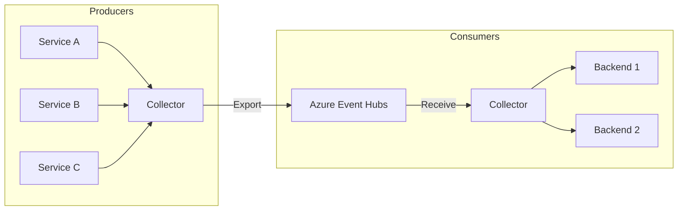
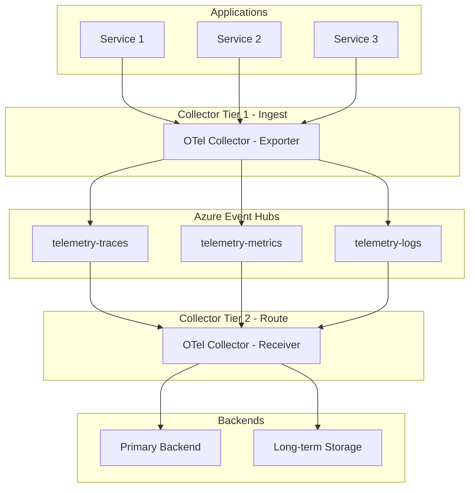

# How to Use Azure Event Hubs with OpenTelemetry Collector

Author: [nawazdhandala](https://www.github.com/nawazdhandala)

Tags: OpenTelemetry, Azure Event Hub, OpenTelemetry Collector, Observability, Azure, Streaming, Telemetry Pipeline

Description: A step-by-step guide to using Azure Event Hubs as a receiver and exporter with the OpenTelemetry Collector for scalable telemetry pipelines.

---

> Azure Event Hubs is a high-throughput event streaming platform that can handle millions of events per second. When paired with the OpenTelemetry Collector Kafka receiver and exporter, it becomes a powerful buffer and routing layer in your telemetry pipeline. This combination is especially useful in large-scale deployments where you need to decouple telemetry producers from consumers.

This guide covers two scenarios: sending telemetry data to Event Hubs and ingesting telemetry data from Event Hubs by using the Collector's Kafka components against the Event Hubs Kafka endpoint. Both patterns have valid use cases, and you might even use them together in different parts of your infrastructure.

---

## Why Use Event Hubs in a Telemetry Pipeline?

Most OpenTelemetry setups use a direct connection from the Collector to a backend. That works fine at moderate scale. But when you have hundreds of services producing millions of spans per minute, a direct connection can become a bottleneck. Event Hubs solves this by acting as a durable buffer between producers and consumers.


```mermaid
flowchart LR
    subgraph Producers
        A1[Service A] --> C1[Collector]
        A2[Service B] --> C1
        A3[Service C] --> C1
    end
    C1 -->|Export| EH[Azure Event Hubs]
    subgraph Consumers
        EH -->|Receive| C2[Collector]
        C2 --> B1[Backend 1]
        C2 --> B2[Backend 2]
    end
```

The benefits of this architecture include:

- **Buffering**: Event Hubs absorbs traffic spikes without overwhelming your backend
- **Fan-out**: Multiple consumers can read from the same Event Hub independently
- **Durability**: Events are retained for a configurable period, so a downstream outage does not lose data
- **Decoupling**: Producers and consumers scale independently

---

## Prerequisites

- An Azure subscription
- An Azure Event Hubs namespace with at least one Event Hub created
- A shared access policy or managed identity for authentication
- Docker (for running the Collector) or the Collector binary
- An OpenTelemetry Collector distribution with the Kafka receiver and exporter. The contrib distribution is a good default and is also required if you use the native Azure Event Hub receiver for Azure Monitor diagnostic data.

---

## Setting Up Azure Event Hubs

First, create an Event Hubs namespace and Event Hubs if you do not already have them.

```bash
# Create a resource group for the Event Hubs resources

az group create --name otel-telemetry-rg --location eastus

# Create an Event Hubs namespace with Standard tier
# Standard tier supports consumer groups and partitions
az eventhubs namespace create \
  --name otel-telemetry-ns \
  --resource-group otel-telemetry-rg \
  --sku Standard \
  --location eastus

# Create Event Hubs with 4 partitions for parallel processing
# More partitions allow higher throughput
az eventhubs eventhub create \
  --name telemetry-traces \
  --namespace-name otel-telemetry-ns \
  --resource-group otel-telemetry-rg \
  --partition-count 4 \
  --retention-time-in-hours 24

az eventhubs eventhub create \
  --name telemetry-metrics \
  --namespace-name otel-telemetry-ns \
  --resource-group otel-telemetry-rg \
  --partition-count 4 \
  --retention-time-in-hours 24

az eventhubs eventhub create \
  --name telemetry-logs \
  --namespace-name otel-telemetry-ns \
  --resource-group otel-telemetry-rg \
  --partition-count 4 \
  --retention-time-in-hours 24

# Create a namespace-level shared access policy with Send and Listen permissions
# The Kafka endpoint uses a namespace connection string as its SASL password
az eventhubs namespace authorization-rule create \
  --name otel-collector-policy \
  --namespace-name otel-telemetry-ns \
  --resource-group otel-telemetry-rg \
  --rights Send Listen
```

Grab the connection string for use in the Collector configuration.

```bash
# Get the connection string for the shared access policy
az eventhubs namespace authorization-rule keys list \
  --name otel-collector-policy \
  --namespace-name otel-telemetry-ns \
  --resource-group otel-telemetry-rg \
  --query primaryConnectionString \
  --output tsv
```

---

## Scenario 1: Exporting Telemetry to Event Hubs

In this pattern, the Collector receives telemetry from your applications via OTLP and forwards it to Azure Event Hubs through the Event Hubs Kafka endpoint. Another Collector (or any Event Hubs consumer) picks it up downstream.

### Collector Configuration for Export

```yaml
# otel-collector-export.yaml
# Collector configuration that exports telemetry to Azure Event Hubs

receivers:
  otlp:
    protocols:
      grpc:
        endpoint: 0.0.0.0:4317  # Receive OTLP from applications
      http:
        endpoint: 0.0.0.0:4318

processors:
  batch:
    timeout: 5s
    send_batch_size: 512  # Batch up to 512 spans before sending

  memory_limiter:
    check_interval: 1s
    limit_mib: 512        # Limit memory usage to 512 MB
    spike_limit_mib: 128  # Allow 128 MB spike headroom

exporters:
  kafka/eventhubs:
    brokers:
      - otel-telemetry-ns.servicebus.windows.net:9093
    tls:
      insecure: false
    auth:
      sasl:
        username: "$ConnectionString"
        password: "Endpoint=sb://otel-telemetry-ns.servicebus.windows.net/;SharedAccessKeyName=otel-collector-policy;SharedAccessKey=YOUR_KEY"
        mechanism: PLAIN
    traces:
      topic: telemetry-traces
      encoding: otlp_proto
    metrics:
      topic: telemetry-metrics
      encoding: otlp_proto
    logs:
      topic: telemetry-logs
      encoding: otlp_proto

service:
  pipelines:
    traces:
      receivers: [otlp]
      processors: [memory_limiter, batch]
      exporters: [kafka/eventhubs]
    metrics:
      receivers: [otlp]
      processors: [memory_limiter, batch]
      exporters: [kafka/eventhubs]
    logs:
      receivers: [otlp]
      processors: [memory_limiter, batch]
      exporters: [kafka/eventhubs]
```

### Running the Export Collector

```bash
# Run the Collector with the export configuration
# Use the contrib image, which includes the Kafka components used here
docker run -d \
  --name otel-collector-export \
  -p 4317:4317 \
  -p 4318:4318 \
  -v $(pwd)/otel-collector-export.yaml:/etc/otelcol-contrib/config.yaml \
  otel/opentelemetry-collector-contrib:latest
```

---

## Scenario 2: Receiving Telemetry from Event Hubs

In this pattern, the Collector reads OTLP-encoded telemetry from Azure Event Hubs through the Kafka endpoint and forwards it to one or more backends. This is the consumer side of the pipeline.

### Collector Configuration for Receive

```yaml
# otel-collector-receive.yaml
# Collector configuration that reads telemetry from Azure Event Hubs

receivers:
  kafka/eventhubs:
    brokers:
      - otel-telemetry-ns.servicebus.windows.net:9093
    tls:
      insecure: false
    auth:
      sasl:
        username: "$ConnectionString"
        password: "Endpoint=sb://otel-telemetry-ns.servicebus.windows.net/;SharedAccessKeyName=otel-collector-policy;SharedAccessKey=YOUR_KEY"
        mechanism: PLAIN
    # Consumer group for this Collector instance.
    # Use different group IDs for independent consumers.
    group_id: otel-collector-consumer
    initial_offset: earliest
    use_leader_epoch: false
    traces:
      topics: [telemetry-traces]
      encoding: otlp_proto
    metrics:
      topics: [telemetry-metrics]
      encoding: otlp_proto
    logs:
      topics: [telemetry-logs]
      encoding: otlp_proto

processors:
  batch:
    timeout: 10s
    send_batch_size: 1024

  resource:
    attributes:
      - key: pipeline.stage
        value: "post-eventhub"
        action: upsert  # Mark telemetry that passed through Event Hubs

exporters:
  otlphttp:
    # Forward to your observability backend
    endpoint: "https://your-backend.example.com/otlp"
    headers:
      Authorization: "Bearer your-api-token"

  debug:
    # Also log a summary to stdout for debugging
    verbosity: basic

service:
  pipelines:
    traces:
      receivers: [kafka/eventhubs]
      processors: [batch, resource]
      exporters: [otlphttp, debug]
    metrics:
      receivers: [kafka/eventhubs]
      processors: [batch, resource]
      exporters: [otlphttp]
    logs:
      receivers: [kafka/eventhubs]
      processors: [batch, resource]
      exporters: [otlphttp]
```

---

## Full Pipeline: End-to-End Architecture

Combining both scenarios, you get a full telemetry pipeline with Event Hubs in the middle.


```mermaid
flowchart TB
    subgraph Applications
        S1[Service 1]
        S2[Service 2]
        S3[Service 3]
    end

    subgraph "Collector Tier 1 - Ingest"
        C1[OTel Collector - Exporter]
    end

    subgraph "Azure Event Hubs"
        EH1[telemetry-traces]
        EH2[telemetry-metrics]
        EH3[telemetry-logs]
    end

    subgraph "Collector Tier 2 - Route"
        C2[OTel Collector - Receiver]
    end

    subgraph Backends
        B1[Primary Backend]
        B2[Long-term Storage]
    end

    S1 --> C1
    S2 --> C1
    S3 --> C1
    C1 --> EH1
    C1 --> EH2
    C1 --> EH3
    EH1 --> C2
    EH2 --> C2
    EH3 --> C2
    C2 --> B1
    C2 --> B2
```

---

## Using Separate Event Hubs for Each Signal

For better isolation and independent scaling, create separate Event Hubs for traces, metrics, and logs. The Collector Kafka exporter and receiver support separate topics for each signal.

```yaml
# otel-collector-multi.yaml
# Configuration with separate Event Hubs for each telemetry signal

receivers:
  otlp:
    protocols:
      grpc:
        endpoint: 0.0.0.0:4317

exporters:
  # Separate exporter for each signal type
  kafka/traces:
    brokers: [otel-telemetry-ns.servicebus.windows.net:9093]
    tls:
      insecure: false
    auth:
      sasl:
        username: "$ConnectionString"
        password: "Endpoint=sb://otel-telemetry-ns.servicebus.windows.net/;SharedAccessKeyName=policy;SharedAccessKey=KEY"
        mechanism: PLAIN
    traces:
      topic: telemetry-traces
      encoding: otlp_proto

  kafka/metrics:
    brokers: [otel-telemetry-ns.servicebus.windows.net:9093]
    tls:
      insecure: false
    auth:
      sasl:
        username: "$ConnectionString"
        password: "Endpoint=sb://otel-telemetry-ns.servicebus.windows.net/;SharedAccessKeyName=policy;SharedAccessKey=KEY"
        mechanism: PLAIN
    metrics:
      topic: telemetry-metrics
      encoding: otlp_proto

  kafka/logs:
    brokers: [otel-telemetry-ns.servicebus.windows.net:9093]
    tls:
      insecure: false
    auth:
      sasl:
        username: "$ConnectionString"
        password: "Endpoint=sb://otel-telemetry-ns.servicebus.windows.net/;SharedAccessKeyName=policy;SharedAccessKey=KEY"
        mechanism: PLAIN
    logs:
      topic: telemetry-logs
      encoding: otlp_proto

processors:
  batch:
    timeout: 5s

service:
  pipelines:
    # Each pipeline routes to its own Event Hub
    traces:
      receivers: [otlp]
      processors: [batch]
      exporters: [kafka/traces]
    metrics:
      receivers: [otlp]
      processors: [batch]
      exporters: [kafka/metrics]
    logs:
      receivers: [otlp]
      processors: [batch]
      exporters: [kafka/logs]
```

---

## Performance Tuning

When running this at scale, a few settings make a big difference:

- **Partition count**: More partitions in your Event Hub allow more parallel consumers in the same consumer group. Start with 4 and increase based on throughput needs.
- **Batch size**: The `batch` processor in the Collector should stay within your Event Hub publication size limits. Standard and Premium support 1 MB publications; Dedicated supports larger publications.
- **Memory limiter**: Always use the `memory_limiter` processor to prevent the Collector from running out of memory during traffic spikes.
- **Consumer groups**: If multiple independent consumer applications read from the same Event Hub, give each a unique consumer group. Collectors in the same group share partitions.
- **Message retention**: Set retention based on your recovery needs. One day is fine for real-time pipelines. Seven days gives you more buffer for outage recovery.

---

## Authentication with Managed Identity

The Kafka receiver and exporter path shown above uses the Event Hubs Kafka endpoint with SASL credentials. The native `azure_event_hub` receiver supports managed identity through the Collector's Azure Auth extension, which is useful when reading Azure Monitor diagnostic data sent to Event Hubs.

```yaml
# Using managed identity authentication with the native Azure Event Hub receiver
extensions:
  azure_auth:
    managed_identity:

receivers:
  azure_event_hub:
    event_hub:
      name: telemetry-traces
      namespace: otel-telemetry-ns.servicebus.windows.net
    auth: azure_auth

service:
  extensions: [azure_auth]
```

Make sure the managed identity has the "Azure Event Hubs Data Receiver" role for native receivers. For Kafka exporter and receiver configurations that use SAS, grant the shared access policy Send and Listen permissions as needed.

---

## Summary

Azure Event Hubs fits naturally into large-scale OpenTelemetry pipelines. With the Collector Kafka exporter, it buffers telemetry and protects your backends from traffic spikes. With the Collector Kafka receiver, it lets you build flexible consumer architectures where multiple systems process the same telemetry data independently. The OpenTelemetry Collector makes both patterns straightforward to configure. Start with separate Event Hubs for traces, metrics, and logs, and scale each signal independently as your throughput grows.
