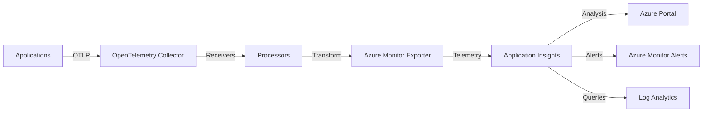

# How to Configure the Azure Monitor Exporter in the OpenTelemetry Collector

Author: [nawazdhandala](https://www.github.com/nawazdhandala)

Tags: OpenTelemetry, Collector, Exporters, Azure, Azure Monitor, Application Insights, Observability

Description: Complete guide to configuring the Azure Monitor exporter in the OpenTelemetry Collector for seamless integration with Azure's native monitoring services.

Azure Monitor is Microsoft's comprehensive monitoring solution for cloud and on-premises environments. The OpenTelemetry Collector's Azure Monitor exporter enables you to send traces, metrics, and logs directly to Azure Monitor and Application Insights, providing native integration with Azure's observability ecosystem.

## Understanding the Azure Monitor Exporter

The Azure Monitor exporter translates OpenTelemetry data into Azure Monitor's native format, allowing you to leverage Application Insights for distributed tracing, metrics analysis, and log analytics. This exporter is particularly valuable for organizations using Azure services, as it provides seamless integration with the Azure portal and monitoring tools.

The exporter supports all three telemetry signals and automatically maps OpenTelemetry semantic conventions to Azure Monitor's data model, ensuring your telemetry appears correctly in Application Insights queries and dashboards.

## Architecture Overview

Here's how the Azure Monitor exporter integrates into your observability stack:



## Prerequisites

Before configuring the Azure Monitor exporter, you need:

- An Azure subscription
- An Application Insights resource created in Azure
- The connection string or instrumentation key from Application Insights
- OpenTelemetry Collector Contrib installed (version 0.80.0 or later)

## Creating an Application Insights Resource

If you don't have an Application Insights resource, create one:

```bash
# Using Azure CLI
az monitor app-insights component create \
  --app my-application-insights \
  --location eastus \
  --resource-group my-resource-group \
  --application-type web

# Get the connection string
az monitor app-insights component show \
  --app my-application-insights \
  --resource-group my-resource-group \
  --query connectionString \
  --output tsv
```

The connection string looks like:
```
InstrumentationKey=12345678-abcd-1234-abcd-123456789abc;IngestionEndpoint=https://eastus-1.in.applicationinsights.azure.com/;LiveEndpoint=https://eastus.livediagnostics.monitor.azure.com/
```

## Basic Configuration

Here's a minimal configuration for the Azure Monitor exporter:

```yaml
# OpenTelemetry Collector configuration for Azure Monitor
receivers:
  otlp:
    protocols:
      grpc:
        endpoint: 0.0.0.0:4317
      http:
        endpoint: 0.0.0.0:4318

processors:
  batch:
    # Batch telemetry for efficient transmission
    timeout: 10s
    send_batch_size: 1024

exporters:
  azuremonitor:
    # Connection string from Application Insights
    connection_string: "InstrumentationKey=12345678-abcd-1234-abcd-123456789abc;IngestionEndpoint=https://eastus-1.in.applicationinsights.azure.com/"

    # Maximum number of items to submit in each request
    max_batch_size: 1024

    # Timeout for sending data
    timeout: 10s

service:
  pipelines:
    traces:
      receivers: [otlp]
      processors: [batch]
      exporters: [azuremonitor]
    metrics:
      receivers: [otlp]
      processors: [batch]
      exporters: [azuremonitor]
    logs:
      receivers: [otlp]
      processors: [batch]
      exporters: [azuremonitor]
```

This configuration establishes three pipelines that receive OpenTelemetry data and export it to Azure Monitor.

## Using Environment Variables for Credentials

For security best practices, store the connection string in environment variables:

```yaml
exporters:
  azuremonitor:
    # Reference environment variable for connection string
    connection_string: "${APPLICATIONINSIGHTS_CONNECTION_STRING}"
    max_batch_size: 1024
    timeout: 10s
```

Then set the environment variable:

```bash
export APPLICATIONINSIGHTS_CONNECTION_STRING="InstrumentationKey=12345678-abcd-1234-abcd-123456789abc;IngestionEndpoint=https://eastus-1.in.applicationinsights.azure.com/"
```

## Advanced Configuration Options

For production deployments, customize additional parameters:

```yaml
exporters:
  azuremonitor:
    connection_string: "${APPLICATIONINSIGHTS_CONNECTION_STRING}"

    # Maximum batch size for export
    max_batch_size: 2048

    # Timeout for export operations
    timeout: 30s

    # Queue configuration for handling bursts
    sending_queue:
      enabled: true
      num_consumers: 10
      queue_size: 5000

    # Retry configuration
    retry_on_failure:
      enabled: true
      initial_interval: 5s
      max_interval: 30s
      max_elapsed_time: 300s

    # Instrumentation key (alternative to connection string)
    # instrumentation_key: "12345678-abcd-1234-abcd-123456789abc"

    # Override endpoint (for sovereign clouds)
    # endpoint: "https://dc.services.visualstudio.com/v2/track"

    # Disable telemetry for specific signal types
    # disable_offline_storage: false
```

## Configuring Resource Attributes

Azure Monitor uses specific attributes to organize and filter telemetry. Add these attributes using the resource processor:

```yaml
processors:
  resource:
    attributes:
      # Service name appears as Cloud Role Name in Azure
      - key: service.name
        value: "payment-service"
        action: upsert

      # Service instance appears as Cloud Role Instance
      - key: service.instance.id
        value: "${HOSTNAME}"
        action: upsert

      # Service version for release tracking
      - key: service.version
        value: "1.2.3"
        action: upsert

      # Deployment environment
      - key: deployment.environment
        value: "production"
        action: upsert

  batch:
    timeout: 10s
    send_batch_size: 1024

exporters:
  azuremonitor:
    connection_string: "${APPLICATIONINSIGHTS_CONNECTION_STRING}"

service:
  pipelines:
    traces:
      receivers: [otlp]
      processors: [resource, batch]
      exporters: [azuremonitor]
```

## Mapping OpenTelemetry to Azure Monitor

Understanding how OpenTelemetry concepts map to Azure Monitor helps you query and visualize your data effectively:

| OpenTelemetry | Azure Monitor | Description |
|--------------|---------------|-------------|
| Trace | Request/Dependency | Distributed trace |
| Span (root) | Request | Entry point operation |
| Span (child) | Dependency | Outbound calls |
| Metric | CustomMetrics | Measurement data |
| Log | Trace | Log messages |
| service.name | cloud_RoleName | Service identifier |
| service.instance.id | cloud_RoleInstance | Instance identifier |

## Filtering and Sampling

Reduce data volume and costs with filtering and sampling:

```yaml
processors:
  # Filter out health check endpoints
  filter/healthcheck:
    traces:
      span:
        - 'attributes["http.target"] == "/health"'
        - 'attributes["http.target"] == "/ready"'

  # Probabilistic sampling for high-volume services
  probabilistic_sampler:
    sampling_percentage: 10

  # Tail sampling - keep interesting traces
  tail_sampling:
    policies:
      # Always sample errors
      - name: error-traces
        type: status_code
        status_code:
          status_codes: [ERROR]

      # Sample 5% of successful traces
      - name: successful-traces
        type: probabilistic
        probabilistic:
          sampling_percentage: 5

      # Always sample slow traces
      - name: slow-traces
        type: latency
        latency:
          threshold_ms: 1000

  batch:
    timeout: 10s
    send_batch_size: 1024

exporters:
  azuremonitor:
    connection_string: "${APPLICATIONINSIGHTS_CONNECTION_STRING}"

service:
  pipelines:
    traces:
      receivers: [otlp]
      processors: [filter/healthcheck, tail_sampling, batch]
      exporters: [azuremonitor]
```

## Multi-Region and Sovereign Cloud Support

For global deployments or sovereign clouds, configure region-specific endpoints:

```yaml
exporters:
  # Azure Commercial (default)
  azuremonitor/commercial:
    connection_string: "${AZURE_COMMERCIAL_CONNECTION_STRING}"

  # Azure Government
  azuremonitor/government:
    connection_string: "${AZURE_GOV_CONNECTION_STRING}"
    endpoint: "https://dc.applicationinsights.us/v2/track"

  # Azure China
  azuremonitor/china:
    connection_string: "${AZURE_CHINA_CONNECTION_STRING}"
    endpoint: "https://dc.applicationinsights.azure.cn/v2/track"

service:
  pipelines:
    traces:
      receivers: [otlp]
      processors: [batch]
      exporters: [azuremonitor/commercial]  # Choose appropriate exporter
```

## Querying Data in Application Insights

Once your data is in Application Insights, query it using Kusto Query Language (KQL):

```kql
// Query traces by service name
requests
| where cloud_RoleName == "payment-service"
| where timestamp > ago(1h)
| summarize
    RequestCount = count(),
    AvgDuration = avg(duration),
    P95Duration = percentile(duration, 95)
  by name
| order by RequestCount desc

// Query dependencies (outbound calls)
dependencies
| where cloud_RoleName == "payment-service"
| where timestamp > ago(1h)
| summarize
    CallCount = count(),
    FailureRate = countif(success == false) * 100.0 / count()
  by target, name
| order by CallCount desc

// Query custom metrics
customMetrics
| where name == "order.processing.time"
| where timestamp > ago(1h)
| summarize avg(value), percentile(value, 95), percentile(value, 99) by bin(timestamp, 5m)
| render timechart

// Query logs
traces
| where cloud_RoleName == "payment-service"
| where severityLevel >= 3  // Warning and above
| where timestamp > ago(1h)
| order by timestamp desc
| take 100
```

## Creating Alerts

Configure alerts based on your telemetry data:

```bash
# Create an alert for high error rate
az monitor metrics alert create \
  --name high-error-rate \
  --resource-group my-resource-group \
  --scopes /subscriptions/{subscription-id}/resourceGroups/my-resource-group/providers/microsoft.insights/components/my-application-insights \
  --condition "avg requests/failed > 10" \
  --window-size 5m \
  --evaluation-frequency 1m \
  --action-group my-action-group

# Create an alert for slow response times
az monitor metrics alert create \
  --name slow-response \
  --resource-group my-resource-group \
  --scopes /subscriptions/{subscription-id}/resourceGroups/my-resource-group/providers/microsoft.insights/components/my-application-insights \
  --condition "avg requests/duration > 1000" \
  --window-size 5m \
  --evaluation-frequency 1m \
  --action-group my-action-group
```

## Cost Management Strategies

Application Insights pricing is based on data volume. Here's how to optimize costs:

**1. Use Sampling:**

```yaml
processors:
  probabilistic_sampler:
    # Sample 25% of traces
    sampling_percentage: 25
```

**2. Configure Daily Cap:**

Set a daily ingestion cap in the Azure portal to prevent unexpected costs.

**3. Filter Unnecessary Data:**

```yaml
processors:
  filter/noisy:
    traces:
      span:
        - 'attributes["http.target"] == "/metrics"'
        - 'attributes["http.target"] == "/health"'
```

**4. Use Commitment Tiers:**

Azure offers discounted commitment tiers for predictable data volumes.

## Security Best Practices

Protect your telemetry data with these security measures:

**1. Use Azure Key Vault for Connection Strings:**

```bash
# Store connection string in Key Vault
az keyvault secret set \
  --vault-name my-keyvault \
  --name app-insights-connection-string \
  --value "InstrumentationKey=..."

# Grant collector access to Key Vault
az keyvault set-policy \
  --name my-keyvault \
  --object-id <collector-managed-identity-id> \
  --secret-permissions get
```

**2. Use Managed Identities:**

For collectors running in Azure, use managed identities instead of connection strings when possible.

**3. Enable Data Encryption:**

Application Insights encrypts data at rest by default. For additional security, use customer-managed keys.

**4. Configure Network Isolation:**

Use Private Link to send telemetry over a private network:

```bash
# Create a private endpoint for Application Insights
az network private-endpoint create \
  --name appinsights-private-endpoint \
  --resource-group my-resource-group \
  --vnet-name my-vnet \
  --subnet my-subnet \
  --private-connection-resource-id /subscriptions/{subscription-id}/resourceGroups/my-resource-group/providers/microsoft.insights/components/my-application-insights \
  --connection-name appinsights-connection \
  --group-id azuremonitor
```

## Complete Production Example

Here's a complete configuration for production use:

```yaml
receivers:
  otlp:
    protocols:
      grpc:
        endpoint: 0.0.0.0:4317
      http:
        endpoint: 0.0.0.0:4318

processors:
  # Add resource attributes
  resource:
    attributes:
      - key: service.name
        value: "${SERVICE_NAME}"
        action: upsert
      - key: service.instance.id
        value: "${HOSTNAME}"
        action: upsert
      - key: service.version
        value: "${SERVICE_VERSION}"
        action: upsert
      - key: deployment.environment
        value: "${ENVIRONMENT}"
        action: upsert

  # Filter health checks
  filter/healthcheck:
    traces:
      span:
        - 'attributes["http.target"] == "/health"'
        - 'attributes["http.target"] == "/ready"'
        - 'attributes["http.target"] == "/metrics"'

  # Tail sampling for intelligent trace retention
  tail_sampling:
    decision_wait: 10s
    num_traces: 100000
    expected_new_traces_per_sec: 1000
    policies:
      - name: error-traces
        type: status_code
        status_code:
          status_codes: [ERROR]
      - name: slow-traces
        type: latency
        latency:
          threshold_ms: 1000
      - name: sampled-traces
        type: probabilistic
        probabilistic:
          sampling_percentage: 10

  # Batch for efficiency
  batch:
    timeout: 10s
    send_batch_size: 2048

  # Add span metrics
  spanmetrics:
    metrics_exporter: azuremonitor
    dimensions:
      - name: http.method
      - name: http.status_code

exporters:
  azuremonitor:
    connection_string: "${APPLICATIONINSIGHTS_CONNECTION_STRING}"
    max_batch_size: 2048
    timeout: 30s

    sending_queue:
      enabled: true
      num_consumers: 10
      queue_size: 10000

    retry_on_failure:
      enabled: true
      initial_interval: 5s
      max_interval: 30s
      max_elapsed_time: 300s

service:
  pipelines:
    traces:
      receivers: [otlp]
      processors: [resource, filter/healthcheck, tail_sampling, spanmetrics, batch]
      exporters: [azuremonitor]

    metrics:
      receivers: [otlp]
      processors: [resource, batch]
      exporters: [azuremonitor]

    logs:
      receivers: [otlp]
      processors: [resource, batch]
      exporters: [azuremonitor]

  telemetry:
    logs:
      level: info
    metrics:
      address: 0.0.0.0:8888
```

## Troubleshooting Common Issues

**Issue: Data not appearing in Application Insights**

Check:
- Connection string is correct and not expired
- Network connectivity to Azure endpoints
- Collector logs for authentication errors
- Application Insights resource is not disabled

**Issue: High latency or timeouts**

Solutions:
- Increase batch size to reduce request frequency
- Enable sending queue for burst handling
- Check network latency to Azure region
- Consider using a collector closer to Azure

**Issue: Missing spans or incomplete traces**

Verify:
- Trace context propagation is working correctly
- Sampling decisions are consistent across services
- Collector buffer sizes are sufficient

## Integration with Azure Services

The Azure Monitor exporter works seamlessly with other Azure services:

**Azure Kubernetes Service (AKS):**

Deploy the collector as a DaemonSet or Deployment in your AKS cluster.

**Azure Functions:**

Use the collector to aggregate telemetry from multiple function apps.

**Azure Container Instances:**

Run the collector as a sidecar container.

**Azure Monitor Workbooks:**

Create custom visualizations using telemetry from the collector.

## Conclusion

The Azure Monitor exporter provides first-class integration between OpenTelemetry and Azure's monitoring ecosystem. By following the configuration patterns and best practices in this guide, you can build a robust observability solution that leverages the full power of Application Insights.

For more information on OpenTelemetry exporters, check out these related articles:
- https://oneuptime.com/blog/post/2026-02-06-aws-s3-exporter-opentelemetry-collector/view
- https://oneuptime.com/blog/post/2026-02-06-azure-data-explorer-exporter-opentelemetry-collector/view

For detailed information about the Azure Monitor exporter configuration options, refer to the official OpenTelemetry Collector documentation.
