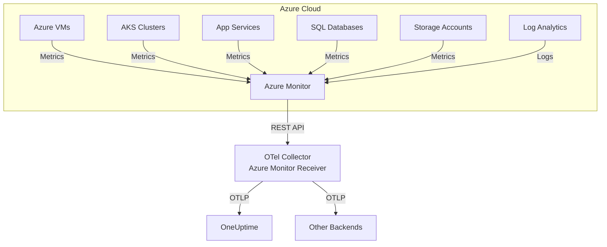

# How to Configure the Azure Monitor Receiver in the OpenTelemetry Collector

Author: [nawazdhandala](https://www.github.com/nawazdhandala)

Tags: OpenTelemetry, Collector, Azure, Azure Monitor, Metrics, Observability, Cloud

Description: Learn how to configure the Azure Monitor Receiver in OpenTelemetry Collector to pull metrics and logs from Azure Monitor with authentication setup, query patterns, and production deployment strategies.

---

> Running workloads on Azure but want to avoid vendor lock-in? The Azure Monitor Receiver lets you pull metrics and logs from Azure Monitor into OpenTelemetry, giving you the freedom to choose your observability backend while leveraging Azure's native monitoring capabilities.

The Azure Monitor Receiver is an OpenTelemetry Collector component that queries Azure Monitor APIs to retrieve metrics and logs from Azure resources. This receiver bridges the gap between Azure's native monitoring service and vendor-neutral OpenTelemetry pipelines, enabling you to consolidate Azure telemetry with data from other sources in a unified observability platform.

---

## What is the Azure Monitor Receiver?

Azure Monitor is Microsoft's comprehensive monitoring solution for Azure resources, collecting metrics and logs from virtual machines, databases, storage accounts, Kubernetes clusters, and more. The Azure Monitor Receiver queries these metrics and logs via Azure's REST APIs and converts them into OpenTelemetry format.

This receiver is essential for:

- **Multi-cloud observability**: Consolidate Azure metrics with AWS and GCP data
- **Cost optimization**: Export Azure metrics to cheaper storage/analytics platforms
- **Vendor independence**: Avoid Azure Monitor lock-in
- **Custom processing**: Apply OpenTelemetry processors before storage
- **Long-term retention**: Store metrics beyond Azure Monitor's retention limits

### Key Capabilities

- Query Azure Monitor metrics for any resource type
- Retrieve logs from Log Analytics workspaces
- Support for custom metric queries and filters
- Multiple authentication methods (managed identity, service principal)
- Resource tag-based filtering
- Configurable scrape intervals

---

## Architecture Overview

Here's how the Azure Monitor Receiver integrates into your observability stack:



The receiver periodically queries Azure Monitor APIs for specified resources and metric definitions, transforms the responses into OpenTelemetry metrics, and sends them through the collector pipeline.

---

## Prerequisites

Before configuring the receiver, ensure you have:

1. **Azure Subscription** with resources to monitor
2. **Authentication credentials** - Managed identity or service principal
3. **Azure Monitor permissions** - `Monitoring Reader` role at minimum
4. **Log Analytics workspace** (if querying logs)
5. **OpenTelemetry Collector** version 0.85.0 or later with azuremonitor receiver component

---

## Authentication Setup

The receiver supports two primary authentication methods:

### Method 1: Managed Identity (Recommended for Azure VMs)

Assign the managed identity these roles:
- `Monitoring Reader` on the subscription or resource group
- `Log Analytics Reader` if querying Log Analytics

Enable managed identity on your VM or AKS cluster:

```bash
# For Azure VM
az vm identity assign --name myVM --resource-group myResourceGroup

# For AKS cluster
az aks update --name myAKS --resource-group myResourceGroup --enable-managed-identity
```

### Method 2: Service Principal

Create a service principal and assign the `Monitoring Reader` role:

```bash
# Create service principal
az ad sp create-for-rbac --name "otel-collector-sp" \
  --role "Monitoring Reader" \
  --scopes /subscriptions/{subscription-id}

# Output will include:
# - appId (client ID)
# - password (client secret)
# - tenant (tenant ID)
```

Store credentials securely:

```bash
export AZURE_TENANT_ID="your-tenant-id"
export AZURE_CLIENT_ID="your-client-id"
export AZURE_CLIENT_SECRET="your-client-secret"
export AZURE_SUBSCRIPTION_ID="your-subscription-id"
```

---

## Basic Configuration

Here's a minimal configuration to start collecting Azure VM metrics. This example uses managed identity authentication:

```yaml
# Configure the Azure Monitor receiver
receivers:
  # The azuremonitor receiver queries Azure Monitor APIs
  azuremonitor:
    # Subscription ID containing resources to monitor
    subscription_id: "12345678-1234-1234-1234-123456789012"

    # Authentication using managed identity (no credentials needed)
    auth:
      type: managed_identity

    # How often to scrape metrics from Azure Monitor
    collection_interval: 60s

    # Resource groups to monitor (optional, omit to monitor all)
    resource_groups:
      - production-rg
      - staging-rg

    # Metrics to collect
    metrics:
      # Azure Virtual Machines metrics
      - resource_type: Microsoft.Compute/virtualMachines
        metrics:
          - name: Percentage CPU
            aggregation: Average
          - name: Network In Total
            aggregation: Total
          - name: Network Out Total
            aggregation: Total
          - name: Disk Read Bytes
            aggregation: Total
          - name: Disk Write Bytes
            aggregation: Total

# Configure where to send metrics
exporters:
  otlphttp:
    endpoint: https://oneuptime.com/otlp
    headers:
      x-oneuptime-token: ${ONEUPTIME_TOKEN}

# Define the metrics pipeline
service:
  pipelines:
    metrics:
      receivers: [azuremonitor]
      exporters: [otlphttp]
```

This basic configuration collects key VM metrics every 60 seconds from specified resource groups and exports them to OneUptime. The managed identity handles authentication automatically.

---

## Production Configuration with Multiple Resource Types

For production environments, monitor multiple Azure resource types with processing and error handling:

```yaml
receivers:
  azuremonitor:
    subscription_id: ${AZURE_SUBSCRIPTION_ID}

    # Use service principal for non-Azure deployments
    auth:
      type: service_principal
      tenant_id: ${AZURE_TENANT_ID}
      client_id: ${AZURE_CLIENT_ID}
      client_secret: ${AZURE_CLIENT_SECRET}

    # Scrape interval
    collection_interval: 60s

    # Resource groups to monitor
    resource_groups:
      - production-rg
      - database-rg
      - storage-rg

    # Filter resources by tags (optional)
    resource_tags:
      environment: production
      monitoring: enabled

    # Comprehensive metrics configuration
    metrics:
      # Virtual Machines
      - resource_type: Microsoft.Compute/virtualMachines
        metrics:
          - name: Percentage CPU
            aggregation: Average
          - name: Available Memory Bytes
            aggregation: Average
          - name: Network In Total
            aggregation: Total
          - name: Network Out Total
            aggregation: Total
          - name: Disk Read Bytes
            aggregation: Total
          - name: Disk Write Bytes
            aggregation: Total
          - name: Disk Read Operations/Sec
            aggregation: Average
          - name: Disk Write Operations/Sec
            aggregation: Average

      # Azure Kubernetes Service
      - resource_type: Microsoft.ContainerService/managedClusters
        metrics:
          - name: node_cpu_usage_percentage
            aggregation: Average
          - name: node_memory_working_set_percentage
            aggregation: Average
          - name: node_disk_usage_percentage
            aggregation: Average
          - name: node_network_in_bytes
            aggregation: Total
          - name: node_network_out_bytes
            aggregation: Total

      # SQL Databases
      - resource_type: Microsoft.Sql/servers/databases
        metrics:
          - name: cpu_percent
            aggregation: Average
          - name: physical_data_read_percent
            aggregation: Average
          - name: log_write_percent
            aggregation: Average
          - name: dtu_consumption_percent
            aggregation: Average
          - name: storage_percent
            aggregation: Maximum
          - name: connection_successful
            aggregation: Total
          - name: connection_failed
            aggregation: Total
          - name: deadlock
            aggregation: Total

      # Storage Accounts
      - resource_type: Microsoft.Storage/storageAccounts
        metrics:
          - name: UsedCapacity
            aggregation: Average
          - name: Transactions
            aggregation: Total
          - name: Ingress
            aggregation: Total
          - name: Egress
            aggregation: Total
          - name: SuccessServerLatency
            aggregation: Average
          - name: SuccessE2ELatency
            aggregation: Average
          - name: Availability
            aggregation: Average

      # App Services
      - resource_type: Microsoft.Web/sites
        metrics:
          - name: CpuTime
            aggregation: Total
          - name: MemoryWorkingSet
            aggregation: Average
          - name: Requests
            aggregation: Total
          - name: Http2xx
            aggregation: Total
          - name: Http4xx
            aggregation: Total
          - name: Http5xx
            aggregation: Total
          - name: ResponseTime
            aggregation: Average
          - name: BytesReceived
            aggregation: Total
          - name: BytesSent
            aggregation: Total

processors:
  # Protect collector from memory issues
  memory_limiter:
    limit_mib: 2048
    spike_limit_mib: 512
    check_interval: 5s

  # Add resource attributes
  resource:
    attributes:
      - key: source.type
        value: azure_monitor
        action: insert
      - key: cloud.provider
        value: azure
        action: insert
      - key: azure.subscription.id
        value: ${AZURE_SUBSCRIPTION_ID}
        action: insert

  # Transform metric names to follow conventions
  metricstransform:
    transforms:
      # Normalize Azure metric names to lowercase with underscores
      - include: ".*"
        match_type: regexp
        action: update
        operations:
          - action: update_label
            label: azure.metric.name
            new_label: metric.name
          - action: aggregate_labels
            aggregation_type: sum
            label_set: [resource.id, metric.name]

  # Filter out metrics you don't need
  filter/unnecessary:
    metrics:
      exclude:
        match_type: regexp
        metric_names:
          # Example: Exclude specific metrics to reduce volume
          - ".*test.*"
          - ".*debug.*"

  # Batch metrics for efficiency
  batch:
    timeout: 30s
    send_batch_size: 1000
    send_batch_max_size: 2000

exporters:
  # Primary export to OneUptime
  otlphttp/oneuptime:
    endpoint: https://oneuptime.com/otlp
    headers:
      x-oneuptime-token: ${ONEUPTIME_TOKEN}
    compression: gzip
    timeout: 30s
    retry_on_failure:
      enabled: true
      initial_interval: 5s
      max_interval: 30s
      max_elapsed_time: 300s

  # Backup to Azure Log Analytics
  azuremonitor:
    workspace_id: ${LOG_ANALYTICS_WORKSPACE_ID}
    instrumentation_key: ${APPLICATION_INSIGHTS_KEY}

  # Export to Prometheus for local monitoring
  prometheus:
    endpoint: :9090

service:
  # Enable collector telemetry
  telemetry:
    logs:
      level: info
    metrics:
      address: :8888
      level: detailed

  # Enable extensions
  extensions: [health_check, pprof]

  pipelines:
    metrics:
      receivers: [azuremonitor]
      processors:
        - memory_limiter
        - resource
        - metricstransform
        - filter/unnecessary
        - batch
      exporters:
        - otlphttp/oneuptime
        - azuremonitor
        - prometheus

extensions:
  health_check:
    endpoint: :13133

  pprof:
    endpoint: localhost:1777
```

This production configuration demonstrates:

- **Multi-resource monitoring**: VMs, AKS, SQL, Storage, App Services
- **Resource filtering**: Use tags to select specific resources
- **Metric transformation**: Normalize Azure metric names
- **Multiple exporters**: Send to OneUptime, Log Analytics, and Prometheus
- **Comprehensive monitoring**: Health checks and performance profiling

---

## Querying Log Analytics Workspaces

In addition to metrics, the Azure Monitor Receiver can query logs from Log Analytics workspaces using Kusto Query Language (KQL):

```yaml
receivers:
  azuremonitor:
    subscription_id: ${AZURE_SUBSCRIPTION_ID}

    auth:
      type: managed_identity

    # Log Analytics workspace configuration
    logs:
      # Workspace ID from Azure Portal
      workspace_id: "12345678-1234-1234-1234-123456789012"

      # KQL queries to execute
      queries:
        # Query for application errors
        - name: application_errors
          query: |
            AppTraces
            | where TimeGenerated > ago(5m)
            | where SeverityLevel >= 3
            | project TimeGenerated, Message, SeverityLevel, AppRoleName
          interval: 5m

        # Query for performance issues
        - name: slow_requests
          query: |
            AppRequests
            | where TimeGenerated > ago(5m)
            | where DurationMs > 5000
            | project TimeGenerated, Name, DurationMs, ResultCode, ClientIP
          interval: 5m

        # Query for failed dependencies
        - name: dependency_failures
          query: |
            AppDependencies
            | where TimeGenerated > ago(5m)
            | where Success == false
            | project TimeGenerated, Name, Target, ResultCode, DurationMs
          interval: 5m

        # Custom metrics from logs
        - name: custom_business_metrics
          query: |
            customMetrics
            | where TimeGenerated > ago(1m)
            | where name in ("orders_processed", "payment_success", "user_signups")
            | project TimeGenerated, name, value, customDimensions
          interval: 1m

processors:
  # Transform log query results to OpenTelemetry format
  attributes/logs:
    actions:
      - key: log.source
        value: azure_log_analytics
        action: insert

  batch:
    timeout: 10s

exporters:
  otlphttp:
    endpoint: https://oneuptime.com/otlp
    headers:
      x-oneuptime-token: ${ONEUPTIME_TOKEN}

service:
  pipelines:
    logs:
      receivers: [azuremonitor]
      processors: [attributes/logs, batch]
      exporters: [otlphttp]
```

This configuration runs KQL queries against Log Analytics and converts the results into OpenTelemetry logs. The queries run at specified intervals, providing near-real-time log ingestion.

---

## Advanced: Per-Resource Configuration

For fine-grained control, specify exact resources to monitor instead of resource groups:

```yaml
receivers:
  azuremonitor:
    subscription_id: ${AZURE_SUBSCRIPTION_ID}

    auth:
      type: managed_identity

    collection_interval: 60s

    # Specify exact resources to monitor
    resources:
      # Production web server VMs
      - resource_id: /subscriptions/{sub-id}/resourceGroups/prod-rg/providers/Microsoft.Compute/virtualMachines/web-vm-01
        metrics:
          - name: Percentage CPU
            aggregation: Average
          - name: Available Memory Bytes
            aggregation: Average

      - resource_id: /subscriptions/{sub-id}/resourceGroups/prod-rg/providers/Microsoft.Compute/virtualMachines/web-vm-02
        metrics:
          - name: Percentage CPU
            aggregation: Average
          - name: Available Memory Bytes
            aggregation: Average

      # Production database
      - resource_id: /subscriptions/{sub-id}/resourceGroups/db-rg/providers/Microsoft.Sql/servers/prod-sql/databases/maindb
        metrics:
          - name: cpu_percent
            aggregation: Average
          - name: dtu_consumption_percent
            aggregation: Average
          - name: storage_percent
            aggregation: Maximum
          - name: deadlock
            aggregation: Total

      # Production storage account
      - resource_id: /subscriptions/{sub-id}/resourceGroups/storage-rg/providers/Microsoft.Storage/storageAccounts/prodstorage
        metrics:
          - name: UsedCapacity
            aggregation: Average
          - name: Transactions
            aggregation: Total
          - name: Availability
            aggregation: Average

processors:
  # Add custom attributes per resource
  attributes/resource:
    actions:
      # Tag critical resources
      - key: criticality
        value: high
        action: insert
        # Apply only to specific resources
        resource_filters:
          - resource_id: ".*maindb.*"

  batch:
    timeout: 30s

exporters:
  otlphttp:
    endpoint: https://oneuptime.com/otlp
    headers:
      x-oneuptime-token: ${ONEUPTIME_TOKEN}

service:
  pipelines:
    metrics:
      receivers: [azuremonitor]
      processors: [attributes/resource, batch]
      exporters: [otlphttp]
```

This approach is useful when you need different scrape intervals or metric sets for specific resources.

---

## Monitoring Multiple Subscriptions

Monitor resources across multiple Azure subscriptions by defining multiple receivers:

```yaml
receivers:
  # Production subscription
  azuremonitor/prod:
    subscription_id: "prod-subscription-id"
    auth:
      type: managed_identity
    collection_interval: 60s
    resource_groups:
      - production-rg
    metrics:
      - resource_type: Microsoft.Compute/virtualMachines
        metrics:
          - name: Percentage CPU
            aggregation: Average

  # Development subscription
  azuremonitor/dev:
    subscription_id: "dev-subscription-id"
    auth:
      type: managed_identity
    collection_interval: 300s  # Less frequent for dev
    resource_groups:
      - development-rg
    metrics:
      - resource_type: Microsoft.Compute/virtualMachines
        metrics:
          - name: Percentage CPU
            aggregation: Average

  # Shared services subscription
  azuremonitor/shared:
    subscription_id: "shared-subscription-id"
    auth:
      type: managed_identity
    collection_interval: 60s
    resource_groups:
      - shared-services-rg
    metrics:
      - resource_type: Microsoft.Sql/servers/databases
        metrics:
          - name: cpu_percent
            aggregation: Average

processors:
  # Tag production metrics
  resource/prod:
    attributes:
      - key: environment
        value: production
        action: insert

  # Tag development metrics
  resource/dev:
    attributes:
      - key: environment
        value: development
        action: insert

  # Tag shared services metrics
  resource/shared:
    attributes:
      - key: environment
        value: shared
        action: insert

  batch:
    timeout: 30s

exporters:
  otlphttp:
    endpoint: https://oneuptime.com/otlp
    headers:
      x-oneuptime-token: ${ONEUPTIME_TOKEN}

service:
  pipelines:
    # Production pipeline
    metrics/prod:
      receivers: [azuremonitor/prod]
      processors: [resource/prod, batch]
      exporters: [otlphttp]

    # Development pipeline
    metrics/dev:
      receivers: [azuremonitor/dev]
      processors: [resource/dev, batch]
      exporters: [otlphttp]

    # Shared services pipeline
    metrics/shared:
      receivers: [azuremonitor/shared]
      processors: [resource/shared, batch]
      exporters: [otlphttp]
```

Ensure the managed identity or service principal has `Monitoring Reader` role on all subscriptions.

---

## Cost Optimization Strategies

Azure Monitor API calls and data transfer can add up. Here are optimization strategies:

### 1. Increase Scrape Intervals

Collect metrics less frequently for non-critical resources:

```yaml
receivers:
  # Critical resources: every minute
  azuremonitor/critical:
    collection_interval: 60s
    resource_tags:
      criticality: high

  # Normal resources: every 5 minutes
  azuremonitor/normal:
    collection_interval: 300s
    resource_tags:
      criticality: normal

  # Development resources: every 15 minutes
  azuremonitor/dev:
    collection_interval: 900s
    resource_tags:
      environment: development
```

### 2. Select Only Necessary Metrics

Don't collect every available metric:

```yaml
receivers:
  azuremonitor:
    metrics:
      - resource_type: Microsoft.Compute/virtualMachines
        # Only collect essential metrics
        metrics:
          - name: Percentage CPU
            aggregation: Average
          - name: Available Memory Bytes
            aggregation: Average
        # Skip: Network, Disk, etc. if not needed
```

### 3. Filter Resources by Tags

Monitor only tagged resources:

```yaml
receivers:
  azuremonitor:
    resource_tags:
      monitoring: enabled  # Only resources with this tag
      tier: premium        # Additional filter
```

### 4. Use Aggregated Metrics

Request pre-aggregated metrics from Azure Monitor:

```yaml
receivers:
  azuremonitor:
    metrics:
      - resource_type: Microsoft.Compute/virtualMachines
        metrics:
          - name: Percentage CPU
            # Use Average instead of pulling all data points
            aggregation: Average
            # Specify time grain to reduce data points
            time_grain: PT5M  # 5-minute aggregation
```

---

## Monitoring Receiver Performance

Monitor the Azure Monitor Receiver's health and API usage:

```yaml
service:
  telemetry:
    logs:
      level: info
    metrics:
      address: :8888
      level: detailed

  extensions: [health_check, pprof]

extensions:
  health_check:
    endpoint: :13133
    check_collector_pipeline:
      enabled: true
      interval: 5m
      exporter_failure_threshold: 5

  pprof:
    endpoint: localhost:1777
```

### Key Metrics to Monitor

- `azuremonitor_scrape_duration_seconds` - Time to complete scraping
- `azuremonitor_api_calls_total` - Number of Azure API calls
- `azuremonitor_api_errors_total` - API call failures
- `otelcol_receiver_accepted_metric_points` - Metrics successfully received
- `otelcol_receiver_refused_metric_points` - Metrics rejected

Set up alerts in OneUptime:

- **High API error rate**: Alert when error rate > 5%
- **Slow scrapes**: Alert when scrape duration > 30s
- **No data received**: Alert when no metrics received for 10 minutes

---

## Troubleshooting Common Issues

### Issue: Authentication Failures

**Cause**: Missing role assignments or expired credentials

**Solution**: Verify role assignments:

```bash
# Check managed identity permissions
az role assignment list \
  --assignee <managed-identity-object-id> \
  --all

# Expected roles:
# - Monitoring Reader (or Reader) at subscription/resource group level
# - Log Analytics Reader (if querying logs)
```

### Issue: High Memory Usage

**Cause**: Monitoring too many resources or metrics

**Solution**: Reduce scope and add memory limiter:

```yaml
receivers:
  azuremonitor:
    # Reduce resources monitored
    resource_groups:
      - essential-rg  # Only critical resource groups

processors:
  memory_limiter:
    limit_mib: 1024
    check_interval: 1s
```

### Issue: Rate Limiting

**Cause**: Too many API calls to Azure Monitor

**Solution**: Increase scrape interval and batch requests:

```yaml
receivers:
  azuremonitor:
    collection_interval: 120s  # Increase from 60s
    # Enable request batching (if supported)
    batch_size: 20
```

### Issue: Missing Metrics

**Cause**: Incorrect metric names or aggregation types

**Solution**: Verify metric names in Azure Portal:

1. Go to resource in Azure Portal
2. Select "Metrics" blade
3. View available metrics and their names
4. Use exact names in configuration

Enable debug logging to see API responses:

```yaml
service:
  telemetry:
    logs:
      level: debug
```

---

## Integration with OneUptime

OneUptime provides native support for OpenTelemetry metrics from Azure Monitor. Once configured:

1. **Visualize Azure metrics**: Create dashboards for Azure resource health
2. **Set up alerts**: Alert on Azure resource anomalies
3. **Correlate data**: Link Azure metrics with application traces and logs
4. **Historical analysis**: Query Azure metrics alongside other data sources

Example OneUptime alert for high CPU:

- **Metric**: `azure.vm.cpu.percentage`
- **Condition**: Average > 80% for 5 minutes
- **Scope**: `azure.resource.type = "Microsoft.Compute/virtualMachines" AND environment = "production"`
- **Action**: Page on-call engineer

---

## Related Resources

- [How to Configure Azure Event Hub Receiver in OpenTelemetry Collector](https://oneuptime.com/blog/post/2026-02-06-azure-event-hub-receiver-opentelemetry-collector/view)
- [How to Configure Google Cloud Monitoring Receiver](https://oneuptime.com/blog/post/2026-02-06-google-cloud-monitoring-receiver-opentelemetry-collector/view)
- [OpenTelemetry Collector: What It Is and When You Need It](https://oneuptime.com/blog/post/2025-09-18-what-is-opentelemetry-collector-and-why-use-one/view)

---

## Conclusion

The Azure Monitor Receiver provides a powerful way to extract metrics and logs from Azure Monitor into OpenTelemetry pipelines. By querying Azure's native monitoring APIs, you maintain visibility into Azure resources while gaining the flexibility to send data to any OpenTelemetry-compatible backend.

Start with basic metric collection for key resources, then expand to comprehensive monitoring across subscriptions with advanced filtering and processing. With proper authentication, cost optimization, and monitoring, you'll have production-grade Azure telemetry ingestion that scales with your infrastructure.

The combination of Azure Monitor's comprehensive resource coverage with OpenTelemetry's vendor neutrality gives you the best of both worlds - native Azure insights without platform lock-in.

---

**Ready to liberate your Azure metrics?** OneUptime provides seamless integration with OpenTelemetry, making it easy to analyze Azure Monitor data alongside metrics, logs, and traces from any source. Get started with unified multi-cloud observability today.
