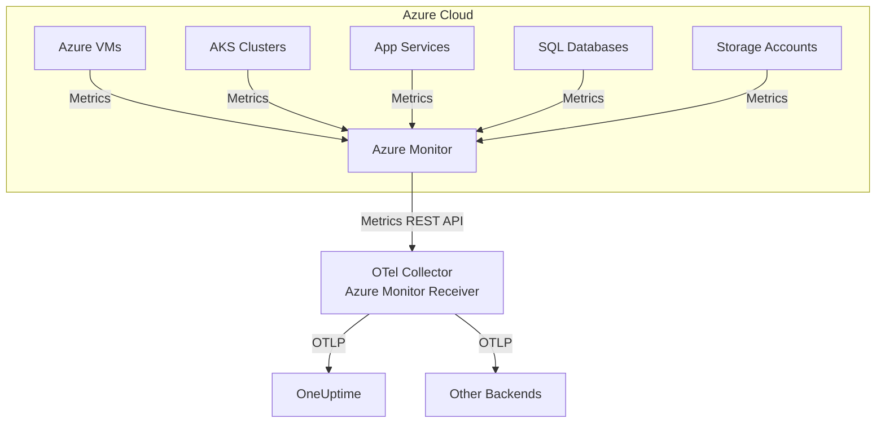

# How to Configure the Azure Monitor Receiver in the OpenTelemetry Collector

Author: [nawazdhandala](https://www.github.com/nawazdhandala)

Tags: OpenTelemetry, Collector, Azure, Azure Monitor, Metric, Observability, Cloud

Description: Learn how to configure the Azure Monitor Receiver in OpenTelemetry Collector to pull metrics and logs from Azure Monitor with authentication setup, query patterns.

---

> Running workloads on Azure but want to avoid vendor lock-in? The Azure Monitor Receiver lets you pull metrics from Azure Monitor into OpenTelemetry, giving you the freedom to choose your observability backend while leveraging Azure's native monitoring capabilities.

The Azure Monitor Receiver is an OpenTelemetry Collector component that queries Azure Monitor APIs to retrieve metrics from Azure resources. This receiver bridges the gap between Azure's native monitoring service and vendor-neutral OpenTelemetry pipelines, enabling you to consolidate Azure telemetry with data from other sources in a unified observability platform.

---

## What is the Azure Monitor Receiver?

Azure Monitor is Microsoft's comprehensive monitoring solution for Azure resources, collecting metrics and logs from virtual machines, databases, storage accounts, Kubernetes clusters, and more. The Azure Monitor Receiver queries Azure Monitor metrics APIs and converts metric data into OpenTelemetry format.

This receiver is essential for:

- **Multi-cloud observability**: Consolidate Azure metrics with AWS and GCP data
- **Cost optimization**: Export Azure metrics to cheaper storage/analytics platforms
- **Vendor independence**: Avoid Azure Monitor lock-in
- **Custom processing**: Apply OpenTelemetry processors before storage
- **Long-term retention**: Store metrics beyond Azure Monitor's retention limits

### Key Capabilities

- Query Azure Monitor metrics for Azure resource types supported by Azure Monitor
- Support for metric name and aggregation filters
- Multiple authentication methods through the Azure Authenticator extension
- Resource group and Azure service filters
- Configurable scrape intervals
- Optional Azure resource tags as OpenTelemetry resource attributes

---

## Architecture Overview

Here's how the Azure Monitor Receiver integrates into your observability stack:


```mermaid
graph TB
    subgraph Azure Cloud
        A[Azure VMs] -->|Metrics| B[Azure Monitor]
        C[AKS Clusters] -->|Metrics| B
        D[App Services] -->|Metrics| B
        E[SQL Databases] -->|Metrics| B
        F[Storage Accounts] -->|Metrics| B
    end
    B -->|Metrics REST API| H[OTel Collector<br/>Azure Monitor Receiver]
    H -->|OTLP| I[OneUptime]
    H -->|OTLP| J[Other Backends]
```

The receiver periodically queries Azure Monitor APIs for specified resources and metric definitions, transforms the responses into OpenTelemetry metrics, and sends them through the collector pipeline.

---

## Prerequisites

Before configuring the receiver, ensure you have:

1. **Azure Subscription** with resources to monitor
2. **Authentication credentials** - Managed identity, workload identity, service principal, or default Azure credentials
3. **Azure Monitor permissions** - `Monitoring Reader` role at minimum
4. **OpenTelemetry Collector Contrib** distribution with the `azure_monitor` receiver and `azure_auth` extension

---

## Authentication Setup

The current non-deprecated configuration uses the Azure Authenticator extension and references it from the receiver.

### Method 1: Managed Identity (Recommended for Azure VMs)

Assign the managed identity these roles:
- `Monitoring Reader` on the subscription or resource group

Enable managed identity on your VM or AKS cluster:

```bash
# For Azure VM
az vm identity assign --name myVM --resource-group myResourceGroup

# For AKS cluster
az aks update --name myAKS --resource-group myResourceGroup --enable-managed-identity
```

Configure the Collector to use the system-assigned identity:

```yaml
receivers:
  azure_monitor:
    subscription_ids: ["${AZURE_SUBSCRIPTION_ID}"]
    auth:
      authenticator: azure_auth

extensions:
  azure_auth:
    managed_identity:

service:
  extensions: [azure_auth]
```

For a user-assigned managed identity, set the identity client ID:

```yaml
extensions:
  azure_auth:
    managed_identity:
      client_id: ${AZURE_CLIENT_ID}
```

### Method 2: Service Principal

Create a service principal and assign the `Monitoring Reader` role:

```bash
# Create service principal
az ad sp create-for-rbac --name "otel-collector-sp" \
  --role "Monitoring Reader" \
  --scopes /subscriptions/{subscription-id}

# Output will include:
# - appId (client ID)
# - password (client secret)
# - tenant (tenant ID)
```

Store credentials securely:

```bash
export AZURE_TENANT_ID="your-tenant-id"
export AZURE_CLIENT_ID="your-client-id"
export AZURE_CLIENT_SECRET="your-client-secret"
export AZURE_SUBSCRIPTION_ID="your-subscription-id"
```

Configure the Azure Authenticator extension:

```yaml
extensions:
  azure_auth:
    service_principal:
      tenant_id: ${AZURE_TENANT_ID}
      client_id: ${AZURE_CLIENT_ID}
      client_secret: ${AZURE_CLIENT_SECRET}
```

---

## Basic Configuration

Here's a minimal configuration to start collecting Azure VM metrics. This example uses managed identity authentication:

```yaml
# Configure the Azure Monitor receiver
receivers:
  # The azure_monitor receiver queries Azure Monitor APIs
  azure_monitor:
    # Subscription IDs containing resources to monitor
    subscription_ids: ["12345678-1234-1234-1234-123456789012"]

    # Authentication using the Azure Authenticator extension
    auth:
      authenticator: azure_auth

    # How often to scrape metrics from Azure Monitor
    collection_interval: 60s

    # Resource groups to monitor (optional, omit to monitor all)
    resource_groups:
      - production-rg
      - staging-rg

    # Azure resource types to monitor (optional, omit to monitor all supported services)
    services:
      - Microsoft.Compute/virtualMachines

    # Metrics to collect, keyed by Azure metric namespace
    metrics:
      Microsoft.Compute/virtualMachines:
        "Percentage CPU": [Average]
        "Network In Total": [Total]
        "Network Out Total": [Total]
        "Disk Read Bytes": [Total]
        "Disk Write Bytes": [Total]

extensions:
  azure_auth:
    managed_identity:

# Configure where to send metrics
exporters:
  otlphttp:
    endpoint: https://oneuptime.com/otlp
    headers:
      x-oneuptime-token: ${ONEUPTIME_TOKEN}

# Define the metrics pipeline
service:
  extensions: [azure_auth]
  pipelines:
    metrics:
      receivers: [azure_monitor]
      exporters: [otlphttp]
```

This basic configuration collects key VM metrics every 60 seconds from specified resource groups and exports them to OneUptime. The managed identity handles authentication automatically.

---

## Production Configuration with Multiple Resource Types

For production environments, monitor multiple Azure resource types with processing and error handling:

```yaml
receivers:
  azure_monitor:
    subscription_ids: ["${AZURE_SUBSCRIPTION_ID}"]

    # Use service principal for non-Azure deployments
    auth:
      authenticator: azure_auth

    # Scrape interval
    collection_interval: 60s

    # Resource groups to monitor
    resource_groups:
      - production-rg
      - database-rg
      - storage-rg

    # Resource types to monitor
    services:
      - Microsoft.Compute/virtualMachines
      - Microsoft.ContainerService/managedClusters
      - Microsoft.Sql/servers/databases
      - Microsoft.Storage/storageAccounts
      - Microsoft.Web/sites

    # Add selected Azure resource tags as resource attributes
    append_tags_as_attributes:
      - environment
      - monitoring

    # Comprehensive metrics configuration
    metrics:
      Microsoft.Compute/virtualMachines:
        "Percentage CPU": [Average]
        "Available Memory Bytes": [Average]
        "Network In Total": [Total]
        "Network Out Total": [Total]
        "Disk Read Bytes": [Total]
        "Disk Write Bytes": [Total]
        "Disk Read Operations/Sec": [Average]
        "Disk Write Operations/Sec": [Average]

      Microsoft.ContainerService/managedClusters:
        node_cpu_usage_percentage: [Average]
        node_memory_working_set_percentage: [Average]
        node_disk_usage_percentage: [Average]
        node_network_in_bytes: [Average]
        node_network_out_bytes: [Average]

      Microsoft.Sql/servers/databases:
        cpu_percent: [Average]
        physical_data_read_percent: [Average]
        log_write_percent: [Average]
        dtu_consumption_percent: [Average]
        storage_percent: [Maximum]
        connection_successful: [Total]
        connection_failed: [Total]
        deadlock: [Total]

      Microsoft.Storage/storageAccounts:
        UsedCapacity: [Average]
        Transactions: [Total]
        Ingress: [Total]
        Egress: [Total]
        SuccessServerLatency: [Average]
        SuccessE2ELatency: [Average]
        Availability: [Average]

      Microsoft.Web/sites:
        CpuTime: [Total]
        MemoryWorkingSet: [Average]
        Requests: [Total]
        Http2xx: [Total]
        Http4xx: [Total]
        Http5xx: [Total]
        HttpResponseTime: [Average]
        BytesReceived: [Total]
        BytesSent: [Total]

processors:
  # Protect collector from memory issues
  memory_limiter:
    limit_mib: 2048
    spike_limit_mib: 512
    check_interval: 5s

  # Add resource attributes
  resource:
    attributes:
      - key: source.type
        value: azure_monitor
        action: insert
      - key: cloud.provider
        value: azure
        action: insert
      - key: azure.subscription.id
        value: ${AZURE_SUBSCRIPTION_ID}
        action: insert

  # Filter out metrics you don't need
  filter/unnecessary:
    metrics:
      exclude:
        match_type: regexp
        metric_names:
          # Example: Exclude specific metrics to reduce volume
          - ".*test.*"
          - ".*debug.*"

  # Batch metrics for efficiency
  batch:
    timeout: 30s
    send_batch_size: 1000
    send_batch_max_size: 2000

exporters:
  # Primary export to OneUptime
  otlphttp/oneuptime:
    endpoint: https://oneuptime.com/otlp
    headers:
      x-oneuptime-token: ${ONEUPTIME_TOKEN}
    compression: gzip
    timeout: 30s
    retry_on_failure:
      enabled: true
      initial_interval: 5s
      max_interval: 30s
      max_elapsed_time: 300s

  # Optional backup to Azure Monitor Application Insights
  azuremonitor:
    connection_string: ${APPLICATIONINSIGHTS_CONNECTION_STRING}

  # Export to Prometheus for local monitoring
  prometheus:
    endpoint: :9090

service:
  # Enable collector telemetry
  telemetry:
    logs:
      level: info
    metrics:
      level: detailed

  # Enable extensions
  extensions: [azure_auth, health_check, pprof]

  pipelines:
    metrics:
      receivers: [azure_monitor]
      processors:
        - memory_limiter
        - resource
        - filter/unnecessary
        - batch
      exporters:
        - otlphttp/oneuptime
        - azuremonitor
        - prometheus

extensions:
  azure_auth:
    service_principal:
      tenant_id: ${AZURE_TENANT_ID}
      client_id: ${AZURE_CLIENT_ID}
      client_secret: ${AZURE_CLIENT_SECRET}

  health_check:
    endpoint: :13133

  pprof:
    endpoint: localhost:1777
```

This production configuration demonstrates:

- **Multi-resource monitoring**: VMs, AKS, SQL, Storage, App Services
- **Resource filtering**: Use resource groups and services to select specific resources
- **Metric filtering**: Limit metric names and aggregations with the `metrics` map
- **Multiple exporters**: Send to OneUptime, Azure Monitor Application Insights, and Prometheus
- **Comprehensive monitoring**: Health checks and performance profiling

---

## Querying Log Analytics Workspaces

The Azure Monitor Receiver collects Azure Monitor metrics only. It does not execute Kusto Query Language (KQL) queries against Log Analytics workspaces or convert query results into OpenTelemetry logs.

If you need Azure logs in an OpenTelemetry pipeline, use a log-specific path such as the Azure Event Hub receiver for logs streamed from Azure Monitor diagnostic settings, or use Azure Monitor's OTLP ingestion support to send OpenTelemetry logs into Azure Monitor.

```yaml
receivers:
  azure_event_hub:
    connection: ${AZURE_EVENT_HUB_CONNECTION_STRING}
    format: azure

processors:
  batch:
    timeout: 10s

exporters:
  otlphttp:
    endpoint: https://oneuptime.com/otlp
    headers:
      x-oneuptime-token: ${ONEUPTIME_TOKEN}

service:
  pipelines:
    logs:
      receivers: [azure_event_hub]
      processors: [batch]
      exporters: [otlphttp]
```

This keeps Azure Monitor metrics collection and Azure log ingestion on components that support those signals.

---

## Advanced: Per-Resource Configuration

The Azure Monitor Receiver discovers Azure resources from the configured subscriptions and can narrow the scrape using `resource_groups` and `services`. It does not support a `resources` list of individual Azure resource IDs in its receiver configuration.

For fine-grained control, define separate receiver instances with different resource group, service, and metric filters:

```yaml
receivers:
  azure_monitor/web_vms:
    subscription_ids: ["${AZURE_SUBSCRIPTION_ID}"]
    auth:
      authenticator: azure_auth
    collection_interval: 60s
    resource_groups:
      - prod-rg
    services:
      - Microsoft.Compute/virtualMachines
    metrics:
      Microsoft.Compute/virtualMachines:
        "Percentage CPU": [Average]
        "Available Memory Bytes": [Average]

  azure_monitor/databases:
    subscription_ids: ["${AZURE_SUBSCRIPTION_ID}"]
    auth:
      authenticator: azure_auth
    collection_interval: 60s
    resource_groups:
      - db-rg
    services:
      - Microsoft.Sql/servers/databases
    metrics:
      Microsoft.Sql/servers/databases:
        cpu_percent: [Average]
        dtu_consumption_percent: [Average]
        storage_percent: [Maximum]
        deadlock: [Total]

  azure_monitor/storage:
    subscription_ids: ["${AZURE_SUBSCRIPTION_ID}"]
    auth:
      authenticator: azure_auth
    collection_interval: 60s
    resource_groups:
      - storage-rg
    services:
      - Microsoft.Storage/storageAccounts
    metrics:
      Microsoft.Storage/storageAccounts:
        UsedCapacity: [Average]
        Transactions: [Total]
        Availability: [Average]

extensions:
  azure_auth:
    managed_identity:

processors:
  batch:
    timeout: 30s

exporters:
  otlphttp:
    endpoint: https://oneuptime.com/otlp
    headers:
      x-oneuptime-token: ${ONEUPTIME_TOKEN}

service:
  extensions: [azure_auth]
  pipelines:
    metrics/web:
      receivers: [azure_monitor/web_vms]
      processors: [batch]
      exporters: [otlphttp]

    metrics/databases:
      receivers: [azure_monitor/databases]
      processors: [batch]
      exporters: [otlphttp]

    metrics/storage:
      receivers: [azure_monitor/storage]
      processors: [batch]
      exporters: [otlphttp]
```

This approach is useful when you need different scrape intervals or metric sets for specific groups of resources.

---

## Monitoring Multiple Subscriptions

Monitor resources across multiple Azure subscriptions by setting multiple subscription IDs or defining multiple receivers:

```yaml
receivers:
  # Production subscription
  azure_monitor/prod:
    subscription_ids: ["prod-subscription-id"]
    auth:
      authenticator: azure_auth
    collection_interval: 60s
    resource_groups:
      - production-rg
    services:
      - Microsoft.Compute/virtualMachines
    metrics:
      Microsoft.Compute/virtualMachines:
        "Percentage CPU": [Average]

  # Development subscription
  azure_monitor/dev:
    subscription_ids: ["dev-subscription-id"]
    auth:
      authenticator: azure_auth
    collection_interval: 300s  # Less frequent for dev
    resource_groups:
      - development-rg
    services:
      - Microsoft.Compute/virtualMachines
    metrics:
      Microsoft.Compute/virtualMachines:
        "Percentage CPU": [Average]

  # Shared services subscription
  azure_monitor/shared:
    subscription_ids: ["shared-subscription-id"]
    auth:
      authenticator: azure_auth
    collection_interval: 60s
    resource_groups:
      - shared-services-rg
    services:
      - Microsoft.Sql/servers/databases
    metrics:
      Microsoft.Sql/servers/databases:
        cpu_percent: [Average]

extensions:
  azure_auth:
    managed_identity:

processors:
  # Tag production metrics
  resource/prod:
    attributes:
      - key: environment
        value: production
        action: insert

  # Tag development metrics
  resource/dev:
    attributes:
      - key: environment
        value: development
        action: insert

  # Tag shared services metrics
  resource/shared:
    attributes:
      - key: environment
        value: shared
        action: insert

  batch:
    timeout: 30s

exporters:
  otlphttp:
    endpoint: https://oneuptime.com/otlp
    headers:
      x-oneuptime-token: ${ONEUPTIME_TOKEN}

service:
  extensions: [azure_auth]
  pipelines:
    # Production pipeline
    metrics/prod:
      receivers: [azure_monitor/prod]
      processors: [resource/prod, batch]
      exporters: [otlphttp]

    # Development pipeline
    metrics/dev:
      receivers: [azure_monitor/dev]
      processors: [resource/dev, batch]
      exporters: [otlphttp]

    # Shared services pipeline
    metrics/shared:
      receivers: [azure_monitor/shared]
      processors: [resource/shared, batch]
      exporters: [otlphttp]
```

Ensure the managed identity or service principal has `Monitoring Reader` role on all subscriptions.

---

## Cost Optimization Strategies

Azure Monitor API calls and data transfer can add up. Here are optimization strategies:

### 1. Increase Scrape Intervals

Collect metrics less frequently for non-critical resources:

```yaml
receivers:
  # Critical resources: every minute
  azure_monitor/critical:
    subscription_ids: ["${AZURE_SUBSCRIPTION_ID}"]
    collection_interval: 60s
    resource_groups:
      - critical-rg

  # Normal resources: every 5 minutes
  azure_monitor/normal:
    subscription_ids: ["${AZURE_SUBSCRIPTION_ID}"]
    collection_interval: 300s
    resource_groups:
      - normal-rg

  # Development resources: every 15 minutes
  azure_monitor/dev:
    subscription_ids: ["${AZURE_SUBSCRIPTION_ID}"]
    collection_interval: 900s
    resource_groups:
      - development-rg
```

### 2. Select Only Necessary Metrics

Don't collect every available metric:

```yaml
receivers:
  azure_monitor:
    metrics:
      Microsoft.Compute/virtualMachines:
        # Only collect essential metrics
        "Percentage CPU": [Average]
        "Available Memory Bytes": [Average]
        # Skip: Network, Disk, etc. if not needed
```

### 3. Filter Resources by Resource Group or Service

Monitor only the resource groups and services you need:

```yaml
receivers:
  azure_monitor:
    resource_groups:
      - production-rg
    services:
      - Microsoft.Compute/virtualMachines
      - Microsoft.Sql/servers/databases
```

### 4. Use Batch API for Large Environments

The receiver can use Azure Monitor's metrics batch API to reduce the number of requests for large subscriptions:

```yaml
receivers:
  azure_monitor:
    use_batch_api: true
    maximum_resources_per_batch: 50
    metrics:
      Microsoft.Compute/virtualMachines:
        "Percentage CPU": [Average]
```

---

## Monitoring Receiver Performance

Monitor the Azure Monitor Receiver's health and API usage:

```yaml
service:
  telemetry:
    logs:
      level: info
    metrics:
      level: detailed

  extensions: [health_check, pprof]

extensions:
  health_check:
    endpoint: :13133

  pprof:
    endpoint: localhost:1777
```

### Key Metrics to Monitor

- `otelcol_receiver_accepted_metric_points` - Metrics successfully received
- `otelcol_receiver_refused_metric_points` - Metrics rejected
- `otelcol_receiver_accepted_metric_points{receiver="azure_monitor"}` - Accepted metric points from the Azure Monitor receiver
- `otelcol_receiver_refused_metric_points{receiver="azure_monitor"}` - Refused metric points from the Azure Monitor receiver

Set up alerts in OneUptime:

- **High receiver refusal rate**: Alert when refused metric points increase
- **No data received**: Alert when no metrics received for 10 minutes
- **Collector errors**: Alert on repeated Azure API errors in Collector logs

---

## Troubleshooting Common Issues

### Issue: Authentication Failures

**Cause**: Missing role assignments or expired credentials

**Solution**: Verify role assignments:

```bash
# Check managed identity permissions
az role assignment list \
  --assignee <managed-identity-object-id> \
  --all

# Expected role:
# - Monitoring Reader (or Reader) at subscription/resource group level
```

### Issue: High Memory Usage

**Cause**: Monitoring too many resources or metrics

**Solution**: Reduce scope and add memory limiter:

```yaml
receivers:
  azure_monitor:
    # Reduce resources monitored
    resource_groups:
      - essential-rg  # Only critical resource groups
    services:
      - Microsoft.Compute/virtualMachines

processors:
  memory_limiter:
    limit_mib: 1024
    check_interval: 1s
```

### Issue: Rate Limiting

**Cause**: Too many API calls to Azure Monitor

**Solution**: Increase scrape interval and use the batch API:

```yaml
receivers:
  azure_monitor:
    collection_interval: 120s  # Increase from 60s
    use_batch_api: true
    maximum_resources_per_batch: 50
```

### Issue: Missing Metrics

**Cause**: Incorrect metric namespaces, metric names, or aggregation types

**Solution**: Verify metric names in Azure Portal or Microsoft Learn's supported metrics reference:

1. Go to resource in Azure Portal
2. Select "Metrics" blade
3. View available metrics and their names
4. Use exact metric names and valid aggregations in configuration

Enable debug logging to see API responses:

```yaml
service:
  telemetry:
    logs:
      level: debug
```

---

## Integration with OneUptime

OneUptime provides native support for OpenTelemetry metrics from Azure Monitor. Once configured:

1. **Visualize Azure metrics**: Create dashboards for Azure resource health
2. **Set up alerts**: Alert on Azure resource anomalies
3. **Correlate data**: Link Azure metrics with application traces and logs
4. **Historical analysis**: Query Azure metrics alongside other data sources

Example OneUptime alert for high CPU:

- **Metric**: `azure_Percentage_CPU`
- **Condition**: Average > 80% for 5 minutes
- **Scope**: `cloud.provider = "azure" AND environment = "production"`
- **Action**: Page on-call engineer

---

## Related Resources

- [How to Configure Azure Event Hub Receiver in OpenTelemetry Collector](https://oneuptime.com/blog/post/2026-02-06-azure-event-hub-receiver-opentelemetry-collector/view)
- [How to Configure Google Cloud Monitoring Receiver](https://oneuptime.com/blog/post/2026-02-06-google-cloud-monitoring-receiver-opentelemetry-collector/view)
- [OpenTelemetry Collector: What It Is and When You Need It](https://oneuptime.com/blog/post/2025-09-18-what-is-opentelemetry-collector-and-why-use-one/view)

---

## Conclusion

The Azure Monitor Receiver provides a powerful way to extract metrics from Azure Monitor into OpenTelemetry pipelines. By querying Azure's native monitoring APIs, you maintain visibility into Azure resources while gaining the flexibility to send data to any OpenTelemetry-compatible backend.

Start with basic metric collection for key resources, then expand to comprehensive monitoring across subscriptions with advanced filtering and processing. With proper authentication, cost optimization, and monitoring, you'll have production-grade Azure telemetry ingestion that scales with your infrastructure.

The combination of Azure Monitor's comprehensive resource coverage with OpenTelemetry's vendor neutrality gives you the best of both worlds - native Azure insights without platform lock-in.

---

**Ready to liberate your Azure metrics?** OneUptime provides seamless integration with OpenTelemetry, making it easy to analyze Azure Monitor data alongside metrics, logs, and traces from any source. Get started with unified multi-cloud observability today.
