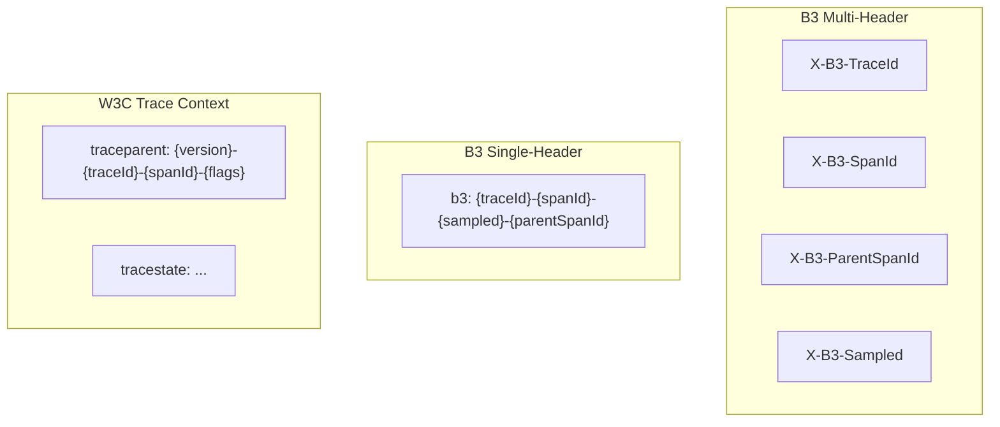
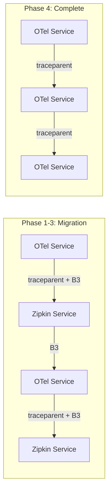

# How to Use B3 Propagation for Backward Compatibility with Zipkin

Author: [nawazdhandala](https://www.github.com/nawazdhandala)

Tags: OpenTelemetry, B3 Propagation, Zipkin, Distributed Tracing, Context Propagation, Migration

Description: Learn how to configure B3 propagation in OpenTelemetry for backward compatibility with Zipkin-instrumented services during migration.

---

If you are migrating from Zipkin to OpenTelemetry, or if parts of your system still use Zipkin instrumentation, you need a way for both systems to participate in the same traces. Zipkin uses B3 propagation headers to pass trace context between services, and OpenTelemetry defaults to W3C Trace Context. Without bridging these two formats, your traces will break at every boundary between Zipkin and OTel services. This post shows you how to configure B3 propagation in OpenTelemetry so both worlds can coexist while you migrate at your own pace.

## Understanding B3 Propagation

B3 propagation comes in two flavors: multi-header and single-header. The multi-header format uses four separate HTTP headers to carry trace context.

```
X-B3-TraceId: 463ac35c9f6413ad48485a3953bb6124
X-B3-SpanId: 0020000000000001
X-B3-ParentSpanId: 0010000000000001
X-B3-Sampled: 1
```

The single-header format packs all the same information into one header.

```
b3: 463ac35c9f6413ad48485a3953bb6124-0020000000000001-1-0010000000000001
```

Both formats carry the same data: a trace ID, a span ID, a sampling decision, and optionally a parent span ID. The single-header format concatenates these with dashes.



The multi-header format is the original Zipkin format and has the widest compatibility. The single-header format was introduced later to reduce header overhead. Some older Zipkin clients only understand multi-header, so your choice depends on what your existing services support.

## Installing the B3 Propagator

The B3 propagator for OpenTelemetry is available as a separate package. It is not included in the core SDK, so you need to install it explicitly.

```bash
# Install the B3 propagator package
pip install opentelemetry-propagator-b3
```

For JavaScript/TypeScript projects, the package name is different.

```bash
# Node.js installation
npm install @opentelemetry/propagator-b3
```

Once installed, you can configure OpenTelemetry to use B3 propagation alongside or instead of the default W3C format.

## Configuring B3 Multi-Header Propagation

The most common scenario during migration is configuring OpenTelemetry to speak B3 so it can communicate with existing Zipkin services. Here is how to set up B3 multi-header propagation in Python.

```python
from opentelemetry import trace
from opentelemetry.sdk.trace import TracerProvider
from opentelemetry.sdk.trace.export import ConsoleSpanExporter, SimpleSpanProcessor
from opentelemetry.propagate import set_global_textmap, inject, extract
from opentelemetry.propagators.b3 import B3MultiFormat

# Initialize the tracer provider
provider = TracerProvider()
provider.add_span_processor(SimpleSpanProcessor(ConsoleSpanExporter()))
trace.set_tracer_provider(provider)

# Set B3 multi-header as the global propagator
# This replaces the default W3C Trace Context propagator
set_global_textmap(B3MultiFormat())

tracer = trace.get_tracer("b3-demo")

# Create a span and inject B3 headers
with tracer.start_as_current_span("my-operation") as span:
    headers = {}
    inject(headers)

    print("B3 Multi-Header output:")
    for key, value in headers.items():
        print(f"  {key}: {value}")
    # Output:
    #   X-B3-TraceId: 463ac35c9f6413ad48485a3953bb6124
    #   X-B3-SpanId: 0020000000000001
    #   X-B3-Sampled: 1
```

When you set `B3MultiFormat` as the global propagator, all outgoing HTTP requests instrumented by OpenTelemetry will include B3 headers instead of the `traceparent` header. Zipkin services will be able to read these headers and continue the trace.

## Configuring B3 Single-Header Propagation

If your Zipkin services support the single-header format, you can use `B3SingleFormat` instead.

```python
from opentelemetry.propagators.b3 import B3SingleFormat
from opentelemetry.propagate import set_global_textmap, inject

# Use B3 single-header format
set_global_textmap(B3SingleFormat())

# When injecting, this produces a single b3 header
headers = {}
inject(headers)
# Output:
#   b3: 463ac35c9f6413ad48485a3953bb6124-0020000000000001-1
```

The single-header format is more compact but less widely supported among older Zipkin implementations. If you are not sure which format your existing services expect, stick with multi-header.

## Running Both B3 and W3C Together

During a migration, you probably have some services on Zipkin and others on OpenTelemetry with W3C Trace Context. The solution is to use a composite propagator that injects and extracts both formats simultaneously.

```python
from opentelemetry.propagate import set_global_textmap, inject
from opentelemetry.propagators.composite import CompositePropagator
from opentelemetry.trace.propagation import TraceContextTextMapPropagator
from opentelemetry.baggage.propagation import W3CBaggagePropagator
from opentelemetry.propagators.b3 import B3MultiFormat

# Configure a composite propagator with both formats
propagator = CompositePropagator([
    TraceContextTextMapPropagator(),  # W3C traceparent/tracestate
    W3CBaggagePropagator(),           # W3C baggage
    B3MultiFormat(),                  # Zipkin B3 headers
])
set_global_textmap(propagator)

# Now inject produces both W3C and B3 headers
headers = {}
inject(headers)

print("Combined headers:")
for key, value in sorted(headers.items()):
    print(f"  {key}: {value}")
# Output includes both:
#   X-B3-Sampled: 1
#   X-B3-SpanId: ...
#   X-B3-TraceId: ...
#   traceparent: 00-...-...-01
```

With this setup, every outgoing request carries both sets of headers. A Zipkin service reads the B3 headers and ignores `traceparent`. An OpenTelemetry service reads `traceparent` and ignores B3. Both see the same trace ID and can join the same trace.

On extraction, the composite propagator tries each format in order. If it finds W3C headers, it uses those. If it only finds B3 headers, it uses B3. This means you do not need to know in advance which format an incoming request will use.

## Handling Trace ID Length Differences

One gotcha when bridging B3 and W3C is trace ID length. W3C Trace Context always uses 128-bit (32-character) trace IDs. Older Zipkin implementations sometimes use 64-bit (16-character) trace IDs.

```python
# 64-bit trace ID from older Zipkin
short_trace_id = "463ac35c9f6413ad"

# W3C requires 128-bit, so OpenTelemetry left-pads with zeros
padded_trace_id = "0000000000000000463ac35c9f6413ad"

# When extracting a 64-bit B3 trace ID, OpenTelemetry handles this
# automatically by padding to 128 bits
incoming_headers = {
    "X-B3-TraceId": "463ac35c9f6413ad",
    "X-B3-SpanId": "0020000000000001",
    "X-B3-Sampled": "1"
}

from opentelemetry.propagate import extract
from opentelemetry import trace

ctx = extract(incoming_headers)
span_ctx = trace.get_current_span(ctx).get_span_context()

# The trace ID is stored as 128-bit internally
print(f"Trace ID: {format(span_ctx.trace_id, '032x')}")
# Output: 0000000000000000463ac35c9f6413ad
```

OpenTelemetry handles this padding automatically during extraction. When it encounters a 64-bit trace ID from B3, it pads it to 128 bits by prepending zeros. This means the trace will still be continuous, but the trace ID will look different in Zipkin (16 chars) versus your OTel backend (32 chars with leading zeros). Keep this in mind when searching for traces across systems.

## Environment Variable Configuration

You can also configure the propagator through environment variables, which is useful for deployments where you do not want to change code.

```bash
# Set the propagator via environment variable
# Use comma-separated values for multiple propagators
export OTEL_PROPAGATORS=tracecontext,baggage,b3multi

# Or for B3 single-header format
export OTEL_PROPAGATORS=tracecontext,baggage,b3
```

The supported values are:

- `tracecontext` for W3C Trace Context
- `baggage` for W3C Baggage
- `b3multi` for B3 multi-header format
- `b3` for B3 single-header format

```python
# When using environment variables, the auto-instrumentation
# picks up the configuration automatically
# No code changes needed if you are using opentelemetry-instrument

# Just run your application with the env var set:
# OTEL_PROPAGATORS=tracecontext,baggage,b3multi python app.py
```

This approach is particularly helpful in containerized environments where you can set environment variables in your deployment manifests.

```yaml
# Kubernetes deployment example
apiVersion: apps/v1
kind: Deployment
metadata:
  name: my-service
spec:
  template:
    spec:
      containers:
        - name: my-service
          image: my-service:latest
          env:
            # Enable both W3C and B3 propagation
            - name: OTEL_PROPAGATORS
              value: "tracecontext,baggage,b3multi"
            # Point to the OTel collector
            - name: OTEL_EXPORTER_OTLP_ENDPOINT
              value: "http://otel-collector:4317"
```

## A Migration Strategy

Here is a practical step-by-step approach for migrating from Zipkin to OpenTelemetry while maintaining trace continuity.

**Phase 1: Add B3 to OpenTelemetry services.** Configure all new or migrated services with composite propagators that emit both W3C and B3 headers. Existing Zipkin services continue working without changes.

**Phase 2: Migrate services one at a time.** As each service moves to OpenTelemetry instrumentation, it automatically starts emitting both header formats. No coordination needed between teams.

**Phase 3: Verify trace continuity.** Check your tracing backend to confirm that traces span across both Zipkin and OpenTelemetry services without gaps.

**Phase 4: Remove B3 propagation.** Once all services are on OpenTelemetry, remove the B3 propagator from the composite configuration. This simplifies headers and reduces overhead.



## Testing Your Configuration

Before deploying, verify that your propagation setup works correctly by writing a test that simulates the full inject-extract cycle.

```python
from opentelemetry import trace
from opentelemetry.sdk.trace import TracerProvider
from opentelemetry.propagate import inject, extract, set_global_textmap
from opentelemetry.propagators.composite import CompositePropagator
from opentelemetry.trace.propagation import TraceContextTextMapPropagator
from opentelemetry.propagators.b3 import B3MultiFormat

# Setup
provider = TracerProvider()
trace.set_tracer_provider(provider)
set_global_textmap(CompositePropagator([
    TraceContextTextMapPropagator(),
    B3MultiFormat(),
]))

tracer = trace.get_tracer("test")

# Create a span and inject into headers
with tracer.start_as_current_span("test-span") as span:
    original_ctx = span.get_span_context()

    headers = {}
    inject(headers)

    # Verify both header formats are present
    assert "traceparent" in headers, "Missing W3C header"
    assert "X-B3-TraceId" in headers, "Missing B3 header"

    # Extract from headers and verify the context matches
    extracted_ctx_obj = extract(headers)
    extracted_span = trace.get_current_span(extracted_ctx_obj)
    extracted_ctx = extracted_span.get_span_context()

    assert original_ctx.trace_id == extracted_ctx.trace_id, "Trace ID mismatch"
    assert original_ctx.span_id == extracted_ctx.span_id, "Span ID mismatch"

    print("All propagation checks passed")
```

This test creates a span, injects its context into headers using both formats, then extracts the context back and verifies the trace ID and span ID survived the round trip.

## Wrapping Up

B3 propagation in OpenTelemetry is the bridge that lets you migrate from Zipkin without breaking your traces. By using the `B3MultiFormat` or `B3SingleFormat` propagators, either standalone or as part of a composite propagator, you can maintain backward compatibility with Zipkin services while new services use the W3C standard.

The key takeaway is that migration does not have to be a big-bang event. Configure composite propagators, migrate services incrementally, and eventually drop B3 once the migration is complete. The OpenTelemetry SDK makes this straightforward through both programmatic configuration and environment variables.
