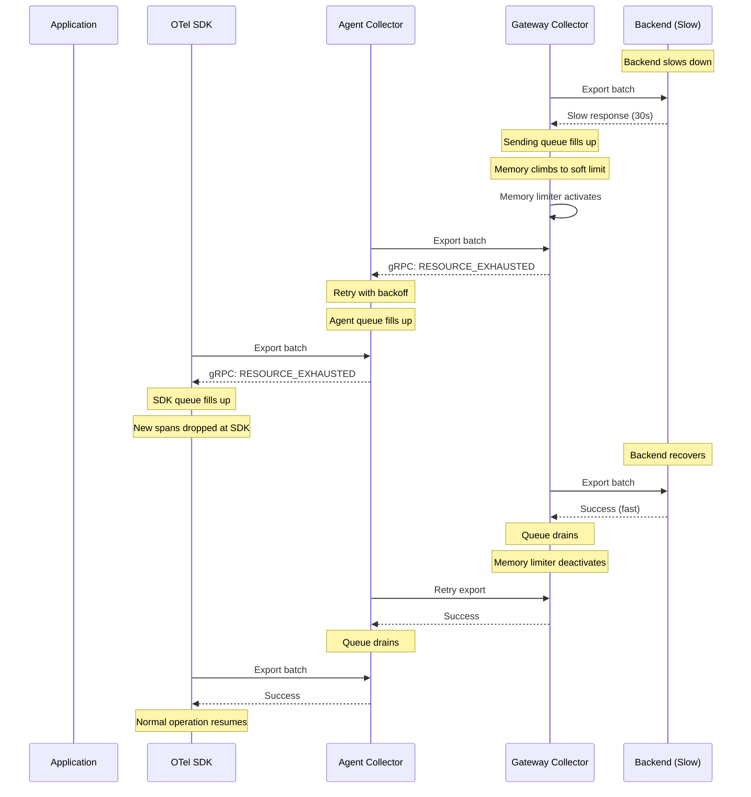
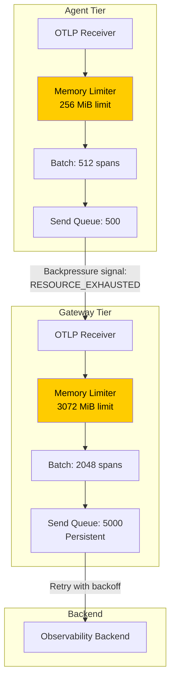

# How to Implement Backpressure Handling in OpenTelemetry Pipelines

Author: [nawazdhandala](https://www.github.com/nawazdhandala)

Tags: OpenTelemetry, Backpressure, Pipeline, Flow Control, Reliability

Description: Learn how to implement backpressure handling in OpenTelemetry pipelines to prevent data loss and resource exhaustion during traffic spikes and backend slowdowns.

---

Backpressure is what happens when a downstream component in your pipeline cannot keep up with the data flowing into it. Without proper handling, the upstream components either crash from memory exhaustion or silently drop data. Neither outcome is acceptable in production.

OpenTelemetry has several built-in mechanisms for handling backpressure, but they need to be configured correctly and coordinated across your pipeline. This guide shows you how to set up effective backpressure handling from the SDK through the collector tiers to the backend.

## Understanding Backpressure in Telemetry Pipelines

Backpressure occurs at any point where a slower component sits downstream of a faster one. In an OpenTelemetry pipeline, the common bottleneck points are:


Each bottleneck needs a different backpressure strategy:

1. **SDK to Agent**: The SDK has a bounded queue. When it fills up, new spans are dropped.
2. **Agent to Gateway**: The agent's exporter has a sending queue. When the gateway is slow, the queue fills.
3. **Gateway to Backend**: The gateway's exporter queue fills when the backend cannot ingest fast enough.

The goal is to propagate backpressure upstream so that each layer slows down gracefully instead of failing abruptly.

## Memory Limiter: The First Line of Defense

The memory limiter processor is the most important backpressure mechanism in the collector. It monitors the collector's memory usage and starts refusing incoming data when memory gets too high.

```yaml
# Collector config with tuned memory limiter
processors:
  memory_limiter:
    # How often to check the current memory usage
    check_interval: 1s

    # Hard limit: start dropping data when memory reaches this level
    # Set this to about 80% of the container's memory limit
    # For a container with 2 GiB limit, set to 1600 MiB
    limit_mib: 1600

    # Spike limit: the maximum expected spike in memory usage
    # between checks. The soft limit is (limit_mib - spike_limit_mib)
    # Data will start being refused at the soft limit
    spike_limit_mib: 400

    # With these settings:
    # - Soft limit (backpressure starts): 1200 MiB
    # - Hard limit (data dropped): 1600 MiB
    # - Container limit: 2048 MiB
    # - Headroom for Go runtime: 448 MiB
```

The memory limiter must always be the first processor in your pipeline. If you put it after other processors, those processors will consume memory before the limiter has a chance to act:

```yaml
service:
  pipelines:
    traces:
      receivers: [otlp]
      # memory_limiter MUST be first in the processor chain
      processors: [memory_limiter, batch, tail_sampling]
      exporters: [otlp]
```

## How Backpressure Propagates

When the memory limiter activates, it creates a chain reaction that propagates backpressure upstream through the entire pipeline:



The key insight here is that gRPC (the default OTLP transport) has built-in backpressure through status codes. When a collector refuses data, it returns `RESOURCE_EXHAUSTED`, which tells the upstream to back off and retry.

## Configuring Backpressure at the SDK Level

The SDK is where backpressure handling starts. Configure the batch span processor with appropriate queue sizes and timeouts:

```python
# Python SDK backpressure configuration
from opentelemetry.sdk.trace.export import BatchSpanProcessor
from opentelemetry.exporter.otlp.proto.grpc.trace_exporter import OTLPSpanExporter

exporter = OTLPSpanExporter(
    endpoint="localhost:4317",
    # Timeout for each export attempt
    # Shorter timeouts mean faster detection of backpressure
    timeout=10,
)

processor = BatchSpanProcessor(
    exporter,
    # Maximum spans in the queue before dropping
    # Size this based on your traffic and how long you want to
    # buffer during brief slowdowns
    max_queue_size=8192,

    # Batch size for each export
    max_export_batch_size=512,

    # Maximum wait time between exports
    # Shorter intervals mean smaller batches and faster
    # backpressure detection
    schedule_delay_millis=2000,

    # Timeout for graceful shutdown flush
    export_timeout_millis=30000,
)
```

For Java applications:

```java
// Java SDK backpressure configuration
// These settings determine how the SDK behaves when the collector
// is applying backpressure
BatchSpanProcessor processor = BatchSpanProcessor.builder(exporter)
    // Queue size bounds memory usage in the application
    // When this fills up, new spans are dropped
    .setMaxQueueSize(8192)
    // Smaller batches export faster, which means the SDK
    // detects backpressure sooner
    .setMaxExportBatchSize(512)
    // Export every 2 seconds or when the batch is full
    .setScheduleDelay(Duration.ofSeconds(2))
    // Per-export timeout
    .setExporterTimeout(Duration.ofSeconds(10))
    .build();
```

## Sending Queue Configuration

The sending queue in the exporter is the main buffering mechanism in the collector. It decouples the processor pipeline from the export process, so slow exports do not immediately block incoming data.

```yaml
exporters:
  otlp:
    endpoint: backend.example.com:4317

    # The sending queue sits between the processor pipeline
    # and the actual export call
    sending_queue:
      enabled: true

      # Number of batches the queue can hold
      # Multiply by your batch size to get total span capacity
      # 5000 batches * 1024 spans/batch = ~5 million spans
      queue_size: 5000

      # Number of parallel export workers
      # More consumers = faster drain but more load on the backend
      # Start with 10 and adjust based on your backend's capacity
      num_consumers: 10

      # Persist the queue to disk for crash resilience
      storage: file_storage

    # Retry configuration works with the sending queue
    # Failed exports go back into the queue for retry
    retry_on_failure:
      enabled: true
      initial_interval: 5s
      max_interval: 60s
      max_elapsed_time: 600s
```

## Batch Processor Tuning for Backpressure

The batch processor interacts with backpressure in an important way. Large batches take longer to export, which means the exporter holds the batch longer before reporting success or failure. Smaller batches give you faster feedback.

```yaml
processors:
  batch:
    # Smaller batches during backpressure scenarios
    # export faster and give quicker feedback
    send_batch_size: 512
    send_batch_max_size: 1024

    # Timeout is the maximum time to wait for a batch to fill
    # Shorter timeouts mean more frequent, smaller exports
    timeout: 3s
```

The tradeoff is that smaller batches mean more export RPCs, which adds overhead. Find the balance for your environment by monitoring export latency and throughput.

## Rate Limiting as Proactive Backpressure

Instead of waiting for the pipeline to get overwhelmed, you can proactively limit the incoming data rate. This is useful when you know your backend has a hard throughput limit:

```yaml
processors:
  # The rate limiter processor drops data above a configured rate
  # Use this when your backend has a known ingestion limit
  rate_limiting:
    # Maximum spans per second across this collector
    spans_per_second: 50000

  # Alternatively, use probabilistic sampling to reduce volume
  # This is less precise but preserves complete traces
  probabilistic_sampler:
    sampling_percentage: 25
```

## Multi-Tier Backpressure Architecture

In a full agent-gateway setup, backpressure needs to be coordinated across both tiers. Here is a complete configuration that handles backpressure correctly:



Agent tier configuration:

```yaml
# agent-backpressure.yaml
processors:
  memory_limiter:
    check_interval: 1s
    # Agents have tight memory budgets since they run on every node
    limit_mib: 256
    spike_limit_mib: 64

  batch:
    send_batch_size: 512
    timeout: 2s

exporters:
  otlp:
    endpoint: otel-gateway.observability.svc:4317
    timeout: 10s
    retry_on_failure:
      enabled: true
      initial_interval: 1s
      max_interval: 15s
      # Short max_elapsed_time for agents since we do not want
      # them buffering too much data
      max_elapsed_time: 60s
    sending_queue:
      enabled: true
      # Small queue on agents to keep memory usage low
      # If this fills up, the memory limiter should kick in
      queue_size: 500
      num_consumers: 5

service:
  pipelines:
    traces:
      receivers: [otlp]
      processors: [memory_limiter, batch]
      exporters: [otlp]
```

Gateway tier configuration:

```yaml
# gateway-backpressure.yaml
processors:
  memory_limiter:
    check_interval: 1s
    # Gateways have more memory budget
    limit_mib: 3072
    spike_limit_mib: 768

  batch:
    send_batch_size: 2048
    timeout: 10s

exporters:
  otlp:
    endpoint: backend.observability.svc:4317
    timeout: 30s
    retry_on_failure:
      enabled: true
      initial_interval: 5s
      max_interval: 60s
      max_elapsed_time: 600s
    sending_queue:
      enabled: true
      # Large persistent queue on gateways to buffer during outages
      queue_size: 5000
      num_consumers: 10
      storage: file_storage

extensions:
  file_storage:
    directory: /var/lib/otel/queue
    max_file_size_mib: 4096

service:
  extensions: [file_storage]
  pipelines:
    traces:
      receivers: [otlp]
      processors: [memory_limiter, batch]
      exporters: [otlp]
```

## Monitoring Backpressure

You need to know when backpressure is active so you can take action before data starts dropping.

```promql
# Rate of receiver refusals indicates active backpressure
# from the memory limiter to upstream senders
rate(otelcol_receiver_refused_spans[5m])

# Queue utilization shows how much buffer capacity remains
# Above 80% is a warning sign
otelcol_exporter_queue_size / otelcol_exporter_queue_capacity

# Memory limiter activation rate
# Each activation means the collector was close to its memory limit
rate(otelcol_processor_refused_spans{processor="memory_limiter"}[5m])

# Export latency p99 -- rising latency is an early warning
# of backpressure building up
histogram_quantile(0.99, rate(otelcol_exporter_send_latency_bucket[5m]))
```

Set up alerts for these:

```yaml
groups:
  - name: backpressure-alerts
    rules:
      - alert: BackpressureActive
        expr: rate(otelcol_receiver_refused_spans[5m]) > 0
        for: 5m
        labels:
          severity: warning
        annotations:
          summary: "Backpressure active on {{ $labels.instance }}"
          description: "The collector is refusing {{ $value }} spans/sec. Downstream components may be overwhelmed."

      - alert: QueueNearCapacity
        expr: otelcol_exporter_queue_size / otelcol_exporter_queue_capacity > 0.85
        for: 10m
        labels:
          severity: warning
        annotations:
          summary: "Export queue at {{ $value | humanizePercentage }} on {{ $labels.instance }}"
```

## Wrapping Up

Backpressure handling is about making your pipeline degrade gracefully instead of failing catastrophically. The key mechanisms are the memory limiter (to prevent OOM kills), sending queues (to buffer during slowdowns), retry with backoff (to recover from transient failures), and gRPC status codes (to propagate pressure upstream). Configure these at every tier of your pipeline, monitor for backpressure activation, and test your pipeline under load to make sure the backpressure chain works end to end.
