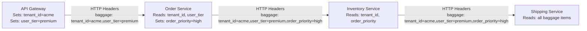

# How to Use Baggage to Pass Business Context Across Service Boundaries

Author: [nawazdhandala](https://www.github.com/nawazdhandala)

Tags: OpenTelemetry, Baggage, Distributed Tracing, Context Propagation, Microservices, Observability

Description: Learn how to use OpenTelemetry Baggage to propagate business context like tenant IDs, feature flags, and user tiers across service boundaries in distributed systems.

---

When you build distributed systems, you quickly run into a frustrating problem. Service A knows something important about the request, like which customer tenant it belongs to or what pricing tier the user is on, but by the time the request reaches Service D three hops later, that context is gone. You end up passing business metadata through API parameters, custom headers, or worse, making extra database calls to look it up again.

OpenTelemetry Baggage solves this problem. It gives you a standardized way to attach key-value pairs to a context and propagate them automatically across service boundaries. Every service in the call chain can read and contribute to this shared context without any custom plumbing.

## What Baggage Actually Is

Baggage is part of the OpenTelemetry context propagation system, but it is separate from traces and spans. Think of it as a sidecar to your distributed trace. While spans capture timing and structural information about operations, baggage carries arbitrary key-value pairs that travel alongside the trace context.

When a request crosses a service boundary (through HTTP, gRPC, or messaging), the baggage gets serialized into headers and deserialized on the other side. The W3C Baggage specification defines the wire format, so it works across languages and frameworks.



The key thing to understand is that baggage propagates through the context, not through spans. Spans can read baggage values and attach them as attributes, but baggage itself lives in the broader context layer.

## Setting Up Baggage in Python

Let's start with a practical example. Suppose you have an API gateway that authenticates requests and knows the tenant ID and user tier.

```python
from opentelemetry import baggage, trace
from opentelemetry.context import attach, detach
from opentelemetry.sdk.trace import TracerProvider
from opentelemetry.sdk.trace.export import BatchSpanProcessor
from opentelemetry.exporter.otlp.proto.grpc.trace_exporter import OTLPSpanExporter
from opentelemetry.propagators.composite import CompositePropagator
from opentelemetry.baggage.propagation import W3CBaggagePropagator
from opentelemetry.trace.propagation import TraceContextTextMapPropagator
from opentelemetry.propagate import set_global_textmap
import requests

# Configure the propagator to include baggage
# Both trace context and baggage must be propagated
propagator = CompositePropagator([
    TraceContextTextMapPropagator(),
    W3CBaggagePropagator(),
])
set_global_textmap(propagator)

# Standard tracer setup
provider = TracerProvider()
provider.add_span_processor(BatchSpanProcessor(OTLPSpanExporter()))
trace.set_tracer_provider(provider)
tracer = trace.get_tracer("api-gateway")
```

The `CompositePropagator` is essential here. Without it, only trace context gets propagated, and your baggage values never leave the current process.

Now, in your request handler, set baggage values after authentication:

```python
def handle_request(request):
    # After authentication, we know who the user is
    user = authenticate(request)

    # Set baggage values for downstream services
    # Each call returns a new context token
    ctx = baggage.set_baggage("tenant.id", user.tenant_id)
    ctx = baggage.set_baggage("user.tier", user.tier, context=ctx)
    ctx = baggage.set_baggage("request.region", user.region, context=ctx)

    # Attach the context so it becomes the current context
    token = attach(ctx)

    try:
        with tracer.start_as_current_span("handle_request") as span:
            # Optionally copy baggage to span attributes for querying
            span.set_attribute("tenant.id", user.tenant_id)
            span.set_attribute("user.tier", user.tier)

            # Make downstream call; baggage is automatically injected
            headers = {}
            from opentelemetry.propagate import inject
            inject(headers)

            # Headers now contain both traceparent and baggage
            response = requests.post(
                "http://order-service/api/orders",
                json=request.body,
                headers=headers,
            )
            return response
    finally:
        # Always detach to restore previous context
        detach(token)
```

The `inject(headers)` call serializes both the trace context and baggage into HTTP headers. The downstream service receives something like `baggage: tenant.id=acme,user.tier=premium,request.region=us-east-1` in the request headers.

## Reading Baggage in Downstream Services

On the receiving side, the downstream service extracts baggage from the incoming request:

```python
from opentelemetry import baggage
from opentelemetry.propagate import extract
from flask import Flask, request

app = Flask(__name__)

@app.route("/api/orders", methods=["POST"])
def create_order():
    # Extract propagated context (trace + baggage) from headers
    ctx = extract(request.headers)
    token = attach(ctx)

    try:
        # Read baggage values set by upstream services
        tenant_id = baggage.get_baggage("tenant.id", context=ctx)
        user_tier = baggage.get_baggage("user.tier", context=ctx)

        with tracer.start_as_current_span("create_order") as span:
            # Use baggage for business logic
            if user_tier == "premium":
                priority = "high"
            else:
                priority = "standard"

            # Add more baggage for further downstream services
            ctx2 = baggage.set_baggage("order.priority", priority)
            token2 = attach(ctx2)

            try:
                # This call carries all baggage: tenant.id, user.tier,
                # request.region, and now order.priority
                call_inventory_service(order_data)
            finally:
                detach(token2)

            return {"status": "created", "priority": priority}
    finally:
        detach(token)
```

Notice how each service can both read existing baggage and add new entries. The baggage accumulates as the request flows through the system.

## Setting Up Baggage in Node.js

The same pattern works in Node.js services, which is common in polyglot architectures:

```javascript
const { propagation, context, ROOT_CONTEXT } = require("@opentelemetry/api");
const { W3CBaggagePropagator } = require("@opentelemetry/core");
const {
  CompositePropagator,
  W3CTraceContextPropagator,
} = require("@opentelemetry/core");

// Configure composite propagator
propagation.setGlobalPropagator(
  new CompositePropagator({
    propagators: [
      new W3CTraceContextPropagator(),
      new W3CBaggagePropagator(),
    ],
  })
);

// Reading baggage in an Express middleware
function baggageMiddleware(req, res, next) {
  // Extract context from incoming headers
  const extractedContext = propagation.extract(ROOT_CONTEXT, req.headers);

  // Read baggage from the extracted context
  const baggageObj = propagation.getBaggage(extractedContext);

  if (baggageObj) {
    // Access individual baggage entries
    const tenantEntry = baggageObj.getEntry("tenant.id");
    const tierEntry = baggageObj.getEntry("user.tier");

    // Make values available to route handlers
    req.tenantId = tenantEntry ? tenantEntry.value : null;
    req.userTier = tierEntry ? tierEntry.value : null;
  }

  // Run the rest of the request in the extracted context
  context.with(extractedContext, () => {
    next();
  });
}
```

Since baggage uses the W3C specification, a Python service can set baggage values and a Node.js service three hops later can read them without any compatibility issues.

## Using a SpanProcessor to Automatically Copy Baggage to Spans

Manually copying baggage to span attributes in every handler is tedious and easy to forget. A better approach is to build a custom SpanProcessor that does it automatically:

```python
from opentelemetry.sdk.trace import SpanProcessor
from opentelemetry import baggage

class BaggageSpanProcessor(SpanProcessor):
    """Automatically copies baggage entries to span attributes."""

    def __init__(self, allowed_keys=None):
        # Only copy specific keys to avoid leaking sensitive data
        self.allowed_keys = allowed_keys

    def on_start(self, span, parent_context=None):
        # Get all baggage from the current context
        all_baggage = baggage.get_all(context=parent_context)

        for key, value in all_baggage.items():
            # Filter to allowed keys if specified
            if self.allowed_keys is None or key in self.allowed_keys:
                # Prefix with "baggage." to distinguish from regular attributes
                span.set_attribute(f"baggage.{key}", value)

    def on_end(self, span):
        pass

    def shutdown(self):
        pass

    def force_flush(self, timeout_millis=None):
        return True
```

Register this processor alongside your export processor:

```python
from opentelemetry.sdk.trace import TracerProvider
from opentelemetry.sdk.trace.export import BatchSpanProcessor
from opentelemetry.exporter.otlp.proto.grpc.trace_exporter import OTLPSpanExporter

provider = TracerProvider()

# Add the baggage processor first so attributes are set before export
provider.add_span_processor(
    BaggageSpanProcessor(allowed_keys=["tenant.id", "user.tier", "request.region"])
)

# Then add the export processor
provider.add_span_processor(
    BatchSpanProcessor(OTLPSpanExporter(endpoint="http://localhost:4317"))
)

trace.set_tracer_provider(provider)
```

Now every span automatically gets `baggage.tenant.id`, `baggage.user.tier`, and `baggage.request.region` attributes without any manual work in your handlers. This is extremely powerful for filtering and grouping traces by business dimensions in your observability backend.

## Practical Use Cases

Baggage shines in several real-world scenarios:

**Multi-tenant systems**: Set the tenant ID at the edge and use it throughout the system for routing, data isolation, and observability filtering. Every span in the trace gets tagged with the tenant, making it easy to investigate issues for a specific customer.

**Feature flags**: Propagate feature flag evaluations so downstream services know which code paths to take without re-evaluating the flags. This keeps feature flag evaluation consistent across the entire request.

**A/B testing**: Carry experiment assignments through the system so that metrics and logs from all services can be correlated with the experiment variant.

**Priority routing**: As shown in the examples above, set a priority at the edge and let downstream services make decisions based on it, like choosing faster queues or more aggressive caching.

## Important Caveats and Security Considerations

Baggage is powerful but comes with real risks you need to understand.

First, baggage is visible to every service in the call chain and to any network observer if you are not using TLS. Never put sensitive data like passwords, tokens, or PII directly in baggage. If you need to propagate a user identifier, use an opaque ID rather than an email address.

Second, baggage has size limits. The W3C specification recommends a maximum of 8192 bytes for the entire baggage header. In practice, keep your baggage small. A handful of short key-value pairs is fine. Dozens of large values will cause problems with header size limits in load balancers and proxies.

Third, baggage is mutable by any service in the chain. A downstream service could overwrite or remove baggage entries set by upstream services. There is no access control mechanism built into baggage.

```python
# Be careful with what you put in baggage
# GOOD: opaque identifiers and short values
ctx = baggage.set_baggage("tenant.id", "t-12345")
ctx = baggage.set_baggage("user.tier", "premium")
ctx = baggage.set_baggage("region", "us-east-1")

# BAD: sensitive or large data
ctx = baggage.set_baggage("user.email", "john@example.com")  # PII risk
ctx = baggage.set_baggage("auth.token", "eyJhbG...")  # Security risk
ctx = baggage.set_baggage("request.body", large_json_string)  # Size risk
```

## Baggage vs Span Attributes

A common question is when to use baggage versus span attributes. The distinction is straightforward:

Use **span attributes** when the data is relevant only to the current service and does not need to cross service boundaries. For example, the number of database rows returned or the cache hit ratio.

Use **baggage** when the data needs to be available to downstream services. For example, the tenant ID or the request priority level.

You will often use both together, setting baggage at the edge for propagation and then copying selected baggage entries into span attributes (manually or via the BaggageSpanProcessor) for querying in your observability backend.

## Conclusion

OpenTelemetry Baggage provides a clean, standardized mechanism for propagating business context across service boundaries. By setting values at the edge and reading them throughout the call chain, you avoid redundant lookups and parameter threading. Combined with a BaggageSpanProcessor that automatically copies baggage to span attributes, you get powerful filtering and grouping capabilities in your observability platform without cluttering your application code. Just remember to keep baggage small, avoid sensitive data, and always configure the W3CBaggagePropagator alongside your trace context propagator.
