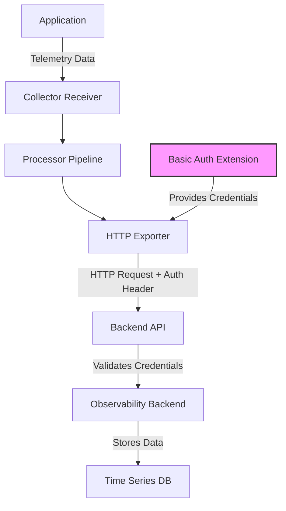

# How to Configure Basic Auth Extension in the OpenTelemetry Collector

Author: [nawazdhandala](https://www.github.com/nawazdhandala)

Tags: OpenTelemetry, Collector, Extensions, Authentication, Basic Auth, Security, HTTP

Description: Learn how to configure HTTP Basic Authentication in the OpenTelemetry Collector to secure communications with username and password credentials for exporters and receivers.

HTTP Basic Authentication is one of the simplest and most widely-supported authentication mechanisms for HTTP-based services. The OpenTelemetry Collector's basic auth extension provides a straightforward way to secure communications between collectors and backends, or to require authentication for incoming telemetry data.

## Understanding HTTP Basic Authentication

HTTP Basic Authentication, defined in RFC 7617, works by encoding a username and password combination in Base64 and including it in the Authorization header of HTTP requests. The header format looks like this:

```
Authorization: Basic <base64-encoded-credentials>
```

Where the credentials are the username and password joined by a colon, then Base64-encoded. For example, username "admin" and password "secret" becomes "admin:secret", which is then encoded.

While Basic Authentication is simple to implement and universally supported, it must be used over HTTPS/TLS connections to prevent credential exposure, as Base64 encoding is easily reversible.

## Why Use Basic Auth in OpenTelemetry?

Basic Authentication offers several advantages for telemetry pipelines:

**Universal Support**: Nearly every HTTP client and server supports Basic Authentication, making it compatible with a wide range of backends and APIs.

**Simplicity**: Configuration requires only a username and password, with no complex certificate management or token lifecycle considerations.

**Legacy Integration**: Many existing monitoring systems and APIs use Basic Authentication, making it essential for integrating the OpenTelemetry Collector with these systems.

**Quick Setup**: For development and testing environments, Basic Auth provides immediate security without extensive infrastructure setup.

## Architecture Overview

The basic auth extension acts as a credential provider for exporters and authenticator for receivers:



The extension manages credentials and automatically injects them into HTTP requests made by exporters that reference the authentication extension.

## Basic Configuration

Here's a minimal configuration using Basic Authentication to secure an HTTP exporter:

```yaml
# Define the basic auth extension
extensions:
  # basicauth extension with inline credentials
  basicauth:
    # Client credentials for authenticating to backends
    client_auth:
      # Username for authentication
      username: "collector-user"
      # Password for authentication
      password: "collector-password"

# Configure receivers to accept telemetry data
receivers:
  otlp:
    protocols:
      http:
        endpoint: 0.0.0.0:4318

# Processors transform the data
processors:
  batch:
    timeout: 10s
    send_batch_size: 1024

# Exporters send data to backends
exporters:
  # OTLP HTTP exporter with basic auth
  otlphttp:
    endpoint: https://api.backend.com/v1/traces
    # Reference the basic auth extension
    auth:
      authenticator: basicauth

# Service configuration
service:
  # Include the extension in the service
  extensions: [basicauth]

  pipelines:
    traces:
      receivers: [otlp]
      processors: [batch]
      exporters: [otlphttp]
```

This configuration automatically adds the Authorization header with Basic Authentication credentials to all requests sent by the OTLP HTTP exporter.

## Using Environment Variables for Credentials

For production environments, store credentials in environment variables rather than hardcoding them in configuration files:

```yaml
extensions:
  basicauth:
    client_auth:
      # Read username from environment variable
      username: "${env:OTEL_BACKEND_USERNAME}"
      # Read password from environment variable
      password: "${env:OTEL_BACKEND_PASSWORD}"

receivers:
  otlp:
    protocols:
      http:
        endpoint: 0.0.0.0:4318

processors:
  batch:
    timeout: 10s
    send_batch_size: 1024

  # Add identifying information to telemetry
  resource:
    attributes:
      - key: collector.name
        value: primary-collector
        action: upsert

exporters:
  # Prometheus remote write with basic auth
  prometheusremotewrite:
    endpoint: https://prometheus.backend.com/api/v1/write
    auth:
      authenticator: basicauth
    # Additional remote write configuration
    external_labels:
      environment: production

  # OTLP HTTP exporter with basic auth
  otlphttp/traces:
    endpoint: https://traces.backend.com/v1/traces
    auth:
      authenticator: basicauth

service:
  extensions: [basicauth]

  pipelines:
    traces:
      receivers: [otlp]
      processors: [resource, batch]
      exporters: [otlphttp/traces]

    metrics:
      receivers: [otlp]
      processors: [resource, batch]
      exporters: [prometheusremotewrite]
```

Start the collector with credentials provided via environment variables:

```bash
export OTEL_BACKEND_USERNAME="your-username"
export OTEL_BACKEND_PASSWORD="your-password"
./otelcol --config=config.yaml
```

## Reading Credentials from Files

For containerized environments, you can read credentials from mounted files:

```yaml
extensions:
  basicauth:
    client_auth:
      # Read username from file
      username: "${file:/var/secrets/username}"
      # Read password from file
      password: "${file:/var/secrets/password}"

receivers:
  otlp:
    protocols:
      grpc:
        endpoint: 0.0.0.0:4317
      http:
        endpoint: 0.0.0.0:4318

processors:
  # Memory limiter prevents OOM conditions
  memory_limiter:
    check_interval: 1s
    limit_mib: 512

  batch:
    timeout: 10s
    send_batch_size: 2048

exporters:
  # Loki exporter for logs
  loki:
    endpoint: https://loki.backend.com/loki/api/v1/push
    auth:
      authenticator: basicauth
    # Loki-specific configuration
    labels:
      resource:
        service.name: "service_name"
      attributes:
        level: "level"

service:
  extensions: [basicauth]

  pipelines:
    logs:
      receivers: [otlp]
      processors: [memory_limiter, batch]
      exporters: [loki]
```

## Multiple Basic Auth Configurations

Configure multiple basic auth extensions when connecting to different backends with different credentials:

```yaml
extensions:
  # Credentials for primary backend
  basicauth/primary:
    client_auth:
      username: "${env:PRIMARY_USERNAME}"
      password: "${env:PRIMARY_PASSWORD}"

  # Credentials for secondary backup backend
  basicauth/secondary:
    client_auth:
      username: "${env:SECONDARY_USERNAME}"
      password: "${env:SECONDARY_PASSWORD}"

  # Credentials for metrics-specific backend
  basicauth/metrics:
    client_auth:
      username: "${env:METRICS_USERNAME}"
      password: "${env:METRICS_PASSWORD}"

receivers:
  otlp:
    protocols:
      http:
        endpoint: 0.0.0.0:4318

processors:
  batch/traces:
    timeout: 10s

  batch/metrics:
    timeout: 30s

exporters:
  # Primary traces backend
  otlphttp/primary:
    endpoint: https://traces-primary.backend.com/v1/traces
    auth:
      authenticator: basicauth/primary

  # Secondary traces backend for redundancy
  otlphttp/secondary:
    endpoint: https://traces-secondary.backend.com/v1/traces
    auth:
      authenticator: basicauth/secondary

  # Dedicated metrics backend
  prometheusremotewrite:
    endpoint: https://metrics.backend.com/api/v1/write
    auth:
      authenticator: basicauth/metrics

service:
  extensions: [basicauth/primary, basicauth/secondary, basicauth/metrics]

  pipelines:
    traces:
      receivers: [otlp]
      processors: [batch/traces]
      # Send to both backends for redundancy
      exporters: [otlphttp/primary, otlphttp/secondary]

    metrics:
      receivers: [otlp]
      processors: [batch/metrics]
      exporters: [prometheusremotewrite]
```

## Securing Receivers with Basic Auth

You can also require Basic Authentication for clients sending data to the collector:

```yaml
extensions:
  # Server-side basic auth for incoming requests
  basicauth/server:
    # htpasswd file contains username:bcrypt-hash pairs
    htpasswd:
      # Path to htpasswd file
      file: /etc/otel/htpasswd
      # Inline htpasswd entries (for testing only)
      inline: |
        # user1 with password 'pass1'
        user1:$2y$05$gV5MRwvQl.Z5gC5x8HqZKuW4aQQQQQQQQQQQQQQQQQQQQQQ
        # user2 with password 'pass2'
        user2:$2y$05$aB3MxwvQm.A6hD6y9IsALvX5bRRRRRRRRRRRRRRRRRRRRRR

receivers:
  otlp:
    protocols:
      http:
        endpoint: 0.0.0.0:4318
        # Require authentication for incoming requests
        auth:
          authenticator: basicauth/server
        # Always use TLS with basic auth
        tls:
          cert_file: /etc/otel/certs/server.crt
          key_file: /etc/otel/certs/server.key

processors:
  batch:
    timeout: 10s

exporters:
  logging:
    loglevel: info

service:
  extensions: [basicauth/server]

  pipelines:
    traces:
      receivers: [otlp]
      processors: [batch]
      exporters: [logging]
```

Generate htpasswd entries using the htpasswd utility:

```bash
# Install htpasswd (usually part of apache2-utils)
apt-get install apache2-utils

# Create htpasswd file with bcrypt hashing
htpasswd -nbB user1 pass1 >> /etc/otel/htpasswd
htpasswd -nbB user2 pass2 >> /etc/otel/htpasswd
```

Clients must include credentials when sending data:

```bash
curl -X POST https://localhost:4318/v1/traces \
  -u user1:pass1 \
  -H "Content-Type: application/json" \
  -d '{"resourceSpans": []}'
```

## Kubernetes Deployment with Secrets

Deploy the collector in Kubernetes using Secrets for credential management:

```yaml
# Kubernetes Secret for backend credentials
apiVersion: v1
kind: Secret
metadata:
  name: otel-basic-auth
  namespace: observability
type: Opaque
stringData:
  username: "backend-user"
  password: "backend-password"
---
# ConfigMap for collector configuration
apiVersion: v1
kind: ConfigMap
metadata:
  name: otel-collector-config
  namespace: observability
data:
  config.yaml: |
    extensions:
      basicauth:
        client_auth:
          username: "${env:BACKEND_USERNAME}"
          password: "${env:BACKEND_PASSWORD}"

    receivers:
      otlp:
        protocols:
          http:
            endpoint: 0.0.0.0:4318

    processors:
      batch:
        timeout: 10s

    exporters:
      otlphttp:
        endpoint: https://backend.com/v1/traces
        auth:
          authenticator: basicauth

    service:
      extensions: [basicauth]
      pipelines:
        traces:
          receivers: [otlp]
          processors: [batch]
          exporters: [otlphttp]
---
# Deployment
apiVersion: apps/v1
kind: Deployment
metadata:
  name: otel-collector
  namespace: observability
spec:
  replicas: 3
  selector:
    matchLabels:
      app: otel-collector
  template:
    metadata:
      labels:
        app: otel-collector
    spec:
      containers:
      - name: otel-collector
        image: otel/opentelemetry-collector-contrib:latest
        env:
        # Inject credentials from secret
        - name: BACKEND_USERNAME
          valueFrom:
            secretKeyRef:
              name: otel-basic-auth
              key: username
        - name: BACKEND_PASSWORD
          valueFrom:
            secretKeyRef:
              name: otel-basic-auth
              key: password
        volumeMounts:
        - name: config
          mountPath: /etc/otel
          readOnly: true
        args:
        - --config=/etc/otel/config.yaml
        ports:
        - containerPort: 4318
          name: otlp-http
      volumes:
      - name: config
        configMap:
          name: otel-collector-config
```

## Production Configuration Example

Here's a comprehensive production configuration with Basic Authentication:

```yaml
extensions:
  # Basic auth for backend communication
  basicauth:
    client_auth:
      username: "${file:/var/secrets/username}"
      password: "${file:/var/secrets/password}"

  # Health check endpoint
  health_check:
    endpoint: 0.0.0.0:13133

  # Performance profiling
  pprof:
    endpoint: localhost:1777

receivers:
  otlp:
    protocols:
      grpc:
        endpoint: 0.0.0.0:4317
        tls:
          cert_file: /etc/otel/certs/server.crt
          key_file: /etc/otel/certs/server.key
      http:
        endpoint: 0.0.0.0:4318
        tls:
          cert_file: /etc/otel/certs/server.crt
          key_file: /etc/otel/certs/server.key

processors:
  # Prevent memory issues
  memory_limiter:
    check_interval: 1s
    limit_mib: 2048
    spike_limit_mib: 512

  # Batch for efficiency
  batch:
    timeout: 10s
    send_batch_size: 2048

  # Add metadata
  resource:
    attributes:
      - key: collector.version
        value: "1.0.0"
        action: upsert
      - key: deployment.environment
        value: production
        action: upsert

  # Attribute filtering for security
  attributes:
    actions:
      - key: password
        action: delete
      - key: token
        action: delete
      - key: secret
        action: delete

exporters:
  # Primary backend with basic auth
  otlphttp/backend:
    endpoint: https://api.backend.com/v1/traces
    auth:
      authenticator: basicauth
    tls:
      insecure: false
      ca_file: /etc/otel/certs/ca.crt
    compression: gzip
    retry_on_failure:
      enabled: true
      initial_interval: 5s
      max_interval: 30s
      max_elapsed_time: 300s
    sending_queue:
      enabled: true
      num_consumers: 10
      queue_size: 5000
    timeout: 30s

  # Logging for troubleshooting
  logging:
    loglevel: info
    sampling_initial: 5
    sampling_thereafter: 200

service:
  extensions: [basicauth, health_check, pprof]

  pipelines:
    traces:
      receivers: [otlp]
      processors: [memory_limiter, attributes, resource, batch]
      exporters: [otlphttp/backend, logging]

    metrics:
      receivers: [otlp]
      processors: [memory_limiter, resource, batch]
      exporters: [otlphttp/backend]
```

## Integration with Popular Backends

Basic Authentication is commonly used with several observability backends:

**Grafana Cloud**: Requires Basic Auth with instance ID as username and API key as password.

**Prometheus Remote Write**: Many managed Prometheus services use Basic Auth for authentication.

**Elasticsearch**: Can be configured to require Basic Auth for index operations.

**InfluxDB**: Supports Basic Auth for database access.

Configure the collector to work with these backends by setting the appropriate credentials and endpoints.

## Troubleshooting

**401 Unauthorized Errors**: Verify that credentials are correctly configured and match what the backend expects. Check for trailing whitespace in credential files.

**Base64 Encoding Issues**: The collector handles Base64 encoding automatically. Do not manually encode credentials in the configuration.

**TLS Errors**: Basic Auth should always be used with TLS. Ensure TLS is properly configured and certificates are valid.

**Credential Updates**: When rotating credentials, update environment variables or secret files, then restart the collector to load new values.

## Security Best Practices

Always use HTTPS/TLS when using Basic Authentication. Credentials sent over unencrypted connections can be easily intercepted and decoded.

Never commit credentials to version control systems. Use environment variables, secret management systems, or mounted volumes.

Implement credential rotation policies and regularly update usernames and passwords to minimize the impact of credential compromise.

Use strong passwords with sufficient length and complexity. Weak passwords can be easily brute-forced.

Monitor authentication failures which could indicate credential issues or potential security incidents.

Consider using more robust authentication methods like OAuth2 or mutual TLS for highly sensitive environments.

## Related Resources

For more information about OpenTelemetry Collector authentication mechanisms, check out these related posts:

- [How to Configure Bearer Token Auth Extension in the OpenTelemetry Collector](https://oneuptime.com/blog/post/bearer-token-auth-extension-opentelemetry-collector/view)
- [How to Configure OIDC Auth Extension in the OpenTelemetry Collector](https://oneuptime.com/blog/post/oidc-auth-extension-opentelemetry-collector/view)
- [How to Configure OAuth2 Client Auth Extension in the OpenTelemetry Collector](https://oneuptime.com/blog/post/oauth2-client-auth-extension-opentelemetry-collector/view)

Basic Authentication provides a simple, widely-supported method for securing OpenTelemetry Collector communications. While it may not offer the advanced features of modern authentication protocols, its simplicity and universal compatibility make it an excellent choice for many use cases, particularly when properly secured with TLS encryption.
