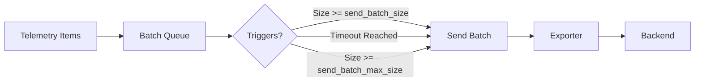

# How to Configure the Batch Processor in the OpenTelemetry Collector

Author: [nawazdhandala](https://www.github.com/nawazdhandala)

Tags: OpenTelemetry, Collector, Processors, Batch Processor, Performance, Configuration

Description: A comprehensive guide to configuring the batch processor in OpenTelemetry Collector for optimal throughput, reduced network overhead, and efficient telemetry export with practical examples.

The batch processor is one of the most critical components in the OpenTelemetry Collector pipeline. It groups multiple telemetry signals (traces, metrics, logs) into batches before exporting them to backends. This dramatically improves throughput, reduces network overhead, and prevents overwhelming downstream systems with individual requests.

Understanding how to configure the batch processor correctly can mean the difference between a smooth-running observability pipeline and one that struggles with performance issues, dropped data, or excessive resource consumption.

## Why Batching Matters

Without batching, your collector would send each span, metric data point, or log record individually to your backend. For a moderately busy application generating 10,000 spans per second, this translates to 10,000 HTTP requests per second to your observability backend.

Batching solves this by:

- **Reducing network calls**: Hundreds of telemetry items sent in one request instead of hundreds of requests
- **Improving throughput**: Backend systems can process bulk data more efficiently
- **Lowering CPU overhead**: Fewer connection establishments and TLS handshakes
- **Enabling compression**: Larger payloads compress better, reducing bandwidth
- **Protecting backends**: Prevents overwhelming downstream systems with request floods

## Basic Configuration

The batch processor is recommended for every production collector deployment. Here's a minimal configuration:

```yaml
receivers:
  otlp:
    protocols:
      grpc:
        endpoint: 0.0.0.0:4317
      http:
        endpoint: 0.0.0.0:4318

processors:
  batch:
    # Default configuration (all parameters optional)
    timeout: 200ms
    send_batch_size: 8192

exporters:
  otlphttp:
    endpoint: https://oneuptime.com/otlp
    encoding: json
    headers:
      x-oneuptime-token: "YOUR_TOKEN"

service:
  pipelines:
    traces:
      receivers: [otlp]
      processors: [batch]
      exporters: [otlphttp]
    metrics:
      receivers: [otlp]
      processors: [batch]
      exporters: [otlphttp]
    logs:
      receivers: [otlp]
      processors: [batch]
      exporters: [otlphttp]
```

This configuration batches all telemetry types before export, using default parameters that work well for most scenarios.

## Core Configuration Parameters

### timeout

The `timeout` parameter defines the maximum duration the processor waits before sending a batch, regardless of size.

```yaml
processors:
  batch:
    timeout: 5s  # Send batch every 5 seconds maximum
```

**When to adjust**:
- **Lower timeout (100ms-500ms)**: Real-time alerting scenarios where latency matters more than efficiency
- **Higher timeout (5s-10s)**: High-volume environments where throughput optimization is priority
- **Default (200ms)**: Balanced approach for most production workloads

Lower timeouts ensure fresher data reaches your backend but may increase network overhead. Higher timeouts maximize batching efficiency but introduce latency.

### send_batch_size

Defines the number of telemetry items that trigger an immediate batch send.

```yaml
processors:
  batch:
    send_batch_size: 1024  # Send when batch reaches 1024 items
```

**Sizing guidance**:
- **Traces**: 512-2048 spans per batch
- **Metrics**: 2048-8192 data points per batch
- **Logs**: 1024-4096 log records per batch

Larger batches improve efficiency but consume more memory and may hit backend payload limits. Most backends accept 5-10MB per request, which translates to thousands of spans or metrics.

### send_batch_max_size

A hard limit on batch size. The batch processor will never send more than this number of items in a single batch.

```yaml
processors:
  batch:
    send_batch_size: 1024
    send_batch_max_size: 2048  # Never exceed 2048 items
```

This parameter provides a safety ceiling. If data accumulates faster than expected, batches won't grow unbounded. The difference between `send_batch_size` and `send_batch_max_size` gives you a buffer zone for traffic spikes.

## Advanced Configuration Examples

### High-Throughput Production Setup

For environments processing millions of telemetry items per hour:

```yaml
processors:
  batch:
    # Maximize throughput with larger batches
    timeout: 10s
    send_batch_size: 8192
    send_batch_max_size: 16384

exporters:
  otlphttp:
    endpoint: https://oneuptime.com/otlp
    encoding: json
    compression: gzip  # Compress large batches
    timeout: 30s  # Allow time for large batch export
    retry_on_failure:
      enabled: true
      initial_interval: 5s
      max_interval: 30s
      max_elapsed_time: 300s
```

This configuration prioritizes efficiency over latency, suitable when you're processing high volumes and can tolerate a 10-second delay.

### Low-Latency Real-Time Setup

For alerting pipelines where every second counts:

```yaml
processors:
  batch:
    # Minimize latency with aggressive batching
    timeout: 100ms
    send_batch_size: 256
    send_batch_max_size: 512

exporters:
  otlphttp:
    endpoint: https://oneuptime.com/otlp
    encoding: json
    timeout: 5s
```

This setup ensures telemetry reaches your backend within milliseconds, critical for real-time alerting and monitoring dashboards.

### Memory-Constrained Environment

For edge deployments or resource-limited containers:

```yaml
processors:
  memory_limiter:
    check_interval: 1s
    limit_mib: 256
    spike_limit_mib: 64

  batch:
    # Smaller batches to reduce memory pressure
    timeout: 2s
    send_batch_size: 512
    send_batch_max_size: 1024

exporters:
  otlphttp:
    endpoint: https://oneuptime.com/otlp
    encoding: json
```

Pairing the batch processor with the memory limiter prevents out-of-memory issues in constrained environments. Smaller batches mean less memory consumption but slightly more network overhead.

## Understanding Batch Processor Behavior

The batch processor uses an internal queue and timer mechanism:



The processor evaluates three conditions continuously:

1. **Size trigger**: Queue reaches `send_batch_size` items
2. **Timeout trigger**: `timeout` duration elapses since last send
3. **Max size trigger**: Queue reaches `send_batch_max_size` items (overflow protection)

Whichever condition triggers first causes the batch to export.

## Performance Tuning Strategy

Follow this methodology to optimize batch processor configuration for your workload:

### Step 1: Baseline Your Telemetry Volume

Measure your telemetry generation rate:

```bash
# Query your collector metrics endpoint
curl http://localhost:8888/metrics | grep receiver_accepted

# Look for metrics like:
# otelcol_receiver_accepted_spans{receiver="otlp"} 15000
# otelcol_receiver_accepted_metric_points{receiver="otlp"} 50000
# otelcol_receiver_accepted_log_records{receiver="otlp"} 8000
```

This tells you how many items per second flow through your collector.

### Step 2: Calculate Optimal Batch Size

Use this formula:

```
send_batch_size = items_per_second × timeout_seconds × 0.8
```

The 0.8 factor provides headroom for traffic spikes. For example, if processing 10,000 spans/second with a 1-second timeout:

```
send_batch_size = 10,000 × 1 × 0.8 = 8,000
```

### Step 3: Monitor and Adjust

Watch these collector metrics to validate your configuration:

```yaml
# Key metrics to monitor
- otelcol_processor_batch_batch_send_size_bucket  # Distribution of batch sizes
- otelcol_processor_batch_timeout_trigger_send    # How often timeout triggers
- otelcol_processor_batch_batch_size_trigger_send # How often size triggers
- otelcol_exporter_send_failed_spans              # Export failures
```

Healthy batch processor operation shows:

- Most batches reaching full `send_batch_size` (size trigger dominates)
- Minimal timeout triggers during normal load
- Zero or near-zero export failures
- Consistent batch sizes in the metrics histogram

## Multi-Pipeline Configuration

Different telemetry types often need different batching strategies:

```yaml
processors:
  # Optimized for spans (larger batches, longer timeout)
  batch/traces:
    timeout: 10s
    send_batch_size: 2048
    send_batch_max_size: 4096

  # Optimized for metrics (very large batches)
  batch/metrics:
    timeout: 30s
    send_batch_size: 8192
    send_batch_max_size: 16384

  # Optimized for logs (balanced approach)
  batch/logs:
    timeout: 5s
    send_batch_size: 1024
    send_batch_max_size: 2048

service:
  pipelines:
    traces:
      receivers: [otlp]
      processors: [batch/traces]
      exporters: [otlphttp]

    metrics:
      receivers: [otlp]
      processors: [batch/metrics]
      exporters: [otlphttp]

    logs:
      receivers: [otlp]
      processors: [batch/logs]
      exporters: [otlphttp]
```

This approach acknowledges that metrics compress better and can tolerate higher latency, while traces often need quicker delivery for distributed tracing visualization.

## Common Pitfalls and Solutions

### Pitfall 1: Batches Too Small

**Symptom**: High CPU usage, excessive network connections, backend rate limiting.

**Solution**: Increase `send_batch_size` and `timeout`:

```yaml
processors:
  batch:
    timeout: 5s        # Was: 200ms
    send_batch_size: 4096  # Was: 512
```

### Pitfall 2: Batches Too Large

**Symptom**: HTTP 413 errors (Payload Too Large), OOM kills, high export latency.

**Solution**: Reduce `send_batch_max_size` and add compression:

```yaml
processors:
  batch:
    send_batch_max_size: 2048  # Cap maximum size

exporters:
  otlphttp:
    compression: gzip  # Compress large payloads
```

### Pitfall 3: Memory Exhaustion

**Symptom**: Collector crashes with OOM, increasing memory usage over time.

**Solution**: Add memory limiter before batch processor:

```yaml
processors:
  memory_limiter:
    check_interval: 1s
    limit_mib: 512
    spike_limit_mib: 128

  batch:
    timeout: 2s
    send_batch_size: 1024

service:
  pipelines:
    traces:
      # Memory limiter MUST come first
      processors: [memory_limiter, batch]
```

The memory limiter drops data before the batch processor can accumulate excessive backlog.

## Testing Your Configuration

Validate your batch processor setup with a load test:

```yaml
# test-collector.yaml
receivers:
  otlp:
    protocols:
      grpc:
        endpoint: 0.0.0.0:4317

processors:
  batch:
    timeout: 5s
    send_batch_size: 1000

exporters:
  logging:
    verbosity: detailed  # Shows batch sizes

  otlphttp:
    endpoint: https://oneuptime.com/otlp
    encoding: json

service:
  telemetry:
    metrics:
      address: 0.0.0.0:8888  # Expose metrics

  pipelines:
    traces:
      receivers: [otlp]
      processors: [batch]
      exporters: [logging, otlphttp]
```

Generate load and observe:

```bash
# Run collector
otelcol --config test-collector.yaml

# In another terminal, generate test spans
# (Use a load generator like opentelemetry-collector-contrib/testbed)

# Query batch processor metrics
curl -s http://localhost:8888/metrics | grep batch

# Check for:
# - Consistent batch_send_size values
# - Low timeout_trigger_send compared to batch_size_trigger_send
# - Zero send_failed_spans
```

## Integration with Other Processors

The batch processor works best as the final processor before export, but some exceptions exist:

### Recommended Order

```yaml
processors:
  memory_limiter:      # 1. Protect against OOM
  filter:              # 2. Drop unwanted telemetry early
  attributes:          # 3. Enrich/modify attributes
  resource:            # 4. Modify resource attributes
  batch:               # 5. Batch before export

service:
  pipelines:
    traces:
      processors: [memory_limiter, filter, attributes, resource, batch]
```

### Why Batch Goes Last

Batching after filtering and transformation means:
- Smaller overall batch memory (filtered items don't occupy space)
- Attribute modifications happen once per item, not per batch
- Resource processing benefits from individual item context

## Production Checklist

Before deploying a batch processor configuration to production:

- [ ] Baseline telemetry volume measured (items/second per signal type)
- [ ] `send_batch_size` calculated based on volume and timeout
- [ ] `send_batch_max_size` set to prevent unbounded growth
- [ ] Memory limiter configured upstream of batch processor
- [ ] Exporter timeout >= batch timeout + network latency buffer
- [ ] Compression enabled for large batches (gzip recommended)
- [ ] Collector metrics endpoint exposed and monitored
- [ ] Load testing performed at 2x expected peak volume
- [ ] Batch size metrics show size trigger dominance over timeout trigger
- [ ] No export failures under normal load conditions

## Key Takeaways

The batch processor is essential for production OpenTelemetry Collector deployments. Proper configuration requires understanding your telemetry volume, latency requirements, and resource constraints.

Start with conservative defaults (200ms timeout, 1024 batch size), measure performance, and adjust based on metrics. Most production environments benefit from larger batches (4096-8192 items) and longer timeouts (5-10 seconds) for maximum efficiency.

Always pair the batch processor with the memory limiter, monitor batch size distributions, and test under realistic load before deploying to production.

**Related Reading:**

- [How to Configure the Memory Limiter Processor in the OpenTelemetry Collector](https://oneuptime.com/blog/post/memory-limiter-processor-opentelemetry-collector/view)
- [How to Configure the Filter Processor in the OpenTelemetry Collector](https://oneuptime.com/blog/post/filter-processor-opentelemetry-collector/view)
- [How to reduce noise in OpenTelemetry?](https://oneuptime.com/blog/post/2025-08-25-how-to-reduce-noise-in-opentelemetry/view)
