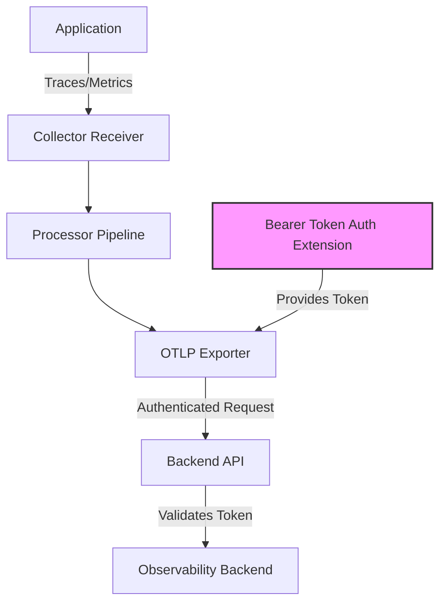

# How to Configure Bearer Token Auth Extension in the OpenTelemetry Collector

Author: [nawazdhandala](https://www.github.com/nawazdhandala)

Tags: OpenTelemetry, Collector, Extensions, Authentication, Bearer Token, Security

Description: Learn how to configure bearer token authentication in the OpenTelemetry Collector to secure exporters and receivers with token-based authentication mechanisms.

Bearer token authentication is a widely-used HTTP authentication scheme where clients include a token in the Authorization header of their requests. The OpenTelemetry Collector's bearer token auth extension enables you to secure communications between collectors and backends, or between applications and collectors, using this standardized authentication method.

## Understanding Bearer Token Authentication

Bearer token authentication follows the OAuth 2.0 specification (RFC 6750), where a token serves as a credential to access protected resources. The token is included in HTTP requests using the Authorization header with the "Bearer" scheme:

```
Authorization: Bearer <token>
```

This authentication method is stateless, making it ideal for distributed systems where maintaining session state across multiple collector instances would be impractical. The token can be a simple API key, a JSON Web Token (JWT), or any other string-based credential accepted by your backend services.

## Why Use Bearer Token Authentication?

Bearer token authentication provides several advantages for telemetry pipelines:

**Simplicity**: Unlike certificate-based authentication, bearer tokens require no complex PKI infrastructure. You generate a token, distribute it securely, and configure the collector to use it.

**Compatibility**: Most modern observability backends and APIs support bearer token authentication, making it a universal choice for securing telemetry data.

**Rotation**: Tokens can be easily rotated without changing collector configurations by reading from files or environment variables that get updated externally.

**Access Control**: Different tokens can be used for different environments or teams, enabling fine-grained access control at the backend level.

## Architecture Overview

The bearer token auth extension acts as an authentication provider that other collector components can reference:



The extension manages the token lifecycle, retrieves it from the configured source, and injects it into outgoing requests from exporters that reference the authentication extension.

## Basic Configuration

Here's a simple configuration that uses a static bearer token for authenticating with a backend:

```yaml
# Define the bearer token auth extension
extensions:
  # bearertoken extension with inline token
  bearertoken:
    # The token can be specified directly (not recommended for production)
    token: "your-api-token-here"

# Configure receivers to accept telemetry data
receivers:
  otlp:
    protocols:
      grpc:
        endpoint: 0.0.0.0:4317
      http:
        endpoint: 0.0.0.0:4318

# Processors transform the data
processors:
  batch:
    timeout: 10s
    send_batch_size: 1024

# Exporters send data to backends
exporters:
  otlp:
    endpoint: https://api.observability-backend.com:4317
    # Reference the bearer token auth extension
    auth:
      authenticator: bearertoken

# Service configuration
service:
  # Include the extension in the service
  extensions: [bearertoken]

  pipelines:
    traces:
      receivers: [otlp]
      processors: [batch]
      exporters: [otlp]
```

This configuration automatically adds the Authorization header with the bearer token to all requests sent by the OTLP exporter.

## Reading Token from Environment Variables

For production environments, avoid hardcoding tokens in configuration files. Instead, read them from environment variables:

```yaml
extensions:
  bearertoken:
    # Use environment variable expansion
    # The collector will read the token from the OTEL_AUTH_TOKEN env var
    token: "${env:OTEL_AUTH_TOKEN}"

receivers:
  otlp:
    protocols:
      grpc:
        endpoint: 0.0.0.0:4317

processors:
  batch:
    timeout: 10s
    send_batch_size: 1024

  # Add resource attributes for better observability
  resource:
    attributes:
      - key: service.name
        value: otel-collector
        action: upsert

exporters:
  # Primary backend with bearer token auth
  otlp/primary:
    endpoint: https://primary-backend.com:4317
    auth:
      authenticator: bearertoken

  # Secondary backend with the same auth
  otlp/secondary:
    endpoint: https://secondary-backend.com:4317
    auth:
      authenticator: bearertoken

service:
  extensions: [bearertoken]

  pipelines:
    traces:
      receivers: [otlp]
      processors: [resource, batch]
      exporters: [otlp/primary, otlp/secondary]

    metrics:
      receivers: [otlp]
      processors: [resource, batch]
      exporters: [otlp/primary]
```

Start the collector with the token provided via environment variable:

```bash
export OTEL_AUTH_TOKEN="your-secret-token"
./otelcol --config=config.yaml
```

## Reading Token from Files

For Kubernetes environments using secrets or Docker with mounted volumes, read the token from a file:

```yaml
extensions:
  bearertoken:
    # Read token from a file
    # This file could be mounted from a Kubernetes secret
    token: "${file:/var/secrets/otel-token}"

receivers:
  otlp:
    protocols:
      grpc:
        endpoint: 0.0.0.0:4317
      http:
        endpoint: 0.0.0.0:4318

processors:
  # Memory limiter prevents OOM conditions
  memory_limiter:
    check_interval: 1s
    limit_mib: 512

  batch:
    timeout: 10s
    send_batch_size: 2048

exporters:
  otlphttp:
    # HTTP endpoint for the backend
    endpoint: https://api.backend.com/v1/traces
    auth:
      authenticator: bearertoken
    # Additional headers can still be added
    headers:
      X-Custom-Header: "custom-value"

service:
  extensions: [bearertoken]

  pipelines:
    traces:
      receivers: [otlp]
      processors: [memory_limiter, batch]
      exporters: [otlphttp]
```

## Multiple Bearer Token Configurations

You can configure multiple bearer token auth extensions for different backends or use cases:

```yaml
extensions:
  # Token for production backend
  bearertoken/prod:
    token: "${env:PROD_AUTH_TOKEN}"

  # Token for staging backend
  bearertoken/staging:
    token: "${env:STAGING_AUTH_TOKEN}"

  # Token for metrics backend (different from traces)
  bearertoken/metrics:
    token: "${file:/var/secrets/metrics-token}"

receivers:
  otlp:
    protocols:
      grpc:
        endpoint: 0.0.0.0:4317

processors:
  batch:
    timeout: 10s

  # Route data based on attributes
  routing:
    from_attribute: environment
    table:
      - value: production
        exporters: [otlp/prod]
      - value: staging
        exporters: [otlp/staging]

exporters:
  # Production backend with dedicated token
  otlp/prod:
    endpoint: https://prod-backend.com:4317
    auth:
      authenticator: bearertoken/prod

  # Staging backend with dedicated token
  otlp/staging:
    endpoint: https://staging-backend.com:4317
    auth:
      authenticator: bearertoken/staging

  # Metrics backend with separate auth
  otlphttp/metrics:
    endpoint: https://metrics-backend.com/v1/metrics
    auth:
      authenticator: bearertoken/metrics

service:
  extensions: [bearertoken/prod, bearertoken/staging, bearertoken/metrics]

  pipelines:
    traces:
      receivers: [otlp]
      processors: [routing]
      # Note: routing processor handles exporter selection

    metrics:
      receivers: [otlp]
      processors: [batch]
      exporters: [otlphttp/metrics]
```

## Kubernetes Deployment with Secrets

When deploying the collector in Kubernetes, use Secrets to manage bearer tokens securely:

```yaml
# Kubernetes Secret
apiVersion: v1
kind: Secret
metadata:
  name: otel-bearer-token
  namespace: observability
type: Opaque
stringData:
  token: "your-secret-bearer-token"
```

Reference the secret in your collector deployment:

```yaml
apiVersion: apps/v1
kind: Deployment
metadata:
  name: otel-collector
  namespace: observability
spec:
  replicas: 3
  selector:
    matchLabels:
      app: otel-collector
  template:
    metadata:
      labels:
        app: otel-collector
    spec:
      containers:
      - name: otel-collector
        image: otel/opentelemetry-collector-contrib:latest
        volumeMounts:
        - name: token
          mountPath: /var/secrets
          readOnly: true
        - name: config
          mountPath: /etc/otel
          readOnly: true
        args:
        - --config=/etc/otel/config.yaml
      volumes:
      - name: token
        secret:
          secretName: otel-bearer-token
          items:
          - key: token
            path: otel-token
      - name: config
        configMap:
          name: otel-collector-config
```

The collector configuration reads from the mounted secret:

```yaml
extensions:
  bearertoken:
    # Token is mounted at /var/secrets/otel-token
    token: "${file:/var/secrets/otel-token}"

receivers:
  otlp:
    protocols:
      grpc:
        endpoint: 0.0.0.0:4317

processors:
  batch:
    timeout: 10s

exporters:
  otlphttp:
    endpoint: https://backend.com/v1/traces
    auth:
      authenticator: bearertoken

service:
  extensions: [bearertoken]
  pipelines:
    traces:
      receivers: [otlp]
      processors: [batch]
      exporters: [otlphttp]
```

## Securing Receivers with Bearer Tokens

You can also use bearer token authentication to secure collector receivers, requiring clients to authenticate before sending telemetry:

```yaml
extensions:
  # Expected token for incoming requests
  bearertoken/server:
    token: "${env:EXPECTED_CLIENT_TOKEN}"

receivers:
  otlp:
    protocols:
      http:
        endpoint: 0.0.0.0:4318
        # Require authentication for incoming requests
        auth:
          authenticator: bearertoken/server

processors:
  batch:
    timeout: 10s

exporters:
  logging:
    loglevel: info

service:
  extensions: [bearertoken/server]

  pipelines:
    traces:
      receivers: [otlp]
      processors: [batch]
      exporters: [logging]
```

Clients must now include the bearer token when sending data to the collector:

```bash
curl -X POST http://localhost:4318/v1/traces \
  -H "Content-Type: application/json" \
  -H "Authorization: Bearer your-client-token" \
  -d '{"resourceSpans": []}'
```

## Production Configuration Example

Here's a comprehensive production configuration combining multiple best practices:

```yaml
extensions:
  # Bearer token for backend authentication
  bearertoken:
    token: "${file:/var/secrets/backend-token}"

  # Health check extension for monitoring
  health_check:
    endpoint: 0.0.0.0:13133

  # zPages for debugging
  zpages:
    endpoint: localhost:55679

receivers:
  otlp:
    protocols:
      grpc:
        endpoint: 0.0.0.0:4317
        # TLS configuration for encrypted transport
        tls:
          cert_file: /etc/otel/certs/server.crt
          key_file: /etc/otel/certs/server.key
      http:
        endpoint: 0.0.0.0:4318
        tls:
          cert_file: /etc/otel/certs/server.crt
          key_file: /etc/otel/certs/server.key

processors:
  # Memory limiter to prevent OOM
  memory_limiter:
    check_interval: 1s
    limit_mib: 2048
    spike_limit_mib: 512

  # Batch processor for efficiency
  batch:
    timeout: 10s
    send_batch_size: 2048

  # Add resource attributes
  resource:
    attributes:
      - key: collector.id
        value: "${env:HOSTNAME}"
        action: upsert
      - key: environment
        value: production
        action: upsert

exporters:
  # Primary backend with bearer token
  otlphttp/backend:
    endpoint: https://api.backend.com/v1/traces
    auth:
      authenticator: bearertoken
    tls:
      insecure: false
      ca_file: /etc/otel/certs/ca.crt
    retry_on_failure:
      enabled: true
      initial_interval: 5s
      max_interval: 30s
      max_elapsed_time: 300s
    sending_queue:
      enabled: true
      num_consumers: 10
      queue_size: 5000

  # Logging for troubleshooting
  logging:
    loglevel: info
    sampling_initial: 5
    sampling_thereafter: 200

service:
  extensions: [bearertoken, health_check, zpages]

  pipelines:
    traces:
      receivers: [otlp]
      processors: [memory_limiter, resource, batch]
      exporters: [otlphttp/backend, logging]

    metrics:
      receivers: [otlp]
      processors: [memory_limiter, resource, batch]
      exporters: [otlphttp/backend]
```

## Troubleshooting

**Authentication Failures**: If requests fail with 401 or 403 errors, verify that the token is correctly configured and matches what the backend expects. Check collector logs for authentication errors.

**Token Not Found**: When using file or environment variable expansion, ensure the file exists and is readable, or that the environment variable is set before starting the collector.

**Token Rotation**: To rotate tokens without restarting the collector, update the token file or environment variable, then send a SIGHUP signal to the collector process to reload the configuration.

## Security Best Practices

Never hardcode bearer tokens in configuration files that are committed to version control. Use environment variables or mounted secrets instead.

Restrict file permissions on token files to prevent unauthorized access. Use mode 0400 or 0600 for token files.

Use HTTPS/TLS for all communications when bearer tokens are involved. Bearer tokens transmitted over unencrypted connections can be intercepted.

Implement token rotation policies and regularly update bearer tokens to minimize the impact of token compromise.

Monitor for authentication failures which could indicate token expiration, misconfiguration, or potential security issues.

## Related Resources

For more information about OpenTelemetry Collector authentication, check out these related posts:

- [How to Configure Basic Auth Extension in the OpenTelemetry Collector](https://oneuptime.com/blog/post/2026-02-06-basic-auth-extension-opentelemetry-collector/view)
- [How to Configure OIDC Auth Extension in the OpenTelemetry Collector](https://oneuptime.com/blog/post/2026-02-06-oidc-auth-extension-opentelemetry-collector/view)
- [How to Configure OAuth2 Client Auth Extension in the OpenTelemetry Collector](https://oneuptime.com/blog/post/2026-02-06-oauth2-client-auth-extension-opentelemetry-collector/view)

Bearer token authentication provides a straightforward yet effective method for securing OpenTelemetry Collector communications. By properly configuring the bearer token auth extension and following security best practices, you can ensure that your telemetry data remains protected throughout its journey from applications to observability backends.
