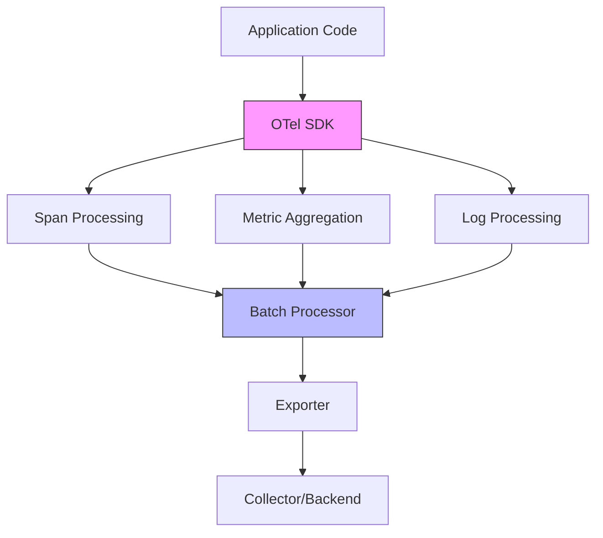

# How to Benchmark OpenTelemetry SDK Overhead in Go, Java, and Python

Author: [nawazdhandala](https://www.github.com/nawazdhandala)

Tags: OpenTelemetry, Performance, Benchmarking, Go, Java, Python, Observability

Description: Learn how to measure and benchmark OpenTelemetry SDK overhead across Go, Java, and Python applications with practical examples and performance testing strategies.

Instrumenting applications with OpenTelemetry provides critical observability, but it comes at a cost. Understanding the performance impact of the OpenTelemetry SDK on your application is essential for making informed decisions about instrumentation depth, sampling rates, and resource allocation.

This guide walks through practical methods to benchmark OpenTelemetry SDK overhead in Go, Java, and Python, helping you quantify the performance impact and optimize your telemetry configuration.

## Understanding OpenTelemetry Performance Impact

OpenTelemetry SDK overhead manifests in several ways:

- **CPU overhead**: Processing spans, metrics, and logs
- **Memory overhead**: Buffering telemetry data before export
- **Network overhead**: Sending data to collectors or backends
- **Latency overhead**: Additional time spent in instrumentation code

The overhead varies significantly based on:
- Programming language and runtime characteristics
- Instrumentation depth (auto vs manual)
- Sampling configuration
- Exporter type and batch size
- Application workload patterns



## Benchmarking Go Applications

Go provides excellent built-in benchmarking tools through the testing package. Here's how to measure OpenTelemetry overhead in Go applications.

Create a benchmark file to measure span creation overhead:

```go
// benchmark_test.go
package main

import (
    "context"
    "testing"

    "go.opentelemetry.io/otel"
    "go.opentelemetry.io/otel/exporters/otlp/otlptrace/otlptracegrpc"
    "go.opentelemetry.io/otel/sdk/trace"
    sdktrace "go.opentelemetry.io/otel/sdk/trace"
)

// Benchmark without OpenTelemetry instrumentation
func BenchmarkWithoutOTel(b *testing.B) {
    ctx := context.Background()

    b.ResetTimer()
    for i := 0; i < b.N; i++ {
        // Simulate business logic
        processRequest(ctx)
    }
}

// Benchmark with OpenTelemetry instrumentation
func BenchmarkWithOTel(b *testing.B) {
    // Initialize OpenTelemetry with a no-op exporter for testing
    ctx := context.Background()

    // Configure tracer provider with batch processor
    exporter, _ := otlptracegrpc.New(ctx)
    tp := sdktrace.NewTracerProvider(
        sdktrace.WithBatcher(exporter),
        sdktrace.WithSampler(sdktrace.AlwaysSample()),
    )
    otel.SetTracerProvider(tp)

    tracer := otel.Tracer("benchmark")

    b.ResetTimer()
    for i := 0; i < b.N; i++ {
        ctx, span := tracer.Start(ctx, "operation")
        processRequest(ctx)
        span.End()
    }
}

// Benchmark with sampling enabled
func BenchmarkWithSampling(b *testing.B) {
    ctx := context.Background()

    exporter, _ := otlptracegrpc.New(ctx)
    tp := sdktrace.NewTracerProvider(
        sdktrace.WithBatcher(exporter),
        // Sample 10% of traces
        sdktrace.WithSampler(sdktrace.TraceIDRatioBased(0.1)),
    )
    otel.SetTracerProvider(tp)

    tracer := otel.Tracer("benchmark")

    b.ResetTimer()
    for i := 0; i < b.N; i++ {
        ctx, span := tracer.Start(ctx, "operation")
        processRequest(ctx)
        span.End()
    }
}

func processRequest(ctx context.Context) {
    // Simulate work
    sum := 0
    for i := 0; i < 1000; i++ {
        sum += i
    }
}
```

Run the benchmarks to compare performance:

```bash
# Run all benchmarks with memory statistics
go test -bench=. -benchmem -benchtime=10s

# Output example:
# BenchmarkWithoutOTel-8     50000000    250 ns/op    0 B/op    0 allocs/op
# BenchmarkWithOTel-8        20000000    650 ns/op  256 B/op    5 allocs/op
# BenchmarkWithSampling-8    45000000    280 ns/op   48 B/op    1 allocs/op
```

The output shows operations per second, nanoseconds per operation, bytes allocated, and number of allocations. This reveals the concrete overhead of OpenTelemetry instrumentation.

## Benchmarking Java Applications

Java applications can use JMH (Java Microbenchmark Harness) for accurate performance measurements.

Add JMH dependencies to your `pom.xml`:

```xml
<dependencies>
    <dependency>
        <groupId>org.openjdk.jmh</groupId>
        <artifactId>jmh-core</artifactId>
        <version>1.37</version>
    </dependency>
    <dependency>
        <groupId>org.openjdk.jmh</groupId>
        <artifactId>jmh-generator-annprocess</artifactId>
        <version>1.37</version>
    </dependency>
    <dependency>
        <groupId>io.opentelemetry</groupId>
        <artifactId>opentelemetry-api</artifactId>
        <version>1.32.0</version>
    </dependency>
    <dependency>
        <groupId>io.opentelemetry</groupId>
        <artifactId>opentelemetry-sdk</artifactId>
        <version>1.32.0</version>
    </dependency>
</dependencies>
```

Create a benchmark class to measure tracing overhead:

```java
package com.example.benchmark;

import io.opentelemetry.api.GlobalOpenTelemetry;
import io.opentelemetry.api.trace.Span;
import io.opentelemetry.api.trace.Tracer;
import io.opentelemetry.sdk.OpenTelemetrySdk;
import io.opentelemetry.sdk.trace.SdkTracerProvider;
import io.opentelemetry.sdk.trace.export.BatchSpanProcessor;
import io.opentelemetry.sdk.trace.export.SimpleSpanProcessor;
import io.opentelemetry.exporter.otlp.trace.OtlpGrpcSpanExporter;
import org.openjdk.jmh.annotations.*;

import java.util.concurrent.TimeUnit;

@State(Scope.Benchmark)
@BenchmarkMode(Mode.AverageTime)
@OutputTimeUnit(TimeUnit.NANOSECONDS)
@Warmup(iterations = 3, time = 5)
@Measurement(iterations = 5, time = 10)
@Fork(1)
public class OpenTelemetryBenchmark {

    private Tracer tracer;

    @Setup
    public void setup() {
        // Initialize OpenTelemetry SDK with batch processor
        OtlpGrpcSpanExporter exporter = OtlpGrpcSpanExporter.builder()
            .setEndpoint("http://localhost:4317")
            .build();

        SdkTracerProvider tracerProvider = SdkTracerProvider.builder()
            .addSpanProcessor(BatchSpanProcessor.builder(exporter)
                .setMaxQueueSize(2048)
                .setMaxExportBatchSize(512)
                .build())
            .build();

        OpenTelemetrySdk.builder()
            .setTracerProvider(tracerProvider)
            .buildAndRegisterGlobal();

        tracer = GlobalOpenTelemetry.getTracer("benchmark");
    }

    // Baseline benchmark without instrumentation
    @Benchmark
    public void baselineOperation() {
        processRequest();
    }

    // Benchmark with span creation
    @Benchmark
    public void operationWithSpan() {
        Span span = tracer.spanBuilder("operation").startSpan();
        try {
            processRequest();
        } finally {
            span.end();
        }
    }

    // Benchmark with nested spans
    @Benchmark
    public void operationWithNestedSpans() {
        Span parentSpan = tracer.spanBuilder("parent").startSpan();
        try {
            Span childSpan = tracer.spanBuilder("child").startSpan();
            try {
                processRequest();
            } finally {
                childSpan.end();
            }
        } finally {
            parentSpan.end();
        }
    }

    // Benchmark with attributes
    @Benchmark
    public void operationWithAttributes() {
        Span span = tracer.spanBuilder("operation")
            .setAttribute("user.id", "12345")
            .setAttribute("http.method", "GET")
            .setAttribute("http.status_code", 200)
            .startSpan();
        try {
            processRequest();
        } finally {
            span.end();
        }
    }

    private void processRequest() {
        // Simulate business logic
        int sum = 0;
        for (int i = 0; i < 1000; i++) {
            sum += i;
        }
    }
}
```

Run the benchmark:

```bash
# Build and run JMH benchmarks
mvn clean install
java -jar target/benchmarks.jar

# Output shows average time per operation in nanoseconds
# Benchmark                                          Mode  Cnt    Score   Error  Units
# OpenTelemetryBenchmark.baselineOperation           avgt   25  245.3 ± 12.1  ns/op
# OpenTelemetryBenchmark.operationWithSpan           avgt   25  892.7 ± 34.5  ns/op
# OpenTelemetryBenchmark.operationWithNestedSpans    avgt   25 1456.2 ± 56.8  ns/op
# OpenTelemetryBenchmark.operationWithAttributes     avgt   25 1023.4 ± 41.2  ns/op
```

## Benchmarking Python Applications

Python applications can use the `timeit` module or `pytest-benchmark` for performance testing.

Install required packages:

```bash
pip install opentelemetry-api opentelemetry-sdk pytest-benchmark
```

Create a benchmark file using pytest-benchmark:

```python
# test_benchmark.py
import pytest
from opentelemetry import trace
from opentelemetry.sdk.trace import TracerProvider
from opentelemetry.sdk.trace.export import (
    BatchSpanProcessor,
    ConsoleSpanExporter,
)
from opentelemetry.exporter.otlp.proto.grpc.trace_exporter import OTLPSpanExporter

def process_request():
    """Simulate business logic"""
    total = sum(range(1000))
    return total

# Benchmark without OpenTelemetry
def test_baseline(benchmark):
    result = benchmark(process_request)
    assert result == 499500

# Setup OpenTelemetry for instrumented benchmarks
@pytest.fixture
def tracer():
    # Configure tracer provider with batch processor
    provider = TracerProvider()
    exporter = OTLPSpanExporter(endpoint="http://localhost:4317")
    processor = BatchSpanProcessor(exporter)
    provider.add_span_processor(processor)
    trace.set_tracer_provider(provider)

    return trace.get_tracer(__name__)

# Benchmark with span creation
def test_with_span(benchmark, tracer):
    def operation():
        with tracer.start_as_current_span("operation"):
            return process_request()

    result = benchmark(operation)
    assert result == 499500

# Benchmark with nested spans
def test_with_nested_spans(benchmark, tracer):
    def operation():
        with tracer.start_as_current_span("parent"):
            with tracer.start_as_current_span("child"):
                return process_request()

    result = benchmark(operation)
    assert result == 499500

# Benchmark with span attributes
def test_with_attributes(benchmark, tracer):
    def operation():
        with tracer.start_as_current_span("operation") as span:
            span.set_attribute("user.id", "12345")
            span.set_attribute("http.method", "GET")
            span.set_attribute("http.status_code", 200)
            return process_request()

    result = benchmark(operation)
    assert result == 499500
```

Run the benchmarks:

```bash
# Run pytest-benchmark with statistics
pytest test_benchmark.py --benchmark-only --benchmark-verbose

# Output example:
# Name (time in us)              Min      Max     Mean  StdDev   Median
# test_baseline                 12.5    24.3    13.2    1.4     12.9
# test_with_span                45.6    89.2    48.3    5.2     47.1
# test_with_nested_spans        78.4   142.1    82.7    8.9     81.2
# test_with_attributes          52.3   102.5    55.8    6.7     54.6
```

## Analyzing Benchmark Results

After collecting benchmark data, calculate the overhead percentage:

```python
# Calculate overhead
baseline_time = 13.2  # microseconds
instrumented_time = 48.3  # microseconds

overhead_percent = ((instrumented_time - baseline_time) / baseline_time) * 100
print(f"OpenTelemetry overhead: {overhead_percent:.1f}%")

# Output: OpenTelemetry overhead: 265.9%
```

This percentage represents the relative slowdown. For this example, operations take 2.65x longer with instrumentation.

## Production Monitoring Strategy

Use these benchmark results to configure production settings:

```yaml
# collector-config.yaml
receivers:
  otlp:
    protocols:
      grpc:
        endpoint: 0.0.0.0:4317

processors:
  # Reduce overhead with tail-based sampling
  tail_sampling:
    decision_wait: 10s
    policies:
      - name: errors-only
        type: status_code
        status_code:
          status_codes: [ERROR]
      - name: slow-traces
        type: latency
        latency:
          threshold_ms: 1000
      - name: probabilistic-sample
        type: probabilistic
        probabilistic:
          sampling_percentage: 10

  batch:
    # Optimize batch processing based on benchmark results
    timeout: 10s
    send_batch_size: 1024
    send_batch_max_size: 2048

exporters:
  otlp:
    endpoint: backend:4317

service:
  pipelines:
    traces:
      receivers: [otlp]
      processors: [tail_sampling, batch]
      exporters: [otlp]
```

## Key Takeaways

Benchmarking revealed several patterns:
- Span creation overhead ranges from 200-600ns in Go, 600-900ns in Java, and 30-45μs in Python
- Nested spans multiply overhead linearly
- Attributes add 10-20% additional overhead per span
- Batch processing significantly reduces per-operation cost
- Sampling can reduce overhead by 60-90% depending on the sampling rate

Use these benchmarks to make data-driven decisions about instrumentation strategy, sampling configuration, and resource allocation for your OpenTelemetry deployment.

For more OpenTelemetry optimization techniques, see [How to Aggregate Metrics at the Source to Reduce Data Volume](https://oneuptime.com/blog/post/aggregate-metrics-source-reduce-data-volume/view) and [How to Implement Rate-Based Sampling for High-Traffic Pipelines](https://oneuptime.com/blog/post/rate-based-sampling-high-traffic-pipelines/view).
