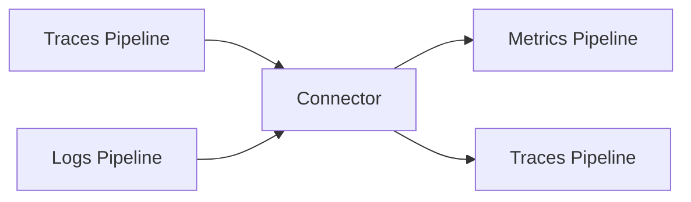

# How to Build a Custom Connector for the OpenTelemetry Collector

Author: [nawazdhandala](https://www.github.com/nawazdhandala)

Tags: OpenTelemetry, Collector, Connector, Custom Components, Go

Description: Learn how to build custom connectors for the OpenTelemetry Collector to transform and route telemetry data between pipelines with practical Go examples.

Connectors are powerful OpenTelemetry Collector components that enable you to connect pipelines together, allowing data to flow from one pipeline type to another. Unlike processors that work within a single pipeline, connectors can consume data from one or more pipelines and emit data to one or more pipelines of different types.

## Understanding Connectors

Connectors serve as both exporters and receivers simultaneously. They receive telemetry data from one pipeline, perform transformations or aggregations, and then emit the results to another pipeline. Common use cases include generating metrics from traces (like span metrics) or creating traces from logs.

The connector architecture enables sophisticated data processing workflows:



## Setting Up Your Development Environment

Before building a custom connector, set up your Go development environment with the OpenTelemetry Collector SDK.

Create a new Go module for your connector:

```bash
mkdir otel-custom-connector
cd otel-custom-connector
go mod init github.com/yourusername/otel-custom-connector
```

Install the required OpenTelemetry dependencies:

```bash
go get go.opentelemetry.io/collector/component
go get go.opentelemetry.io/collector/connector
go get go.opentelemetry.io/collector/consumer
go get go.opentelemetry.io/collector/pdata
```

## Building a Trace-to-Metrics Connector

We'll build a connector that generates latency metrics from incoming trace spans. This connector consumes traces and produces metrics based on span duration.

First, define the connector configuration structure:

```go
// config.go
package tracetometricsconnector

import (
    "go.opentelemetry.io/collector/component"
)

// Config defines the configuration for the trace-to-metrics connector
type Config struct {
    // MetricPrefix is the prefix for generated metrics
    MetricPrefix string `mapstructure:"metric_prefix"`

    // Dimensions are the span attributes to include as metric dimensions
    Dimensions []string `mapstructure:"dimensions"`

    // HistogramBuckets defines custom histogram buckets for latency
    HistogramBuckets []float64 `mapstructure:"histogram_buckets"`
}

// Validate checks if the configuration is valid
func (cfg *Config) Validate() error {
    if cfg.MetricPrefix == "" {
        cfg.MetricPrefix = "span.metrics"
    }

    if len(cfg.HistogramBuckets) == 0 {
        // Default buckets in milliseconds
        cfg.HistogramBuckets = []float64{5, 10, 25, 50, 100, 250, 500, 1000}
    }

    return nil
}
```

Next, implement the factory that creates connector instances:

```go
// factory.go
package tracetometricsconnector

import (
    "context"
    "go.opentelemetry.io/collector/component"
    "go.opentelemetry.io/collector/connector"
    "go.opentelemetry.io/collector/consumer"
)

const (
    typeStr = "tracetometrics"
    stability = component.StabilityLevelDevelopment
)

// NewFactory creates a factory for the trace-to-metrics connector
func NewFactory() connector.Factory {
    return connector.NewFactory(
        component.MustNewType(typeStr),
        createDefaultConfig,
        connector.WithTracesToMetrics(createTracesToMetrics, stability),
    )
}

// createDefaultConfig creates the default configuration
func createDefaultConfig() component.Config {
    return &Config{
        MetricPrefix: "span.metrics",
        Dimensions: []string{"service.name", "span.kind", "status.code"},
        HistogramBuckets: []float64{5, 10, 25, 50, 100, 250, 500, 1000},
    }
}

// createTracesToMetrics creates a traces-to-metrics connector
func createTracesToMetrics(
    ctx context.Context,
    set connector.Settings,
    cfg component.Config,
    nextConsumer consumer.Metrics,
) (connector.Traces, error) {
    config := cfg.(*Config)
    return newTraceToMetrics(config, set, nextConsumer), nil
}
```

Now implement the core connector logic:

```go
// connector.go
package tracetometricsconnector

import (
    "context"
    "sync"
    "time"

    "go.opentelemetry.io/collector/component"
    "go.opentelemetry.io/collector/connector"
    "go.opentelemetry.io/collector/consumer"
    "go.opentelemetry.io/collector/pdata/pcommon"
    "go.opentelemetry.io/collector/pdata/pmetric"
    "go.opentelemetry.io/collector/pdata/ptrace"
)

type traceToMetrics struct {
    config *Config
    logger component.Logger

    // metricsConsumer is the next consumer in the metrics pipeline
    metricsConsumer consumer.Metrics

    // Aggregation state
    mu sync.Mutex
    latencyHistograms map[string]*histogramData
}

type histogramData struct {
    counts []uint64
    sum    float64
    count  uint64
    attrs  pcommon.Map
}

func newTraceToMetrics(
    config *Config,
    set connector.Settings,
    nextConsumer consumer.Metrics,
) *traceToMetrics {
    return &traceToMetrics{
        config:            config,
        logger:            set.Logger,
        metricsConsumer:   nextConsumer,
        latencyHistograms: make(map[string]*histogramData),
    }
}

// Start initializes the connector
func (c *traceToMetrics) Start(ctx context.Context, host component.Host) error {
    c.logger.Info("Starting trace-to-metrics connector")
    return nil
}

// Shutdown stops the connector
func (c *traceToMetrics) Shutdown(ctx context.Context) error {
    c.logger.Info("Shutting down trace-to-metrics connector")
    return nil
}

// Capabilities returns the consumer capabilities
func (c *traceToMetrics) Capabilities() consumer.Capabilities {
    return consumer.Capabilities{MutatesData: false}
}

// ConsumeTraces processes incoming trace data and generates metrics
func (c *traceToMetrics) ConsumeTraces(ctx context.Context, td ptrace.Traces) error {
    // Process all spans and aggregate into metrics
    c.mu.Lock()
    defer c.mu.Unlock()

    resourceSpans := td.ResourceSpans()
    for i := 0; i < resourceSpans.Len(); i++ {
        rs := resourceSpans.At(i)
        resource := rs.Resource()

        scopeSpans := rs.ScopeSpans()
        for j := 0; j < scopeSpans.Len(); j++ {
            ss := scopeSpans.At(j)
            spans := ss.Spans()

            for k := 0; k < spans.Len(); k++ {
                span := spans.At(k)
                c.processSpan(span, resource.Attributes())
            }
        }
    }

    // Generate metrics from aggregated data
    metrics := c.generateMetrics()

    // Send metrics to the next consumer
    if metrics.MetricCount() > 0 {
        return c.metricsConsumer.ConsumeMetrics(ctx, metrics)
    }

    return nil
}

// processSpan extracts latency information from a span
func (c *traceToMetrics) processSpan(span ptrace.Span, resourceAttrs pcommon.Map) {
    // Calculate span duration in milliseconds
    duration := float64(span.EndTimestamp()-span.StartTimestamp()) / float64(time.Millisecond)

    // Build dimension key from configured attributes
    dimKey := c.buildDimensionKey(span, resourceAttrs)

    // Get or create histogram for these dimensions
    hist, exists := c.latencyHistograms[dimKey]
    if !exists {
        hist = &histogramData{
            counts: make([]uint64, len(c.config.HistogramBuckets)+1),
            attrs:  c.buildAttributes(span, resourceAttrs),
        }
        c.latencyHistograms[dimKey] = hist
    }

    // Update histogram
    hist.sum += duration
    hist.count++

    // Find the appropriate bucket
    bucketIdx := len(c.config.HistogramBuckets)
    for i, boundary := range c.config.HistogramBuckets {
        if duration <= boundary {
            bucketIdx = i
            break
        }
    }
    hist.counts[bucketIdx]++
}

// buildDimensionKey creates a unique key for metric dimensions
func (c *traceToMetrics) buildDimensionKey(span ptrace.Span, resourceAttrs pcommon.Map) string {
    key := ""
    for _, dim := range c.config.Dimensions {
        if val, ok := span.Attributes().Get(dim); ok {
            key += dim + "=" + val.AsString() + ","
        } else if val, ok := resourceAttrs.Get(dim); ok {
            key += dim + "=" + val.AsString() + ","
        }
    }
    return key
}

// buildAttributes creates metric attributes from span data
func (c *traceToMetrics) buildAttributes(span ptrace.Span, resourceAttrs pcommon.Map) pcommon.Map {
    attrs := pcommon.NewMap()

    for _, dim := range c.config.Dimensions {
        if val, ok := span.Attributes().Get(dim); ok {
            val.CopyTo(attrs.PutEmpty(dim))
        } else if val, ok := resourceAttrs.Get(dim); ok {
            val.CopyTo(attrs.PutEmpty(dim))
        }
    }

    return attrs
}

// generateMetrics creates pmetric.Metrics from aggregated data
func (c *traceToMetrics) generateMetrics() pmetric.Metrics {
    metrics := pmetric.NewMetrics()
    rm := metrics.ResourceMetrics().AppendEmpty()
    sm := rm.ScopeMetrics().AppendEmpty()

    for _, hist := range c.latencyHistograms {
        metric := sm.Metrics().AppendEmpty()
        metric.SetName(c.config.MetricPrefix + ".duration")
        metric.SetUnit("ms")

        histMetric := metric.SetEmptyHistogram()
        histMetric.SetAggregationTemporality(pmetric.AggregationTemporalityDelta)

        dp := histMetric.DataPoints().AppendEmpty()
        dp.SetTimestamp(pcommon.NewTimestampFromTime(time.Now()))
        dp.SetCount(hist.count)
        dp.SetSum(hist.sum)

        dp.ExplicitBounds().FromRaw(c.config.HistogramBuckets)
        dp.BucketCounts().FromRaw(hist.counts)

        hist.attrs.CopyTo(dp.Attributes())
    }

    // Clear aggregated data after generating metrics
    c.latencyHistograms = make(map[string]*histogramData)

    return metrics
}
```

## Integrating Your Connector

To use your custom connector, you need to build a custom collector distribution using the OpenTelemetry Collector Builder (ocb).

Create a builder configuration file:

```yaml
# builder-config.yaml
dist:
  name: otelcol-custom
  description: Custom OpenTelemetry Collector with trace-to-metrics connector
  output_path: ./dist

exporters:
  - gomod: go.opentelemetry.io/collector/exporter/otlpexporter v0.91.0
  - gomod: go.opentelemetry.io/collector/exporter/debugexporter v0.91.0

receivers:
  - gomod: go.opentelemetry.io/collector/receiver/otlpreceiver v0.91.0

processors:
  - gomod: go.opentelemetry.io/collector/processor/batchprocessor v0.91.0

connectors:
  # Your custom connector
  - gomod: github.com/yourusername/otel-custom-connector v1.0.0
    path: ./tracetometricsconnector
```

Build your custom collector:

```bash
# Install the builder
go install go.opentelemetry.io/collector/cmd/builder@latest

# Build the custom collector
builder --config builder-config.yaml
```

Configure your custom connector in the collector configuration:

```yaml
# collector-config.yaml
receivers:
  otlp:
    protocols:
      grpc:
        endpoint: 0.0.0.0:4317
      http:
        endpoint: 0.0.0.0:4318

connectors:
  # Your custom trace-to-metrics connector
  tracetometrics:
    metric_prefix: "service.latency"
    dimensions:
      - service.name
      - span.kind
      - status.code
      - http.method
    histogram_buckets: [10, 25, 50, 100, 250, 500, 1000, 2500, 5000]

exporters:
  debug:
    verbosity: detailed

  otlp/metrics:
    endpoint: metrics-backend:4317

processors:
  batch:
    timeout: 10s

service:
  pipelines:
    # Traces pipeline that feeds the connector
    traces:
      receivers: [otlp]
      processors: [batch]
      exporters: [tracetometrics]

    # Metrics pipeline that receives from the connector
    metrics:
      receivers: [tracetometrics]
      processors: [batch]
      exporters: [otlp/metrics, debug]
```

## Testing Your Connector

Create unit tests to verify your connector's behavior:

```go
// connector_test.go
package tracetometricsconnector

import (
    "context"
    "testing"
    "time"

    "github.com/stretchr/testify/assert"
    "github.com/stretchr/testify/require"
    "go.opentelemetry.io/collector/component/componenttest"
    "go.opentelemetry.io/collector/connector/connectortest"
    "go.opentelemetry.io/collector/consumer/consumertest"
    "go.opentelemetry.io/collector/pdata/pcommon"
    "go.opentelemetry.io/collector/pdata/ptrace"
)

func TestTraceToMetrics(t *testing.T) {
    factory := NewFactory()
    cfg := factory.CreateDefaultConfig().(*Config)

    sink := &consumertest.MetricsSink{}

    connector, err := factory.CreateTracesToMetrics(
        context.Background(),
        connectortest.NewNopSettings(),
        cfg,
        sink,
    )
    require.NoError(t, err)
    require.NotNil(t, connector)

    err = connector.Start(context.Background(), componenttest.NewNopHost())
    require.NoError(t, err)

    // Create test trace data
    traces := ptrace.NewTraces()
    rs := traces.ResourceSpans().AppendEmpty()
    rs.Resource().Attributes().PutStr("service.name", "test-service")

    ss := rs.ScopeSpans().AppendEmpty()
    span := ss.Spans().AppendEmpty()
    span.SetName("test-span")
    span.SetStartTimestamp(pcommon.NewTimestampFromTime(time.Now()))
    span.SetEndTimestamp(pcommon.NewTimestampFromTime(time.Now().Add(100 * time.Millisecond)))
    span.Attributes().PutStr("span.kind", "server")

    // Consume traces
    err = connector.ConsumeTraces(context.Background(), traces)
    require.NoError(t, err)

    // Verify metrics were generated
    assert.Eventually(t, func() bool {
        return sink.MetricCount() > 0
    }, 5*time.Second, 100*time.Millisecond)

    metrics := sink.AllMetrics()[0]
    assert.Equal(t, 1, metrics.MetricCount())

    err = connector.Shutdown(context.Background())
    require.NoError(t, err)
}
```

## Best Practices

When building custom connectors, follow these best practices:

**Handle Backpressure**: Implement proper buffering and backpressure handling to prevent memory issues when downstream consumers are slow.

**Thread Safety**: Use mutexes or channels to ensure thread-safe access to shared state, as connectors can be called concurrently.

**Memory Management**: Clear aggregated data periodically to prevent memory leaks, especially in long-running deployments.

**Configuration Validation**: Always validate configuration parameters in the `Validate()` method to catch errors early.

**Observability**: Add metrics and logs to your connector to monitor its performance and behavior in production.

For more advanced connector patterns, check out the [OpenTelemetry Collector Connector documentation](https://opentelemetry.io/docs/collector/configuration/#connectors) and explore related topics like [environment variables in collector configuration](https://oneuptime.com/blog/post/2026-02-06-environment-variables-opentelemetry-collector-configuration/view).

## Conclusion

Building custom connectors extends the OpenTelemetry Collector's capabilities to meet specific observability needs. By following the patterns shown here, you can create connectors that transform trace data into metrics, aggregate logs into traces, or implement any custom data transformation pipeline. The connector architecture provides a clean separation between pipeline stages while maintaining high performance and reliability.
