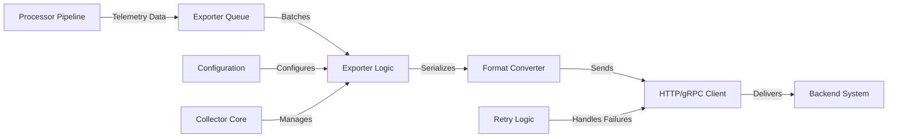

# How to Build a Custom Exporter for the OpenTelemetry Collector

Author: [nawazdhandala](https://www.github.com/nawazdhandala)

Tags: OpenTelemetry, Collector, Custom Exporter, Go Development, Data Export, Observability

Description: A comprehensive guide to building custom OpenTelemetry Collector exporters in Go to send telemetry data to any backend system or storage service.

Custom exporters enable the OpenTelemetry Collector to send telemetry data to destinations not supported by existing exporters. Whether you need to integrate with proprietary monitoring platforms, custom databases, or legacy systems, building a custom exporter provides the flexibility to route telemetry data anywhere.

## Understanding Exporter Architecture

Exporters are the final stage in the Collector pipeline, responsible for sending processed telemetry data to backend systems. They receive data from processors and handle:

- Data serialization and formatting
- Network communication and retries
- Authentication and authorization
- Batch management and buffering
- Error handling and recovery

Exporters implement the consumer interface, receiving telemetry data from the pipeline and forwarding it to external systems.

## Exporter Component Architecture



## Project Setup

Create a new Go module for your custom exporter.

```bash
# Create project directory
mkdir custom-exporter
cd custom-exporter

# Initialize Go module
go mod init github.com/yourorg/customexporter

# Install required dependencies
go get go.opentelemetry.io/collector/component
go get go.opentelemetry.io/collector/consumer
go get go.opentelemetry.io/collector/exporter
go get go.opentelemetry.io/collector/exporter/exporterhelper
go get go.opentelemetry.io/collector/pdata
go get go.uber.org/zap
```

## Define the Configuration Structure

Create a configuration struct that defines exporter settings.

```go
// config.go
package customexporter

import (
	"errors"
	"time"

	"go.opentelemetry.io/collector/component"
	"go.opentelemetry.io/collector/config/confighttp"
	"go.opentelemetry.io/collector/config/configretry"
	"go.opentelemetry.io/collector/exporter/exporterhelper"
)

// Config defines the configuration for the custom exporter
type Config struct {
	// HTTPClientSettings embeds common HTTP client configuration
	confighttp.HTTPClientSettings `mapstructure:",squash"`

	// BackoffConfig defines retry backoff configuration
	configretry.BackOffConfig `mapstructure:"retry_on_failure"`

	// QueueSettings configures the exporter queue
	exporterhelper.QueueSettings `mapstructure:"sending_queue"`

	// TimeoutSettings configures timeout behavior
	exporterhelper.TimeoutSettings `mapstructure:",squash"`

	// Endpoint specifies the backend API endpoint
	Endpoint string `mapstructure:"endpoint"`

	// APIKey for authentication with the backend
	APIKey string `mapstructure:"api_key"`

	// Format specifies the output format (json, protobuf, etc.)
	Format string `mapstructure:"format"`

	// CompressionType defines the compression algorithm
	CompressionType string `mapstructure:"compression"`

	// MaxBatchSize limits the number of items per batch
	MaxBatchSize int `mapstructure:"max_batch_size"`

	// FlushInterval defines how often to flush batches
	FlushInterval time.Duration `mapstructure:"flush_interval"`

	// CustomHeaders are additional HTTP headers to send
	CustomHeaders map[string]string `mapstructure:"headers"`
}

// Validate checks if the configuration is valid
func (cfg *Config) Validate() error {
	if cfg.Endpoint == "" {
		return errors.New("endpoint must be specified")
	}

	if cfg.Format != "json" && cfg.Format != "protobuf" {
		return errors.New("format must be 'json' or 'protobuf'")
	}

	if cfg.MaxBatchSize <= 0 {
		return errors.New("max_batch_size must be positive")
	}

	if cfg.FlushInterval <= 0 {
		return errors.New("flush_interval must be positive")
	}

	return nil
}

// defaultConfig returns default configuration values
func defaultConfig() component.Config {
	return &Config{
		HTTPClientSettings: confighttp.HTTPClientSettings{
			Endpoint: "http://localhost:8080",
			Timeout:  30 * time.Second,
		},
		BackOffConfig: configretry.NewDefaultBackOffConfig(),
		QueueSettings: exporterhelper.NewDefaultQueueSettings(),
		TimeoutSettings: exporterhelper.TimeoutSettings{
			Timeout: 30 * time.Second,
		},
		Format:          "json",
		CompressionType: "gzip",
		MaxBatchSize:    100,
		FlushInterval:   10 * time.Second,
		CustomHeaders:   map[string]string{},
	}
}
```

## Create the Exporter Factory

The factory creates exporter instances and provides metadata about the component.

```go
// factory.go
package customexporter

import (
	"context"
	"fmt"

	"go.opentelemetry.io/collector/component"
	"go.opentelemetry.io/collector/consumer"
	"go.opentelemetry.io/collector/exporter"
	"go.opentelemetry.io/collector/exporter/exporterhelper"
)

const (
	// typeStr is the name used in the Collector configuration
	typeStr = "custom"

	// stability level of the exporter
	stability = component.StabilityLevelAlpha
)

// NewFactory creates a factory for the custom exporter
func NewFactory() exporter.Factory {
	return exporter.NewFactory(
		typeStr,
		defaultConfig,
		exporter.WithTraces(createTracesExporter, stability),
		exporter.WithMetrics(createMetricsExporter, stability),
		exporter.WithLogs(createLogsExporter, stability),
	)
}

// createTracesExporter creates a traces exporter based on the configuration
func createTracesExporter(
	ctx context.Context,
	params exporter.CreateSettings,
	cfg component.Config,
) (exporter.Traces, error) {
	exporterCfg, ok := cfg.(*Config)
	if !ok {
		return nil, fmt.Errorf("invalid config type: %T", cfg)
	}

	// Create the base exporter
	baseExporter, err := newExporter(exporterCfg, params)
	if err != nil {
		return nil, err
	}

	// Wrap with exporterhelper for queue, retry, and timeout support
	return exporterhelper.NewTracesExporter(
		ctx,
		params,
		cfg,
		baseExporter.pushTraces,
		exporterhelper.WithStart(baseExporter.start),
		exporterhelper.WithShutdown(baseExporter.shutdown),
		exporterhelper.WithTimeout(exporterCfg.TimeoutSettings),
		exporterhelper.WithRetry(exporterCfg.BackOffConfig),
		exporterhelper.WithQueue(exporterCfg.QueueSettings),
	)
}

// createMetricsExporter creates a metrics exporter based on the configuration
func createMetricsExporter(
	ctx context.Context,
	params exporter.CreateSettings,
	cfg component.Config,
) (exporter.Metrics, error) {
	exporterCfg, ok := cfg.(*Config)
	if !ok {
		return nil, fmt.Errorf("invalid config type: %T", cfg)
	}

	baseExporter, err := newExporter(exporterCfg, params)
	if err != nil {
		return nil, err
	}

	return exporterhelper.NewMetricsExporter(
		ctx,
		params,
		cfg,
		baseExporter.pushMetrics,
		exporterhelper.WithStart(baseExporter.start),
		exporterhelper.WithShutdown(baseExporter.shutdown),
		exporterhelper.WithTimeout(exporterCfg.TimeoutSettings),
		exporterhelper.WithRetry(exporterCfg.BackOffConfig),
		exporterhelper.WithQueue(exporterCfg.QueueSettings),
	)
}

// createLogsExporter creates a logs exporter based on the configuration
func createLogsExporter(
	ctx context.Context,
	params exporter.CreateSettings,
	cfg component.Config,
) (exporter.Logs, error) {
	exporterCfg, ok := cfg.(*Config)
	if !ok {
		return nil, fmt.Errorf("invalid config type: %T", cfg)
	}

	baseExporter, err := newExporter(exporterCfg, params)
	if err != nil {
		return nil, err
	}

	return exporterhelper.NewLogsExporter(
		ctx,
		params,
		cfg,
		baseExporter.pushLogs,
		exporterhelper.WithStart(baseExporter.start),
		exporterhelper.WithShutdown(baseExporter.shutdown),
		exporterhelper.WithTimeout(exporterCfg.TimeoutSettings),
		exporterhelper.WithRetry(exporterCfg.BackOffConfig),
		exporterhelper.WithQueue(exporterCfg.QueueSettings),
	)
}
```

## Implement the Base Exporter

Create the core exporter implementation.

```go
// exporter.go
package customexporter

import (
	"bytes"
	"compress/gzip"
	"context"
	"encoding/json"
	"fmt"
	"io"
	"net/http"

	"go.opentelemetry.io/collector/exporter"
	"go.opentelemetry.io/collector/pdata/plog"
	"go.opentelemetry.io/collector/pdata/pmetric"
	"go.opentelemetry.io/collector/pdata/ptrace"
	"go.uber.org/zap"
)

// customExporter implements the core exporter functionality
type customExporter struct {
	config   *Config
	settings exporter.CreateSettings
	client   *http.Client
}

// newExporter creates a new exporter instance
func newExporter(config *Config, settings exporter.CreateSettings) (*customExporter, error) {
	// Create HTTP client with configured settings
	client, err := config.HTTPClientSettings.ToClient(nil, settings.TelemetrySettings)
	if err != nil {
		return nil, fmt.Errorf("failed to create HTTP client: %w", err)
	}

	return &customExporter{
		config:   config,
		settings: settings,
		client:   client,
	}, nil
}

// start initializes the exporter
func (e *customExporter) start(ctx context.Context, host component.Host) error {
	e.settings.Logger.Info("Custom exporter started",
		zap.String("endpoint", e.config.Endpoint),
		zap.String("format", e.config.Format),
	)
	return nil
}

// shutdown cleans up resources
func (e *customExporter) shutdown(ctx context.Context) error {
	e.settings.Logger.Info("Custom exporter stopped")
	return nil
}

// pushTraces sends trace data to the backend
func (e *customExporter) pushTraces(ctx context.Context, td ptrace.Traces) error {
	// Convert traces to the target format
	payload, err := e.marshalTraces(td)
	if err != nil {
		return fmt.Errorf("failed to marshal traces: %w", err)
	}

	// Send to backend
	return e.sendData(ctx, payload, "traces")
}

// pushMetrics sends metric data to the backend
func (e *customExporter) pushMetrics(ctx context.Context, md pmetric.Metrics) error {
	// Convert metrics to the target format
	payload, err := e.marshalMetrics(md)
	if err != nil {
		return fmt.Errorf("failed to marshal metrics: %w", err)
	}

	// Send to backend
	return e.sendData(ctx, payload, "metrics")
}

// pushLogs sends log data to the backend
func (e *customExporter) pushLogs(ctx context.Context, ld plog.Logs) error {
	// Convert logs to the target format
	payload, err := e.marshalLogs(ld)
	if err != nil {
		return fmt.Errorf("failed to marshal logs: %w", err)
	}

	// Send to backend
	return e.sendData(ctx, payload, "logs")
}

// marshalTraces converts traces to the configured format
func (e *customExporter) marshalTraces(td ptrace.Traces) ([]byte, error) {
	switch e.config.Format {
	case "json":
		return e.tracesToJSON(td)
	case "protobuf":
		return e.tracesToProtobuf(td)
	default:
		return nil, fmt.Errorf("unsupported format: %s", e.config.Format)
	}
}

// tracesToJSON converts traces to JSON format
func (e *customExporter) tracesToJSON(td ptrace.Traces) ([]byte, error) {
	// Convert pdata traces to a simplified JSON structure
	traces := make([]map[string]interface{}, 0)

	resourceSpans := td.ResourceSpans()
	for i := 0; i < resourceSpans.Len(); i++ {
		rs := resourceSpans.At(i)
		resource := e.attributesToMap(rs.Resource().Attributes())

		scopeSpans := rs.ScopeSpans()
		for j := 0; j < scopeSpans.Len(); j++ {
			ss := scopeSpans.At(j)

			spans := ss.Spans()
			for k := 0; k < spans.Len(); k++ {
				span := spans.At(k)

				traceData := map[string]interface{}{
					"trace_id":       span.TraceID().String(),
					"span_id":        span.SpanID().String(),
					"parent_span_id": span.ParentSpanID().String(),
					"name":           span.Name(),
					"kind":           span.Kind().String(),
					"start_time":     span.StartTimestamp().AsTime().Unix(),
					"end_time":       span.EndTimestamp().AsTime().Unix(),
					"attributes":     e.attributesToMap(span.Attributes()),
					"resource":       resource,
					"status": map[string]interface{}{
						"code":    span.Status().Code().String(),
						"message": span.Status().Message(),
					},
				}

				// Add events
				events := make([]map[string]interface{}, 0)
				spanEvents := span.Events()
				for l := 0; l < spanEvents.Len(); l++ {
					event := spanEvents.At(l)
					events = append(events, map[string]interface{}{
						"name":       event.Name(),
						"timestamp":  event.Timestamp().AsTime().Unix(),
						"attributes": e.attributesToMap(event.Attributes()),
					})
				}
				traceData["events"] = events

				traces = append(traces, traceData)
			}
		}
	}

	return json.Marshal(map[string]interface{}{
		"traces": traces,
	})
}

// tracesToProtobuf converts traces to protobuf format
func (e *customExporter) tracesToProtobuf(td ptrace.Traces) ([]byte, error) {
	// Use the native protobuf marshaler
	marshaler := ptrace.ProtoMarshaler{}
	return marshaler.MarshalTraces(td)
}

// marshalMetrics converts metrics to the configured format
func (e *customExporter) marshalMetrics(md pmetric.Metrics) ([]byte, error) {
	switch e.config.Format {
	case "json":
		return e.metricsToJSON(md)
	case "protobuf":
		return e.metricsToProtobuf(md)
	default:
		return nil, fmt.Errorf("unsupported format: %s", e.config.Format)
	}
}

// metricsToJSON converts metrics to JSON format
func (e *customExporter) metricsToJSON(md pmetric.Metrics) ([]byte, error) {
	metrics := make([]map[string]interface{}, 0)

	resourceMetrics := md.ResourceMetrics()
	for i := 0; i < resourceMetrics.Len(); i++ {
		rm := resourceMetrics.At(i)
		resource := e.attributesToMap(rm.Resource().Attributes())

		scopeMetrics := rm.ScopeMetrics()
		for j := 0; j < scopeMetrics.Len(); j++ {
			sm := scopeMetrics.At(j)

			metricSlice := sm.Metrics()
			for k := 0; k < metricSlice.Len(); k++ {
				metric := metricSlice.At(k)

				metricData := map[string]interface{}{
					"name":        metric.Name(),
					"description": metric.Description(),
					"unit":        metric.Unit(),
					"type":        metric.Type().String(),
					"resource":    resource,
				}

				// Extract data points based on metric type
				switch metric.Type() {
				case pmetric.MetricTypeGauge:
					metricData["data_points"] = e.extractGaugeDataPoints(metric.Gauge())
				case pmetric.MetricTypeSum:
					metricData["data_points"] = e.extractSumDataPoints(metric.Sum())
				case pmetric.MetricTypeHistogram:
					metricData["data_points"] = e.extractHistogramDataPoints(metric.Histogram())
				}

				metrics = append(metrics, metricData)
			}
		}
	}

	return json.Marshal(map[string]interface{}{
		"metrics": metrics,
	})
}

// extractGaugeDataPoints extracts data points from a gauge metric
func (e *customExporter) extractGaugeDataPoints(gauge pmetric.Gauge) []map[string]interface{} {
	dataPoints := make([]map[string]interface{}, 0)
	dps := gauge.DataPoints()

	for i := 0; i < dps.Len(); i++ {
		dp := dps.At(i)
		dataPoints = append(dataPoints, map[string]interface{}{
			"timestamp":  dp.Timestamp().AsTime().Unix(),
			"value":      e.numberDataPointValue(dp),
			"attributes": e.attributesToMap(dp.Attributes()),
		})
	}

	return dataPoints
}

// extractSumDataPoints extracts data points from a sum metric
func (e *customExporter) extractSumDataPoints(sum pmetric.Sum) []map[string]interface{} {
	dataPoints := make([]map[string]interface{}, 0)
	dps := sum.DataPoints()

	for i := 0; i < dps.Len(); i++ {
		dp := dps.At(i)
		dataPoints = append(dataPoints, map[string]interface{}{
			"timestamp":  dp.Timestamp().AsTime().Unix(),
			"value":      e.numberDataPointValue(dp),
			"attributes": e.attributesToMap(dp.Attributes()),
		})
	}

	return dataPoints
}

// extractHistogramDataPoints extracts data points from a histogram metric
func (e *customExporter) extractHistogramDataPoints(histogram pmetric.Histogram) []map[string]interface{} {
	dataPoints := make([]map[string]interface{}, 0)
	dps := histogram.DataPoints()

	for i := 0; i < dps.Len(); i++ {
		dp := dps.At(i)

		buckets := make([]map[string]interface{}, 0)
		for j := 0; j < dp.BucketCounts().Len(); j++ {
			bucket := map[string]interface{}{
				"count": dp.BucketCounts().At(j),
			}
			if j < dp.ExplicitBounds().Len() {
				bucket["upper_bound"] = dp.ExplicitBounds().At(j)
			}
			buckets = append(buckets, bucket)
		}

		dataPoints = append(dataPoints, map[string]interface{}{
			"timestamp":  dp.Timestamp().AsTime().Unix(),
			"count":      dp.Count(),
			"sum":        dp.Sum(),
			"buckets":    buckets,
			"attributes": e.attributesToMap(dp.Attributes()),
		})
	}

	return dataPoints
}

// numberDataPointValue extracts the value from a number data point
func (e *customExporter) numberDataPointValue(dp pmetric.NumberDataPoint) interface{} {
	switch dp.ValueType() {
	case pmetric.NumberDataPointValueTypeInt:
		return dp.IntValue()
	case pmetric.NumberDataPointValueTypeDouble:
		return dp.DoubleValue()
	default:
		return nil
	}
}

// metricsToProtobuf converts metrics to protobuf format
func (e *customExporter) metricsToProtobuf(md pmetric.Metrics) ([]byte, error) {
	marshaler := pmetric.ProtoMarshaler{}
	return marshaler.MarshalMetrics(md)
}

// marshalLogs converts logs to the configured format
func (e *customExporter) marshalLogs(ld plog.Logs) ([]byte, error) {
	switch e.config.Format {
	case "json":
		return e.logsToJSON(ld)
	case "protobuf":
		return e.logsToProtobuf(ld)
	default:
		return nil, fmt.Errorf("unsupported format: %s", e.config.Format)
	}
}

// logsToJSON converts logs to JSON format
func (e *customExporter) logsToJSON(ld plog.Logs) ([]byte, error) {
	logs := make([]map[string]interface{}, 0)

	resourceLogs := ld.ResourceLogs()
	for i := 0; i < resourceLogs.Len(); i++ {
		rl := resourceLogs.At(i)
		resource := e.attributesToMap(rl.Resource().Attributes())

		scopeLogs := rl.ScopeLogs()
		for j := 0; j < scopeLogs.Len(); j++ {
			sl := scopeLogs.At(j)

			logRecords := sl.LogRecords()
			for k := 0; k < logRecords.Len(); k++ {
				lr := logRecords.At(k)

				logData := map[string]interface{}{
					"timestamp":         lr.Timestamp().AsTime().Unix(),
					"observed_timestamp": lr.ObservedTimestamp().AsTime().Unix(),
					"severity_number":   lr.SeverityNumber().String(),
					"severity_text":     lr.SeverityText(),
					"body":              e.valueToInterface(lr.Body()),
					"attributes":        e.attributesToMap(lr.Attributes()),
					"resource":          resource,
					"trace_id":          lr.TraceID().String(),
					"span_id":           lr.SpanID().String(),
				}

				logs = append(logs, logData)
			}
		}
	}

	return json.Marshal(map[string]interface{}{
		"logs": logs,
	})
}

// logsToProtobuf converts logs to protobuf format
func (e *customExporter) logsToProtobuf(ld plog.Logs) ([]byte, error) {
	marshaler := plog.ProtoMarshaler{}
	return marshaler.MarshalLogs(ld)
}

// attributesToMap converts pcommon.Map to a regular map
func (e *customExporter) attributesToMap(attrs pcommon.Map) map[string]interface{} {
	result := make(map[string]interface{})
	attrs.Range(func(k string, v pcommon.Value) bool {
		result[k] = e.valueToInterface(v)
		return true
	})
	return result
}

// valueToInterface converts pcommon.Value to interface{}
func (e *customExporter) valueToInterface(v pcommon.Value) interface{} {
	switch v.Type() {
	case pcommon.ValueTypeStr:
		return v.Str()
	case pcommon.ValueTypeInt:
		return v.Int()
	case pcommon.ValueTypeDouble:
		return v.Double()
	case pcommon.ValueTypeBool:
		return v.Bool()
	case pcommon.ValueTypeMap:
		return e.attributesToMap(v.Map())
	case pcommon.ValueTypeSlice:
		slice := v.Slice()
		result := make([]interface{}, 0, slice.Len())
		for i := 0; i < slice.Len(); i++ {
			result = append(result, e.valueToInterface(slice.At(i)))
		}
		return result
	case pcommon.ValueTypeBytes:
		return v.Bytes().AsRaw()
	default:
		return nil
	}
}

// sendData sends payload to the backend via HTTP
func (e *customExporter) sendData(ctx context.Context, payload []byte, dataType string) error {
	// Compress if configured
	if e.config.CompressionType == "gzip" {
		compressed, err := e.compress(payload)
		if err != nil {
			return fmt.Errorf("failed to compress data: %w", err)
		}
		payload = compressed
	}

	// Build request URL
	url := fmt.Sprintf("%s/%s", e.config.Endpoint, dataType)

	// Create HTTP request
	req, err := http.NewRequestWithContext(ctx, http.MethodPost, url, bytes.NewReader(payload))
	if err != nil {
		return fmt.Errorf("failed to create request: %w", err)
	}

	// Set headers
	req.Header.Set("Content-Type", "application/json")
	if e.config.CompressionType == "gzip" {
		req.Header.Set("Content-Encoding", "gzip")
	}
	if e.config.APIKey != "" {
		req.Header.Set("Authorization", "Bearer "+e.config.APIKey)
	}

	// Add custom headers
	for key, value := range e.config.CustomHeaders {
		req.Header.Set(key, value)
	}

	// Send request
	resp, err := e.client.Do(req)
	if err != nil {
		return fmt.Errorf("failed to send request: %w", err)
	}
	defer resp.Body.Close()

	// Check response status
	if resp.StatusCode < 200 || resp.StatusCode >= 300 {
		body, _ := io.ReadAll(resp.Body)
		return fmt.Errorf("backend returned error status %d: %s", resp.StatusCode, string(body))
	}

	e.settings.Logger.Debug("Data sent successfully",
		zap.String("type", dataType),
		zap.Int("bytes", len(payload)),
		zap.Int("status", resp.StatusCode),
	)

	return nil
}

// compress compresses data using gzip
func (e *customExporter) compress(data []byte) ([]byte, error) {
	var buf bytes.Buffer
	writer := gzip.NewWriter(&buf)

	if _, err := writer.Write(data); err != nil {
		return nil, err
	}

	if err := writer.Close(); err != nil {
		return nil, err
	}

	return buf.Bytes(), nil
}
```

## Write Unit Tests

Create comprehensive tests for your exporter.

```go
// exporter_test.go
package customexporter

import (
	"context"
	"io"
	"net/http"
	"net/http/httptest"
	"testing"
	"time"

	"github.com/stretchr/testify/assert"
	"github.com/stretchr/testify/require"
	"go.opentelemetry.io/collector/component/componenttest"
	"go.opentelemetry.io/collector/config/confighttp"
	"go.opentelemetry.io/collector/exporter/exportertest"
	"go.opentelemetry.io/collector/pdata/pcommon"
	"go.opentelemetry.io/collector/pdata/ptrace"
)

func TestTracesExporter(t *testing.T) {
	// Create a test HTTP server
	var receivedData []byte
	server := httptest.NewServer(http.HandlerFunc(func(w http.ResponseWriter, r *http.Request) {
		var err error
		receivedData, err = io.ReadAll(r.Body)
		require.NoError(t, err)
		w.WriteHeader(http.StatusOK)
	}))
	defer server.Close()

	// Create exporter configuration
	cfg := &Config{
		HTTPClientSettings: confighttp.HTTPClientSettings{
			Endpoint: server.URL,
			Timeout:  5 * time.Second,
		},
		Format:        "json",
		MaxBatchSize:  100,
		FlushInterval: 1 * time.Second,
	}

	// Create the exporter
	factory := NewFactory()
	exporter, err := factory.CreateTracesExporter(
		context.Background(),
		exportertest.NewNopCreateSettings(),
		cfg,
	)
	require.NoError(t, err)

	// Start the exporter
	err = exporter.Start(context.Background(), componenttest.NewNopHost())
	require.NoError(t, err)

	// Create test trace data
	traces := ptrace.NewTraces()
	resourceSpan := traces.ResourceSpans().AppendEmpty()
	scopeSpan := resourceSpan.ScopeSpans().AppendEmpty()
	span := scopeSpan.Spans().AppendEmpty()
	span.SetName("test-span")
	span.SetStartTimestamp(pcommon.NewTimestampFromTime(time.Now()))
	span.SetEndTimestamp(pcommon.NewTimestampFromTime(time.Now().Add(100 * time.Millisecond)))

	// Export traces
	err = exporter.ConsumeTraces(context.Background(), traces)
	require.NoError(t, err)

	// Verify data was received
	assert.NotEmpty(t, receivedData)

	// Shutdown the exporter
	err = exporter.Shutdown(context.Background())
	require.NoError(t, err)
}

func TestConfigValidation(t *testing.T) {
	tests := []struct {
		name    string
		config  Config
		wantErr bool
	}{
		{
			name: "valid config",
			config: Config{
				Endpoint:      "http://localhost:8080",
				Format:        "json",
				MaxBatchSize:  100,
				FlushInterval: 10 * time.Second,
			},
			wantErr: false,
		},
		{
			name: "missing endpoint",
			config: Config{
				Format:        "json",
				MaxBatchSize:  100,
				FlushInterval: 10 * time.Second,
			},
			wantErr: true,
		},
		{
			name: "invalid format",
			config: Config{
				Endpoint:      "http://localhost:8080",
				Format:        "xml",
				MaxBatchSize:  100,
				FlushInterval: 10 * time.Second,
			},
			wantErr: true,
		},
	}

	for _, tt := range tests {
		t.Run(tt.name, func(t *testing.T) {
			err := tt.config.Validate()
			if tt.wantErr {
				assert.Error(t, err)
			} else {
				assert.NoError(t, err)
			}
		})
	}
}
```

## Build and Test the Exporter

Build your exporter module and run tests.

```bash
# Download dependencies
go mod tidy

# Run tests
go test -v ./...

# Run tests with coverage
go test -v -coverprofile=coverage.out ./...
go tool cover -html=coverage.out

# Build the module
go build ./...
```

## Integrate with the Collector

Create a custom Collector distribution that includes your exporter using OCB.

```yaml
# builder-config.yaml

dist:
  name: otelcol-custom
  description: Collector with custom exporter
  output_path: ./dist
  otelcol_version: 0.95.0

receivers:
  - gomod: go.opentelemetry.io/collector/receiver/otlpreceiver v0.95.0

processors:
  - gomod: go.opentelemetry.io/collector/processor/batchprocessor v0.95.0

exporters:
  # Include your custom exporter
  - gomod: github.com/yourorg/customexporter v1.0.0
    path: ../customexporter

  # Include standard exporters
  - gomod: go.opentelemetry.io/collector/exporter/loggingexporter v0.95.0
```

For details on building custom distributions, see https://oneuptime.com/blog/post/build-custom-opentelemetry-collector-distribution-ocb/view.

## Configure the Collector

Create a Collector configuration that uses your custom exporter.

```yaml
# config.yaml

receivers:
  otlp:
    protocols:
      grpc:
        endpoint: 0.0.0.0:4317

processors:
  batch:
    timeout: 10s
    send_batch_size: 100

exporters:
  # Configure your custom exporter
  custom:
    endpoint: https://api.backend.com/v1
    api_key: your-api-key-here
    format: json
    compression: gzip
    max_batch_size: 100
    flush_interval: 10s
    headers:
      X-Custom-Header: value
    timeout: 30s
    retry_on_failure:
      enabled: true
      initial_interval: 5s
      max_interval: 30s
      max_elapsed_time: 300s
    sending_queue:
      enabled: true
      num_consumers: 10
      queue_size: 5000

service:
  pipelines:
    traces:
      receivers: [otlp]
      processors: [batch]
      exporters: [custom]

    metrics:
      receivers: [otlp]
      processors: [batch]
      exporters: [custom]

    logs:
      receivers: [otlp]
      processors: [batch]
      exporters: [custom]
```

## Advanced Features

### Implement Persistent Queue

Add disk-based queueing for reliability.

```go
import (
	"go.opentelemetry.io/collector/exporter/exporterhelper"
)

func createTracesExporter(
	ctx context.Context,
	params exporter.CreateSettings,
	cfg component.Config,
) (exporter.Traces, error) {
	exporterCfg := cfg.(*Config)
	baseExporter, _ := newExporter(exporterCfg, params)

	// Configure persistent queue
	queueSettings := exporterhelper.QueueSettings{
		Enabled:      true,
		NumConsumers: 10,
		QueueSize:    5000,
		StorageID:    component.NewID("file_storage"),
	}

	return exporterhelper.NewTracesExporter(
		ctx,
		params,
		cfg,
		baseExporter.pushTraces,
		exporterhelper.WithQueue(queueSettings),
	)
}
```

### Add Metrics Tracking

Export performance metrics for the exporter.

```go
import (
	"go.opentelemetry.io/otel/metric"
)

type instrumentedExporter struct {
	*customExporter
	exportedCounter  metric.Int64Counter
	failedCounter    metric.Int64Counter
	exportDuration   metric.Float64Histogram
}

func (e *instrumentedExporter) pushTraces(ctx context.Context, td ptrace.Traces) error {
	start := time.Now()

	err := e.customExporter.pushTraces(ctx, td)

	duration := time.Since(start).Seconds()
	e.exportDuration.Record(ctx, duration)

	if err != nil {
		e.failedCounter.Add(ctx, 1)
		return err
	}

	e.exportedCounter.Add(ctx, int64(td.SpanCount()))
	return nil
}
```

## Best Practices

When building custom exporters:

1. **Use exporterhelper** for built-in retry, queue, and timeout handling
2. **Validate configuration** early to catch errors before runtime
3. **Implement efficient serialization** to minimize CPU usage
4. **Handle backpressure** gracefully with queuing
5. **Add comprehensive tests** including error scenarios
6. **Document authentication methods** and configuration options
7. **Use structured logging** for debugging
8. **Implement health checks** for monitoring
9. **Support compression** to reduce network bandwidth
10. **Follow semantic versioning** for your exporter module

## Troubleshooting

### Exporter Not Sending Data

Check that:
- The endpoint is reachable
- Authentication credentials are correct
- The exporter is included in the service pipeline
- Network connectivity is available

### High Memory Usage

Optimize by:
- Enabling queuing with size limits
- Reducing batch sizes
- Implementing streaming serialization
- Monitoring queue depth

### Data Loss

Investigate:
- Retry configuration
- Queue settings
- Backend availability
- Error logs

## Conclusion

Building custom exporters for the OpenTelemetry Collector enables you to send telemetry data to any backend system or storage service. By implementing the exporter interface and using the exporterhelper utilities, you can create production-ready exporters with built-in retry logic, queueing, and timeout handling. Combined with custom receivers, processors, and extensions, custom exporters complete your telemetry pipeline customization.

For related topics, see:
- https://oneuptime.com/blog/post/build-custom-receiver-opentelemetry-collector/view
- https://oneuptime.com/blog/post/build-custom-processor-opentelemetry-collector/view
- https://oneuptime.com/blog/post/build-custom-extension-opentelemetry-collector/view
