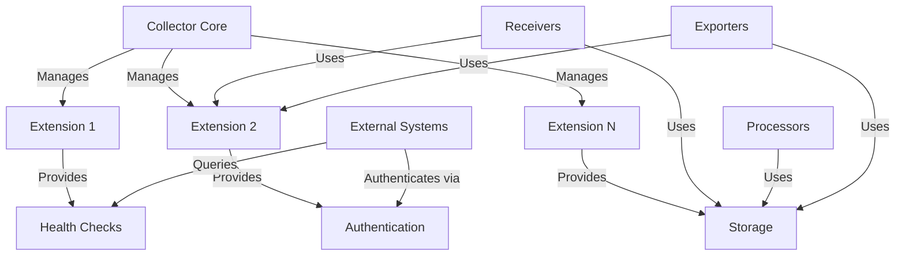

# How to Build a Custom Extension for the OpenTelemetry Collector

Author: [nawazdhandala](https://www.github.com/nawazdhandala)

Tags: OpenTelemetry, Collector, Custom Extension, Go Development, Infrastructure, Observability

Description: Learn how to build custom OpenTelemetry Collector extensions in Go to add auxiliary capabilities like health checks, authentication, and service discovery.

Custom extensions enable you to add auxiliary capabilities to the OpenTelemetry Collector that don't directly process telemetry data. Extensions provide infrastructure functionality like health checks, service discovery, authentication, persistent storage, and management interfaces. They enhance the Collector's operational capabilities without interfering with the telemetry pipeline.

## Understanding Extension Architecture

Extensions operate independently from the telemetry pipeline, providing supporting services that enhance the Collector's functionality. Unlike receivers, processors, and exporters that handle telemetry data, extensions provide:

- Health and readiness endpoints for orchestration platforms
- Authentication and authorization mechanisms
- Service discovery and dynamic configuration
- Persistent storage for component state
- Performance profiling and diagnostics
- Custom management APIs

Extensions start before the telemetry pipeline and shutdown after it, ensuring supporting services are available throughout the Collector's lifecycle.

## Extension Component Architecture



## Project Setup

Create a new Go module for your custom extension.

```bash
# Create project directory
mkdir custom-extension
cd custom-extension

# Initialize Go module
go mod init github.com/yourorg/customextension

# Install required dependencies
go get go.opentelemetry.io/collector/component
go get go.opentelemetry.io/collector/extension
go get go.opentelemetry.io/collector/config/confighttp
go get go.uber.org/zap
```

## Define the Configuration Structure

Create a configuration struct that defines extension settings.

```go
// config.go
package customextension

import (
	"errors"
	"time"

	"go.opentelemetry.io/collector/component"
	"go.opentelemetry.io/collector/config/confighttp"
)

// Config defines the configuration for the custom extension
type Config struct {
	// HTTPServerSettings embeds common HTTP server configuration
	confighttp.HTTPServerSettings `mapstructure:",squash"`

	// EnableHealthCheck enables the health check endpoint
	EnableHealthCheck bool `mapstructure:"enable_health_check"`

	// HealthCheckPath specifies the health check endpoint path
	HealthCheckPath string `mapstructure:"health_check_path"`

	// EnableMetrics enables the metrics endpoint
	EnableMetrics bool `mapstructure:"enable_metrics"`

	// MetricsPath specifies the metrics endpoint path
	MetricsPath string `mapstructure:"metrics_path"`

	// EnableAuth enables authentication
	EnableAuth bool `mapstructure:"enable_auth"`

	// AuthTokens is a list of valid authentication tokens
	AuthTokens []string `mapstructure:"auth_tokens"`

	// EnableStorage enables persistent storage
	EnableStorage bool `mapstructure:"enable_storage"`

	// StoragePath specifies the storage directory
	StoragePath string `mapstructure:"storage_path"`

	// StorageTimeout defines the timeout for storage operations
	StorageTimeout time.Duration `mapstructure:"storage_timeout"`

	// CustomEndpoints defines additional custom endpoints
	CustomEndpoints map[string]string `mapstructure:"custom_endpoints"`
}

// Validate checks if the configuration is valid
func (cfg *Config) Validate() error {
	if cfg.EnableHealthCheck && cfg.HealthCheckPath == "" {
		return errors.New("health_check_path must be specified when health check is enabled")
	}

	if cfg.EnableMetrics && cfg.MetricsPath == "" {
		return errors.New("metrics_path must be specified when metrics is enabled")
	}

	if cfg.EnableAuth && len(cfg.AuthTokens) == 0 {
		return errors.New("auth_tokens must be provided when authentication is enabled")
	}

	if cfg.EnableStorage && cfg.StoragePath == "" {
		return errors.New("storage_path must be specified when storage is enabled")
	}

	if cfg.StorageTimeout <= 0 {
		return errors.New("storage_timeout must be positive")
	}

	return nil
}

// defaultConfig returns default configuration values
func defaultConfig() component.Config {
	return &Config{
		HTTPServerSettings: confighttp.HTTPServerSettings{
			Endpoint: "localhost:8888",
		},
		EnableHealthCheck: true,
		HealthCheckPath:   "/health",
		EnableMetrics:     true,
		MetricsPath:       "/metrics",
		EnableAuth:        false,
		AuthTokens:        []string{},
		EnableStorage:     false,
		StoragePath:       "/var/lib/otelcol",
		StorageTimeout:    5 * time.Second,
		CustomEndpoints:   map[string]string{},
	}
}
```

## Create the Extension Factory

The factory creates extension instances and provides metadata about the component.

```go
// factory.go
package customextension

import (
	"context"
	"fmt"

	"go.opentelemetry.io/collector/component"
	"go.opentelemetry.io/collector/extension"
)

const (
	// typeStr is the name used in the Collector configuration
	typeStr = "custom"

	// stability level of the extension
	stability = component.StabilityLevelAlpha
)

// NewFactory creates a factory for the custom extension
func NewFactory() extension.Factory {
	return extension.NewFactory(
		typeStr,
		defaultConfig,
		createExtension,
		stability,
	)
}

// createExtension creates an extension based on the configuration
func createExtension(
	ctx context.Context,
	params extension.CreateSettings,
	cfg component.Config,
) (extension.Extension, error) {
	extensionCfg, ok := cfg.(*Config)
	if !ok {
		return nil, fmt.Errorf("invalid config type: %T", cfg)
	}

	return newExtension(extensionCfg, params)
}
```

## Implement the Extension

Create the core extension implementation.

```go
// extension.go
package customextension

import (
	"context"
	"encoding/json"
	"fmt"
	"net/http"
	"os"
	"path/filepath"
	"sync"
	"time"

	"go.opentelemetry.io/collector/component"
	"go.opentelemetry.io/collector/extension"
	"go.uber.org/zap"
)

// customExtension implements the extension.Extension interface
type customExtension struct {
	config   *Config
	settings extension.CreateSettings
	server   *http.Server
	storage  *storageManager
	mu       sync.RWMutex
	started  bool
}

// newExtension creates a new extension instance
func newExtension(config *Config, settings extension.CreateSettings) (extension.Extension, error) {
	ext := &customExtension{
		config:   config,
		settings: settings,
	}

	// Initialize storage if enabled
	if config.EnableStorage {
		storage, err := newStorageManager(config.StoragePath, config.StorageTimeout, settings.Logger)
		if err != nil {
			return nil, fmt.Errorf("failed to initialize storage: %w", err)
		}
		ext.storage = storage
	}

	return ext, nil
}

// Start initializes and starts the extension
func (e *customExtension) Start(ctx context.Context, host component.Host) error {
	e.mu.Lock()
	defer e.mu.Unlock()

	if e.started {
		return nil
	}

	// Create HTTP server mux
	mux := http.NewServeMux()

	// Register health check endpoint
	if e.config.EnableHealthCheck {
		mux.HandleFunc(e.config.HealthCheckPath, e.healthCheckHandler)
		e.settings.Logger.Info("Health check endpoint enabled",
			zap.String("path", e.config.HealthCheckPath),
		)
	}

	// Register metrics endpoint
	if e.config.EnableMetrics {
		mux.HandleFunc(e.config.MetricsPath, e.metricsHandler)
		e.settings.Logger.Info("Metrics endpoint enabled",
			zap.String("path", e.config.MetricsPath),
		)
	}

	// Register custom endpoints
	for path, handler := range e.config.CustomEndpoints {
		mux.HandleFunc(path, e.customEndpointHandler(handler))
		e.settings.Logger.Info("Custom endpoint registered",
			zap.String("path", path),
		)
	}

	// Wrap handlers with authentication if enabled
	var handler http.Handler = mux
	if e.config.EnableAuth {
		handler = e.authMiddleware(mux)
		e.settings.Logger.Info("Authentication enabled")
	}

	// Create and start HTTP server
	e.server = &http.Server{
		Addr:         e.config.HTTPServerSettings.Endpoint,
		Handler:      handler,
		ReadTimeout:  10 * time.Second,
		WriteTimeout: 10 * time.Second,
	}

	go func() {
		e.settings.Logger.Info("Starting custom extension server",
			zap.String("endpoint", e.config.HTTPServerSettings.Endpoint),
		)

		if err := e.server.ListenAndServe(); err != nil && err != http.ErrServerClosed {
			e.settings.Logger.Error("Server failed", zap.Error(err))
		}
	}()

	e.started = true
	e.settings.Logger.Info("Custom extension started")

	return nil
}

// Shutdown stops the extension
func (e *customExtension) Shutdown(ctx context.Context) error {
	e.mu.Lock()
	defer e.mu.Unlock()

	if !e.started {
		return nil
	}

	// Shutdown HTTP server
	if e.server != nil {
		if err := e.server.Shutdown(ctx); err != nil {
			e.settings.Logger.Error("Failed to shutdown server", zap.Error(err))
		}
	}

	// Close storage
	if e.storage != nil {
		if err := e.storage.Close(); err != nil {
			e.settings.Logger.Error("Failed to close storage", zap.Error(err))
		}
	}

	e.started = false
	e.settings.Logger.Info("Custom extension stopped")

	return nil
}

// healthCheckHandler handles health check requests
func (e *customExtension) healthCheckHandler(w http.ResponseWriter, r *http.Request) {
	if r.Method != http.MethodGet {
		http.Error(w, "Method not allowed", http.StatusMethodNotAllowed)
		return
	}

	// Check if all components are healthy
	healthy := e.isHealthy()

	status := "healthy"
	statusCode := http.StatusOK

	if !healthy {
		status = "unhealthy"
		statusCode = http.StatusServiceUnavailable
	}

	response := map[string]interface{}{
		"status":    status,
		"timestamp": time.Now().Unix(),
		"checks": map[string]interface{}{
			"server":  "ok",
			"storage": e.storageStatus(),
		},
	}

	w.Header().Set("Content-Type", "application/json")
	w.WriteHeader(statusCode)
	json.NewEncoder(w).Encode(response)
}

// isHealthy checks if the extension is healthy
func (e *customExtension) isHealthy() bool {
	// Check storage health if enabled
	if e.config.EnableStorage && e.storage != nil {
		if !e.storage.IsHealthy() {
			return false
		}
	}

	return true
}

// storageStatus returns the storage status
func (e *customExtension) storageStatus() string {
	if !e.config.EnableStorage || e.storage == nil {
		return "disabled"
	}

	if e.storage.IsHealthy() {
		return "ok"
	}

	return "error"
}

// metricsHandler handles metrics requests
func (e *customExtension) metricsHandler(w http.ResponseWriter, r *http.Request) {
	if r.Method != http.MethodGet {
		http.Error(w, "Method not allowed", http.StatusMethodNotAllowed)
		return
	}

	metrics := map[string]interface{}{
		"uptime_seconds": time.Since(time.Now()).Seconds(),
		"started":        e.started,
	}

	// Add storage metrics if enabled
	if e.config.EnableStorage && e.storage != nil {
		metrics["storage_items"] = e.storage.ItemCount()
		metrics["storage_size_bytes"] = e.storage.SizeBytes()
	}

	w.Header().Set("Content-Type", "application/json")
	w.WriteHeader(http.StatusOK)
	json.NewEncoder(w).Encode(metrics)
}

// customEndpointHandler creates a handler for custom endpoints
func (e *customExtension) customEndpointHandler(handlerType string) http.HandlerFunc {
	return func(w http.ResponseWriter, r *http.Request) {
		response := map[string]interface{}{
			"handler":   handlerType,
			"timestamp": time.Now().Unix(),
			"method":    r.Method,
			"path":      r.URL.Path,
		}

		w.Header().Set("Content-Type", "application/json")
		w.WriteHeader(http.StatusOK)
		json.NewEncoder(w).Encode(response)
	}
}

// authMiddleware adds authentication to HTTP handlers
func (e *customExtension) authMiddleware(next http.Handler) http.Handler {
	return http.HandlerFunc(func(w http.ResponseWriter, r *http.Request) {
		// Extract token from Authorization header
		token := r.Header.Get("Authorization")
		if token == "" {
			http.Error(w, "Unauthorized", http.StatusUnauthorized)
			return
		}

		// Validate token
		if !e.isValidToken(token) {
			http.Error(w, "Invalid token", http.StatusUnauthorized)
			return
		}

		// Call next handler
		next.ServeHTTP(w, r)
	})
}

// isValidToken checks if a token is valid
func (e *customExtension) isValidToken(token string) bool {
	for _, validToken := range e.config.AuthTokens {
		if token == "Bearer "+validToken {
			return true
		}
	}
	return false
}

// storageManager handles persistent storage
type storageManager struct {
	basePath string
	timeout  time.Duration
	logger   *zap.Logger
	mu       sync.RWMutex
	data     map[string][]byte
}

// newStorageManager creates a new storage manager
func newStorageManager(basePath string, timeout time.Duration, logger *zap.Logger) (*storageManager, error) {
	// Create storage directory if it doesn't exist
	if err := os.MkdirAll(basePath, 0755); err != nil {
		return nil, fmt.Errorf("failed to create storage directory: %w", err)
	}

	sm := &storageManager{
		basePath: basePath,
		timeout:  timeout,
		logger:   logger,
		data:     make(map[string][]byte),
	}

	// Load existing data
	if err := sm.load(); err != nil {
		logger.Warn("Failed to load existing storage data", zap.Error(err))
	}

	return sm, nil
}

// Set stores a value
func (sm *storageManager) Set(key string, value []byte) error {
	sm.mu.Lock()
	defer sm.mu.Unlock()

	sm.data[key] = value

	// Persist to disk
	filePath := filepath.Join(sm.basePath, key)
	if err := os.WriteFile(filePath, value, 0644); err != nil {
		return fmt.Errorf("failed to write storage file: %w", err)
	}

	return nil
}

// Get retrieves a value
func (sm *storageManager) Get(key string) ([]byte, error) {
	sm.mu.RLock()
	defer sm.mu.RUnlock()

	value, exists := sm.data[key]
	if !exists {
		return nil, fmt.Errorf("key not found: %s", key)
	}

	return value, nil
}

// Delete removes a value
func (sm *storageManager) Delete(key string) error {
	sm.mu.Lock()
	defer sm.mu.Unlock()

	delete(sm.data, key)

	// Remove from disk
	filePath := filepath.Join(sm.basePath, key)
	if err := os.Remove(filePath); err != nil && !os.IsNotExist(err) {
		return fmt.Errorf("failed to delete storage file: %w", err)
	}

	return nil
}

// IsHealthy checks if storage is healthy
func (sm *storageManager) IsHealthy() bool {
	// Try to write a test file
	testPath := filepath.Join(sm.basePath, ".health")
	if err := os.WriteFile(testPath, []byte("ok"), 0644); err != nil {
		return false
	}

	// Clean up test file
	os.Remove(testPath)
	return true
}

// ItemCount returns the number of stored items
func (sm *storageManager) ItemCount() int {
	sm.mu.RLock()
	defer sm.mu.RUnlock()
	return len(sm.data)
}

// SizeBytes returns the total size of stored data
func (sm *storageManager) SizeBytes() int64 {
	sm.mu.RLock()
	defer sm.mu.RUnlock()

	var total int64
	for _, value := range sm.data {
		total += int64(len(value))
	}
	return total
}

// load reads existing storage data from disk
func (sm *storageManager) load() error {
	entries, err := os.ReadDir(sm.basePath)
	if err != nil {
		return err
	}

	for _, entry := range entries {
		if entry.IsDir() || entry.Name()[0] == '.' {
			continue
		}

		filePath := filepath.Join(sm.basePath, entry.Name())
		data, err := os.ReadFile(filePath)
		if err != nil {
			sm.logger.Warn("Failed to read storage file",
				zap.String("file", entry.Name()),
				zap.Error(err),
			)
			continue
		}

		sm.data[entry.Name()] = data
	}

	return nil
}

// Close cleans up storage resources
func (sm *storageManager) Close() error {
	// Flush any pending writes
	// In a production implementation, this would ensure all data is persisted
	return nil
}
```

## Write Unit Tests

Create comprehensive tests for your extension.

```go
// extension_test.go
package customextension

import (
	"context"
	"net/http"
	"testing"
	"time"

	"github.com/stretchr/testify/assert"
	"github.com/stretchr/testify/require"
	"go.opentelemetry.io/collector/component/componenttest"
	"go.opentelemetry.io/collector/config/confighttp"
	"go.opentelemetry.io/collector/extension/extensiontest"
)

func TestExtension(t *testing.T) {
	// Create extension configuration
	cfg := &Config{
		HTTPServerSettings: confighttp.HTTPServerSettings{
			Endpoint: "localhost:18888",
		},
		EnableHealthCheck: true,
		HealthCheckPath:   "/health",
		EnableMetrics:     true,
		MetricsPath:       "/metrics",
	}

	// Create the extension
	ext, err := newExtension(cfg, extensiontest.NewNopCreateSettings())
	require.NoError(t, err)

	// Start the extension
	err = ext.Start(context.Background(), componenttest.NewNopHost())
	require.NoError(t, err)

	// Wait for server to start
	time.Sleep(100 * time.Millisecond)

	// Test health check endpoint
	resp, err := http.Get("http://localhost:18888/health")
	require.NoError(t, err)
	assert.Equal(t, http.StatusOK, resp.StatusCode)
	resp.Body.Close()

	// Test metrics endpoint
	resp, err = http.Get("http://localhost:18888/metrics")
	require.NoError(t, err)
	assert.Equal(t, http.StatusOK, resp.StatusCode)
	resp.Body.Close()

	// Shutdown the extension
	err = ext.Shutdown(context.Background())
	require.NoError(t, err)
}

func TestAuthMiddleware(t *testing.T) {
	cfg := &Config{
		HTTPServerSettings: confighttp.HTTPServerSettings{
			Endpoint: "localhost:18889",
		},
		EnableHealthCheck: true,
		HealthCheckPath:   "/health",
		EnableAuth:        true,
		AuthTokens:        []string{"test-token"},
	}

	ext, err := newExtension(cfg, extensiontest.NewNopCreateSettings())
	require.NoError(t, err)

	err = ext.Start(context.Background(), componenttest.NewNopHost())
	require.NoError(t, err)

	time.Sleep(100 * time.Millisecond)

	// Test without authentication
	resp, err := http.Get("http://localhost:18889/health")
	require.NoError(t, err)
	assert.Equal(t, http.StatusUnauthorized, resp.StatusCode)
	resp.Body.Close()

	// Test with valid token
	req, _ := http.NewRequest(http.MethodGet, "http://localhost:18889/health", nil)
	req.Header.Set("Authorization", "Bearer test-token")
	resp, err = http.DefaultClient.Do(req)
	require.NoError(t, err)
	assert.Equal(t, http.StatusOK, resp.StatusCode)
	resp.Body.Close()

	err = ext.Shutdown(context.Background())
	require.NoError(t, err)
}

func TestStorageManager(t *testing.T) {
	tmpDir := t.TempDir()

	logger := extensiontest.NewNopCreateSettings().Logger
	sm, err := newStorageManager(tmpDir, 5*time.Second, logger)
	require.NoError(t, err)

	// Test Set
	err = sm.Set("key1", []byte("value1"))
	require.NoError(t, err)

	// Test Get
	value, err := sm.Get("key1")
	require.NoError(t, err)
	assert.Equal(t, []byte("value1"), value)

	// Test ItemCount
	assert.Equal(t, 1, sm.ItemCount())

	// Test Delete
	err = sm.Delete("key1")
	require.NoError(t, err)

	_, err = sm.Get("key1")
	assert.Error(t, err)

	assert.Equal(t, 0, sm.ItemCount())
}
```

## Build and Test the Extension

Build your extension module and run tests.

```bash
# Download dependencies
go mod tidy

# Run tests
go test -v ./...

# Run tests with coverage
go test -v -coverprofile=coverage.out ./...
go tool cover -html=coverage.out

# Build the module
go build ./...
```

## Integrate with the Collector

Create a custom Collector distribution that includes your extension using OCB.

```yaml
# builder-config.yaml

dist:
  name: otelcol-custom
  description: Collector with custom extension
  output_path: ./dist
  otelcol_version: 0.95.0

receivers:
  - gomod: go.opentelemetry.io/collector/receiver/otlpreceiver v0.95.0

processors:
  - gomod: go.opentelemetry.io/collector/processor/batchprocessor v0.95.0

exporters:
  - gomod: go.opentelemetry.io/collector/exporter/loggingexporter v0.95.0

extensions:
  # Include your custom extension
  - gomod: github.com/yourorg/customextension v1.0.0
    path: ../customextension

  # Include standard extensions
  - gomod: go.opentelemetry.io/collector/extension/zpagesextension v0.95.0
```

For details on building custom distributions, see https://oneuptime.com/blog/post/build-custom-opentelemetry-collector-distribution-ocb/view.

## Configure the Collector

Create a Collector configuration that uses your custom extension.

```yaml
# config.yaml

extensions:
  # Configure your custom extension
  custom:
    endpoint: localhost:8888
    enable_health_check: true
    health_check_path: /health
    enable_metrics: true
    metrics_path: /metrics
    enable_auth: true
    auth_tokens:
      - secret-token-123
    enable_storage: true
    storage_path: /var/lib/otelcol/storage
    storage_timeout: 5s
    custom_endpoints:
      /status: status_handler
      /info: info_handler

  # Standard extensions
  zpages:
    endpoint: localhost:55679

receivers:
  otlp:
    protocols:
      grpc:
        endpoint: 0.0.0.0:4317

processors:
  batch:
    timeout: 10s

exporters:
  logging:
    loglevel: info

service:
  # Extensions are loaded first
  extensions: [custom, zpages]

  pipelines:
    traces:
      receivers: [otlp]
      processors: [batch]
      exporters: [logging]
```

## Advanced Features

### Implement Service Discovery

Add service discovery for dynamic backend configuration.

```go
type serviceDiscovery struct {
	endpoints []string
	mu        sync.RWMutex
	logger    *zap.Logger
}

func (sd *serviceDiscovery) Start(ctx context.Context) error {
	// Poll for service endpoints
	ticker := time.NewTicker(30 * time.Second)
	go func() {
		for {
			select {
			case <-ctx.Done():
				return
			case <-ticker.C:
				sd.refresh()
			}
		}
	}()
	return nil
}

func (sd *serviceDiscovery) refresh() {
	// Discover services using DNS, Consul, etc.
	newEndpoints := sd.discoverServices()

	sd.mu.Lock()
	sd.endpoints = newEndpoints
	sd.mu.Unlock()

	sd.logger.Info("Service endpoints refreshed",
		zap.Strings("endpoints", newEndpoints),
	)
}

func (sd *serviceDiscovery) GetEndpoints() []string {
	sd.mu.RLock()
	defer sd.mu.RUnlock()
	return sd.endpoints
}
```

### Add Certificate Management

Implement automatic certificate rotation.

```go
type certManager struct {
	certPath string
	keyPath  string
	logger   *zap.Logger
	mu       sync.RWMutex
	cert     *tls.Certificate
}

func (cm *certManager) Start(ctx context.Context) error {
	// Load initial certificate
	if err := cm.loadCertificate(); err != nil {
		return err
	}

	// Watch for certificate changes
	go cm.watchCertificates(ctx)

	return nil
}

func (cm *certManager) loadCertificate() error {
	cert, err := tls.LoadX509KeyPair(cm.certPath, cm.keyPath)
	if err != nil {
		return err
	}

	cm.mu.Lock()
	cm.cert = &cert
	cm.mu.Unlock()

	cm.logger.Info("Certificate loaded")
	return nil
}

func (cm *certManager) GetCertificate() *tls.Certificate {
	cm.mu.RLock()
	defer cm.mu.RUnlock()
	return cm.cert
}
```

## Best Practices

When building custom extensions:

1. **Validate configuration** early to catch errors before runtime
2. **Start before pipeline components** to ensure services are available
3. **Implement graceful shutdown** to clean up resources properly
4. **Add health checks** for monitoring and orchestration
5. **Use structured logging** for debugging
6. **Document configuration options** clearly
7. **Handle concurrent access** with proper synchronization
8. **Implement timeout handling** for long-running operations
9. **Add comprehensive tests** including integration tests
10. **Follow semantic versioning** for your extension module

## Troubleshooting

### Extension Not Starting

Check that:
- Configuration is valid
- Required ports are available
- File system permissions are correct
- Dependencies are available

### Health Check Failing

Investigate:
- Component health status
- Storage accessibility
- Network connectivity
- Resource availability

### High Resource Usage

Optimize by:
- Implementing efficient data structures
- Adding caching where appropriate
- Limiting concurrent operations
- Monitoring resource metrics

## Conclusion

Building custom extensions for the OpenTelemetry Collector enables you to add auxiliary capabilities that enhance the Collector's operational functionality. Extensions provide infrastructure services like health checks, authentication, storage, and management APIs without interfering with the telemetry pipeline. Combined with custom receivers, processors, and exporters, custom extensions complete your ability to fully customize the Collector for your specific requirements.

For related topics, see:
- https://oneuptime.com/blog/post/build-custom-receiver-opentelemetry-collector/view
- https://oneuptime.com/blog/post/build-custom-processor-opentelemetry-collector/view
- https://oneuptime.com/blog/post/build-custom-exporter-opentelemetry-collector/view
