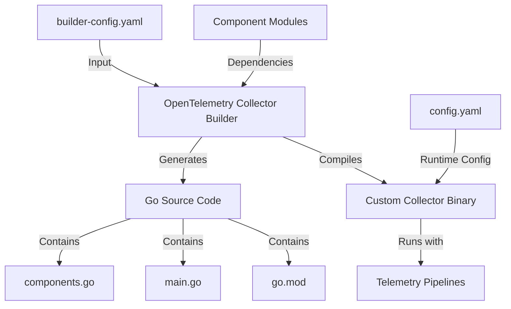

# How to Build a Custom OpenTelemetry Collector Distribution with OCB

Author: [nawazdhandala](https://www.github.com/nawazdhandala)

Tags: OpenTelemetry, Collector, OCB, Custom Distribution, Build Tools, Observability

Description: A comprehensive guide to building custom OpenTelemetry Collector distributions using the OpenTelemetry Collector Builder (OCB) with specific components tailored to your needs.

The OpenTelemetry Collector Builder (OCB) enables you to create custom Collector distributions that include only the components you need. This reduces binary size, improves security by minimizing attack surface, and allows you to include custom or community components not available in standard distributions.

## Why Build a Custom Distribution

The default OpenTelemetry Collector distributions (core and contrib) include many components, but you might need a custom distribution when:

- You want to minimize binary size for containerized deployments
- You need to include custom receivers, processors, or exporters
- You require community components not in the official distributions
- You want to enforce security policies by excluding unused components
- You need to include proprietary telemetry components

## Prerequisites

Before building a custom Collector distribution, ensure you have:

- Go 1.21 or later installed
- Git for version control
- Basic understanding of YAML configuration
- Familiarity with the OpenTelemetry Collector architecture

## Install OCB

The OpenTelemetry Collector Builder is a standalone tool that generates Collector distributions based on a configuration file.

```bash
# Install OCB using Go
go install go.opentelemetry.io/collector/cmd/builder@latest

# Verify installation
builder version

# Alternative: Download pre-built binary
# For Linux
curl -L -o builder https://github.com/open-telemetry/opentelemetry-collector/releases/download/cmd%2Fbuilder%2Fv0.95.0/ocb_0.95.0_linux_amd64
chmod +x builder

# For macOS
curl -L -o builder https://github.com/open-telemetry/opentelemetry-collector/releases/download/cmd%2Fbuilder%2Fv0.95.0/ocb_0.95.0_darwin_amd64
chmod +x builder

# For Windows
# Download from: https://github.com/open-telemetry/opentelemetry-collector/releases/
```

## Create a Builder Configuration File

The builder configuration file defines which components to include in your custom Collector. Create a file named `builder-config.yaml`.

```yaml
# builder-config.yaml

# Distribution configuration defines the output binary details
dist:
  # Name of the output binary
  name: otelcol-custom
  # Description appears in version output
  description: Custom OpenTelemetry Collector distribution
  # Output directory for the built binary
  output_path: ./dist
  # Go version for building
  go: 1.21.0
  # Module name for the generated code
  module: github.com/yourorg/otelcol-custom
  # Version of the distribution
  version: 1.0.0
  # OTEL Collector core version to use as base
  otelcol_version: 0.95.0

# Exporters send telemetry data to backends
exporters:
  # OTLP exporter for native OpenTelemetry protocol
  - gomod: go.opentelemetry.io/collector/exporter/otlpexporter v0.95.0

  # OTLP HTTP exporter
  - gomod: go.opentelemetry.io/collector/exporter/otlphttpexporter v0.95.0

  # Logging exporter for debugging
  - gomod: go.opentelemetry.io/collector/exporter/loggingexporter v0.95.0

  # Prometheus exporter for metrics
  - gomod: github.com/open-telemetry/opentelemetry-collector-contrib/exporter/prometheusexporter v0.95.0

  # Jaeger exporter for traces
  - gomod: github.com/open-telemetry/opentelemetry-collector-contrib/exporter/jaegerexporter v0.95.0

  # File exporter for writing to local files
  - gomod: github.com/open-telemetry/opentelemetry-collector-contrib/exporter/fileexporter v0.95.0

# Receivers define how telemetry data enters the Collector
receivers:
  # OTLP receiver for native OpenTelemetry protocol
  - gomod: go.opentelemetry.io/collector/receiver/otlpreceiver v0.95.0

  # Prometheus receiver for scraping metrics
  - gomod: github.com/open-telemetry/opentelemetry-collector-contrib/receiver/prometheusreceiver v0.95.0

  # Jaeger receiver for traces
  - gomod: github.com/open-telemetry/opentelemetry-collector-contrib/receiver/jaegerreceiver v0.95.0

  # Host metrics receiver for system metrics
  - gomod: github.com/open-telemetry/opentelemetry-collector-contrib/receiver/hostmetricsreceiver v0.95.0

  # Kafka receiver for consuming from Kafka topics
  - gomod: github.com/open-telemetry/opentelemetry-collector-contrib/receiver/kafkareceiver v0.95.0

  # HTTP check receiver for availability monitoring
  - gomod: github.com/open-telemetry/opentelemetry-collector-contrib/receiver/httpcheckreceiver v0.95.0

# Processors transform and enrich telemetry data
processors:
  # Batch processor groups data before export
  - gomod: go.opentelemetry.io/collector/processor/batchprocessor v0.95.0

  # Memory limiter prevents out-of-memory issues
  - gomod: go.opentelemetry.io/collector/processor/memorylimiterprocessor v0.95.0

  # Attributes processor modifies attributes
  - gomod: github.com/open-telemetry/opentelemetry-collector-contrib/processor/attributesprocessor v0.95.0

  # Resource processor adds resource attributes
  - gomod: github.com/open-telemetry/opentelemetry-collector-contrib/processor/resourceprocessor v0.95.0

  # Filter processor drops unwanted telemetry
  - gomod: github.com/open-telemetry/opentelemetry-collector-contrib/processor/filterprocessor v0.95.0

  # Transform processor applies complex transformations
  - gomod: github.com/open-telemetry/opentelemetry-collector-contrib/processor/transformprocessor v0.95.0

  # Tail sampling processor makes sampling decisions based on complete traces
  - gomod: github.com/open-telemetry/opentelemetry-collector-contrib/processor/tailsamplingprocessor v0.95.0

# Extensions provide additional capabilities
extensions:
  # Health check extension provides liveness/readiness probes
  - gomod: go.opentelemetry.io/collector/extension/healthcheckextension v0.95.0

  # PPRof extension enables Go profiling
  - gomod: go.opentelemetry.io/collector/extension/pprofextension v0.95.0

  # zPages extension provides diagnostic pages
  - gomod: go.opentelemetry.io/collector/extension/zpagesextension v0.95.0

  # File storage extension for persistent state
  - gomod: github.com/open-telemetry/opentelemetry-collector-contrib/extension/storage/filestorage v0.95.0

  # Basic auth extension for authentication
  - gomod: github.com/open-telemetry/opentelemetry-collector-contrib/extension/basicauthextension v0.95.0

# Connectors link pipelines together
connectors:
  # Forward connector passes data between pipelines
  - gomod: go.opentelemetry.io/collector/connector/forwardconnector v0.95.0

  # Span metrics connector generates metrics from trace spans
  - gomod: github.com/open-telemetry/opentelemetry-collector-contrib/connector/spanmetricsconnector v0.95.0
```

## Build the Custom Distribution

Once you have the configuration file, build the custom Collector.

```bash
# Build using the configuration file
builder --config=builder-config.yaml

# The build process will:
# 1. Generate Go code for the custom Collector
# 2. Download all required dependencies
# 3. Compile the binary
# 4. Output the binary to the specified output_path

# Expected output structure:
# ./dist/
#   ├── otelcol-custom (or otelcol-custom.exe on Windows)
#   ├── components.go
#   ├── go.mod
#   ├── go.sum
#   └── main.go
```

## Verify the Built Collector

Test the custom Collector to ensure it includes the expected components.

```bash
# Check version information
./dist/otelcol-custom --version

# List available components
./dist/otelcol-custom components

# The output shows all receivers, processors, exporters, extensions, and connectors
# included in your custom distribution
```

## Create a Collector Configuration

Create a configuration file to use with your custom Collector.

```yaml
# config.yaml

# Extensions provide additional capabilities
extensions:
  # Health check endpoint for Kubernetes probes
  health_check:
    endpoint: 0.0.0.0:13133

  # PPRof for performance profiling
  pprof:
    endpoint: localhost:1777

  # zPages for diagnostic information
  zpages:
    endpoint: localhost:55679

# Receivers define how telemetry enters the Collector
receivers:
  # OTLP receiver for applications using OpenTelemetry SDKs
  otlp:
    protocols:
      grpc:
        endpoint: 0.0.0.0:4317
      http:
        endpoint: 0.0.0.0:4318

  # Prometheus receiver scrapes metrics from endpoints
  prometheus:
    config:
      scrape_configs:
        - job_name: 'otel-collector'
          scrape_interval: 30s
          static_configs:
            - targets: ['localhost:8888']

  # Host metrics for system monitoring
  hostmetrics:
    collection_interval: 30s
    scrapers:
      cpu:
      memory:
      disk:
      network:

# Processors transform telemetry data
processors:
  # Memory limiter protects against OOM
  memory_limiter:
    check_interval: 1s
    limit_mib: 1024
    spike_limit_mib: 256

  # Batch processor improves export efficiency
  batch:
    timeout: 10s
    send_batch_size: 1024

  # Resource processor adds identifying attributes
  resource:
    attributes:
      - key: service.name
        value: my-service
        action: upsert
      - key: environment
        value: production
        action: upsert

  # Attributes processor modifies span/log attributes
  attributes:
    actions:
      - key: sensitive_data
        action: delete
      - key: http.url
        action: hash

  # Filter processor drops unwanted telemetry
  filter:
    metrics:
      exclude:
        match_type: regexp
        metric_names:
          - ".*test.*"

# Exporters send telemetry to backends
exporters:
  # OTLP exporter to backend service
  otlp:
    endpoint: backend.example.com:4317
    tls:
      insecure: false
      cert_file: /etc/otelcol/certs/cert.pem
      key_file: /etc/otelcol/certs/key.pem

  # Prometheus exporter exposes metrics endpoint
  prometheus:
    endpoint: 0.0.0.0:8889

  # Logging exporter for debugging
  logging:
    loglevel: info

# Connectors link pipelines
connectors:
  # Span metrics connector generates metrics from traces
  spanmetrics:
    dimensions:
      - name: http.method
      - name: http.status_code

# Service configuration defines the telemetry pipeline
service:
  # Load extensions
  extensions: [health_check, pprof, zpages]

  # Define telemetry pipelines
  pipelines:
    # Traces pipeline
    traces:
      receivers: [otlp]
      processors: [memory_limiter, batch, resource, attributes]
      exporters: [otlp, spanmetrics, logging]

    # Metrics pipeline (includes metrics from traces via connector)
    metrics:
      receivers: [otlp, prometheus, hostmetrics, spanmetrics]
      processors: [memory_limiter, batch, resource, filter]
      exporters: [otlp, prometheus, logging]

    # Logs pipeline
    logs:
      receivers: [otlp]
      processors: [memory_limiter, batch, resource]
      exporters: [otlp, logging]
```

## Run the Custom Collector

Test the custom Collector with your configuration.

```bash
# Run the Collector
./dist/otelcol-custom --config=config.yaml

# Run with verbose logging
./dist/otelcol-custom --config=config.yaml --set=service.telemetry.logs.level=debug

# Validate configuration without running
./dist/otelcol-custom validate --config=config.yaml
```

## Include Custom Components

To include custom or private components, reference them by their Go module path.

```yaml
# builder-config.yaml with custom components

dist:
  name: otelcol-custom
  description: Custom Collector with proprietary components
  output_path: ./dist
  module: github.com/yourorg/otelcol-custom
  version: 1.0.0
  otelcol_version: 0.95.0

exporters:
  # Standard exporter
  - gomod: go.opentelemetry.io/collector/exporter/otlpexporter v0.95.0

  # Custom exporter from your organization
  - gomod: github.com/yourorg/customexporter v1.2.3
    path: ./components/customexporter

receivers:
  # Standard receiver
  - gomod: go.opentelemetry.io/collector/receiver/otlpreceiver v0.95.0

  # Custom receiver from a private repository
  - gomod: github.com/yourorg/customreceiver v0.5.0
    path: ./components/customreceiver

processors:
  # Standard processors
  - gomod: go.opentelemetry.io/collector/processor/batchprocessor v0.95.0

  # Custom processor with local path during development
  - gomod: example.com/customprocessor v0.0.0
    path: ../custom-processor
```

For details on building custom components, see:
- https://oneuptime.com/blog/post/build-custom-receiver-opentelemetry-collector/view
- https://oneuptime.com/blog/post/build-custom-processor-opentelemetry-collector/view
- https://oneuptime.com/blog/post/build-custom-exporter-opentelemetry-collector/view
- https://oneuptime.com/blog/post/build-custom-extension-opentelemetry-collector/view

## Build Process Architecture



## Automate Builds with CI/CD

Create a GitHub Actions workflow to automate building custom Collector distributions.

```yaml
# .github/workflows/build-collector.yaml

name: Build Custom Collector

on:
  push:
    branches: [main]
  pull_request:
    branches: [main]

jobs:
  build:
    runs-on: ubuntu-latest

    steps:
      - name: Checkout repository
        uses: actions/checkout@v4

      - name: Set up Go
        uses: actions/setup-go@v5
        with:
          go-version: '1.21'

      - name: Install OCB
        run: |
          go install go.opentelemetry.io/collector/cmd/builder@latest

      - name: Build custom Collector
        run: |
          builder --config=builder-config.yaml

      - name: Test custom Collector
        run: |
          ./dist/otelcol-custom --version
          ./dist/otelcol-custom components
          ./dist/otelcol-custom validate --config=config.yaml

      - name: Upload artifact
        uses: actions/upload-artifact@v4
        with:
          name: otelcol-custom
          path: dist/otelcol-custom

      - name: Build Docker image
        run: |
          docker build -t otelcol-custom:latest -f Dockerfile .

      - name: Push Docker image
        if: github.ref == 'refs/heads/main'
        run: |
          echo "${{ secrets.DOCKER_PASSWORD }}" | docker login -u "${{ secrets.DOCKER_USERNAME }}" --password-stdin
          docker tag otelcol-custom:latest yourorg/otelcol-custom:latest
          docker push yourorg/otelcol-custom:latest
```

## Create a Dockerfile

Package your custom Collector in a Docker container for easy deployment.

```dockerfile
# Dockerfile

# Build stage
FROM golang:1.21 AS builder

# Install OCB
RUN go install go.opentelemetry.io/collector/cmd/builder@latest

# Copy builder configuration
WORKDIR /build
COPY builder-config.yaml .

# Build custom Collector
RUN builder --config=builder-config.yaml

# Runtime stage
FROM alpine:3.19

# Install CA certificates for TLS
RUN apk --no-cache add ca-certificates

# Copy the built Collector binary
COPY --from=builder /build/dist/otelcol-custom /otelcol-custom

# Copy default configuration
COPY config.yaml /etc/otelcol/config.yaml

# Expose ports for receivers and health checks
EXPOSE 4317 4318 8888 13133

# Set entrypoint
ENTRYPOINT ["/otelcol-custom"]
CMD ["--config=/etc/otelcol/config.yaml"]
```

Build and run the Docker container:

```bash
# Build the image
docker build -t otelcol-custom:1.0.0 .

# Run the container
docker run -d \
  --name otelcol-custom \
  -p 4317:4317 \
  -p 4318:4318 \
  -p 8888:8888 \
  -p 13133:13133 \
  -v $(pwd)/config.yaml:/etc/otelcol/config.yaml \
  otelcol-custom:1.0.0

# Check logs
docker logs -f otelcol-custom

# Check health
curl http://localhost:13133/
```

## Advanced Configuration Options

### Specify Component Versions

Pin specific versions of components for reproducible builds.

```yaml
exporters:
  # Pin to exact version
  - gomod: go.opentelemetry.io/collector/exporter/otlpexporter v0.95.0

  # Use version range (not recommended for production)
  - gomod: github.com/open-telemetry/opentelemetry-collector-contrib/exporter/prometheusexporter v0.95.0
```

### Use Replace Directives

Override component dependencies during development or testing.

```yaml
dist:
  name: otelcol-custom
  output_path: ./dist
  otelcol_version: 0.95.0

# Replace directives override module paths
replaces:
  # Use local development version
  - github.com/open-telemetry/opentelemetry-collector-contrib/processor/attributesprocessor => ../otel-contrib/processor/attributesprocessor

  # Use forked version
  - go.opentelemetry.io/collector => github.com/yourorg/opentelemetry-collector v0.95.1
```

### Exclude Default Components

Start with minimal components and add only what you need.

```yaml
dist:
  name: otelcol-minimal
  description: Minimal Collector with only essential components
  output_path: ./dist
  otelcol_version: 0.95.0

# Include only essential components
receivers:
  - gomod: go.opentelemetry.io/collector/receiver/otlpreceiver v0.95.0

processors:
  - gomod: go.opentelemetry.io/collector/processor/batchprocessor v0.95.0

exporters:
  - gomod: go.opentelemetry.io/collector/exporter/otlpexporter v0.95.0

extensions:
  - gomod: go.opentelemetry.io/collector/extension/healthcheckextension v0.95.0
```

## Troubleshooting Build Issues

### Dependency Resolution Errors

If you encounter dependency conflicts:

```bash
# Clear Go module cache
go clean -modcache

# Rebuild with verbose output
builder --config=builder-config.yaml --verbose

# Check for incompatible versions
go mod graph | grep "component-name"
```

### Missing Components

If a component doesn't appear in the built Collector:

```bash
# Verify the component is in the configuration
cat builder-config.yaml | grep component-name

# Check build logs for errors
builder --config=builder-config.yaml 2>&1 | grep -i error

# List components in the built binary
./dist/otelcol-custom components
```

### Build Performance

Speed up builds by using Go build cache:

```bash
# Set GOCACHE location
export GOCACHE=$HOME/.cache/go-build

# Enable Go module cache
export GOMODCACHE=$HOME/go/pkg/mod

# Use multiple CPU cores
export GOMAXPROCS=$(nproc)
```

## Best Practices

When building custom Collector distributions:

1. **Pin component versions** for reproducible builds across environments
2. **Test thoroughly** before deploying to production
3. **Document included components** and their versions
4. **Automate builds** using CI/CD pipelines
5. **Version your distributions** following semantic versioning
6. **Keep distributions minimal** to reduce binary size and attack surface
7. **Update regularly** to get security patches and new features
8. **Store configurations in version control** alongside builder configs
9. **Use multi-stage Docker builds** to minimize image size
10. **Test configuration validation** before runtime deployment

## Conclusion

Building custom OpenTelemetry Collector distributions with OCB gives you precise control over which components are included, reduces binary size, and enables integration of custom or proprietary telemetry components. By automating the build process and containerizing your custom Collector, you can maintain consistent observability infrastructure across development, staging, and production environments while keeping your telemetry pipeline optimized for your specific needs.
