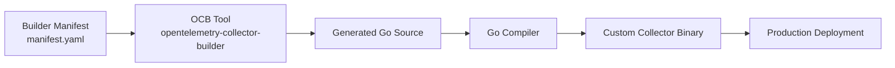
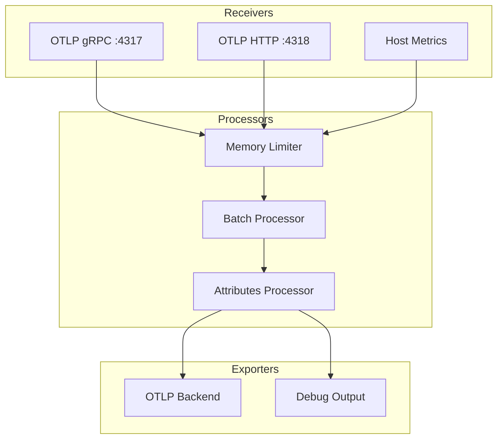

# How to Build Your Own Custom OpenTelemetry Collector Distribution

Author: [nawazdhandala](https://www.github.com/nawazdhandala)

Tags: OpenTelemetry, Collector, Custom Distribution, Observability, Go

Description: Learn how to build a custom OpenTelemetry Collector distribution tailored to your infrastructure needs with only the components you actually use.

---

The OpenTelemetry Collector is a vendor-neutral proxy that receives, processes, and exports telemetry data. But the default distributions ship with dozens of components you probably never touch. A custom distribution lets you pick exactly the receivers, processors, and exporters you need, reducing binary size, attack surface, and memory usage.

In this guide, we will walk through building a custom OpenTelemetry Collector distribution from scratch.

## Why Build a Custom Distribution?

There are several reasons teams invest in building their own collector:

- **Smaller binary size.** The contrib distribution includes 100+ components. Your production environment probably uses 5-10 of them.
- **Reduced attack surface.** Fewer components mean fewer potential vulnerabilities.
- **Faster startup.** Less initialization overhead when the collector boots.
- **Custom components.** You can include your own proprietary receivers, processors, or exporters.
- **Version pinning.** Lock specific component versions that have been tested and validated.

## Architecture of a Custom Distribution

Here is how a custom collector distribution fits into the build pipeline:



## Prerequisites

Before you start, make sure you have these installed:

- Go 1.22 or later
- The OpenTelemetry Collector Builder (ocb) tool
- A text editor for YAML configuration

Install the OCB tool with the following command:

```bash
# Install the OpenTelemetry Collector Builder tool
# This is the official tool for creating custom collector distributions
go install go.opentelemetry.io/collector/cmd/builder@latest
```

Verify the installation worked:

```bash
# Check that ocb is available and print the version
builder version
```

## Step 1: Create the Builder Manifest

The builder manifest is a YAML file that defines which components go into your custom distribution. Create a file called `manifest.yaml`:

```yaml
# manifest.yaml
# This manifest defines which components to include in our custom collector.
# We only include what we actually need in production.

dist:
  # Name of the output binary
  name: my-custom-collector
  # Description shown in --version output
  description: "Custom OTel Collector for our microservices platform"
  # Output directory for the generated source and binary
  output_path: ./build
  # The OTel Collector version to build against
  otelcol_version: "0.96.0"
  # Go module path for the generated code
  module: github.com/myorg/my-custom-collector

# Receivers pull data into the collector
receivers:
  # OTLP receiver handles gRPC and HTTP traffic from instrumented apps
  - gomod: go.opentelemetry.io/collector/receiver/otlpreceiver v0.96.0
  # Prometheus receiver scrapes Prometheus endpoints
  - gomod: github.com/open-telemetry/opentelemetry-collector-contrib/receiver/prometheusreceiver v0.96.0
  # Host metrics receiver collects system-level metrics
  - gomod: github.com/open-telemetry/opentelemetry-collector-contrib/receiver/hostmetricsreceiver v0.96.0

# Processors transform and enrich telemetry data in-flight
processors:
  # Batch processor groups data before export to reduce network calls
  - gomod: go.opentelemetry.io/collector/processor/batchprocessor v0.96.0
  # Memory limiter prevents the collector from using too much RAM
  - gomod: go.opentelemetry.io/collector/processor/memorylimiterprocessor v0.96.0
  # Attributes processor lets you modify span/metric attributes
  - gomod: github.com/open-telemetry/opentelemetry-collector-contrib/processor/attributesprocessor v0.96.0
  # Resource processor modifies resource attributes
  - gomod: github.com/open-telemetry/opentelemetry-collector-contrib/processor/resourceprocessor v0.96.0

# Exporters send telemetry to backends
exporters:
  # OTLP exporter sends data to any OTLP-compatible backend
  - gomod: go.opentelemetry.io/collector/exporter/otlpexporter v0.96.0
  # OTLP HTTP exporter for backends that prefer HTTP over gRPC
  - gomod: go.opentelemetry.io/collector/exporter/otlphttpexporter v0.96.0
  # Debug exporter is useful during development
  - gomod: go.opentelemetry.io/collector/exporter/debugexporter v0.96.0

# Extensions provide additional collector capabilities
extensions:
  # Health check extension exposes a health endpoint
  - gomod: github.com/open-telemetry/opentelemetry-collector-contrib/extension/healthcheckextension v0.96.0
  # zPages extension provides in-process diagnostics
  - gomod: go.opentelemetry.io/collector/extension/zpagesextension v0.96.0

# Connectors join two pipelines together
connectors:
  # Forward connector passes data between pipelines without modification
  - gomod: go.opentelemetry.io/collector/connector/forwardconnector v0.96.0
```

## Step 2: Build the Distribution

Run the builder with your manifest:

```bash
# Build the custom collector using the manifest file
# The --config flag points to the manifest we just created
builder --config manifest.yaml
```

This generates Go source code in the `./build` directory and compiles it into a binary. The output looks something like this:

```
2026-02-06T10:00:00.000Z  INFO  builder/main.go  Building custom collector
2026-02-06T10:00:00.100Z  INFO  builder/main.go  Generating source code
2026-02-06T10:00:05.000Z  INFO  builder/main.go  Compiling
2026-02-06T10:00:30.000Z  INFO  builder/main.go  Build complete: ./build/my-custom-collector
```

## Step 3: Create the Collector Configuration

Now create the runtime configuration that tells the collector how to behave. This is separate from the builder manifest. Save this as `config.yaml`:

```yaml
# config.yaml
# Runtime configuration for our custom collector.
# This controls what the collector does when it runs.

# Extensions run alongside the main pipeline
extensions:
  health_check:
    endpoint: "0.0.0.0:13133"
  zpages:
    endpoint: "0.0.0.0:55679"

# Receivers define how data enters the collector
receivers:
  otlp:
    protocols:
      grpc:
        endpoint: "0.0.0.0:4317"
      http:
        endpoint: "0.0.0.0:4318"

  hostmetrics:
    collection_interval: 30s
    scrapers:
      cpu: {}
      memory: {}
      disk: {}
      network: {}

# Processors modify data between receiving and exporting
processors:
  batch:
    # Wait up to 5 seconds before sending a batch
    timeout: 5s
    # Send a batch when it reaches 10000 items
    send_batch_size: 10000

  memory_limiter:
    # Start refusing data at 80% memory usage
    limit_percentage: 80
    # Resume accepting data at 70% memory usage
    spike_limit_percentage: 70
    check_interval: 1s

  attributes:
    actions:
      # Add the environment tag to all telemetry
      - key: environment
        value: production
        action: upsert

# Exporters define where data goes
exporters:
  otlp:
    endpoint: "your-backend.example.com:4317"
    tls:
      insecure: false

  debug:
    verbosity: basic

# Service ties everything together into pipelines
service:
  extensions: [health_check, zpages]

  pipelines:
    traces:
      receivers: [otlp]
      processors: [memory_limiter, batch, attributes]
      exporters: [otlp]

    metrics:
      receivers: [otlp, hostmetrics]
      processors: [memory_limiter, batch]
      exporters: [otlp]

    logs:
      receivers: [otlp]
      processors: [memory_limiter, batch]
      exporters: [otlp]
```

## Step 4: Run the Custom Collector

Start your custom collector with the configuration file:

```bash
# Run the custom collector with our config
./build/my-custom-collector --config config.yaml
```

## Step 5: Containerize the Distribution

For production deployments, package the collector as a Docker image:

```dockerfile
# Dockerfile
# Multi-stage build to keep the final image small

# Stage 1: Build the custom collector
FROM golang:1.22-alpine AS builder

# Install build dependencies
RUN apk add --no-cache git make

WORKDIR /build

# Copy the manifest file
COPY manifest.yaml .

# Install the builder tool
RUN go install go.opentelemetry.io/collector/cmd/builder@latest

# Build the custom collector
RUN builder --config manifest.yaml

# Stage 2: Create the minimal runtime image
FROM alpine:3.19

# Add ca-certificates for TLS connections to backends
RUN apk add --no-cache ca-certificates

# Copy the built binary from the builder stage
COPY --from=builder /build/build/my-custom-collector /usr/local/bin/collector

# Copy the runtime configuration
COPY config.yaml /etc/collector/config.yaml

# Expose the standard OTel ports
EXPOSE 4317 4318 13133 55679

# Run the collector
ENTRYPOINT ["/usr/local/bin/collector"]
CMD ["--config", "/etc/collector/config.yaml"]
```

Build and run the container:

```bash
# Build the Docker image
docker build -t my-custom-collector:latest .

# Run the container with the necessary port mappings
docker run -d \
  --name otel-collector \
  -p 4317:4317 \
  -p 4318:4318 \
  -p 13133:13133 \
  my-custom-collector:latest
```

## Pipeline Flow Overview

Here is how telemetry flows through the custom collector:



## Comparing Binary Sizes

To understand the benefit of a custom build, here is a rough comparison:

| Distribution | Components | Binary Size | Memory at Idle |
|---|---|---|---|
| Contrib (full) | 100+ | ~250 MB | ~120 MB |
| Core | ~15 | ~80 MB | ~40 MB |
| Custom (this guide) | 12 | ~55 MB | ~30 MB |

## Automating Builds with CI

Set up a GitHub Actions workflow to rebuild your distribution when the manifest changes:

```yaml
# .github/workflows/build-collector.yaml
name: Build Custom Collector

on:
  push:
    paths:
      - 'manifest.yaml'
      - '.github/workflows/build-collector.yaml'

jobs:
  build:
    runs-on: ubuntu-latest
    steps:
      - uses: actions/checkout@v4

      - name: Set up Go
        uses: actions/setup-go@v5
        with:
          go-version: '1.22'

      - name: Install OCB
        run: go install go.opentelemetry.io/collector/cmd/builder@latest

      - name: Build collector
        run: builder --config manifest.yaml

      - name: Build and push Docker image
        uses: docker/build-push-action@v5
        with:
          context: .
          push: true
          tags: ghcr.io/myorg/custom-collector:${{ github.sha }}
```

## Wrapping Up

Building a custom OpenTelemetry Collector distribution is straightforward once you understand the pieces. The builder manifest defines your ingredients, the OCB tool does the compilation, and you end up with a lean binary that does exactly what you need. Start with the components you know you need, and add more as requirements grow. The smaller your distribution, the easier it is to maintain, debug, and deploy.
