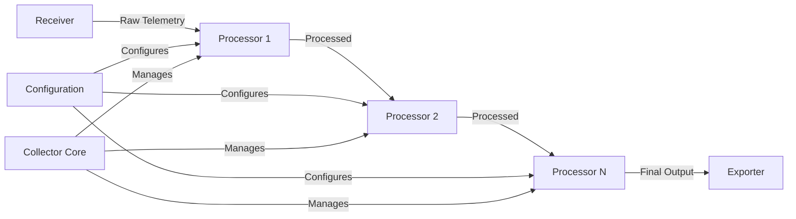

# How to Build a Custom Processor for the OpenTelemetry Collector

Author: [nawazdhandala](https://www.github.com/nawazdhandala)

Tags: OpenTelemetry, Collector, Custom Processor, Go Development, Data Processing, Observability

Description: Learn how to build custom OpenTelemetry Collector processors in Go to transform, filter, and enrich telemetry data according to your specific requirements.

Custom processors enable you to transform, filter, and enrich telemetry data as it flows through the OpenTelemetry Collector pipeline. Whether you need to redact sensitive information, aggregate metrics, sample traces, or add business context to your telemetry, custom processors provide the flexibility to implement any data transformation logic.

## Understanding Processor Architecture

Processors sit between receivers and exporters in the Collector pipeline, transforming telemetry data before it reaches its destination. They operate on three types of telemetry:

- **Traces**: Distributed tracing data representing requests across services
- **Metrics**: Numerical measurements of system and application performance
- **Logs**: Text records of events and messages

Processors implement the consumer interface, receiving data from upstream components and forwarding processed data to downstream components.

## Processor Component Architecture



## Project Setup

Create a new Go module for your custom processor.

```bash
# Create project directory
mkdir custom-processor
cd custom-processor

# Initialize Go module
go mod init github.com/yourorg/customprocessor

# Install required dependencies
go get go.opentelemetry.io/collector/component
go get go.opentelemetry.io/collector/consumer
go get go.opentelemetry.io/collector/processor
go get go.opentelemetry.io/collector/pdata
go get go.uber.org/zap
```

## Define the Configuration Structure

Create a configuration struct that defines processor settings.

```go
// config.go
package customprocessor

import (
	"errors"

	"go.opentelemetry.io/collector/component"
)

// Config defines the configuration for the custom processor
type Config struct {
	// AttributesToRedact lists attribute keys to redact
	AttributesToRedact []string `mapstructure:"attributes_to_redact"`

	// RedactionPattern defines the replacement string for redacted values
	RedactionPattern string `mapstructure:"redaction_pattern"`

	// MinDuration filters spans shorter than this duration (in milliseconds)
	MinDuration int64 `mapstructure:"min_duration_ms"`

	// AddAttributes specifies attributes to add to all telemetry
	AddAttributes map[string]string `mapstructure:"add_attributes"`

	// DropEmptyResources controls whether to drop resources with no data
	DropEmptyResources bool `mapstructure:"drop_empty_resources"`

	// SamplingRate defines the percentage of data to keep (0-100)
	SamplingRate float64 `mapstructure:"sampling_rate"`
}

// Validate checks if the configuration is valid
func (cfg *Config) Validate() error {
	if cfg.RedactionPattern == "" {
		return errors.New("redaction_pattern must be specified")
	}

	if cfg.SamplingRate < 0 || cfg.SamplingRate > 100 {
		return errors.New("sampling_rate must be between 0 and 100")
	}

	if cfg.MinDuration < 0 {
		return errors.New("min_duration_ms must be non-negative")
	}

	return nil
}

// defaultConfig returns default configuration values
func defaultConfig() component.Config {
	return &Config{
		AttributesToRedact: []string{},
		RedactionPattern:   "[REDACTED]",
		MinDuration:        0,
		AddAttributes:      map[string]string{},
		DropEmptyResources: false,
		SamplingRate:       100.0,
	}
}
```

## Create the Processor Factory

The factory creates processor instances and provides metadata about the component.

```go
// factory.go
package customprocessor

import (
	"context"
	"fmt"

	"go.opentelemetry.io/collector/component"
	"go.opentelemetry.io/collector/consumer"
	"go.opentelemetry.io/collector/processor"
)

const (
	// typeStr is the name used in the Collector configuration
	typeStr = "custom"

	// stability level of the processor
	stability = component.StabilityLevelAlpha
)

// NewFactory creates a factory for the custom processor
func NewFactory() processor.Factory {
	return processor.NewFactory(
		typeStr,
		defaultConfig,
		processor.WithTraces(createTracesProcessor, stability),
		processor.WithMetrics(createMetricsProcessor, stability),
		processor.WithLogs(createLogsProcessor, stability),
	)
}

// createTracesProcessor creates a traces processor based on the configuration
func createTracesProcessor(
	ctx context.Context,
	params processor.CreateSettings,
	cfg component.Config,
	nextConsumer consumer.Traces,
) (processor.Traces, error) {
	processorCfg, ok := cfg.(*Config)
	if !ok {
		return nil, fmt.Errorf("invalid config type: %T", cfg)
	}

	return newTracesProcessor(processorCfg, params, nextConsumer)
}

// createMetricsProcessor creates a metrics processor based on the configuration
func createMetricsProcessor(
	ctx context.Context,
	params processor.CreateSettings,
	cfg component.Config,
	nextConsumer consumer.Metrics,
) (processor.Metrics, error) {
	processorCfg, ok := cfg.(*Config)
	if !ok {
		return nil, fmt.Errorf("invalid config type: %T", cfg)
	}

	return newMetricsProcessor(processorCfg, params, nextConsumer)
}

// createLogsProcessor creates a logs processor based on the configuration
func createLogsProcessor(
	ctx context.Context,
	params processor.CreateSettings,
	cfg component.Config,
	nextConsumer consumer.Logs,
) (processor.Logs, error) {
	processorCfg, ok := cfg.(*Config)
	if !ok {
		return nil, fmt.Errorf("invalid config type: %T", cfg)
	}

	return newLogsProcessor(processorCfg, params, nextConsumer)
}
```

## Implement the Traces Processor

Create the core processor implementation for traces.

```go
// traces_processor.go
package customprocessor

import (
	"context"
	"crypto/rand"
	"math/big"

	"go.opentelemetry.io/collector/component"
	"go.opentelemetry.io/collector/consumer"
	"go.opentelemetry.io/collector/pdata/pcommon"
	"go.opentelemetry.io/collector/pdata/ptrace"
	"go.opentelemetry.io/collector/processor"
	"go.uber.org/zap"
)

// tracesProcessor implements the processor.Traces interface
type tracesProcessor struct {
	config       *Config
	settings     processor.CreateSettings
	nextConsumer consumer.Traces
}

// newTracesProcessor creates a new traces processor instance
func newTracesProcessor(
	config *Config,
	settings processor.CreateSettings,
	nextConsumer consumer.Traces,
) (processor.Traces, error) {
	return &tracesProcessor{
		config:       config,
		settings:     settings,
		nextConsumer: nextConsumer,
	}, nil
}

// Capabilities returns the consumer capabilities of the processor
func (p *tracesProcessor) Capabilities() consumer.Capabilities {
	return consumer.Capabilities{MutatesData: true}
}

// Start begins the processor's operation
func (p *tracesProcessor) Start(ctx context.Context, host component.Host) error {
	p.settings.Logger.Info("Custom traces processor started",
		zap.Strings("redact_attributes", p.config.AttributesToRedact),
		zap.Float64("sampling_rate", p.config.SamplingRate),
	)
	return nil
}

// Shutdown stops the processor's operation
func (p *tracesProcessor) Shutdown(ctx context.Context) error {
	p.settings.Logger.Info("Custom traces processor stopped")
	return nil
}

// ConsumeTraces processes trace data
func (p *tracesProcessor) ConsumeTraces(ctx context.Context, td ptrace.Traces) error {
	// Apply sampling first to reduce processing overhead
	if !p.shouldSample() {
		return nil
	}

	// Process each resource span
	resourceSpans := td.ResourceSpans()
	for i := 0; i < resourceSpans.Len(); i++ {
		resourceSpan := resourceSpans.At(i)

		// Add resource-level attributes
		p.addAttributes(resourceSpan.Resource().Attributes())

		// Process scope spans
		scopeSpans := resourceSpan.ScopeSpans()
		for j := 0; j < scopeSpans.Len(); j++ {
			scopeSpan := scopeSpans.At(j)

			// Process individual spans
			spans := scopeSpan.Spans()
			// Iterate in reverse to safely remove spans
			for k := spans.Len() - 1; k >= 0; k-- {
				span := spans.At(k)

				// Filter spans by duration
				if !p.shouldKeepSpan(span) {
					spans.RemoveIf(func(s ptrace.Span) bool {
						return s.SpanID() == span.SpanID()
					})
					continue
				}

				// Redact sensitive attributes
				p.redactAttributes(span.Attributes())

				// Add span-level attributes
				p.addAttributes(span.Attributes())

				// Process span events
				p.processSpanEvents(span)
			}
		}

		// Drop empty resources if configured
		if p.config.DropEmptyResources && p.isResourceEmpty(resourceSpan) {
			resourceSpans.RemoveIf(func(rs ptrace.ResourceSpans) bool {
				return rs.Resource().Attributes().AsRaw()["resource.id"] ==
					resourceSpan.Resource().Attributes().AsRaw()["resource.id"]
			})
		}
	}

	// Forward processed traces to the next consumer
	return p.nextConsumer.ConsumeTraces(ctx, td)
}

// shouldSample determines if the data should be sampled
func (p *tracesProcessor) shouldSample() bool {
	if p.config.SamplingRate >= 100.0 {
		return true
	}

	if p.config.SamplingRate <= 0.0 {
		return false
	}

	// Generate random number between 0 and 100
	n, err := rand.Int(rand.Reader, big.NewInt(100))
	if err != nil {
		p.settings.Logger.Error("Failed to generate random number", zap.Error(err))
		return true
	}

	return float64(n.Int64()) < p.config.SamplingRate
}

// shouldKeepSpan determines if a span should be kept based on duration
func (p *tracesProcessor) shouldKeepSpan(span ptrace.Span) bool {
	if p.config.MinDuration == 0 {
		return true
	}

	// Calculate span duration in milliseconds
	durationNs := span.EndTimestamp() - span.StartTimestamp()
	durationMs := durationNs / 1_000_000

	return int64(durationMs) >= p.config.MinDuration
}

// redactAttributes redacts sensitive attribute values
func (p *tracesProcessor) redactAttributes(attrs pcommon.Map) {
	for _, attrKey := range p.config.AttributesToRedact {
		if _, exists := attrs.Get(attrKey); exists {
			attrs.PutStr(attrKey, p.config.RedactionPattern)
		}
	}
}

// addAttributes adds configured attributes to the map
func (p *tracesProcessor) addAttributes(attrs pcommon.Map) {
	for key, value := range p.config.AddAttributes {
		attrs.PutStr(key, value)
	}
}

// processSpanEvents processes events within a span
func (p *tracesProcessor) processSpanEvents(span ptrace.Span) {
	events := span.Events()
	for i := 0; i < events.Len(); i++ {
		event := events.At(i)

		// Redact event attributes
		p.redactAttributes(event.Attributes())

		// Add attributes to events
		p.addAttributes(event.Attributes())
	}
}

// isResourceEmpty checks if a resource has no spans
func (p *tracesProcessor) isResourceEmpty(resourceSpan ptrace.ResourceSpans) bool {
	scopeSpans := resourceSpan.ScopeSpans()
	for i := 0; i < scopeSpans.Len(); i++ {
		if scopeSpans.At(i).Spans().Len() > 0 {
			return false
		}
	}
	return true
}
```

## Implement the Metrics Processor

Create the processor implementation for metrics.

```go
// metrics_processor.go
package customprocessor

import (
	"context"

	"go.opentelemetry.io/collector/component"
	"go.opentelemetry.io/collector/consumer"
	"go.opentelemetry.io/collector/pdata/pcommon"
	"go.opentelemetry.io/collector/pdata/pmetric"
	"go.opentelemetry.io/collector/processor"
	"go.uber.org/zap"
)

// metricsProcessor implements the processor.Metrics interface
type metricsProcessor struct {
	config       *Config
	settings     processor.CreateSettings
	nextConsumer consumer.Metrics
}

// newMetricsProcessor creates a new metrics processor instance
func newMetricsProcessor(
	config *Config,
	settings processor.CreateSettings,
	nextConsumer consumer.Metrics,
) (processor.Metrics, error) {
	return &metricsProcessor{
		config:       config,
		settings:     settings,
		nextConsumer: nextConsumer,
	}, nil
}

// Capabilities returns the consumer capabilities of the processor
func (p *metricsProcessor) Capabilities() consumer.Capabilities {
	return consumer.Capabilities{MutatesData: true}
}

// Start begins the processor's operation
func (p *metricsProcessor) Start(ctx context.Context, host component.Host) error {
	p.settings.Logger.Info("Custom metrics processor started")
	return nil
}

// Shutdown stops the processor's operation
func (p *metricsProcessor) Shutdown(ctx context.Context) error {
	p.settings.Logger.Info("Custom metrics processor stopped")
	return nil
}

// ConsumeMetrics processes metric data
func (p *metricsProcessor) ConsumeMetrics(ctx context.Context, md pmetric.Metrics) error {
	// Apply sampling
	if !p.shouldSample() {
		return nil
	}

	// Process each resource metric
	resourceMetrics := md.ResourceMetrics()
	for i := 0; i < resourceMetrics.Len(); i++ {
		resourceMetric := resourceMetrics.At(i)

		// Add resource-level attributes
		p.addAttributes(resourceMetric.Resource().Attributes())

		// Process scope metrics
		scopeMetrics := resourceMetric.ScopeMetrics()
		for j := 0; j < scopeMetrics.Len(); j++ {
			scopeMetric := scopeMetrics.At(j)

			// Process individual metrics
			metrics := scopeMetric.Metrics()
			for k := 0; k < metrics.Len(); k++ {
				metric := metrics.At(k)
				p.processMetric(metric)
			}
		}
	}

	// Forward processed metrics to the next consumer
	return p.nextConsumer.ConsumeMetrics(ctx, md)
}

// processMetric processes a single metric
func (p *metricsProcessor) processMetric(metric pmetric.Metric) {
	// Process based on metric type
	switch metric.Type() {
	case pmetric.MetricTypeGauge:
		p.processGauge(metric.Gauge())
	case pmetric.MetricTypeSum:
		p.processSum(metric.Sum())
	case pmetric.MetricTypeHistogram:
		p.processHistogram(metric.Histogram())
	case pmetric.MetricTypeExponentialHistogram:
		p.processExponentialHistogram(metric.ExponentialHistogram())
	case pmetric.MetricTypeSummary:
		p.processSummary(metric.Summary())
	}
}

// processGauge processes gauge metric data points
func (p *metricsProcessor) processGauge(gauge pmetric.Gauge) {
	dataPoints := gauge.DataPoints()
	for i := 0; i < dataPoints.Len(); i++ {
		dp := dataPoints.At(i)
		p.processDataPointAttributes(dp.Attributes())
	}
}

// processSum processes sum metric data points
func (p *metricsProcessor) processSum(sum pmetric.Sum) {
	dataPoints := sum.DataPoints()
	for i := 0; i < dataPoints.Len(); i++ {
		dp := dataPoints.At(i)
		p.processDataPointAttributes(dp.Attributes())
	}
}

// processHistogram processes histogram metric data points
func (p *metricsProcessor) processHistogram(histogram pmetric.Histogram) {
	dataPoints := histogram.DataPoints()
	for i := 0; i < dataPoints.Len(); i++ {
		dp := dataPoints.At(i)
		p.processDataPointAttributes(dp.Attributes())
	}
}

// processExponentialHistogram processes exponential histogram data points
func (p *metricsProcessor) processExponentialHistogram(histogram pmetric.ExponentialHistogram) {
	dataPoints := histogram.DataPoints()
	for i := 0; i < dataPoints.Len(); i++ {
		dp := dataPoints.At(i)
		p.processDataPointAttributes(dp.Attributes())
	}
}

// processSummary processes summary metric data points
func (p *metricsProcessor) processSummary(summary pmetric.Summary) {
	dataPoints := summary.DataPoints()
	for i := 0; i < dataPoints.Len(); i++ {
		dp := dataPoints.At(i)
		p.processDataPointAttributes(dp.Attributes())
	}
}

// processDataPointAttributes processes attributes on a data point
func (p *metricsProcessor) processDataPointAttributes(attrs pcommon.Map) {
	// Redact sensitive attributes
	p.redactAttributes(attrs)

	// Add configured attributes
	p.addAttributes(attrs)
}

// redactAttributes redacts sensitive attribute values
func (p *metricsProcessor) redactAttributes(attrs pcommon.Map) {
	for _, attrKey := range p.config.AttributesToRedact {
		if _, exists := attrs.Get(attrKey); exists {
			attrs.PutStr(attrKey, p.config.RedactionPattern)
		}
	}
}

// addAttributes adds configured attributes to the map
func (p *metricsProcessor) addAttributes(attrs pcommon.Map) {
	for key, value := range p.config.AddAttributes {
		attrs.PutStr(key, value)
	}
}

// shouldSample determines if the data should be sampled
func (p *metricsProcessor) shouldSample() bool {
	if p.config.SamplingRate >= 100.0 {
		return true
	}
	// Implement sampling logic similar to traces processor
	return true
}
```

## Implement the Logs Processor

Create the processor implementation for logs.

```go
// logs_processor.go
package customprocessor

import (
	"context"

	"go.opentelemetry.io/collector/component"
	"go.opentelemetry.io/collector/consumer"
	"go.opentelemetry.io/collector/pdata/pcommon"
	"go.opentelemetry.io/collector/pdata/plog"
	"go.opentelemetry.io/collector/processor"
	"go.uber.org/zap"
)

// logsProcessor implements the processor.Logs interface
type logsProcessor struct {
	config       *Config
	settings     processor.CreateSettings
	nextConsumer consumer.Logs
}

// newLogsProcessor creates a new logs processor instance
func newLogsProcessor(
	config *Config,
	settings processor.CreateSettings,
	nextConsumer consumer.Logs,
) (processor.Logs, error) {
	return &logsProcessor{
		config:       config,
		settings:     settings,
		nextConsumer: nextConsumer,
	}, nil
}

// Capabilities returns the consumer capabilities of the processor
func (p *logsProcessor) Capabilities() consumer.Capabilities {
	return consumer.Capabilities{MutatesData: true}
}

// Start begins the processor's operation
func (p *logsProcessor) Start(ctx context.Context, host component.Host) error {
	p.settings.Logger.Info("Custom logs processor started")
	return nil
}

// Shutdown stops the processor's operation
func (p *logsProcessor) Shutdown(ctx context.Context) error {
	p.settings.Logger.Info("Custom logs processor stopped")
	return nil
}

// ConsumeLogs processes log data
func (p *logsProcessor) ConsumeLogs(ctx context.Context, ld plog.Logs) error {
	// Apply sampling
	if !p.shouldSample() {
		return nil
	}

	// Process each resource log
	resourceLogs := ld.ResourceLogs()
	for i := 0; i < resourceLogs.Len(); i++ {
		resourceLog := resourceLogs.At(i)

		// Add resource-level attributes
		p.addAttributes(resourceLog.Resource().Attributes())

		// Process scope logs
		scopeLogs := resourceLog.ScopeLogs()
		for j := 0; j < scopeLogs.Len(); j++ {
			scopeLog := scopeLogs.At(j)

			// Process individual log records
			logRecords := scopeLog.LogRecords()
			for k := 0; k < logRecords.Len(); k++ {
				logRecord := logRecords.At(k)

				// Redact sensitive attributes
				p.redactAttributes(logRecord.Attributes())

				// Add configured attributes
				p.addAttributes(logRecord.Attributes())

				// Redact sensitive data in log body
				p.redactLogBody(logRecord)
			}
		}
	}

	// Forward processed logs to the next consumer
	return p.nextConsumer.ConsumeLogs(ctx, ld)
}

// redactLogBody redacts sensitive information from log body
func (p *logsProcessor) redactLogBody(logRecord plog.LogRecord) {
	bodyValue := logRecord.Body()

	// Only process string bodies
	if bodyValue.Type() != pcommon.ValueTypeStr {
		return
	}

	body := bodyValue.Str()

	// Check if body contains sensitive attribute keys
	for _, attrKey := range p.config.AttributesToRedact {
		// Simple pattern matching - in production, use regex
		if contains(body, attrKey) {
			// Replace the entire line or use more sophisticated redaction
			bodyValue.SetStr(p.config.RedactionPattern)
			return
		}
	}
}

// contains checks if a string contains a substring
func contains(s, substr string) bool {
	return len(s) >= len(substr) && (s == substr || len(s) > len(substr) &&
		(s[:len(substr)] == substr || s[len(s)-len(substr):] == substr ||
		containsMiddle(s, substr)))
}

func containsMiddle(s, substr string) bool {
	for i := 0; i <= len(s)-len(substr); i++ {
		if s[i:i+len(substr)] == substr {
			return true
		}
	}
	return false
}

// redactAttributes redacts sensitive attribute values
func (p *logsProcessor) redactAttributes(attrs pcommon.Map) {
	for _, attrKey := range p.config.AttributesToRedact {
		if _, exists := attrs.Get(attrKey); exists {
			attrs.PutStr(attrKey, p.config.RedactionPattern)
		}
	}
}

// addAttributes adds configured attributes to the map
func (p *logsProcessor) addAttributes(attrs pcommon.Map) {
	for key, value := range p.config.AddAttributes {
		attrs.PutStr(key, value)
	}
}

// shouldSample determines if the data should be sampled
func (p *logsProcessor) shouldSample() bool {
	if p.config.SamplingRate >= 100.0 {
		return true
	}
	// Implement sampling logic
	return true
}
```

## Write Unit Tests

Create comprehensive tests for your processor.

```go
// traces_processor_test.go
package customprocessor

import (
	"context"
	"testing"
	"time"

	"github.com/stretchr/testify/assert"
	"github.com/stretchr/testify/require"
	"go.opentelemetry.io/collector/component/componenttest"
	"go.opentelemetry.io/collector/consumer/consumertest"
	"go.opentelemetry.io/collector/pdata/pcommon"
	"go.opentelemetry.io/collector/pdata/ptrace"
	"go.opentelemetry.io/collector/processor/processortest"
)

func TestTracesProcessor(t *testing.T) {
	// Create processor configuration
	cfg := &Config{
		AttributesToRedact: []string{"password", "api_key"},
		RedactionPattern:   "[REDACTED]",
		MinDuration:        100,
		AddAttributes: map[string]string{
			"environment": "test",
		},
		SamplingRate: 100.0,
	}

	// Create a test traces consumer
	sink := new(consumertest.TracesSink)

	// Create the processor
	processor, err := newTracesProcessor(
		cfg,
		processortest.NewNopCreateSettings(),
		sink,
	)
	require.NoError(t, err)

	// Start the processor
	err = processor.Start(context.Background(), componenttest.NewNopHost())
	require.NoError(t, err)

	// Create test trace data
	traces := ptrace.NewTraces()
	resourceSpan := traces.ResourceSpans().AppendEmpty()
	scopeSpan := resourceSpan.ScopeSpans().AppendEmpty()
	span := scopeSpan.Spans().AppendEmpty()
	span.SetName("test-span")
	span.SetStartTimestamp(pcommon.NewTimestampFromTime(time.Now()))
	span.SetEndTimestamp(pcommon.NewTimestampFromTime(time.Now().Add(200 * time.Millisecond)))

	// Add attributes including sensitive ones
	span.Attributes().PutStr("http.method", "GET")
	span.Attributes().PutStr("password", "secret123")

	// Process the traces
	err = processor.ConsumeTraces(context.Background(), traces)
	require.NoError(t, err)

	// Verify processing
	result := sink.AllTraces()
	require.Len(t, result, 1)

	processedSpan := result[0].ResourceSpans().At(0).ScopeSpans().At(0).Spans().At(0)

	// Check that sensitive attribute was redacted
	password, exists := processedSpan.Attributes().Get("password")
	assert.True(t, exists)
	assert.Equal(t, "[REDACTED]", password.Str())

	// Check that environment attribute was added
	env, exists := processedSpan.Attributes().Get("environment")
	assert.True(t, exists)
	assert.Equal(t, "test", env.Str())

	// Shutdown the processor
	err = processor.Shutdown(context.Background())
	require.NoError(t, err)
}

func TestMinDurationFilter(t *testing.T) {
	cfg := &Config{
		MinDuration:      100,
		RedactionPattern: "[REDACTED]",
		SamplingRate:     100.0,
	}

	sink := new(consumertest.TracesSink)
	processor, err := newTracesProcessor(cfg, processortest.NewNopCreateSettings(), sink)
	require.NoError(t, err)

	err = processor.Start(context.Background(), componenttest.NewNopHost())
	require.NoError(t, err)

	// Create trace with short duration span
	traces := ptrace.NewTraces()
	resourceSpan := traces.ResourceSpans().AppendEmpty()
	scopeSpan := resourceSpan.ScopeSpans().AppendEmpty()
	span := scopeSpan.Spans().AppendEmpty()
	span.SetName("short-span")
	span.SetStartTimestamp(pcommon.NewTimestampFromTime(time.Now()))
	span.SetEndTimestamp(pcommon.NewTimestampFromTime(time.Now().Add(50 * time.Millisecond)))

	err = processor.ConsumeTraces(context.Background(), traces)
	require.NoError(t, err)

	// Verify short span was filtered out
	result := sink.AllTraces()
	assert.Len(t, result, 1)
	assert.Equal(t, 0, result[0].ResourceSpans().At(0).ScopeSpans().At(0).Spans().Len())
}
```

## Build and Test the Processor

Build your processor module and run tests.

```bash
# Download dependencies
go mod tidy

# Run tests
go test -v ./...

# Run tests with coverage
go test -v -coverprofile=coverage.out ./...
go tool cover -html=coverage.out

# Run benchmarks
go test -bench=. -benchmem ./...

# Build the module
go build ./...
```

## Integrate with the Collector

Create a custom Collector distribution that includes your processor using OCB.

```yaml
# builder-config.yaml

dist:
  name: otelcol-custom
  description: Collector with custom processor
  output_path: ./dist
  otelcol_version: 0.95.0

receivers:
  - gomod: go.opentelemetry.io/collector/receiver/otlpreceiver v0.95.0

processors:
  # Include your custom processor
  - gomod: github.com/yourorg/customprocessor v1.0.0
    path: ../customprocessor

  # Include standard processors
  - gomod: go.opentelemetry.io/collector/processor/batchprocessor v0.95.0

exporters:
  - gomod: go.opentelemetry.io/collector/exporter/loggingexporter v0.95.0
```

For details on building custom distributions, see https://oneuptime.com/blog/post/build-custom-opentelemetry-collector-distribution-ocb/view.

## Configure the Collector

Create a Collector configuration that uses your custom processor.

```yaml
# config.yaml

receivers:
  otlp:
    protocols:
      grpc:
        endpoint: 0.0.0.0:4317

processors:
  # Configure your custom processor
  custom:
    attributes_to_redact:
      - password
      - api_key
      - credit_card
      - ssn
    redaction_pattern: "[REDACTED]"
    min_duration_ms: 100
    add_attributes:
      environment: production
      processor: custom
    drop_empty_resources: true
    sampling_rate: 100.0

  # Standard batch processor
  batch:
    timeout: 10s

exporters:
  logging:
    loglevel: info

service:
  pipelines:
    traces:
      receivers: [otlp]
      processors: [custom, batch]
      exporters: [logging]

    metrics:
      receivers: [otlp]
      processors: [custom, batch]
      exporters: [logging]

    logs:
      receivers: [otlp]
      processors: [custom, batch]
      exporters: [logging]
```

## Advanced Features

### Implement Stateful Processing

Add state management for more complex processing logic.

```go
import (
	"sync"
)

type statefulProcessor struct {
	config       *Config
	settings     processor.CreateSettings
	nextConsumer consumer.Traces
	state        *processorState
}

type processorState struct {
	mu            sync.RWMutex
	spanCounts    map[string]int64
	lastProcessed time.Time
}

func (p *statefulProcessor) ConsumeTraces(ctx context.Context, td ptrace.Traces) error {
	p.state.mu.Lock()
	defer p.state.mu.Unlock()

	// Track span counts per service
	resourceSpans := td.ResourceSpans()
	for i := 0; i < resourceSpans.Len(); i++ {
		serviceName := ""
		if attr, exists := resourceSpans.At(i).Resource().Attributes().Get("service.name"); exists {
			serviceName = attr.Str()
		}

		scopeSpans := resourceSpans.At(i).ScopeSpans()
		for j := 0; j < scopeSpans.Len(); j++ {
			spanCount := scopeSpans.At(j).Spans().Len()
			p.state.spanCounts[serviceName] += int64(spanCount)
		}
	}

	p.state.lastProcessed = time.Now()

	return p.nextConsumer.ConsumeTraces(ctx, td)
}
```

### Add Performance Metrics

Export processor performance metrics.

```go
import (
	"go.opentelemetry.io/otel/metric"
)

type instrumentedProcessor struct {
	config            *Config
	settings          processor.CreateSettings
	nextConsumer      consumer.Traces
	processedCounter  metric.Int64Counter
	processingTime    metric.Float64Histogram
	droppedCounter    metric.Int64Counter
}

func (p *instrumentedProcessor) ConsumeTraces(ctx context.Context, td ptrace.Traces) error {
	start := time.Now()

	// Count spans before processing
	spanCountBefore := td.SpanCount()

	// Process traces
	err := p.processTraces(ctx, td)

	// Count spans after processing
	spanCountAfter := td.SpanCount()

	// Record metrics
	p.processedCounter.Add(ctx, int64(spanCountAfter))
	p.droppedCounter.Add(ctx, int64(spanCountBefore-spanCountAfter))
	p.processingTime.Record(ctx, time.Since(start).Seconds())

	if err != nil {
		return err
	}

	return p.nextConsumer.ConsumeTraces(ctx, td)
}
```

### Implement Batch Processing

Process telemetry in batches for better performance.

```go
type batchProcessor struct {
	config       *Config
	settings     processor.CreateSettings
	nextConsumer consumer.Traces
	buffer       []ptrace.Traces
	mu           sync.Mutex
	batchSize    int
}

func (p *batchProcessor) ConsumeTraces(ctx context.Context, td ptrace.Traces) error {
	p.mu.Lock()
	defer p.mu.Unlock()

	p.buffer = append(p.buffer, td)

	if len(p.buffer) >= p.batchSize {
		return p.flushBuffer(ctx)
	}

	return nil
}

func (p *batchProcessor) flushBuffer(ctx context.Context) error {
	if len(p.buffer) == 0 {
		return nil
	}

	// Combine all buffered traces
	combined := ptrace.NewTraces()
	for _, td := range p.buffer {
		td.ResourceSpans().MoveAndAppendTo(combined.ResourceSpans())
	}

	// Clear buffer
	p.buffer = p.buffer[:0]

	// Process combined traces
	return p.nextConsumer.ConsumeTraces(ctx, combined)
}
```

## Best Practices

When building custom processors:

1. **Validate configuration** early to catch errors before runtime
2. **Use MutatesData capability** when modifying telemetry data
3. **Handle all telemetry types** (traces, metrics, logs) consistently
4. **Implement efficient algorithms** to minimize processing overhead
5. **Add comprehensive tests** including edge cases and error scenarios
6. **Document configuration options** clearly for users
7. **Use structured logging** for debugging and monitoring
8. **Avoid blocking operations** in the processing path
9. **Add metrics** to monitor processor performance
10. **Follow semantic versioning** for your processor module

## Troubleshooting

### Processor Not Processing Data

Check that:
- The processor is included in the service pipeline
- Configuration is valid
- Processor is positioned correctly in the pipeline
- No errors in Collector logs

### High CPU Usage

Optimize by:
- Reducing processing complexity
- Using more efficient algorithms
- Batching operations
- Profiling with pprof

### Data Loss

Investigate:
- Error handling in ConsumeTraces/Metrics/Logs
- Sampling configuration
- Filtering logic
- Pipeline configuration

## Conclusion

Building custom processors for the OpenTelemetry Collector enables you to transform, filter, and enrich telemetry data according to your specific requirements. By implementing the processor interface and using the pdata APIs, you can create production-ready processors that integrate seamlessly with the Collector pipeline. Combined with custom receivers, exporters, and extensions, custom processors provide complete control over your telemetry processing pipeline.

For related topics, see:
- https://oneuptime.com/blog/post/build-custom-receiver-opentelemetry-collector/view
- https://oneuptime.com/blog/post/build-custom-exporter-opentelemetry-collector/view
- https://oneuptime.com/blog/post/build-custom-extension-opentelemetry-collector/view
