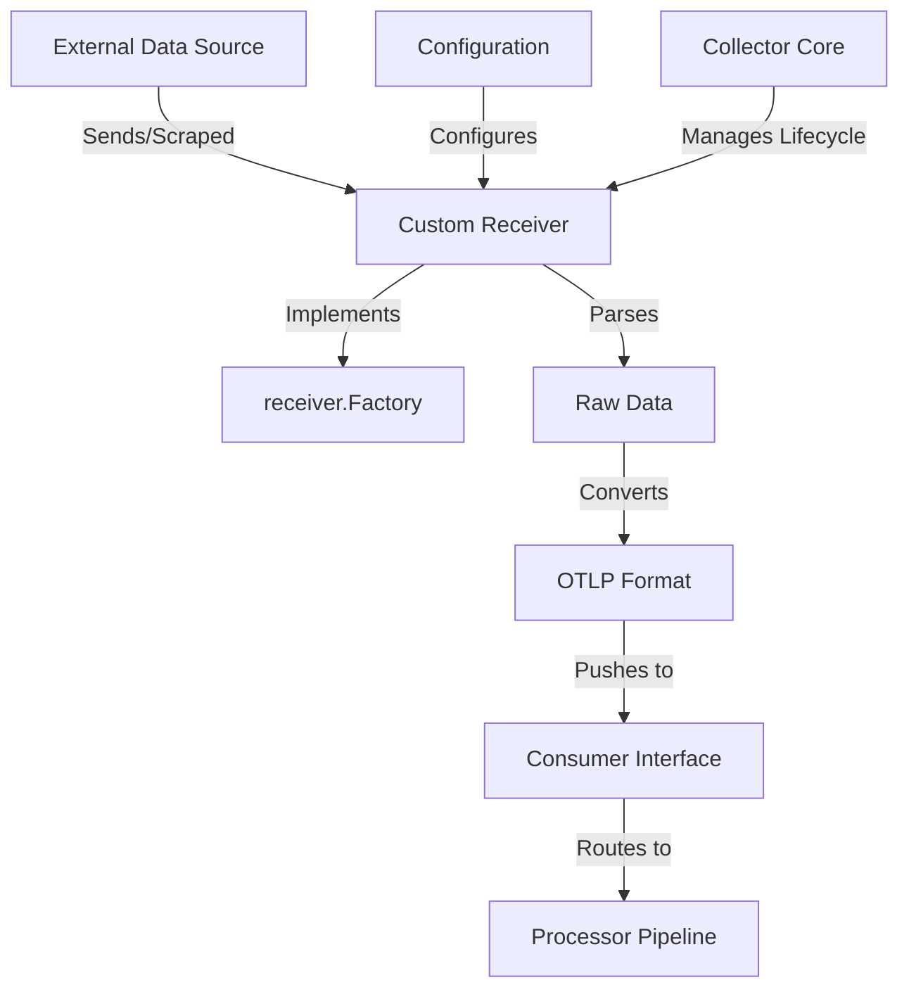

# How to Build a Custom Receiver for the OpenTelemetry Collector

Author: [nawazdhandala](https://www.github.com/nawazdhandala)

Tags: OpenTelemetry, Collector, Custom Receiver, Go Development, Telemetry, Observability

Description: A step-by-step guide to building custom OpenTelemetry Collector receivers in Go, enabling you to collect telemetry from any data source.

Custom receivers enable the OpenTelemetry Collector to ingest telemetry data from sources not supported by existing receivers. Whether you need to collect metrics from proprietary systems, parse custom log formats, or integrate with legacy monitoring tools, building a custom receiver provides the flexibility to bring any data source into your observability pipeline.

## Understanding Receiver Architecture

A receiver is responsible for accepting telemetry data and pushing it into the Collector's processing pipeline. Receivers can operate in two modes:

- **Push-based**: Accept data sent by applications or agents (like OTLP receiver)
- **Pull-based**: Actively fetch data from sources (like Prometheus scraper)

The OpenTelemetry Collector receiver interface defines how receivers interact with the Collector framework, handling lifecycle management, configuration, and telemetry forwarding.

## Receiver Component Architecture



## Project Setup

Create a new Go module for your custom receiver.

```bash
# Create project directory
mkdir custom-receiver
cd custom-receiver

# Initialize Go module
go mod init github.com/yourorg/customreceiver

# Install required dependencies
go get go.opentelemetry.io/collector/component
go get go.opentelemetry.io/collector/consumer
go get go.opentelemetry.io/collector/receiver
go get go.opentelemetry.io/collector/pdata
go get go.uber.org/zap
```

## Define the Configuration Structure

Create a configuration struct that defines settings users can specify in the Collector configuration file.

```go
// config.go
package customreceiver

import (
	"errors"
	"time"

	"go.opentelemetry.io/collector/component"
	"go.opentelemetry.io/collector/config/confighttp"
)

// Config defines the configuration for the custom receiver
type Config struct {
	// HTTPServerSettings embeds common HTTP server configuration
	confighttp.HTTPServerSettings `mapstructure:",squash"`

	// Endpoint specifies the data source endpoint to scrape
	Endpoint string `mapstructure:"endpoint"`

	// CollectionInterval defines how often to collect data
	CollectionInterval time.Duration `mapstructure:"collection_interval"`

	// APIKey for authentication with the data source
	APIKey string `mapstructure:"api_key"`

	// Timeout for data source requests
	Timeout time.Duration `mapstructure:"timeout"`

	// MetricPrefix prepends a prefix to all collected metrics
	MetricPrefix string `mapstructure:"metric_prefix"`
}

// Validate checks if the configuration is valid
func (cfg *Config) Validate() error {
	if cfg.Endpoint == "" {
		return errors.New("endpoint must be specified")
	}

	if cfg.CollectionInterval <= 0 {
		return errors.New("collection_interval must be positive")
	}

	if cfg.Timeout <= 0 {
		return errors.New("timeout must be positive")
	}

	return nil
}

// defaultConfig returns default configuration values
func defaultConfig() component.Config {
	return &Config{
		HTTPServerSettings: confighttp.HTTPServerSettings{
			Endpoint: "localhost:8080",
		},
		CollectionInterval: 30 * time.Second,
		Timeout:            10 * time.Second,
		MetricPrefix:       "custom_",
	}
}
```

## Create the Receiver Factory

The factory creates receiver instances and provides metadata about the receiver component.

```go
// factory.go
package customreceiver

import (
	"context"
	"fmt"

	"go.opentelemetry.io/collector/component"
	"go.opentelemetry.io/collector/consumer"
	"go.opentelemetry.io/collector/receiver"
)

const (
	// typeStr is the name used in the Collector configuration
	typeStr = "custom"

	// stability level of the receiver
	stability = component.StabilityLevelAlpha
)

// NewFactory creates a factory for the custom receiver
func NewFactory() receiver.Factory {
	return receiver.NewFactory(
		typeStr,
		defaultConfig,
		receiver.WithMetrics(createMetricsReceiver, stability),
		receiver.WithTraces(createTracesReceiver, stability),
		receiver.WithLogs(createLogsReceiver, stability),
	)
}

// createMetricsReceiver creates a metrics receiver based on the configuration
func createMetricsReceiver(
	ctx context.Context,
	params receiver.CreateSettings,
	cfg component.Config,
	consumer consumer.Metrics,
) (receiver.Metrics, error) {
	receiverCfg, ok := cfg.(*Config)
	if !ok {
		return nil, fmt.Errorf("invalid config type: %T", cfg)
	}

	// Create and return the metrics receiver
	return newMetricsReceiver(receiverCfg, params, consumer)
}

// createTracesReceiver creates a traces receiver based on the configuration
func createTracesReceiver(
	ctx context.Context,
	params receiver.CreateSettings,
	cfg component.Config,
	consumer consumer.Traces,
) (receiver.Traces, error) {
	receiverCfg, ok := cfg.(*Config)
	if !ok {
		return nil, fmt.Errorf("invalid config type: %T", cfg)
	}

	// Create and return the traces receiver
	return newTracesReceiver(receiverCfg, params, consumer)
}

// createLogsReceiver creates a logs receiver based on the configuration
func createLogsReceiver(
	ctx context.Context,
	params receiver.CreateSettings,
	cfg component.Config,
	consumer consumer.Logs,
) (receiver.Logs, error) {
	receiverCfg, ok := cfg.(*Config)
	if !ok {
		return nil, fmt.Errorf("invalid config type: %T", cfg)
	}

	// Create and return the logs receiver
	return newLogsReceiver(receiverCfg, params, consumer)
}
```

## Implement the Metrics Receiver

Create the core receiver implementation that collects and forwards metrics.

```go
// metrics_receiver.go
package customreceiver

import (
	"context"
	"encoding/json"
	"fmt"
	"io"
	"net/http"
	"time"

	"go.opentelemetry.io/collector/component"
	"go.opentelemetry.io/collector/consumer"
	"go.opentelemetry.io/collector/pdata/pcommon"
	"go.opentelemetry.io/collector/pdata/pmetric"
	"go.opentelemetry.io/collector/receiver"
	"go.uber.org/zap"
)

// metricsReceiver implements the receiver.Metrics interface
type metricsReceiver struct {
	config   *Config
	settings receiver.CreateSettings
	consumer consumer.Metrics
	cancel   context.CancelFunc
	client   *http.Client
}

// newMetricsReceiver creates a new metrics receiver instance
func newMetricsReceiver(
	config *Config,
	settings receiver.CreateSettings,
	consumer consumer.Metrics,
) (receiver.Metrics, error) {
	return &metricsReceiver{
		config:   config,
		settings: settings,
		consumer: consumer,
		client: &http.Client{
			Timeout: config.Timeout,
		},
	}, nil
}

// Start begins the receiver's operation
func (r *metricsReceiver) Start(ctx context.Context, host component.Host) error {
	ctx, r.cancel = context.WithCancel(ctx)

	// Start collection goroutine
	go r.startCollection(ctx)

	r.settings.Logger.Info("Custom metrics receiver started",
		zap.String("endpoint", r.config.Endpoint),
		zap.Duration("interval", r.config.CollectionInterval),
	)

	return nil
}

// Shutdown stops the receiver's operation
func (r *metricsReceiver) Shutdown(ctx context.Context) error {
	if r.cancel != nil {
		r.cancel()
	}

	r.settings.Logger.Info("Custom metrics receiver stopped")
	return nil
}

// startCollection runs the collection loop
func (r *metricsReceiver) startCollection(ctx context.Context) {
	ticker := time.NewTicker(r.config.CollectionInterval)
	defer ticker.Stop()

	for {
		select {
		case <-ctx.Done():
			return
		case <-ticker.C:
			if err := r.collectMetrics(ctx); err != nil {
				r.settings.Logger.Error("Failed to collect metrics", zap.Error(err))
			}
		}
	}
}

// collectMetrics fetches and processes metrics from the data source
func (r *metricsReceiver) collectMetrics(ctx context.Context) error {
	// Fetch data from the external source
	data, err := r.fetchData(ctx)
	if err != nil {
		return fmt.Errorf("failed to fetch data: %w", err)
	}

	// Convert to OpenTelemetry metrics format
	metrics := r.convertToMetrics(data)

	// Send metrics to the consumer (next component in pipeline)
	if err := r.consumer.ConsumeMetrics(ctx, metrics); err != nil {
		return fmt.Errorf("failed to consume metrics: %w", err)
	}

	r.settings.Logger.Debug("Metrics collected and forwarded",
		zap.Int("data_points", metrics.DataPointCount()),
	)

	return nil
}

// fetchData retrieves data from the external source
func (r *metricsReceiver) fetchData(ctx context.Context) (map[string]interface{}, error) {
	req, err := http.NewRequestWithContext(ctx, http.MethodGet, r.config.Endpoint, nil)
	if err != nil {
		return nil, err
	}

	// Add authentication header if API key is configured
	if r.config.APIKey != "" {
		req.Header.Set("Authorization", "Bearer "+r.config.APIKey)
	}

	resp, err := r.client.Do(req)
	if err != nil {
		return nil, err
	}
	defer resp.Body.Close()

	if resp.StatusCode != http.StatusOK {
		return nil, fmt.Errorf("unexpected status code: %d", resp.StatusCode)
	}

	body, err := io.ReadAll(resp.Body)
	if err != nil {
		return nil, err
	}

	var data map[string]interface{}
	if err := json.Unmarshal(body, &data); err != nil {
		return nil, err
	}

	return data, nil
}

// convertToMetrics transforms raw data into OpenTelemetry metrics
func (r *metricsReceiver) convertToMetrics(data map[string]interface{}) pmetric.Metrics {
	metrics := pmetric.NewMetrics()
	resourceMetrics := metrics.ResourceMetrics().AppendEmpty()
	scopeMetrics := resourceMetrics.ScopeMetrics().AppendEmpty()

	// Set resource attributes
	resource := resourceMetrics.Resource()
	resource.Attributes().PutStr("service.name", "custom-receiver")
	resource.Attributes().PutStr("receiver.type", typeStr)

	// Set instrumentation scope
	scopeMetrics.Scope().SetName("github.com/yourorg/customreceiver")
	scopeMetrics.Scope().SetVersion("1.0.0")

	// Parse and convert each metric from the data source
	for key, value := range data {
		metricName := r.config.MetricPrefix + key

		// Determine the metric type based on the value
		switch v := value.(type) {
		case float64:
			// Create a gauge metric for numeric values
			r.addGaugeMetric(scopeMetrics, metricName, v)
		case int:
			r.addGaugeMetric(scopeMetrics, metricName, float64(v))
		case map[string]interface{}:
			// Handle nested objects (could be histogram, summary, etc.)
			r.addComplexMetric(scopeMetrics, metricName, v)
		}
	}

	return metrics
}

// addGaugeMetric adds a gauge metric to the metrics collection
func (r *metricsReceiver) addGaugeMetric(scopeMetrics pmetric.ScopeMetrics, name string, value float64) {
	metric := scopeMetrics.Metrics().AppendEmpty()
	metric.SetName(name)
	metric.SetDescription(fmt.Sprintf("Custom metric: %s", name))
	metric.SetUnit("1")

	gauge := metric.SetEmptyGauge()
	dataPoint := gauge.DataPoints().AppendEmpty()
	dataPoint.SetTimestamp(pcommon.NewTimestampFromTime(time.Now()))
	dataPoint.SetDoubleValue(value)

	// Add attributes to the data point
	dataPoint.Attributes().PutStr("source", "custom_receiver")
}

// addComplexMetric handles more complex metric types
func (r *metricsReceiver) addComplexMetric(scopeMetrics pmetric.ScopeMetrics, name string, data map[string]interface{}) {
	// Check if this is a counter metric
	if count, ok := data["count"].(float64); ok {
		metric := scopeMetrics.Metrics().AppendEmpty()
		metric.SetName(name + "_total")
		metric.SetDescription(fmt.Sprintf("Counter metric: %s", name))
		metric.SetUnit("1")

		sum := metric.SetEmptySum()
		sum.SetIsMonotonic(true)
		sum.SetAggregationTemporality(pmetric.AggregationTemporalityCumulative)

		dataPoint := sum.DataPoints().AppendEmpty()
		dataPoint.SetTimestamp(pcommon.NewTimestampFromTime(time.Now()))
		dataPoint.SetDoubleValue(count)
		dataPoint.Attributes().PutStr("source", "custom_receiver")
	}

	// Check if this is a histogram metric
	if buckets, ok := data["buckets"].([]interface{}); ok {
		r.addHistogramMetric(scopeMetrics, name, data, buckets)
	}
}

// addHistogramMetric creates a histogram metric
func (r *metricsReceiver) addHistogramMetric(scopeMetrics pmetric.ScopeMetrics, name string, data map[string]interface{}, buckets []interface{}) {
	metric := scopeMetrics.Metrics().AppendEmpty()
	metric.SetName(name)
	metric.SetDescription(fmt.Sprintf("Histogram metric: %s", name))
	metric.SetUnit("ms")

	histogram := metric.SetEmptyHistogram()
	histogram.SetAggregationTemporality(pmetric.AggregationTemporalityCumulative)

	dataPoint := histogram.DataPoints().AppendEmpty()
	dataPoint.SetTimestamp(pcommon.NewTimestampFromTime(time.Now()))

	// Set histogram statistics
	if count, ok := data["count"].(float64); ok {
		dataPoint.SetCount(uint64(count))
	}
	if sum, ok := data["sum"].(float64); ok {
		dataPoint.SetSum(sum)
	}

	// Set bucket counts and boundaries
	for _, bucket := range buckets {
		if b, ok := bucket.(map[string]interface{}); ok {
			if boundary, ok := b["boundary"].(float64); ok {
				dataPoint.ExplicitBounds().Append(boundary)
			}
			if count, ok := b["count"].(float64); ok {
				dataPoint.BucketCounts().Append(uint64(count))
			}
		}
	}

	dataPoint.Attributes().PutStr("source", "custom_receiver")
}
```

## Implement Traces and Logs Receivers

For completeness, implement stubs for traces and logs receivers.

```go
// traces_receiver.go
package customreceiver

import (
	"context"

	"go.opentelemetry.io/collector/component"
	"go.opentelemetry.io/collector/consumer"
	"go.opentelemetry.io/collector/receiver"
)

type tracesReceiver struct {
	config   *Config
	settings receiver.CreateSettings
	consumer consumer.Traces
}

func newTracesReceiver(
	config *Config,
	settings receiver.CreateSettings,
	consumer consumer.Traces,
) (receiver.Traces, error) {
	return &tracesReceiver{
		config:   config,
		settings: settings,
		consumer: consumer,
	}, nil
}

func (r *tracesReceiver) Start(ctx context.Context, host component.Host) error {
	r.settings.Logger.Info("Custom traces receiver started")
	return nil
}

func (r *tracesReceiver) Shutdown(ctx context.Context) error {
	r.settings.Logger.Info("Custom traces receiver stopped")
	return nil
}
```

```go
// logs_receiver.go
package customreceiver

import (
	"context"

	"go.opentelemetry.io/collector/component"
	"go.opentelemetry.io/collector/consumer"
	"go.opentelemetry.io/collector/receiver"
)

type logsReceiver struct {
	config   *Config
	settings receiver.CreateSettings
	consumer consumer.Logs
}

func newLogsReceiver(
	config *Config,
	settings receiver.CreateSettings,
	consumer consumer.Logs,
) (receiver.Logs, error) {
	return &logsReceiver{
		config:   config,
		settings: settings,
		consumer: consumer,
	}, nil
}

func (r *logsReceiver) Start(ctx context.Context, host component.Host) error {
	r.settings.Logger.Info("Custom logs receiver started")
	return nil
}

func (r *logsReceiver) Shutdown(ctx context.Context) error {
	r.settings.Logger.Info("Custom logs receiver stopped")
	return nil
}
```

## Write Unit Tests

Create comprehensive tests for your receiver.

```go
// metrics_receiver_test.go
package customreceiver

import (
	"context"
	"net/http"
	"net/http/httptest"
	"testing"
	"time"

	"github.com/stretchr/testify/assert"
	"github.com/stretchr/testify/require"
	"go.opentelemetry.io/collector/component/componenttest"
	"go.opentelemetry.io/collector/consumer/consumertest"
	"go.opentelemetry.io/collector/receiver/receivertest"
)

func TestMetricsReceiver(t *testing.T) {
	// Create a test HTTP server that returns mock data
	server := httptest.NewServer(http.HandlerFunc(func(w http.ResponseWriter, r *http.Request) {
		w.WriteHeader(http.StatusOK)
		w.Write([]byte(`{"cpu_usage": 75.5, "memory_usage": 60.2}`))
	}))
	defer server.Close()

	// Create receiver configuration
	cfg := &Config{
		Endpoint:           server.URL,
		CollectionInterval: 100 * time.Millisecond,
		Timeout:            5 * time.Second,
		MetricPrefix:       "test_",
	}

	// Create a test metrics consumer
	sink := new(consumertest.MetricsSink)

	// Create the receiver
	receiver, err := newMetricsReceiver(
		cfg,
		receivertest.NewNopCreateSettings(),
		sink,
	)
	require.NoError(t, err)

	// Start the receiver
	err = receiver.Start(context.Background(), componenttest.NewNopHost())
	require.NoError(t, err)

	// Wait for metrics to be collected
	time.Sleep(200 * time.Millisecond)

	// Shutdown the receiver
	err = receiver.Shutdown(context.Background())
	require.NoError(t, err)

	// Verify metrics were collected
	assert.Greater(t, len(sink.AllMetrics()), 0)
}

func TestConfigValidation(t *testing.T) {
	tests := []struct {
		name    string
		config  Config
		wantErr bool
	}{
		{
			name: "valid config",
			config: Config{
				Endpoint:           "http://localhost:8080",
				CollectionInterval: 30 * time.Second,
				Timeout:            10 * time.Second,
			},
			wantErr: false,
		},
		{
			name: "missing endpoint",
			config: Config{
				CollectionInterval: 30 * time.Second,
				Timeout:            10 * time.Second,
			},
			wantErr: true,
		},
		{
			name: "invalid collection interval",
			config: Config{
				Endpoint:           "http://localhost:8080",
				CollectionInterval: 0,
				Timeout:            10 * time.Second,
			},
			wantErr: true,
		},
	}

	for _, tt := range tests {
		t.Run(tt.name, func(t *testing.T) {
			err := tt.config.Validate()
			if tt.wantErr {
				assert.Error(t, err)
			} else {
				assert.NoError(t, err)
			}
		})
	}
}
```

## Build and Test the Receiver

Build your receiver module and run tests.

```bash
# Download dependencies
go mod tidy

# Run tests
go test -v ./...

# Run tests with coverage
go test -v -coverprofile=coverage.out ./...
go tool cover -html=coverage.out

# Build the module
go build ./...

# Check for common issues
go vet ./...

# Format code
go fmt ./...
```

## Integrate with the Collector

Create a custom Collector distribution that includes your receiver using OCB.

```yaml
# builder-config.yaml

dist:
  name: otelcol-custom
  description: Collector with custom receiver
  output_path: ./dist
  otelcol_version: 0.95.0

receivers:
  # Include your custom receiver
  - gomod: github.com/yourorg/customreceiver v1.0.0
    path: ../customreceiver

  # Include standard receivers
  - gomod: go.opentelemetry.io/collector/receiver/otlpreceiver v0.95.0

processors:
  - gomod: go.opentelemetry.io/collector/processor/batchprocessor v0.95.0

exporters:
  - gomod: go.opentelemetry.io/collector/exporter/loggingexporter v0.95.0
```

Build the custom Collector:

```bash
# Install OCB if not already installed
go install go.opentelemetry.io/collector/cmd/builder@latest

# Build the Collector
builder --config=builder-config.yaml
```

For details on building custom distributions, see https://oneuptime.com/blog/post/2026-02-06-build-custom-opentelemetry-collector-distribution-ocb/view.

## Configure the Collector

Create a Collector configuration that uses your custom receiver.

```yaml
# config.yaml

receivers:
  # Configure your custom receiver
  custom:
    endpoint: https://api.example.com/metrics
    collection_interval: 30s
    api_key: your-api-key-here
    timeout: 10s
    metric_prefix: myapp_

processors:
  batch:
    timeout: 10s

exporters:
  logging:
    loglevel: info

service:
  pipelines:
    metrics:
      receivers: [custom]
      processors: [batch]
      exporters: [logging]
```

Run the Collector:

```bash
./dist/otelcol-custom --config=config.yaml
```

## Advanced Features

### Add Resource Detection

Automatically detect and add resource attributes.

```go
import (
	"go.opentelemetry.io/collector/pdata/pcommon"
)

func (r *metricsReceiver) addResourceAttributes(resource pcommon.Resource) {
	attrs := resource.Attributes()

	// Add host information
	if hostname, err := os.Hostname(); err == nil {
		attrs.PutStr("host.name", hostname)
	}

	// Add environment information
	attrs.PutStr("deployment.environment", os.Getenv("ENVIRONMENT"))

	// Add cloud provider information if available
	if cloudProvider := detectCloudProvider(); cloudProvider != "" {
		attrs.PutStr("cloud.provider", cloudProvider)
	}
}
```

### Implement Health Checks

Add health check endpoints for monitoring receiver status.

```go
func (r *metricsReceiver) Start(ctx context.Context, host component.Host) error {
	ctx, r.cancel = context.WithCancel(ctx)

	// Start HTTP health check server
	mux := http.NewServeMux()
	mux.HandleFunc("/health", r.healthHandler)
	mux.HandleFunc("/ready", r.readyHandler)

	server := &http.Server{
		Addr:    r.config.HTTPServerSettings.Endpoint,
		Handler: mux,
	}

	go func() {
		if err := server.ListenAndServe(); err != nil && err != http.ErrServerClosed {
			r.settings.Logger.Error("Health check server failed", zap.Error(err))
		}
	}()

	go r.startCollection(ctx)

	return nil
}

func (r *metricsReceiver) healthHandler(w http.ResponseWriter, req *http.Request) {
	w.WriteHeader(http.StatusOK)
	w.Write([]byte("OK"))
}

func (r *metricsReceiver) readyHandler(w http.ResponseWriter, req *http.Request) {
	// Check if receiver is ready to collect data
	if r.isReady() {
		w.WriteHeader(http.StatusOK)
		w.Write([]byte("Ready"))
	} else {
		w.WriteHeader(http.StatusServiceUnavailable)
		w.Write([]byte("Not Ready"))
	}
}
```

### Add Retry Logic

Implement retry logic for transient failures.

```go
import (
	"github.com/cenkalti/backoff/v4"
)

func (r *metricsReceiver) fetchDataWithRetry(ctx context.Context) (map[string]interface{}, error) {
	var data map[string]interface{}

	operation := func() error {
		var err error
		data, err = r.fetchData(ctx)
		return err
	}

	// Configure exponential backoff
	expBackoff := backoff.NewExponentialBackOff()
	expBackoff.MaxElapsedTime = r.config.Timeout

	err := backoff.Retry(operation, backoff.WithContext(expBackoff, ctx))
	return data, err
}
```

## Best Practices

When building custom receivers:

1. **Validate configuration** in the Config.Validate() method to catch errors early
2. **Use structured logging** with zap for consistent log output
3. **Handle context cancellation** properly to support graceful shutdown
4. **Add comprehensive tests** including unit tests and integration tests
5. **Document configuration options** clearly in comments and README
6. **Follow semantic versioning** for your receiver module
7. **Respect collection intervals** to avoid overwhelming data sources
8. **Implement backoff and retry** for transient failures
9. **Add metrics** to monitor receiver performance
10. **Use type-safe pdata APIs** for constructing telemetry data

## Troubleshooting

### Receiver Not Collecting Data

Check that:
- The endpoint is accessible from the Collector
- Authentication credentials are correct
- Collection interval is configured
- The receiver is included in the service pipeline

### High Memory Usage

Optimize by:
- Reducing collection interval
- Batching data before forwarding
- Implementing memory limits
- Using streaming instead of loading all data

### Data Not Appearing in Backend

Verify:
- The receiver is forwarding to the consumer
- Processors are not filtering out data
- Exporters are configured correctly
- Network connectivity to backends

## Conclusion

Building custom receivers for the OpenTelemetry Collector enables you to integrate any data source into your observability pipeline. By following the receiver interface and using the pdata APIs, you can create robust, production-ready receivers that collect telemetry from proprietary systems, legacy tools, or specialized data sources. Combined with custom processors and exporters, custom receivers provide complete flexibility in building your telemetry pipeline.

For related topics, see:
- https://oneuptime.com/blog/post/2026-02-06-build-custom-processor-opentelemetry-collector/view
- https://oneuptime.com/blog/post/2026-02-06-build-custom-exporter-opentelemetry-collector/view
- https://oneuptime.com/blog/post/2026-02-06-build-custom-extension-opentelemetry-collector/view
