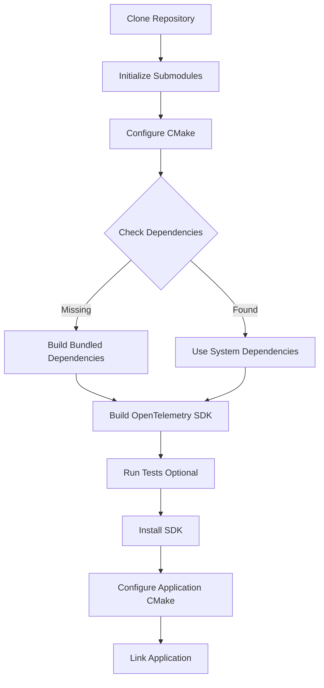

# How to Build and Install OpenTelemetry C++ SDK with CMake

Author: [nawazdhandala](https://www.github.com/nawazdhandala)

Tags: OpenTelemetry, C++, SDK, CMake, Build, Installation

Description: A comprehensive guide to building and installing the OpenTelemetry C++ SDK from source using CMake, covering prerequisites, configuration options, and troubleshooting common build issues.

Getting OpenTelemetry working in C++ applications requires building the SDK from source, as pre-built binaries are not consistently available across platforms. The build process involves CMake and several dependencies, but once you understand the configuration options, it becomes straightforward.

## Prerequisites

Before building the OpenTelemetry C++ SDK, you need to ensure your system has the necessary tools and libraries. The SDK requires a C++14-compliant compiler at minimum, though C++17 or later is recommended for better compatibility.

For Linux systems, install the build essentials:

```bash
# Ubuntu/Debian
sudo apt-get update
sudo apt-get install build-essential cmake git libcurl4-openssl-dev

# RHEL/CentOS/Fedora
sudo yum groupinstall "Development Tools"
sudo yum install cmake git libcurl-devel
```

For macOS, use Homebrew:

```bash
brew install cmake git curl
```

Windows users should install Visual Studio 2017 or later with C++ build tools and CMake.

## Cloning the Repository

The OpenTelemetry C++ SDK is hosted on GitHub. Clone the repository with submodules, as the SDK depends on several third-party libraries:

```bash
# Clone the repository with all submodules
git clone --recursive https://github.com/open-telemetry/opentelemetry-cpp.git
cd opentelemetry-cpp

# If you forgot --recursive, initialize submodules separately
git submodule update --init --recursive
```

The `--recursive` flag is critical because OpenTelemetry C++ includes dependencies like Google Test, Abseil, and others as submodules.

## Basic Build Configuration

Create a separate build directory to keep the source tree clean:

```bash
mkdir build
cd build
```

Run CMake with basic configuration options:

```bash
# Configure the build with essential options
cmake .. \
  -DCMAKE_BUILD_TYPE=Release \
  -DBUILD_SHARED_LIBS=ON \
  -DCMAKE_INSTALL_PREFIX=/usr/local
```

The `CMAKE_BUILD_TYPE=Release` flag optimizes the build for production use. Use `Debug` instead if you need debugging symbols.

## Enabling Exporters

OpenTelemetry supports multiple exporters for sending telemetry data. Enable the ones you need:

```bash
# Build with OTLP exporters (most common)
cmake .. \
  -DCMAKE_BUILD_TYPE=Release \
  -DBUILD_SHARED_LIBS=ON \
  -DWITH_OTLP_GRPC=ON \
  -DWITH_OTLP_HTTP=ON \
  -DCMAKE_INSTALL_PREFIX=/usr/local
```

For Jaeger or Zipkin exporters:

```bash
# Include additional exporters
cmake .. \
  -DCMAKE_BUILD_TYPE=Release \
  -DBUILD_SHARED_LIBS=ON \
  -DWITH_OTLP_GRPC=ON \
  -DWITH_OTLP_HTTP=ON \
  -DWITH_JAEGER=ON \
  -DWITH_ZIPKIN=ON \
  -DCMAKE_INSTALL_PREFIX=/usr/local
```

## Configuring Dependencies

The SDK can use system-installed dependencies or build them from the included submodules. Using system dependencies reduces build time:

```bash
# Use system-installed Abseil and Protobuf (if available)
cmake .. \
  -DCMAKE_BUILD_TYPE=Release \
  -DBUILD_SHARED_LIBS=ON \
  -DWITH_OTLP_GRPC=ON \
  -DWITH_ABSEIL=ON \
  -DWITH_STL=ON \
  -DCMAKE_INSTALL_PREFIX=/usr/local
```

If you encounter dependency version conflicts, let CMake build the bundled versions:

```bash
# Build all dependencies from submodules
cmake .. \
  -DCMAKE_BUILD_TYPE=Release \
  -DBUILD_SHARED_LIBS=ON \
  -DWITH_OTLP_GRPC=ON \
  -DWITH_ABSEIL=OFF \
  -DCMAKE_INSTALL_PREFIX=/usr/local
```

## Building the SDK

After configuration, build the SDK using make or ninja:

```bash
# Build using all available CPU cores
cmake --build . -j$(nproc)

# Or specify a number of parallel jobs
cmake --build . -j4
```

The build process can take 10-30 minutes depending on your system and enabled features. Monitor for errors related to missing dependencies or compiler issues.

## Installing the SDK

Once built successfully, install the SDK to your system:

```bash
# Install to the prefix specified during configuration
sudo cmake --install .
```

This installs headers to `/usr/local/include/opentelemetry` and libraries to `/usr/local/lib` (or your specified prefix).

Verify the installation:

```bash
# Check installed headers
ls /usr/local/include/opentelemetry

# Check installed libraries
ls /usr/local/lib | grep opentelemetry
```

## CMake Configuration for Your Project

After installing the SDK, configure your C++ project to use it. Create a `CMakeLists.txt`:

```cmake
cmake_minimum_required(VERSION 3.14)
project(MyApp CXX)

set(CMAKE_CXX_STANDARD 17)
set(CMAKE_CXX_STANDARD_REQUIRED ON)

# Find OpenTelemetry package
find_package(opentelemetry-cpp CONFIG REQUIRED)

# Create your executable
add_executable(myapp main.cpp)

# Link against OpenTelemetry libraries
target_link_libraries(myapp
    PRIVATE
    opentelemetry-cpp::api
    opentelemetry-cpp::sdk
    opentelemetry-cpp::otlp_grpc_exporter
    opentelemetry-cpp::otlp_http_exporter
)
```

## Custom Installation Prefix

If you cannot install to system directories, use a custom prefix:

```bash
# Install to a local directory
cmake .. \
  -DCMAKE_BUILD_TYPE=Release \
  -DBUILD_SHARED_LIBS=ON \
  -DWITH_OTLP_GRPC=ON \
  -DCMAKE_INSTALL_PREFIX=$HOME/opentelemetry

cmake --build . -j$(nproc)
cmake --install .
```

Then configure your project to find the custom installation:

```bash
# Set CMAKE_PREFIX_PATH when building your application
cmake -DCMAKE_PREFIX_PATH=$HOME/opentelemetry ..
```

## Static vs Shared Libraries

Choose between static and shared libraries based on your deployment needs:

```bash
# Build static libraries (easier deployment)
cmake .. \
  -DCMAKE_BUILD_TYPE=Release \
  -DBUILD_SHARED_LIBS=OFF \
  -DWITH_OTLP_GRPC=ON

# Build shared libraries (smaller binary size)
cmake .. \
  -DCMAKE_BUILD_TYPE=Release \
  -DBUILD_SHARED_LIBS=ON \
  -DWITH_OTLP_GRPC=ON
```

Static libraries increase your binary size but eliminate runtime dependencies. Shared libraries reduce binary size but require the libraries to be present at runtime.

## Troubleshooting Build Issues

If CMake cannot find Abseil:

```bash
# Install Abseil separately
git clone https://github.com/abseil/abseil-cpp.git
cd abseil-cpp
mkdir build && cd build
cmake .. -DCMAKE_INSTALL_PREFIX=/usr/local -DCMAKE_CXX_STANDARD=17
cmake --build . -j$(nproc)
sudo cmake --install .
```

For Protobuf version conflicts:

```bash
# Install a compatible Protobuf version
wget https://github.com/protocolbuffers/protobuf/releases/download/v21.12/protobuf-cpp-3.21.12.tar.gz
tar -xzf protobuf-cpp-3.21.12.tar.gz
cd protobuf-3.21.12
./configure --prefix=/usr/local
make -j$(nproc)
sudo make install
```

## Build Diagram

Here's how the build process flows:



## Running Tests

Verify your build by running the test suite:

```bash
# Enable tests during configuration
cmake .. \
  -DCMAKE_BUILD_TYPE=Release \
  -DBUILD_SHARED_LIBS=ON \
  -DWITH_OTLP_GRPC=ON \
  -DBUILD_TESTING=ON

cmake --build . -j$(nproc)

# Run all tests
ctest --output-on-failure
```

Tests help ensure the SDK was built correctly for your platform.

## Advanced Configuration Options

For production builds, consider these additional flags:

```bash
cmake .. \
  -DCMAKE_BUILD_TYPE=Release \
  -DBUILD_SHARED_LIBS=ON \
  -DWITH_OTLP_GRPC=ON \
  -DWITH_OTLP_HTTP=ON \
  -DWITH_ZPAGES=OFF \
  -DWITH_EXAMPLES=OFF \
  -DBUILD_TESTING=OFF \
  -DWITH_BENCHMARK=OFF \
  -DCMAKE_POSITION_INDEPENDENT_CODE=ON
```

The `CMAKE_POSITION_INDEPENDENT_CODE` flag is essential if you plan to use the SDK in shared libraries.

Building the OpenTelemetry C++ SDK takes some time initially, but the process is reproducible and well-documented. Once installed, you can instrument your C++ applications with distributed tracing and metrics.
