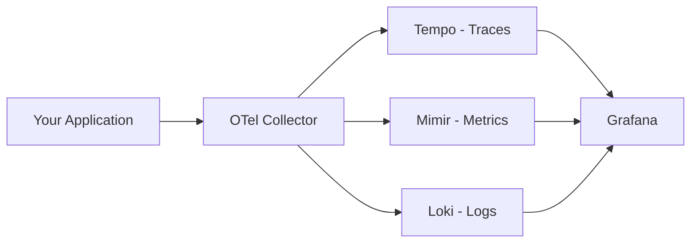

# How to Build a Local LGTM Stack for OpenTelemetry Development

Author: [nawazdhandala](https://www.github.com/nawazdhandala)

Tags: OpenTelemetry, LGTM Stack, Loki, Grafana, Tempo, Mimir, Local Development, Docker

Description: Learn how to build a complete local LGTM stack with Loki, Grafana, Tempo, and Mimir for OpenTelemetry development and testing.

---

The LGTM stack gives you a complete observability backend: Loki for logs, Grafana for visualization, Tempo for traces, and Mimir for metrics. Running this stack locally alongside an OpenTelemetry Collector creates a full-featured development environment where you can see your traces, metrics, and logs in the same dashboards you would use in production. No cloud accounts. No shared infrastructure. Just your machine and Docker.

This guide walks you through setting up every component, wiring them together, and configuring the OpenTelemetry Collector to feed data into the stack.

## Architecture Overview

The local LGTM stack follows a straightforward data flow. Your application sends telemetry to the OpenTelemetry Collector, which processes and routes it to the appropriate backend:



Each component handles one signal type, and Grafana ties them all together with cross-signal correlation.

## The Docker Compose File

Here is the complete Docker Compose configuration for the entire stack:

```yaml
# docker-compose.yaml
# Complete LGTM stack for local OpenTelemetry development

version: '3.8'

services:
  # OpenTelemetry Collector - receives and routes all telemetry
  otel-collector:
    image: otel/opentelemetry-collector-contrib:latest
    container_name: otel-collector
    volumes:
      - ./config/otel-collector.yaml:/etc/otelcol-contrib/config.yaml
    ports:
      - "4317:4317"   # OTLP gRPC
      - "4318:4318"   # OTLP HTTP
    depends_on:
      - tempo
      - mimir
      - loki

  # Grafana Tempo - distributed tracing backend
  tempo:
    image: grafana/tempo:latest
    container_name: tempo
    volumes:
      - ./config/tempo.yaml:/etc/tempo/config.yaml
      - tempo-data:/var/tempo
    command: ["-config.file=/etc/tempo/config.yaml"]
    ports:
      - "3200:3200"   # Tempo API

  # Grafana Mimir - long-term metrics storage
  mimir:
    image: grafana/mimir:latest
    container_name: mimir
    volumes:
      - ./config/mimir.yaml:/etc/mimir/config.yaml
      - mimir-data:/data
    command: ["-config.file=/etc/mimir/config.yaml"]
    ports:
      - "9009:9009"   # Mimir API

  # Grafana Loki - log aggregation
  loki:
    image: grafana/loki:latest
    container_name: loki
    volumes:
      - ./config/loki.yaml:/etc/loki/config.yaml
      - loki-data:/loki
    command: ["-config.file=/etc/loki/config.yaml"]
    ports:
      - "3100:3100"   # Loki API

  # Grafana - visualization and dashboards
  grafana:
    image: grafana/grafana:latest
    container_name: grafana
    environment:
      - GF_AUTH_ANONYMOUS_ENABLED=true
      - GF_AUTH_ANONYMOUS_ORG_ROLE=Admin
      - GF_AUTH_DISABLE_LOGIN_FORM=true
    volumes:
      - ./config/grafana-datasources.yaml:/etc/grafana/provisioning/datasources/datasources.yaml
      - grafana-data:/var/lib/grafana
    ports:
      - "3000:3000"   # Grafana UI
    depends_on:
      - tempo
      - mimir
      - loki

volumes:
  tempo-data:
  mimir-data:
  loki-data:
  grafana-data:
```

This sets up five services. The Collector receives all telemetry and routes it. Tempo, Mimir, and Loki each store one signal type. Grafana provides the unified UI.

## Configuring Tempo for Traces

Tempo needs minimal configuration for local development:

```yaml
# config/tempo.yaml
# Grafana Tempo configuration for local development

# Server configuration
server:
  http_listen_port: 3200

# Distributor receives traces from the Collector
distributor:
  receivers:
    otlp:
      protocols:
        grpc:
          endpoint: 0.0.0.0:4317

# Ingester writes traces to the backend
ingester:
  trace_idle_period: 10s
  max_block_bytes: 1048576
  max_block_duration: 5m

# Compactor merges blocks for efficient storage
compactor:
  compaction:
    block_retention: 48h

# Storage configuration using local filesystem
storage:
  trace:
    backend: local
    local:
      path: /var/tempo/blocks
    wal:
      path: /var/tempo/wal

# Metrics generator creates span metrics for RED dashboards
metrics_generator:
  registry:
    external_labels:
      source: tempo
  storage:
    path: /var/tempo/generator/wal
    remote_write:
      - url: http://mimir:9009/api/v1/push
```

The `metrics_generator` section is particularly useful. It automatically creates RED metrics (Rate, Errors, Duration) from your traces and sends them to Mimir. This gives you service-level metrics without any additional instrumentation.

## Configuring Mimir for Metrics

Mimir handles long-term metrics storage. For local development, a single-instance configuration works well:

```yaml
# config/mimir.yaml
# Grafana Mimir configuration for local development

# Run all components in a single process
target: all

# Server settings
server:
  http_listen_port: 9009
  grpc_listen_port: 9095

# Single-tenant mode for simplicity
multitenancy_enabled: false

# Block storage configuration
blocks_storage:
  backend: filesystem
  filesystem:
    dir: /data/blocks
  tsdb:
    dir: /data/tsdb
  bucket_store:
    sync_dir: /data/sync

# Compactor settings
compactor:
  data_dir: /data/compactor
  sharding_ring:
    kvstore:
      store: memberlist

# Distributor accepts remote write from the Collector
distributor:
  ring:
    kvstore:
      store: memberlist

# Ingester configuration
ingester:
  ring:
    kvstore:
      store: memberlist
    replication_factor: 1

# Store gateway for querying blocks
store_gateway:
  sharding_ring:
    replication_factor: 1

# Ruler for alerting rules
ruler_storage:
  backend: filesystem
  filesystem:
    dir: /data/rules
```

The key setting here is `multitenancy_enabled: false`, which simplifies the setup by removing the need for tenant headers on every request.

## Configuring Loki for Logs

Loki stores and indexes your logs:

```yaml
# config/loki.yaml
# Grafana Loki configuration for local development

auth_enabled: false

server:
  http_listen_port: 3100

# Common configuration shared across components
common:
  path_prefix: /loki
  storage:
    filesystem:
      chunks_directory: /loki/chunks
      rules_directory: /loki/rules
  replication_factor: 1
  ring:
    kvstore:
      store: inmemory

# Schema configuration defines how data is stored
schema_config:
  configs:
    - from: 2020-10-24
      store: tsdb
      object_store: filesystem
      schema: v13
      index:
        prefix: index_
        period: 24h

# Limits for local development
limits_config:
  allow_structured_metadata: true
  volume_enabled: true
```

Setting `auth_enabled: false` removes authentication requirements, which keeps things simple for local development.

## Configuring the OpenTelemetry Collector

Now wire the Collector to send data to all three backends:

```yaml
# config/otel-collector.yaml
# Collector configuration routing to the LGTM stack

receivers:
  otlp:
    protocols:
      grpc:
        endpoint: 0.0.0.0:4317
      http:
        endpoint: 0.0.0.0:4318

processors:
  # Batch processor for efficient data transfer
  batch:
    timeout: 5s
    send_batch_size: 512

  # Add resource attributes for better correlation
  resource:
    attributes:
      - key: environment
        value: local-dev
        action: upsert

exporters:
  # Send traces to Tempo via OTLP
  otlp/tempo:
    endpoint: tempo:4317
    tls:
      insecure: true

  # Send metrics to Mimir via Prometheus remote write
  prometheusremotewrite/mimir:
    endpoint: http://mimir:9009/api/v1/push
    tls:
      insecure: true

  # Send logs to Loki via the loki exporter
  loki:
    endpoint: http://loki:3100/loki/api/v1/push

  # Keep debug output for development visibility
  debug:
    verbosity: basic

service:
  pipelines:
    traces:
      receivers: [otlp]
      processors: [resource, batch]
      exporters: [otlp/tempo, debug]
    metrics:
      receivers: [otlp]
      processors: [resource, batch]
      exporters: [prometheusremotewrite/mimir, debug]
    logs:
      receivers: [otlp]
      processors: [resource, batch]
      exporters: [loki, debug]
```

Each pipeline routes one signal type to its corresponding backend. The `resource` processor adds an `environment` attribute to everything, which helps distinguish local development data from other sources if you ever connect to a shared backend.

## Configuring Grafana Data Sources

Provision the data sources automatically so Grafana is ready to use immediately:

```yaml
# config/grafana-datasources.yaml
# Auto-provisioned data sources for Grafana

apiVersion: 1

datasources:
  # Tempo for traces
  - name: Tempo
    type: tempo
    access: proxy
    url: http://tempo:3200
    isDefault: false
    jsonData:
      tracesToLogsV2:
        datasourceUid: loki
        filterByTraceID: true
      tracesToMetrics:
        datasourceUid: mimir
      nodeGraph:
        enabled: true
      serviceMap:
        datasourceUid: mimir

  # Mimir for metrics
  - name: Mimir
    type: prometheus
    access: proxy
    url: http://mimir:9009/prometheus
    isDefault: true
    jsonData:
      exemplarTraceIdDestinations:
        - name: traceID
          datasourceUid: tempo

  # Loki for logs
  - name: Loki
    type: loki
    access: proxy
    url: http://loki:3100
    isDefault: false
    jsonData:
      derivedFields:
        - name: TraceID
          datasourceUid: tempo
          matcherRegex: "traceID=(\\w+)"
          url: "$${__value.raw}"
```

The `jsonData` sections configure cross-signal correlation. When you view a trace in Tempo, you can jump directly to related logs in Loki. When you see a metric spike in Mimir, you can drill down to the traces that caused it.

## Starting the Stack

Create the config directory and launch everything:

```bash
# Create the config directory structure
mkdir -p config

# Copy your configuration files into the config directory
# (assuming you have created all the yaml files above)

# Start the entire stack
docker compose up -d

# Verify all containers are running
docker compose ps

# Watch the Collector logs for any errors
docker compose logs -f otel-collector
```

After a few seconds, all services should be healthy. Open Grafana at `http://localhost:3000` and you will see the pre-configured data sources.

## Sending Test Data

Point your application at the Collector to start seeing data:

```bash
# Configure your application's OpenTelemetry SDK
export OTEL_EXPORTER_OTLP_ENDPOINT=http://localhost:4317
export OTEL_SERVICE_NAME=my-local-service
export OTEL_LOGS_EXPORTER=otlp

# Or send test data with telemetrygen
telemetrygen traces --otlp-insecure --traces 50
telemetrygen metrics --otlp-insecure --metrics 20
telemetrygen logs --otlp-insecure --logs 30
```

Within seconds, you should see traces in Grafana's Tempo explore view, metrics in the Prometheus data source, and logs in Loki.

## Useful Grafana Explorations

Once data is flowing, try these explorations in Grafana:

Open the Explore view and select the Tempo data source. Search for traces by service name. Click on any trace to see the waterfall view with span details.

Switch to the Mimir data source and query for your service metrics. If you enabled the Tempo metrics generator, you will see automatic `traces_spanmetrics_*` metrics without any additional instrumentation.

Select the Loki data source and filter logs by labels. If your application includes trace IDs in log messages, click on the trace ID link to jump directly to the corresponding trace in Tempo.

## Tearing Down and Resetting

When you need to start fresh or free up resources:

```bash
# Stop all containers but keep data
docker compose stop

# Stop and remove containers, keeping data volumes
docker compose down

# Stop everything and delete all data
docker compose down -v
```

The `-v` flag removes the named volumes, wiping all stored traces, metrics, and logs. This is useful when you want a clean slate for a new round of testing.

## Wrapping Up

A local LGTM stack gives you the same observability experience you would have in production, running entirely on your development machine. By combining the OpenTelemetry Collector with Grafana's Tempo, Mimir, and Loki, you get full trace, metric, and log support with cross-signal correlation. This setup is invaluable for developing and testing instrumentation, building dashboards, and validating your observability pipeline before deploying changes to shared environments.
