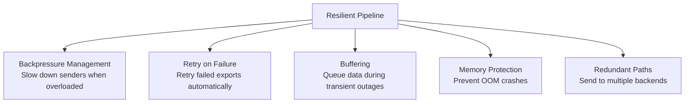
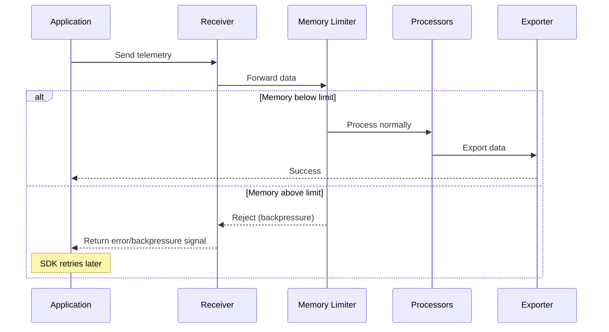
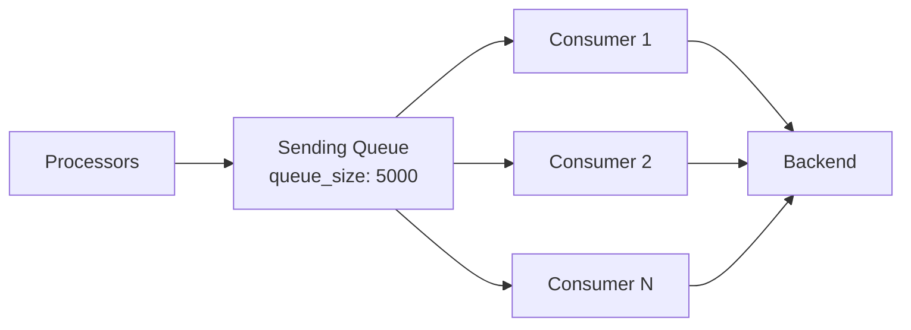
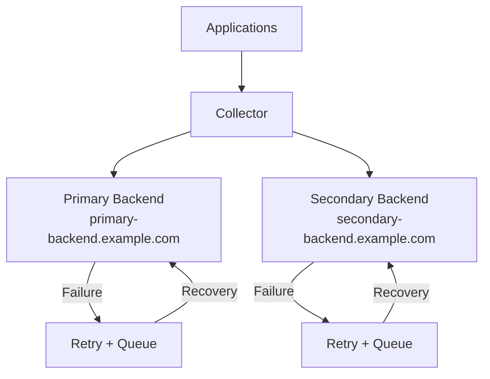
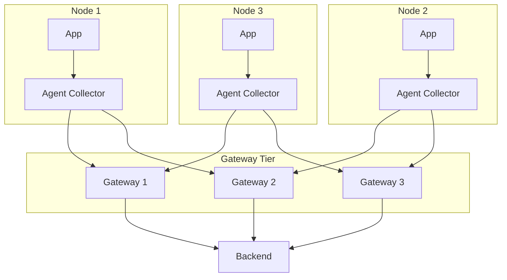

# How to Build Resilient Telemetry Pipelines with the OpenTelemetry Collector

Author: [nawazdhandala](https://www.github.com/nawazdhandala)

Tags: OpenTelemetry, Collector, Resilience, Pipelines, Reliability

Description: Design OpenTelemetry Collector pipelines that handle failures gracefully with retry logic, buffering, backpressure, and redundant export paths.

---

Telemetry data is only valuable when it actually reaches your backend. Network blips, backend outages, traffic spikes, and resource exhaustion can all cause data loss in a naive pipeline setup. The OpenTelemetry Collector has several built-in mechanisms for building resilient pipelines, but you need to configure them deliberately. This post covers the patterns and configurations that keep your telemetry flowing even when things go wrong.

## What Makes a Pipeline Resilient?

A resilient telemetry pipeline handles five failure modes:



## Backpressure with the Memory Limiter

The memory limiter processor is your first line of defense. It monitors the collector's memory usage and starts refusing new data before the process runs out of memory.

```yaml
# Memory limiter configuration
# Place this FIRST in every pipeline's processor list
processors:
  memory_limiter:
    # How often to check memory usage
    check_interval: 1s
    # Start dropping data when memory reaches 80% of the limit
    limit_percentage: 80
    # Allow spikes up to 25% above the soft limit before hard-refusing
    spike_limit_percentage: 25
```

The order matters. The memory limiter must be the first processor in the chain so it can reject data before any other processing happens:

```yaml
service:
  pipelines:
    traces:
      receivers: [otlp]
      # Memory limiter goes first to protect against OOM
      processors: [memory_limiter, batch, attributes]
      exporters: [otlp]
```

Here is how backpressure flows through the system:



## Retry Logic in Exporters

Every exporter supports configurable retry behavior. The default settings are conservative, and you should tune them for your environment:

```yaml
exporters:
  otlp:
    endpoint: "backend.example.com:4317"

    # Retry configuration for transient failures
    retry_on_failure:
      # Enable retry logic
      enabled: true
      # Wait this long before the first retry
      initial_interval: 5s
      # Double the wait time between retries, up to the max
      multiplier: 2.0
      # Never wait longer than this between retries
      max_interval: 30s
      # Give up after this total elapsed time
      max_elapsed_time: 300s
      # Randomize wait times by this factor to prevent thundering herd
      randomization_factor: 0.5
```

The retry timing looks like this in practice:

```mermaid
gantt
    title Retry Timeline Example
    dateFormat X
    axisFormat %s

    section Export Attempts
    Attempt 1 (fail)     :0, 1
    Wait ~5s             :1, 6
    Attempt 2 (fail)     :6, 7
    Wait ~10s            :7, 17
    Attempt 3 (fail)     :17, 18
    Wait ~20s            :18, 38
    Attempt 4 (success)  :38, 39
```



## Batching for Throughput

The batch processor groups telemetry data before sending it to exporters. This reduces the number of network calls and improves throughput:

```yaml
processors:
  batch:
    # Maximum time to wait before sending a batch
    # Even if the batch is not full, send after this timeout
    timeout: 5s

    # Send a batch when it reaches this many items
    send_batch_size: 8192

    # Hard upper limit on batch size
    # If this is hit, the batch is sent immediately
    send_batch_max_size: 16384
```

For high-throughput environments, tune these values based on your traffic patterns:

```yaml
processors:
  # Aggressive batching for high-volume traces
  batch/traces:
    timeout: 2s
    send_batch_size: 10000
    send_batch_max_size: 20000

  # Less aggressive batching for metrics (they are smaller)
  batch/metrics:
    timeout: 10s
    send_batch_size: 5000

  # Quick flush for logs to reduce latency
  batch/logs:
    timeout: 1s
    send_batch_size: 1000
```

Use named batchers in different pipelines:

```yaml
service:
  pipelines:
    traces:
      receivers: [otlp]
      processors: [memory_limiter, batch/traces]
      exporters: [otlp]
    metrics:
      receivers: [otlp]
      processors: [memory_limiter, batch/metrics]
      exporters: [otlp]
    logs:
      receivers: [otlp]
      processors: [memory_limiter, batch/logs]
      exporters: [otlp]
```

## Queued Exports

Exporters support a sending queue that buffers data when the backend is slow or unavailable:

```yaml
exporters:
  otlp:
    endpoint: "backend.example.com:4317"

    # Queue configuration for buffering during outages
    sending_queue:
      # Enable the queue
      enabled: true
      # Number of batches to keep in the queue
      # Higher values tolerate longer outages but use more memory
      num_consumers: 10
      # Maximum number of batches waiting in the queue
      queue_size: 5000

    retry_on_failure:
      enabled: true
      initial_interval: 5s
      max_interval: 30s
      max_elapsed_time: 300s
```

The queue sits between the processor chain and the actual export:



## Redundant Export Paths

Send telemetry to multiple backends so that a single backend failure does not cause data loss:

```yaml
exporters:
  # Primary backend
  otlp/primary:
    endpoint: "primary-backend.example.com:4317"
    retry_on_failure:
      enabled: true
      max_elapsed_time: 120s
    sending_queue:
      enabled: true
      queue_size: 5000

  # Secondary/backup backend
  otlp/secondary:
    endpoint: "secondary-backend.example.com:4317"
    retry_on_failure:
      enabled: true
      max_elapsed_time: 120s
    sending_queue:
      enabled: true
      queue_size: 5000

service:
  pipelines:
    traces:
      receivers: [otlp]
      processors: [memory_limiter, batch]
      # Data goes to both backends simultaneously
      exporters: [otlp/primary, otlp/secondary]
```



## Multi-Tier Architecture

For large deployments, use a tiered collector architecture. Agent collectors run on each node and forward to a gateway cluster:

```yaml
# agent-config.yaml
# Lightweight agent running on each node
# Handles local collection and forwards to the gateway tier

receivers:
  otlp:
    protocols:
      grpc:
        endpoint: "0.0.0.0:4317"
  hostmetrics:
    collection_interval: 30s
    scrapers:
      cpu: {}
      memory: {}

processors:
  memory_limiter:
    check_interval: 1s
    limit_percentage: 75
  batch:
    timeout: 2s
    send_batch_size: 1000

exporters:
  # Load-balanced export to the gateway tier
  loadbalancing:
    protocol:
      otlp:
        tls:
          insecure: true
    resolver:
      dns:
        hostname: otel-gateway.internal
        port: 4317

service:
  pipelines:
    traces:
      receivers: [otlp]
      processors: [memory_limiter, batch]
      exporters: [loadbalancing]
    metrics:
      receivers: [otlp, hostmetrics]
      processors: [memory_limiter, batch]
      exporters: [loadbalancing]
```

```yaml
# gateway-config.yaml
# Gateway tier handles heavy processing and export to backends
# Multiple replicas behind a load balancer

receivers:
  otlp:
    protocols:
      grpc:
        endpoint: "0.0.0.0:4317"

processors:
  memory_limiter:
    check_interval: 1s
    limit_percentage: 80

  batch:
    timeout: 5s
    send_batch_size: 10000

  # Heavy processing happens at the gateway tier
  k8sattributes:
    extract:
      metadata:
        - k8s.pod.name
        - k8s.namespace.name
        - k8s.deployment.name

  tail_sampling:
    decision_wait: 10s
    policies:
      - name: error-traces
        type: status_code
        status_code: {status_codes: [ERROR]}
      - name: slow-traces
        type: latency
        latency: {threshold_ms: 2000}
      - name: sample-rest
        type: probabilistic
        probabilistic: {sampling_percentage: 10}

exporters:
  otlp:
    endpoint: "backend.example.com:4317"
    retry_on_failure:
      enabled: true
      max_elapsed_time: 300s
    sending_queue:
      enabled: true
      queue_size: 10000
      num_consumers: 20

service:
  pipelines:
    traces:
      receivers: [otlp]
      processors: [memory_limiter, k8sattributes, tail_sampling, batch]
      exporters: [otlp]
    metrics:
      receivers: [otlp]
      processors: [memory_limiter, batch]
      exporters: [otlp]
```

The tiered architecture provides resilience at multiple levels:



## Health Monitoring

Monitor the collector itself so you know when the pipeline is degraded:

```yaml
extensions:
  health_check:
    endpoint: "0.0.0.0:13133"
    path: "/health"
    check_collector_pipeline:
      enabled: true
      # Report unhealthy if the exporter queue is 80% full
      exporter_failure_threshold: 5

  # Expose internal metrics about the collector's performance
  zpages:
    endpoint: "0.0.0.0:55679"

service:
  extensions: [health_check, zpages]
  telemetry:
    metrics:
      # The collector can export metrics about itself
      address: "0.0.0.0:8888"
      level: detailed
```

Set up alerts on these key collector metrics:

| Metric | Alert Threshold | What it Means |
|---|---|---|
| `otelcol_exporter_queue_size` | > 80% of capacity | Backend is slow, queue is filling up |
| `otelcol_exporter_send_failed_requests` | Increasing | Exports are failing |
| `otelcol_receiver_refused_spans` | > 0 | Memory limiter is active, data is being dropped |
| `otelcol_processor_batch_timeout_trigger_send` | Increasing | Batches are timing out before filling |

## Wrapping Up

Resilient telemetry pipelines do not happen by accident. Configure the memory limiter to prevent crashes, enable retry logic to handle transient failures, use queues to buffer during outages, and consider redundant export paths for critical telemetry. For large deployments, a multi-tier architecture with agents and gateways gives you the best combination of performance and reliability. Monitor the collector itself as carefully as you monitor your applications, because when the collector goes down, you are flying blind.
