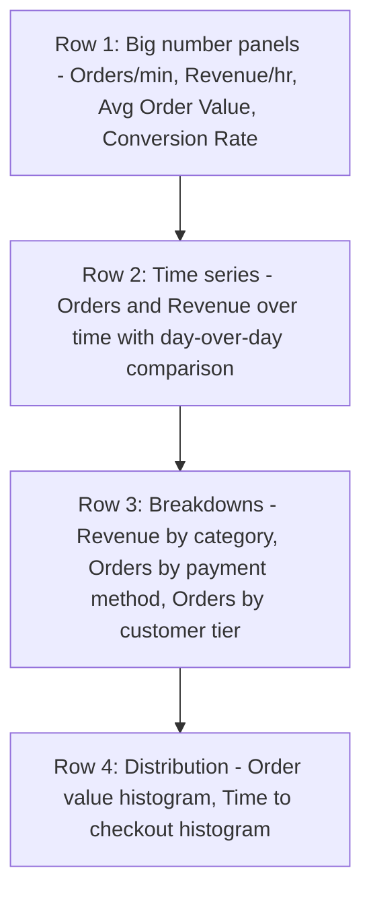

# How to Create a Business KPI Dashboard Using OpenTelemetry Custom Metrics in Grafana

Author: [nawazdhandala](https://www.github.com/nawazdhandala)

Tags: OpenTelemetry, Business Metrics, Grafana, Custom Metrics

Description: Use OpenTelemetry custom metrics to track business KPIs like revenue, signups, and conversions in a Grafana dashboard.

Most observability dashboards focus on technical metrics - CPU usage, request latency, error rates. These are essential for engineering teams, but they do not answer the questions that product managers and business stakeholders care about: How many orders were placed in the last hour? What is the conversion rate from cart to checkout? Is revenue trending up or down after the latest release?

OpenTelemetry is not limited to infrastructure metrics. Its Metrics API lets you define custom instruments that track business events directly in your application code. These metrics flow through the same collector pipeline and end up in the same backend, where you can build business KPI dashboards alongside your technical dashboards.

## Defining Custom Business Metrics

The OpenTelemetry Metrics API provides three instrument types that map well to business KPIs:

- **Counter** - For things you count: orders placed, users signed up, payments processed
- **UpDownCounter** - For values that go up and down: active sessions, items in cart
- **Histogram** - For distributions: order value amounts, time to checkout

Here is an example in Python that tracks order-related business metrics:

```python
# business_metrics.py
from opentelemetry import metrics

# Get the meter for your service
meter = metrics.get_meter("checkout-service", "1.0.0")

# Counter for total orders placed
orders_placed = meter.create_counter(
    name="business.orders.placed",
    description="Total number of orders successfully placed",
    unit="1",
)

# Histogram for order values to track revenue distribution
order_value = meter.create_histogram(
    name="business.orders.value",
    description="Monetary value of each order",
    unit="USD",
)

# UpDownCounter for active shopping carts
active_carts = meter.create_up_down_counter(
    name="business.carts.active",
    description="Number of currently active shopping carts",
    unit="1",
)

def complete_order(order):
    """Called when an order is finalized."""
    # Record the order with relevant business dimensions
    orders_placed.add(1, {
        "payment.method": order.payment_method,
        "product.category": order.category,
        "customer.tier": order.customer_tier,
    })

    # Record the order value for revenue tracking
    order_value.record(order.total_amount, {
        "currency": "USD",
        "product.category": order.category,
    })

    # One less active cart
    active_carts.add(-1)
```

And here is the equivalent in Go:

```go
// business_metrics.go
package checkout

import (
    "go.opentelemetry.io/otel/metric"
)

var (
    meter        = otel.Meter("checkout-service")
    ordersPlaced metric.Int64Counter
    orderValue   metric.Float64Histogram
)

func init() {
    var err error
    // Counter for completed orders
    ordersPlaced, err = meter.Int64Counter("business.orders.placed",
        metric.WithDescription("Total orders placed"),
        metric.WithUnit("1"),
    )
    // Histogram for order monetary values
    orderValue, err = meter.Float64Histogram("business.orders.value",
        metric.WithDescription("Order value in USD"),
        metric.WithUnit("USD"),
    )
}
```

## Collector Configuration

No special collector configuration is needed - custom metrics flow through the standard metrics pipeline. Just make sure your OTLP receiver and exporter are configured.

```yaml
# otel-collector-config.yaml
receivers:
  otlp:
    protocols:
      grpc:
        endpoint: "0.0.0.0:4317"

processors:
  batch:
    send_batch_size: 500
    timeout: 5s

exporters:
  prometheusremotewrite:
    endpoint: "http://prometheus:9090/api/v1/write"

service:
  pipelines:
    metrics:
      receivers: [otlp]
      processors: [batch]
      exporters: [prometheusremotewrite]
```

## Dashboard Queries

**Orders Per Minute** - The primary throughput metric:

```promql
# Orders placed per minute, smoothed over 5 minutes
sum(rate(business_orders_placed_total[5m])) * 60
```

**Revenue Per Hour** - Track monetary throughput:

```promql
# Total revenue per hour from order values
sum(rate(business_orders_value_sum[5m])) * 3600
```

**Average Order Value** - Revenue divided by order count:

```promql
# Average order value over the last 15 minutes
sum(rate(business_orders_value_sum[15m]))
/
sum(rate(business_orders_value_count[15m]))
```

**Revenue by Product Category** - Breakdown for stakeholders:

```promql
# Revenue per hour broken down by product category
sum by (product_category) (
  rate(business_orders_value_sum[5m])
) * 3600
```

**Conversion Rate** - Cart starts vs completed orders:

```promql
# Conversion rate: orders / cart creations
sum(rate(business_orders_placed_total[1h]))
/
sum(rate(business_carts_created_total[1h]))
* 100
```

**Order Value Distribution** - P50 and P95 order values:

```promql
# Median order value
histogram_quantile(0.50,
  sum by (le) (rate(business_orders_value_bucket[15m]))
)
```

## Dashboard Layout



## Naming Conventions

Use a consistent prefix for business metrics to separate them from technical metrics. The `business.` prefix works well. Follow the OpenTelemetry naming conventions: use dots as separators, lowercase, and include a unit. Good names look like `business.orders.placed`, `business.revenue.total`, `business.signups.completed`.

This approach has a significant advantage over event-based analytics platforms: your business metrics and technical metrics live in the same system. When orders per minute drops, you can correlate it with increased latency or error rates on the same dashboard, cutting the time to identify whether the cause is technical or something else entirely.
