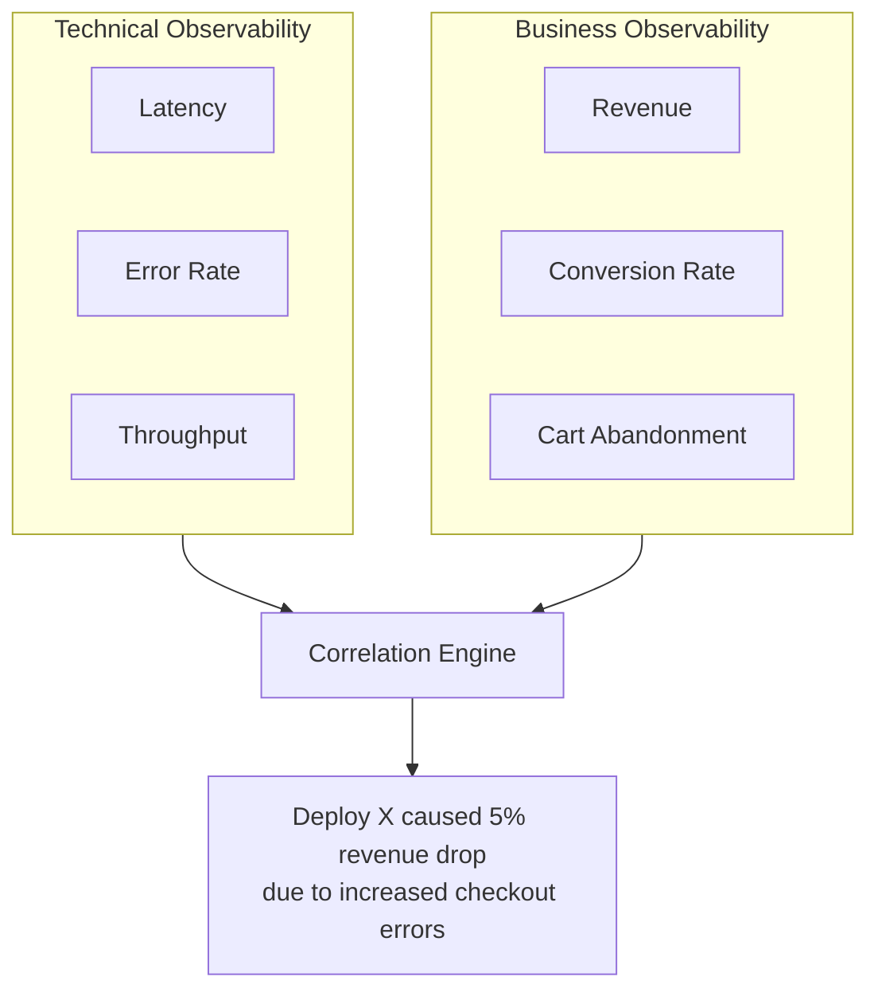

# How to Implement Business Metrics (Revenue, Conversions) with OpenTelemetry

Author: [nawazdhandala](https://www.github.com/nawazdhandala)

Tags: OpenTelemetry, Business Metrics, Revenue, Conversions, Observability, Custom Metrics, E-commerce

Description: Learn how to track business metrics like revenue, conversion rates, and user engagement using OpenTelemetry, bridging the gap between technical observability and business outcomes.

---

Most observability setups track technical metrics like CPU usage, request latency, and error rates. These are essential, but they do not tell you whether your business is actually doing well. A service can have perfect uptime and sub-millisecond response times while revenue is quietly dropping because of a broken checkout flow or a pricing calculation bug.

OpenTelemetry is not just for infrastructure metrics. It gives you all the tools you need to track business metrics alongside your technical telemetry. When you instrument revenue, conversion rates, and user engagement with the same system that tracks your service health, you can correlate business outcomes with technical events. That deployment that dropped your conversion rate by 3%? You will see it right next to the trace that shows the new code path is returning an error on the payment confirmation page.

This guide shows you how to instrument your application to track business metrics with OpenTelemetry.

---

## Why Track Business Metrics in OpenTelemetry?



The value is in the correlation. When business metrics live in the same system as technical metrics, you can answer questions like "Did that deployment affect revenue?" or "Is the latency increase causing lower conversion rates?" without switching between different tools and trying to line up timestamps.

---

## Instrumenting Revenue Tracking

Revenue is your most important business metric. Track it at the point where a transaction is confirmed, with enough dimensional attributes to break it down by product, region, payment method, and customer segment.

```python
# revenue_metrics.py
from opentelemetry import metrics, trace
from opentelemetry.sdk.metrics import MeterProvider
from opentelemetry.sdk.metrics.export import PeriodicExportingMetricReader
from opentelemetry.exporter.otlp.proto.http.metric_exporter import OTLPMetricExporter
from opentelemetry.sdk.resources import Resource, SERVICE_NAME
from decimal import Decimal

resource = Resource.create({SERVICE_NAME: "checkout-service"})
reader = PeriodicExportingMetricReader(
    OTLPMetricExporter(endpoint="https://otel.oneuptime.com/v1/metrics"),
    export_interval_millis=10000,
)
provider = MeterProvider(resource=resource, metric_readers=[reader])
metrics.set_meter_provider(provider)

meter = metrics.get_meter("business.metrics")
tracer = trace.get_tracer("business.metrics")

# Counter for total revenue processed
revenue_counter = meter.create_counter(
    name="business.revenue.total",
    description="Total revenue from completed transactions",
    unit="cents",  # Track in cents to avoid floating point issues
)

# Counter for number of completed transactions
transaction_counter = meter.create_counter(
    name="business.transactions.completed",
    description="Number of completed transactions",
    unit="transactions",
)

# Histogram for order values to understand distribution
order_value_histogram = meter.create_histogram(
    name="business.order.value",
    description="Distribution of order values",
    unit="cents",
)

def record_completed_transaction(order):
    """
    Record a completed transaction with all relevant business dimensions.
    Call this after payment confirmation, not at checkout initiation.
    """
    # Convert to cents for integer precision
    amount_cents = int(order.total_amount * 100)

    attributes = {
        "business.product_category": order.primary_category,
        "business.payment_method": order.payment_method,
        "business.customer_segment": order.customer.segment,
        "business.region": order.shipping_region,
        "business.currency": order.currency,
        "business.is_first_purchase": str(order.customer.is_first_purchase),
        "business.coupon_used": str(order.coupon is not None),
    }

    # Record the revenue
    revenue_counter.add(amount_cents, attributes)
    transaction_counter.add(1, attributes)
    order_value_histogram.record(amount_cents, attributes)

    # Also create a trace span for this transaction
    # so it can be correlated with the technical trace
    with tracer.start_as_current_span("business.transaction.completed") as span:
        span.set_attribute("business.order_id", order.id)
        span.set_attribute("business.amount_cents", amount_cents)
        span.set_attribute("business.items_count", len(order.items))
        for key, value in attributes.items():
            span.set_attribute(key, value)
```

Notice that we track revenue in cents rather than dollars. This avoids floating point precision issues that can cause your revenue totals to drift over time. The various attributes enable slicing the data by category, payment method, region, and customer segment.

---

## Tracking Conversion Funnels

A conversion funnel tracks users through a series of steps. The drop-off between steps tells you where you are losing potential revenue.

```python
# funnel_metrics.py
from opentelemetry import metrics

meter = metrics.get_meter("business.funnel")

# Counter for each funnel step
funnel_step = meter.create_counter(
    name="business.funnel.step",
    description="Number of users reaching each funnel step",
    unit="events",
)

# Specific counters for key conversion events
page_views = meter.create_counter(
    name="business.page_views",
    description="Product page views",
    unit="views",
)

add_to_cart = meter.create_counter(
    name="business.add_to_cart",
    description="Add to cart events",
    unit="events",
)

checkout_started = meter.create_counter(
    name="business.checkout.started",
    description="Checkout flow initiations",
    unit="events",
)

checkout_completed = meter.create_counter(
    name="business.checkout.completed",
    description="Completed checkouts",
    unit="events",
)

class FunnelTracker:
    """
    Tracks users through a conversion funnel. Each step is recorded
    as a metric with the funnel name and step number as attributes.
    """

    def __init__(self, funnel_name: str):
        self.funnel_name = funnel_name

    def record_step(self, step_name: str, step_number: int, user_id: str, extra_attrs: dict = None):
        """Record a user reaching a funnel step."""
        attributes = {
            "funnel.name": self.funnel_name,
            "funnel.step_name": step_name,
            "funnel.step_number": str(step_number),
        }
        if extra_attrs:
            attributes.update(extra_attrs)

        funnel_step.add(1, attributes)

# Usage example
purchase_funnel = FunnelTracker("purchase")

def on_product_view(product, user):
    page_views.add(1, {"product.category": product.category})
    purchase_funnel.record_step("product_view", 1, user.id, {
        "product.category": product.category,
    })

def on_add_to_cart(product, user):
    add_to_cart.add(1, {"product.category": product.category})
    purchase_funnel.record_step("add_to_cart", 2, user.id, {
        "product.category": product.category,
    })

def on_checkout_start(cart, user):
    checkout_started.add(1, {"item_count": str(len(cart.items))})
    purchase_funnel.record_step("checkout_start", 3, user.id)

def on_checkout_complete(order, user):
    checkout_completed.add(1, {"payment_method": order.payment_method})
    purchase_funnel.record_step("checkout_complete", 4, user.id)
```

By tracking each step as a counter with the step number as an attribute, you can compute conversion rates between any two steps. If your "add to cart" to "checkout start" conversion drops after a deployment, you know exactly where to look.

---

## Tracking Cart Abandonment

Cart abandonment is a critical metric for e-commerce. OpenTelemetry can track abandoned carts by recording cart creation events and comparing them against checkout completions.

```python
# abandonment_metrics.py
from opentelemetry import metrics
import time

meter = metrics.get_meter("business.abandonment")

# Track cart lifecycle events
cart_created = meter.create_counter(
    name="business.cart.created",
    description="Number of shopping carts created",
    unit="carts",
)

cart_abandoned = meter.create_counter(
    name="business.cart.abandoned",
    description="Number of shopping carts abandoned",
    unit="carts",
)

# Track the value of abandoned carts
abandoned_value = meter.create_counter(
    name="business.cart.abandoned_value",
    description="Total value of abandoned carts",
    unit="cents",
)

# Track time spent before abandonment
time_to_abandon = meter.create_histogram(
    name="business.cart.time_to_abandon",
    description="Time between cart creation and abandonment",
    unit="minutes",
)

def on_cart_abandoned(cart):
    """Called when a cart expires or is identified as abandoned."""
    attributes = {
        "cart.item_count": str(len(cart.items)),
        "cart.primary_category": cart.primary_category,
        "user.segment": cart.user.segment if cart.user else "anonymous",
    }

    cart_abandoned.add(1, attributes)
    abandoned_value.add(int(cart.total * 100), attributes)

    # Calculate time since cart creation
    abandon_minutes = (time.time() - cart.created_at.timestamp()) / 60
    time_to_abandon.record(abandon_minutes, attributes)
```

---

## Correlating Business and Technical Metrics

The real power comes from having both business and technical metrics in the same system. Here is how to connect them through shared trace context.

```python
# correlation.py
from opentelemetry import trace, metrics

tracer = trace.get_tracer("business.correlation")
meter = metrics.get_meter("business.correlation")

# Track business impact of technical issues
revenue_impact = meter.create_counter(
    name="business.error.revenue_impact",
    description="Estimated revenue lost due to technical errors",
    unit="cents",
)

def checkout_handler(request):
    """
    Checkout handler that tracks both technical and business metrics
    in the same trace, enabling correlation.
    """
    with tracer.start_as_current_span("checkout.process") as span:
        # Add business context to the technical span
        span.set_attribute("business.cart_value_cents", request.cart.total_cents)
        span.set_attribute("business.items_count", len(request.cart.items))
        span.set_attribute("business.customer_segment", request.user.segment)

        try:
            result = process_checkout(request)
            span.set_attribute("business.outcome", "success")
            record_completed_transaction(result.order)
            return result
        except PaymentError as e:
            span.set_attribute("business.outcome", "payment_failed")
            # Track the potential revenue impact of this error
            revenue_impact.add(request.cart.total_cents, {
                "error.type": "payment_failed",
                "payment.method": request.payment_method,
            })
            raise
        except InventoryError as e:
            span.set_attribute("business.outcome", "out_of_stock")
            revenue_impact.add(request.cart.total_cents, {
                "error.type": "inventory_unavailable",
            })
            raise
```

When a checkout fails, this code records both the technical error (through the span's error status) and the business impact (through the `revenue_impact` counter). You can then build dashboards that show exactly how much revenue you are losing to each category of technical error.

---

## Summary

Business metrics in OpenTelemetry bridge the gap between "the system is healthy" and "the business is healthy." By tracking revenue, conversions, and engagement alongside your technical telemetry, you get a complete picture that helps you prioritize what to fix based on actual business impact. A 2% error rate on your homepage might not matter much, but a 2% error rate on your checkout page could be costing you thousands of dollars per hour. Without business metrics in your observability stack, you would never know the difference.
