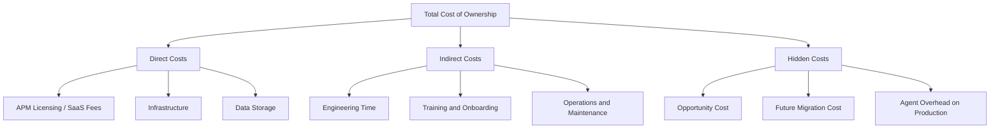
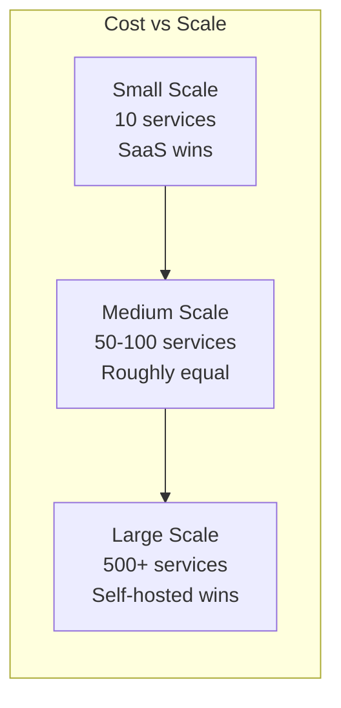

# How to Calculate OpenTelemetry TCO vs Commercial APM Tools

Author: [nawazdhandala](https://www.github.com/nawazdhandala)

Tags: OpenTelemetry, TCO, APM, Cost Analysis, Observability, Commercial APM

Description: A step-by-step guide to calculating the total cost of ownership for OpenTelemetry versus commercial APM tools, with real-world cost models and hidden expenses.

---

When evaluating OpenTelemetry against commercial APM tools like Datadog, New Relic, or Dynatrace, the sticker price tells only part of the story. The true total cost of ownership (TCO) includes infrastructure, engineering time, opportunity costs, and hidden expenses that are easy to overlook. This guide provides a framework for calculating TCO honestly so you can make a data-driven decision.

## What Goes into TCO

TCO is not just licensing fees or infrastructure costs. It includes everything your organization spends to get observability working and keep it running.



## Step 1: Inventory Your Telemetry Volume

Before calculating anything, you need to know your numbers. If you already have an APM tool, pull these from your current dashboards. If you are starting fresh, estimate based on your architecture.

```yaml
# Telemetry volume inventory worksheet
# Fill in your actual numbers
services:
  total_count: 75
  average_requests_per_second: 5000

traces:
  # Spans per month (after sampling)
  spans_per_month: 2_000_000_000
  # Average span size in bytes
  average_span_size_bytes: 500
  # Monthly trace data volume
  monthly_data_gb: 1000

metrics:
  # Active metric time series
  active_time_series: 5_000_000
  # Data points per minute
  datapoints_per_minute: 50_000_000
  # Monthly metric data volume
  monthly_data_gb: 200

logs:
  # Log lines per month
  lines_per_month: 10_000_000_000
  # Average log line size in bytes
  average_line_size_bytes: 300
  # Monthly log data volume
  monthly_data_gb: 3000

# Total monthly data volume
total_monthly_data_gb: 4200
```

## Step 2: Calculate Commercial APM Costs

Commercial APM pricing models vary, but most follow similar patterns. Here is a realistic model:

```python
# Commercial APM cost calculator
# Adjust the unit prices to match your vendor's actual pricing

def calculate_commercial_apm_cost(
    hosts: int,
    spans_per_month: int,
    metric_time_series: int,
    log_gb_per_month: float,
    custom_metrics: int,
):
    # Host-based pricing (common model)
    # Typical range: $15-35 per host per month
    host_cost = hosts * 25  # $/month per host

    # Trace ingestion pricing
    # Typical range: $1-5 per million spans
    trace_cost = (spans_per_month / 1_000_000) * 2.50

    # Metric pricing
    # Base metrics often included with host pricing
    # Custom metrics: $5-10 per 100 time series
    custom_metric_cost = (custom_metrics / 100) * 8

    # Log ingestion pricing
    # Typical range: $0.10-2.00 per GB ingested
    log_ingestion_cost = log_gb_per_month * 1.00

    # Log retention pricing (beyond default period)
    # Typical range: $0.05-0.50 per GB per month retained
    log_retention_cost = log_gb_per_month * 0.25

    monthly_total = (
        host_cost
        + trace_cost
        + custom_metric_cost
        + log_ingestion_cost
        + log_retention_cost
    )

    return {
        "host_cost": host_cost,
        "trace_cost": trace_cost,
        "custom_metric_cost": custom_metric_cost,
        "log_ingestion_cost": log_ingestion_cost,
        "log_retention_cost": log_retention_cost,
        "monthly_total": monthly_total,
        "annual_total": monthly_total * 12,
    }

# Example calculation for a medium deployment
result = calculate_commercial_apm_cost(
    hosts=100,
    spans_per_month=2_000_000_000,
    metric_time_series=5_000_000,
    log_gb_per_month=3000,
    custom_metrics=50_000,
)

# Monthly: ~$12,750
# Annual: ~$153,000
```

Note: These are illustrative numbers. Actual vendor pricing varies significantly, and volume discounts can reduce costs by 30-60% with annual commitments. Always get a real quote from the vendor.

## Step 3: Calculate OpenTelemetry Self-Hosted Costs

The self-hosted cost model has different components:

```python
# OpenTelemetry self-hosted cost calculator
# Includes infrastructure, storage, and engineering costs

def calculate_otel_self_hosted_cost(
    total_data_gb_per_month: float,
    active_time_series: int,
    retention_days: int,
    engineer_salary: float,  # Annual fully loaded
    fte_fraction: float,     # Fraction of an FTE for operations
):
    # Collector infrastructure
    # Agent collectors (DaemonSet): minimal cost, runs on existing nodes
    # Gateway collectors: dedicated nodes for processing
    collector_gateway_nodes = 3  # Typical HA deployment
    collector_cost = collector_gateway_nodes * 150  # $/month per node

    # Trace storage (Tempo, Jaeger, etc.)
    # Tempo uses object storage which is very cheap
    trace_storage_gb = total_data_gb_per_month * 0.25 * (retention_days / 30)
    trace_compute_nodes = 3  # Tempo cluster
    trace_infra_cost = trace_compute_nodes * 200
    trace_storage_cost = trace_storage_gb * 0.023  # S3 pricing per GB

    # Metric storage (Mimir, VictoriaMetrics, etc.)
    metric_compute_nodes = 3
    metric_infra_cost = metric_compute_nodes * 250  # Metrics need more CPU
    metric_storage_cost = (active_time_series / 1_000_000) * 50  # Rough estimate

    # Log storage (Loki, Elasticsearch, etc.)
    log_storage_gb = total_data_gb_per_month * 0.7 * (retention_days / 30)
    log_compute_nodes = 4  # Logs are typically the heaviest
    log_infra_cost = log_compute_nodes * 200
    log_storage_cost = log_storage_gb * 0.023

    # Visualization (Grafana)
    grafana_cost = 2 * 100  # Two nodes for HA

    # Engineering cost
    monthly_engineering = (engineer_salary * fte_fraction) / 12

    monthly_infra = (
        collector_cost
        + trace_infra_cost + trace_storage_cost
        + metric_infra_cost + metric_storage_cost
        + log_infra_cost + log_storage_cost
        + grafana_cost
    )

    monthly_total = monthly_infra + monthly_engineering

    return {
        "monthly_infra": monthly_infra,
        "monthly_engineering": monthly_engineering,
        "monthly_total": monthly_total,
        "annual_total": monthly_total * 12,
    }

# Example for the same medium deployment
result = calculate_otel_self_hosted_cost(
    total_data_gb_per_month=4200,
    active_time_series=5_000_000,
    retention_days=30,
    engineer_salary=180_000,
    fte_fraction=0.5,
)

# Monthly infra: ~$3,500
# Monthly engineering: ~$7,500
# Monthly total: ~$11,000
# Annual total: ~$132,000
```

## Step 4: Account for Hidden Costs

Both approaches have hidden costs that are easy to miss:

### Commercial APM Hidden Costs

```yaml
# Hidden costs in commercial APM
overage_charges:
  # Many vendors charge steep overage fees when you exceed your plan
  # A 20% spike in traffic can cause a 50% spike in your bill
  risk: "Unpredictable monthly bills"

data_sampling_pressure:
  # To control costs, you may need aggressive sampling
  # This means missing important data
  risk: "Reduced observability to stay within budget"

custom_metrics_cardinality:
  # High-cardinality custom metrics can explode costs
  # Adding a user_id label to a metric creates one time series per user
  risk: "Unexpected cost from cardinality explosion"

vendor_lock_in:
  # If using vendor-specific APIs and dashboards
  # Migration cost when switching vendors
  estimated_migration_effort: "2-6 months of engineering time"

contract_inflexibility:
  # Annual contracts may not match actual usage
  # Overpaying during low periods, underpaying during high
  risk: "Paying for capacity you do not use"
```

### OpenTelemetry Self-Hosted Hidden Costs

```yaml
# Hidden costs in self-hosted OpenTelemetry
learning_curve:
  # Time for team to learn Tempo, Mimir, Loki, Grafana
  # Plus OTel Collector configuration and operations
  estimated_ramp_up: "1-3 months per engineer"

incident_response:
  # When the observability platform itself has issues
  # You lose visibility when you need it most
  risk: "Observability blackout during infrastructure incidents"

upgrade_overhead:
  # Major version upgrades for each component
  # Testing compatibility across the stack
  estimated_effort: "2-5 days per quarter"

scaling_surprises:
  # Traffic growth requires proactive capacity planning
  # Running out of disk or memory causes data loss
  risk: "Data loss during traffic spikes"

feature_gap:
  # Building features that commercial tools include out of the box
  # Service maps, anomaly detection, AI analysis
  estimated_effort: "Significant if needed, free if not"
```

## Step 5: Build the Comparison Model

Here is a side-by-side template:

```
TCO Comparison: 12-Month Projection
====================================

                          Commercial APM    OTel Self-Hosted
                          ---------------   ----------------
Direct Costs:
  Licensing/SaaS fees     $153,000          $0
  Infrastructure          $0                $42,000
  Storage                 $0                $12,000

Engineering Costs:
  Initial setup           $5,000            $30,000
  Ongoing operations      $12,000           $90,000
  Training                $3,000            $15,000

Hidden Costs:
  Overage buffer (15%)    $22,950           $0
  Scaling overhead        $0                $6,000
  Migration insurance     $0                $0

                          ---------------   ----------------
12-Month Total            $195,950          $195,000

Cost per service/month    $217              $216
```

In this example, the costs are remarkably similar. The commercial APM spends more on licensing; the self-hosted approach spends more on engineering. The breakeven point shifts depending on scale:



## Step 6: Factor in Non-Financial Considerations

Some factors do not translate directly to dollars:

**Time to value**: Commercial APM tools work out of the box. Self-hosted requires weeks of setup.

**Feature depth**: Commercial tools have years of product development behind their UIs and analysis features. Replicating service maps and anomaly detection on a self-hosted stack requires significant effort.

**Flexibility**: Self-hosted gives you complete control over data processing, retention, and privacy.

**Team skills**: If your team already runs Kubernetes and Grafana, adding Tempo and Loki is easier. If your team has no infrastructure experience, the learning curve is steep.

## Conclusion

TCO calculation requires honest accounting of all costs, not just the obvious ones. Commercial APM tools trade money for convenience. Self-hosted OpenTelemetry trades convenience for money. The right choice depends on your scale, your team's skills, and your priorities. The most important thing is to instrument with OpenTelemetry regardless of your backend choice, because it preserves your ability to change that decision later.
