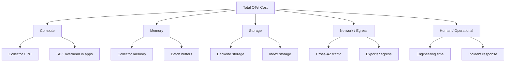
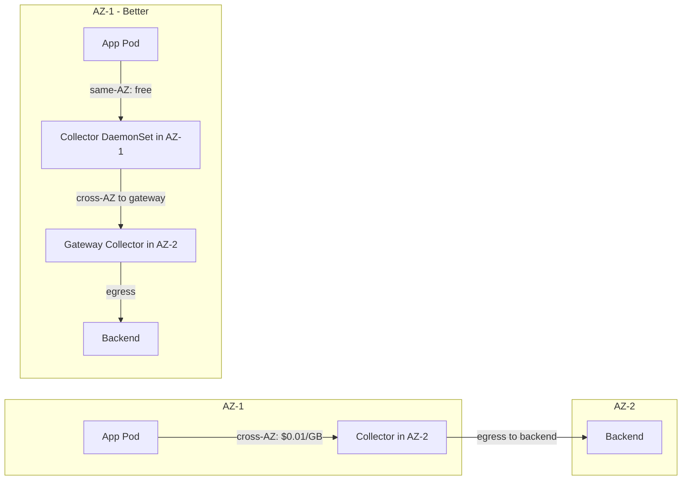
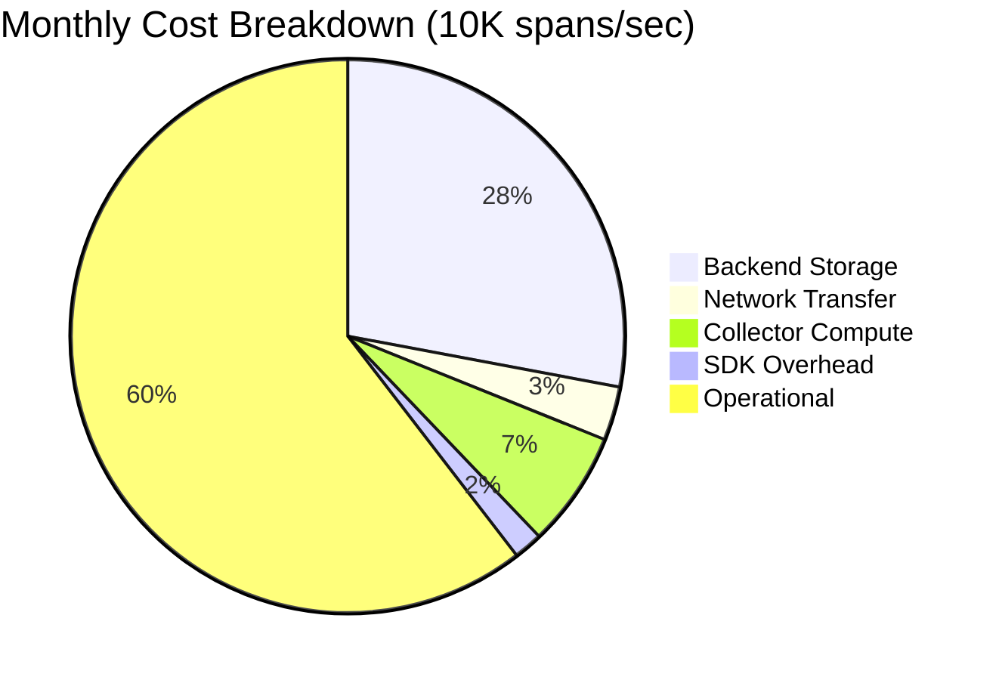

# How to Calculate the True Cost of Running OpenTelemetry at Scale

Author: [nawazdhandala](https://www.github.com/nawazdhandala)

Tags: OpenTelemetry, Observability, Cost Optimization, Scaling, Infrastructure

Description: Learn how to calculate and optimize the real costs of running OpenTelemetry Collectors, storage backends, and telemetry pipelines at scale in production environments.

---

OpenTelemetry is free and open source. But "free" is a tricky word. The software itself costs nothing to download and run. The infrastructure required to run it at scale, however, can get expensive fast. If you are operating a fleet of Collectors processing millions of spans per second, the compute, memory, storage, and network costs add up in ways that surprise most teams.

This guide walks through how to calculate the true cost of running OpenTelemetry in production. We will cover the major cost drivers, show you how to measure them, and share practical strategies for keeping your bill under control.

## Understanding the Cost Components

Before you can calculate anything, you need to know what you are paying for. OpenTelemetry costs break down into five main categories.



**Compute** covers the CPU cycles your Collectors consume plus the overhead the OpenTelemetry SDK adds to your application processes. **Memory** includes the RAM each Collector needs, especially for batch processing and queued retry buffers. **Storage** is whatever your backend charges for ingesting and retaining telemetry data. **Network** covers data transfer between your applications, Collectors, and backends, particularly cross-availability-zone traffic in cloud environments. **Operational cost** is the engineering time spent configuring, maintaining, and debugging the pipeline.

## Step 1: Measure Your Telemetry Volume

Everything starts with volume. You need to know how many spans, log records, and metric data points your applications produce per second. The Collector exposes internal metrics that make this straightforward.

Enable the Collector's built-in telemetry endpoint and query the key throughput metrics.

```yaml
# otel-collector-config.yaml
# Enable the Collector's internal metrics endpoint for cost measurement
service:
  telemetry:
    metrics:
      address: ":8888"  # Prometheus-compatible metrics endpoint
      level: detailed    # Include per-pipeline breakdown
  pipelines:
    traces:
      receivers: [otlp]
      processors: [batch]
      exporters: [otlp/backend]
```

Once that is running, scrape the `/metrics` endpoint and look at these counters:

- `otelcol_receiver_accepted_spans` - total spans received
- `otelcol_receiver_accepted_metric_points` - total metric data points received
- `otelcol_receiver_accepted_log_records` - total log records received
- `otelcol_exporter_sent_spans` - total spans exported to your backend

Calculate your per-second rates by taking the delta over a 5-minute window. For example, if your Collector received 3 million spans in 300 seconds, your ingest rate is 10,000 spans/second.

## Step 2: Calculate Collector Compute Costs

Each Collector instance needs CPU and memory. The amount depends on your throughput, the number of processors in your pipeline, and whether you are running complex transformations.

A rough baseline: a single Collector core can handle approximately 10,000 to 25,000 spans per second with a simple pipeline (receiver, batch processor, exporter). Add a filter processor or attributes processor and that number drops. Add tail-based sampling and it drops significantly because the Collector must hold spans in memory until the trace completes.

Here is how to size your Collector deployment for a given throughput.

```yaml
# collector-deployment.yaml
# Size Collector resources based on measured throughput
apiVersion: apps/v1
kind: Deployment
metadata:
  name: otel-collector-gateway
spec:
  replicas: 4  # Scale horizontally for higher throughput
  template:
    spec:
      containers:
        - name: collector
          image: otel/opentelemetry-collector-contrib:0.96.0
          resources:
            requests:
              cpu: "2"        # 2 cores per replica
              memory: "4Gi"   # 4GB RAM per replica - needed for batch buffers
            limits:
              cpu: "4"        # Allow burst to 4 cores
              memory: "8Gi"   # Hard limit to prevent OOM kills
```

To calculate the monthly cost, multiply the total CPU and memory across all replicas by your cloud provider's per-unit pricing. For example, on AWS with m6i.xlarge instances (4 vCPU, 16 GB RAM) at roughly $0.192/hour on-demand:

- 4 replicas, each using ~2 vCPU and 4 GB RAM
- That is 8 vCPU and 16 GB total, so 2 m6i.xlarge instances
- Monthly cost: 2 x $0.192 x 730 hours = **$280/month** for Collector compute alone

Reserved instances or Savings Plans cut this by 30-60%.

## Step 3: Estimate SDK Overhead in Applications

The OpenTelemetry SDK running inside your application consumes CPU and memory too. This is often overlooked. In most cases, the overhead is small (1-3% CPU, 50-100 MB RAM per process), but multiply that across hundreds of microservice replicas and it becomes real money.

Measure this by comparing your application's resource usage with and without the SDK enabled. The biggest variable is your sampling rate. If you sample 100% of traces, the SDK does more work than if you use a head-based sampler set to 10%.

```yaml
# sdk-resource-overhead-estimate.yaml
# Example: 200 application pods, each with ~2% CPU overhead from OTel SDK
# Base app CPU request: 500m per pod
# OTel SDK overhead: ~10m per pod (2% of 500m)
# Total SDK overhead: 200 pods x 10m = 2000m = 2 full CPU cores
# At $0.048/vCPU-hour (AWS Fargate): 2 x $0.048 x 730 = $70/month
```

This is usually a small fraction of total cost, but it is worth tracking.

## Step 4: Calculate Network Transfer Costs

Network costs are the hidden killer, especially in multi-AZ or multi-region deployments. Every span your application sends to a Collector in a different availability zone incurs cross-AZ transfer charges. On AWS, that is $0.01 per GB in each direction.



To minimize cross-AZ traffic, deploy Collectors as a DaemonSet so each node has a local Collector. Applications send telemetry to localhost, which is always free. The DaemonSet Collectors then forward to a gateway Collector, concentrating your cross-AZ traffic into fewer, larger streams.

Estimate your network cost by measuring the data volume. A single span is typically 500 bytes to 2 KB, depending on how many attributes it carries. At 10,000 spans/second with an average size of 1 KB:

- Data rate: 10 MB/second = 36 GB/hour = 25.9 TB/month
- Cross-AZ cost at $0.01/GB: **$259/month** (if all traffic crosses AZs)
- With DaemonSet optimization: reduce cross-AZ traffic by 60-80%

## Step 5: Calculate Backend Storage Costs

Your backend (whether it is Jaeger, Tempo, Elasticsearch, or a managed SaaS product) charges for ingest and retention. This is usually the largest single cost.

Managed observability platforms typically charge per GB ingested or per million spans. Self-hosted backends charge indirectly through the storage and compute they consume.

Here is a quick comparison framework.

```yaml
# cost-comparison-framework.yaml
# Estimate monthly backend costs for 10,000 spans/sec
#
# Average span size: 1 KB
# Monthly volume: 1 KB x 10,000/sec x 86,400 sec/day x 30 days = 25.9 TB/month
#
# Managed SaaS (typical): $2-8 per GB ingested
#   Low estimate: 25,920 GB x $2 = $51,840/month
#   High estimate: 25,920 GB x $8 = $207,360/month
#
# Self-hosted (Tempo + S3):
#   S3 storage: 25.9 TB x $0.023/GB = $596/month (with 30-day retention)
#   Tempo compute: ~4 large instances = $560/month
#   Total: ~$1,156/month
#
# Reduction with 10% sampling:
#   Volume drops to 2.59 TB/month
#   Self-hosted total: ~$175/month
```

The difference between managed and self-hosted is enormous. But self-hosted requires engineering time to operate, which brings us to the final cost component.

## Step 6: Account for Operational Costs

Someone has to keep this pipeline running. Upgrades, debugging failed exports, tuning batch sizes, responding to Collector OOM kills, adjusting sampling rates when a new service launches. This is real work.

A rough estimate: plan for 10-20% of one engineer's time for a small-to-medium deployment (under 50,000 spans/second). For large deployments, you may need a dedicated observability team.

At a fully loaded engineering cost of $200,000/year, 15% of one engineer is $30,000/year or $2,500/month.

## Putting It All Together

Here is a total cost estimate for a mid-size deployment processing 10,000 spans/second with 30-day retention.



| Component | Monthly Cost |
|-----------|-------------|
| Collector compute (4 replicas) | $280 |
| SDK overhead (200 pods) | $70 |
| Network transfer (optimized) | $130 |
| Backend storage (self-hosted) | $1,156 |
| Operational (15% of 1 engineer) | $2,500 |
| **Total** | **$4,136/month** |

At 100,000 spans/second, multiply the infrastructure costs by roughly 8-10x (not a perfect linear scale due to batch efficiency gains). The operational cost grows more slowly since most of the configuration work is similar regardless of scale.

## Strategies to Reduce Costs

Once you know where the money goes, you can target reductions.

**Sampling** is the single most effective lever. Tail-based sampling in the Collector lets you keep 100% of error traces while dropping routine successful requests. A 10:1 sampling ratio cuts your storage and network costs by 90%.

**Filtering** removes telemetry you never look at. Health check endpoints, readiness probes, and internal keep-alive requests generate spans that nobody queries. Drop them in the Collector before they reach your backend.

**Attribute trimming** reduces span size. Remove redundant attributes, truncate long string values, and avoid attaching full request/response bodies to spans.

**Compression** between Collectors and backends reduces network costs. The OTLP exporter supports gzip compression, which typically achieves 5-10x compression on telemetry data.

```yaml
# cost-optimization-pipeline.yaml
# A Collector pipeline optimized for cost reduction
processors:
  # Drop health check spans - they add volume but no insight
  filter:
    traces:
      span:
        - 'attributes["http.route"] == "/healthz"'
        - 'attributes["http.route"] == "/readyz"'

  # Remove high-cardinality attributes that bloat span size
  attributes:
    actions:
      - key: http.request.body
        action: delete
      - key: http.response.body
        action: delete

  # Batch aggressively to improve compression ratios
  batch:
    send_batch_size: 8192
    timeout: 5s

exporters:
  otlp:
    endpoint: "tempo.monitoring:4317"
    compression: gzip  # 5-10x size reduction on the wire
```

## Final Thoughts

The true cost of OpenTelemetry at scale is not just the Collector binary or the SDK library. It is the sum of compute, memory, network, storage, and human effort required to keep the pipeline healthy. Most teams underestimate network and storage costs, and almost everyone forgets to account for operational overhead.

Measure your telemetry volume first. Then work through each cost component with real numbers from your environment. The framework above gives you a starting point, but your actual costs will depend on your cloud provider, deployment topology, and how aggressively you sample and filter. Run the numbers before you commit to a backend or architecture, and revisit them quarterly as your application grows.
