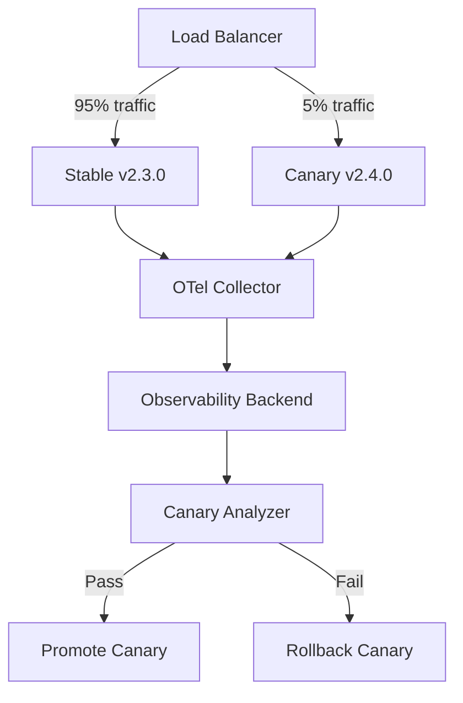
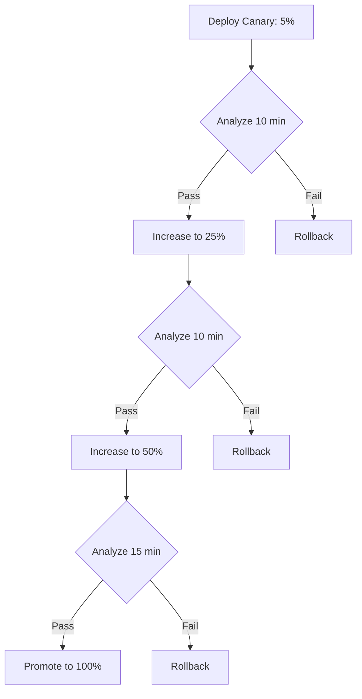

# How to Implement Canary Deployment Monitoring with OpenTelemetry

Author: [nawazdhandala](https://www.github.com/nawazdhandala)

Tags: OpenTelemetry, Canary Deployments, Monitoring, Progressive Delivery, Kubernetes, Metrics, Deployment

Description: Learn how to monitor canary deployments using OpenTelemetry metrics and traces to automatically detect regressions and safely roll out new versions.

---

> Canary deployments let you ship new versions to a small percentage of traffic before rolling out to everyone. OpenTelemetry provides the instrumentation to compare canary and stable versions in real time, catching regressions before they affect your entire user base.

The idea behind canary deployments is simple: send 5% of traffic to the new version and 95% to the stable version. If the new version behaves well, gradually increase its traffic share. If it misbehaves, roll back immediately. The hard part is defining "behaves well" and measuring it reliably.

OpenTelemetry solves the measurement problem. By tagging all telemetry with the application version, you can compare error rates, latencies, and business metrics between canary and stable side by side.

---

## Architecture of a Canary Deployment with Observability



The key insight is that both the stable and canary versions emit telemetry to the same Collector and backend. The version label on the telemetry is what allows you to compare them.

---

## Tagging Telemetry with Version Information

The most important step is ensuring every piece of telemetry from your application includes the version identifier. This should be set as a resource attribute, not a span attribute, because it applies to all telemetry from that instance.

```python
# otel_setup.py
# Configure OpenTelemetry with version-aware resource attributes

import os
from opentelemetry import trace, metrics
from opentelemetry.sdk.trace import TracerProvider
from opentelemetry.sdk.metrics import MeterProvider
from opentelemetry.sdk.resources import Resource
from opentelemetry.sdk.trace.export import BatchSpanProcessor
from opentelemetry.sdk.metrics.export import PeriodicExportingMetricReader
from opentelemetry.exporter.otlp.proto.grpc.trace_exporter import OTLPSpanExporter
from opentelemetry.exporter.otlp.proto.grpc.metric_exporter import OTLPMetricExporter

def init_telemetry():
    # Read version from environment variable set by your deployment system
    # Kubernetes sets this from the container image tag or a ConfigMap
    app_version = os.environ.get("APP_VERSION", "unknown")
    deployment_track = os.environ.get("DEPLOYMENT_TRACK", "stable")

    # Resource attributes tag ALL telemetry from this instance
    # These are the labels you will use to compare canary vs stable
    resource = Resource.create({
        "service.name": "checkout-service",
        "service.version": app_version,
        "deployment.track": deployment_track,  # "canary" or "stable"
        "deployment.environment": "production",
        "k8s.pod.name": os.environ.get("POD_NAME", "unknown"),
    })

    # Set up tracing
    trace_exporter = OTLPSpanExporter(
        endpoint="otel-collector:4317",
        insecure=True,
    )
    trace_provider = TracerProvider(resource=resource)
    trace_provider.add_span_processor(BatchSpanProcessor(trace_exporter))
    trace.set_tracer_provider(trace_provider)

    # Set up metrics
    metric_exporter = OTLPMetricExporter(
        endpoint="otel-collector:4317",
        insecure=True,
    )
    reader = PeriodicExportingMetricReader(metric_exporter, export_interval_millis=15000)
    metric_provider = MeterProvider(resource=resource, metric_readers=[reader])
    metrics.set_meter_provider(metric_provider)

    return trace.get_tracer("checkout-service"), metrics.get_meter("checkout-service")
```

In your Kubernetes deployment, set the version and track through environment variables:

```yaml
# canary-deployment.yaml
apiVersion: apps/v1
kind: Deployment
metadata:
  name: checkout-canary
spec:
  replicas: 1
  selector:
    matchLabels:
      app: checkout
      track: canary
  template:
    metadata:
      labels:
        app: checkout
        track: canary
    spec:
      containers:
        - name: checkout
          image: checkout-service:2.4.0
          env:
            # These environment variables flow into OTel resource attributes
            - name: APP_VERSION
              value: "2.4.0"
            - name: DEPLOYMENT_TRACK
              value: "canary"
            - name: POD_NAME
              valueFrom:
                fieldRef:
                  fieldPath: metadata.name
```

---

## Building the Canary Comparison Dashboard

With version-tagged telemetry flowing, you can build a dashboard that compares canary and stable side by side:

```yaml
# canary-dashboard-panels.yaml
# Dashboard panels that compare canary vs stable versions

panels:
  - title: "Error Rate: Canary vs Stable"
    type: timeseries
    queries:
      # Error rate for the stable version
      - label: "Stable (v2.3.0)"
        query: |
          sum(rate(http_server_request_errors_total{
            service_name="checkout-service",
            deployment_track="stable"
          }[5m]))
          /
          sum(rate(http_server_request_total{
            service_name="checkout-service",
            deployment_track="stable"
          }[5m]))

      # Error rate for the canary version
      - label: "Canary (v2.4.0)"
        query: |
          sum(rate(http_server_request_errors_total{
            service_name="checkout-service",
            deployment_track="canary"
          }[5m]))
          /
          sum(rate(http_server_request_total{
            service_name="checkout-service",
            deployment_track="canary"
          }[5m]))

  - title: "p99 Latency: Canary vs Stable"
    type: timeseries
    queries:
      - label: "Stable"
        query: |
          histogram_quantile(0.99,
            sum(rate(http_server_request_duration_bucket{
              service_name="checkout-service",
              deployment_track="stable"
            }[5m])) by (le)
          )
      - label: "Canary"
        query: |
          histogram_quantile(0.99,
            sum(rate(http_server_request_duration_bucket{
              service_name="checkout-service",
              deployment_track="canary"
            }[5m])) by (le)
          )

  - title: "Traffic Split"
    type: gauge
    query: |
      sum(rate(http_server_request_total{
        service_name="checkout-service",
        deployment_track="canary"
      }[5m]))
      /
      sum(rate(http_server_request_total{
        service_name="checkout-service"
      }[5m]))
```

---

## Automated Canary Analysis

Manual dashboard watching does not scale. You need automated analysis that compares canary metrics to stable metrics and makes a promotion or rollback decision.

Here is a canary analyzer that runs as a periodic job:

```python
# canary_analyzer.py
# Automated canary analysis using OpenTelemetry metrics
# Compares canary vs stable and decides whether to promote or rollback

from opentelemetry import trace

tracer = trace.get_tracer("canary-analyzer")

class CanaryAnalyzer:
    def __init__(self, metrics_client, config):
        self.metrics_client = metrics_client
        self.config = config

    def analyze(self, service_name, canary_version, stable_version):
        """
        Compare canary and stable metrics over the analysis window.
        Returns a decision: promote, rollback, or continue.
        """
        with tracer.start_as_current_span("canary.analysis") as span:
            span.set_attribute("canary.service", service_name)
            span.set_attribute("canary.version", canary_version)
            span.set_attribute("canary.stable_version", stable_version)

            window = self.config["analysis_window"]
            results = {}

            # Compare error rates
            canary_errors = self._query_error_rate(service_name, "canary", window)
            stable_errors = self._query_error_rate(service_name, "stable", window)

            # Allow up to 10% higher error rate for canary vs stable
            # This threshold accounts for statistical noise with small traffic
            error_threshold = self.config.get("error_rate_threshold", 0.10)
            error_diff = canary_errors - stable_errors
            error_passed = error_diff <= error_threshold

            results["error_rate"] = {
                "canary": canary_errors,
                "stable": stable_errors,
                "diff": error_diff,
                "passed": error_passed,
            }
            span.set_attribute("canary.error_rate.canary", canary_errors)
            span.set_attribute("canary.error_rate.stable", stable_errors)
            span.set_attribute("canary.error_rate.passed", error_passed)

            # Compare p99 latency
            canary_p99 = self._query_p99_latency(service_name, "canary", window)
            stable_p99 = self._query_p99_latency(service_name, "stable", window)

            # Allow up to 20% higher p99 latency for canary
            latency_threshold = self.config.get("latency_threshold_pct", 0.20)
            if stable_p99 > 0:
                latency_increase = (canary_p99 - stable_p99) / stable_p99
            else:
                latency_increase = 0

            latency_passed = latency_increase <= latency_threshold

            results["p99_latency"] = {
                "canary_ms": canary_p99,
                "stable_ms": stable_p99,
                "increase_pct": latency_increase,
                "passed": latency_passed,
            }
            span.set_attribute("canary.p99.canary_ms", canary_p99)
            span.set_attribute("canary.p99.stable_ms", stable_p99)
            span.set_attribute("canary.p99.passed", latency_passed)

            # Make the decision
            all_passed = all(r["passed"] for r in results.values())
            min_analysis_time = self.config.get("min_analysis_minutes", 10)
            analysis_duration = self._get_canary_age_minutes(service_name)

            if not all_passed:
                decision = "rollback"
            elif analysis_duration >= min_analysis_time and all_passed:
                decision = "promote"
            else:
                decision = "continue"

            span.set_attribute("canary.decision", decision)
            span.set_attribute("canary.analysis_duration_min", analysis_duration)

            return {
                "decision": decision,
                "results": results,
                "analysis_duration_minutes": analysis_duration,
            }

    def _query_error_rate(self, service, track, window):
        """Query error rate for a specific deployment track"""
        return self.metrics_client.query(
            f'sum(rate(http_server_request_errors_total{{'
            f'service_name="{service}", deployment_track="{track}"'
            f'}}[{window}]))'
            f' / sum(rate(http_server_request_total{{'
            f'service_name="{service}", deployment_track="{track}"'
            f'}}[{window}]))'
        )

    def _query_p99_latency(self, service, track, window):
        """Query p99 latency for a specific deployment track"""
        return self.metrics_client.query(
            f'histogram_quantile(0.99, sum(rate('
            f'http_server_request_duration_bucket{{'
            f'service_name="{service}", deployment_track="{track}"'
            f'}}[{window}])) by (le))'
        )

    def _get_canary_age_minutes(self, service):
        """Get how long the canary has been running"""
        return 15  # In practice, query Kubernetes API
```

---

## Progressive Rollout with Telemetry Gates

Automated canary analysis enables progressive rollout where each traffic increase is gated by telemetry:



Each gate runs the canary analyzer against the OpenTelemetry metrics. Only if the canary's error rate and latency are within acceptable bounds does the rollout proceed.

---

## Using Traces for Canary Debugging

When a canary fails analysis, you need to understand why. Traces are invaluable here because they show you the exact requests that failed.

```python
# canary_debug.py
# Find failed traces from the canary version for debugging

def find_canary_failures(trace_client, service_name, canary_version, limit=20):
    """
    Query for error traces from the canary version.
    These traces help developers understand what went wrong.
    """
    # Search for traces with errors from the canary deployment
    traces = trace_client.search(
        service_name=service_name,
        filters={
            "resource.service.version": canary_version,
            "resource.deployment.track": "canary",
            "status.code": "ERROR",
        },
        order_by="timestamp",
        limit=limit,
    )

    for t in traces:
        print(f"Trace ID: {t.trace_id}")
        print(f"  Error: {t.status_message}")
        print(f"  Duration: {t.duration_ms}ms")
        print(f"  Endpoint: {t.attributes.get('http.route', 'unknown')}")
        # Show the span that actually errored
        for span in t.spans:
            if span.status.code == "ERROR":
                print(f"  Failed span: {span.name}")
                print(f"  Exception: {span.events[0].attributes.get('exception.message', '')}")
        print()

    return traces
```

---

## Best Practices

1. **Ensure sufficient traffic**: Canary analysis is unreliable with too few requests. Wait until the canary has received at least 100 requests before making a decision.

2. **Compare per-endpoint, not just aggregate**: A canary might look fine overall but have a regression on one specific endpoint. Break down the comparison by `http.route`.

3. **Watch for latency distribution changes**: Average latency can be misleading. A canary might have the same average but a much worse tail latency. Always compare p99 and p999.

4. **Include business metrics**: Technical metrics alone miss regressions that affect user behavior. If your canary has the same error rate but a 20% lower conversion rate, something is wrong.

5. **Automate rollback**: Never rely on a human to notice and roll back a bad canary at 3am. The analyzer should trigger automatic rollback when metrics degrade.

Canary deployments monitored by OpenTelemetry give you confidence to ship fast. Every release is validated by real traffic data before it reaches your full user base, and when something goes wrong, the telemetry tells you exactly what happened.
