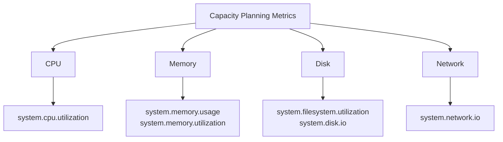

# How to Create a Capacity Planning Dashboard from OpenTelemetry Resource Utilization Metrics

Author: [nawazdhandala](https://www.github.com/nawazdhandala)

Tags: OpenTelemetry, Capacity Planning, Infrastructure, Grafana

Description: Build a capacity planning dashboard from OpenTelemetry resource utilization metrics to forecast when you need to scale.

Capacity planning is about answering a simple question: when will you run out of resources? Whether it is CPU, memory, disk, or network bandwidth, you need to see current utilization trends and project them forward. OpenTelemetry provides standardized resource utilization metrics through the Host Metrics Receiver and Kubelet Stats Receiver, giving you a consistent data source for capacity planning across bare-metal servers, VMs, and Kubernetes clusters.

## Collecting Resource Metrics

The Host Metrics Receiver captures system-level metrics from the machine where the collector runs. For Kubernetes environments, the Kubelet Stats Receiver provides pod and container-level resource data.

```yaml
# otel-collector-config.yaml
receivers:
  # Host-level metrics for VMs and bare metal
  hostmetrics:
    collection_interval: 30s
    scrapers:
      cpu:
        metrics:
          system.cpu.utilization:
            enabled: true
      memory:
        metrics:
          system.memory.utilization:
            enabled: true
      disk:
        metrics:
          system.disk.io:
            enabled: true
      filesystem:
        metrics:
          system.filesystem.utilization:
            enabled: true
      network:
        metrics:
          system.network.io:
            enabled: true

  # Kubernetes pod-level metrics (use on DaemonSet collectors)
  kubeletstats:
    auth_type: serviceAccount
    collection_interval: 30s
    metric_groups:
      - node
      - pod
      - container

processors:
  # Tag metrics with hostname for per-node breakdowns
  resourcedetection:
    detectors: [system, env]
    system:
      hostname_sources: ["os"]

  batch:
    send_batch_size: 1000
    timeout: 10s

exporters:
  prometheusremotewrite:
    endpoint: "http://prometheus:9090/api/v1/write"

service:
  pipelines:
    metrics:
      receivers: [hostmetrics]
      processors: [resourcedetection, batch]
      exporters: [prometheusremotewrite]
```

## Key Capacity Metrics

The metrics you need for capacity planning fall into four categories:



## Dashboard Queries

**CPU Utilization Trend** - Current CPU usage with a linear projection:

```promql
# Average CPU utilization across all cores per host
avg by (host_name) (system_cpu_utilization)
```

For the projection, use Grafana's built-in trend line feature or the `predict_linear` function:

```promql
# Predict CPU utilization 7 days from now based on the last 30 days
predict_linear(
  avg by (host_name) (system_cpu_utilization)[30d:1h],
  7 * 24 * 3600
)
```

**Memory Saturation Timeline** - When will memory run out:

```promql
# Current memory utilization per host
system_memory_utilization{state="used"}
```

```promql
# Days until memory reaches 90% utilization based on 14-day trend
(0.9 - system_memory_utilization{state="used"})
/
deriv(system_memory_utilization{state="used"}[14d])
/ 86400
```

This returns the number of days until you hit 90% memory utilization. Display it as a stat panel with thresholds: green above 30 days, yellow between 7-30 days, red below 7 days.

**Disk Space Runway** - The most common capacity emergency:

```promql
# Current filesystem utilization per mount point
system_filesystem_utilization{state="used"}
```

```promql
# Days until disk is full, based on 7-day trend
(1 - system_filesystem_utilization{state="used"})
/
deriv(system_filesystem_utilization{state="used"}[7d])
/ 86400
```

**Network Bandwidth Utilization** - Percentage of available bandwidth in use:

```promql
# Network throughput in bytes per second per interface
sum by (host_name, device) (
  rate(system_network_io_total{direction="transmit"}[5m])
)
```

## Kubernetes-Specific Capacity Queries

For Kubernetes clusters, capacity planning also involves tracking resource requests vs actual usage.

**CPU Request vs Usage per Namespace** - Identifies over-provisioned or under-provisioned namespaces:

```promql
# Ratio of actual CPU usage to requested CPU per namespace
sum by (k8s_namespace_name) (k8s_pod_cpu_utilization)
/
sum by (k8s_namespace_name) (k8s_pod_cpu_request)
```

A value below 0.5 suggests the namespace is over-provisioned. A value above 0.9 means it is close to its requested limits.

**Node Allocatable Headroom** - How much room is left on each node:

```promql
# Percentage of allocatable CPU already requested
sum by (k8s_node_name) (k8s_pod_cpu_request)
/
k8s_node_allocatable_cpu
* 100
```

## Dashboard Layout

Structure the dashboard around resource type and time horizon:

1. **Current State** - Gauges showing CPU, memory, disk, and network utilization right now
2. **7-Day Trend** - Time series showing utilization trends over the past week
3. **Runway Estimates** - Stat panels showing "days until full" for each resource type
4. **Kubernetes Efficiency** - Request vs usage ratios, node headroom, namespace breakdowns
5. **Long-Range Projection** - 30-day trend lines with `predict_linear` projections

## Alerting on Capacity Thresholds

Set up alerts that fire before you run out of resources, not when you already have:

```yaml
# alerting-rules.yaml
groups:
  - name: capacity_planning
    rules:
      # Alert when disk will be full within 7 days
      - alert: DiskFullIn7Days
        expr: >
          (1 - system_filesystem_utilization{state="used"})
          /
          deriv(system_filesystem_utilization{state="used"}[7d])
          / 86400
          < 7
        for: 1h
        labels:
          severity: warning

      # Alert when memory will hit 90% within 3 days
      - alert: MemoryNearCapacity
        expr: >
          predict_linear(system_memory_utilization{state="used"}[14d], 3 * 86400) > 0.9
        for: 1h
        labels:
          severity: warning
```

Capacity planning dashboards are most valuable when reviewed weekly. The patterns become clear over time: you can see seasonal traffic increases, correlate resource growth with feature launches, and make informed decisions about when to scale rather than reacting to outages.
