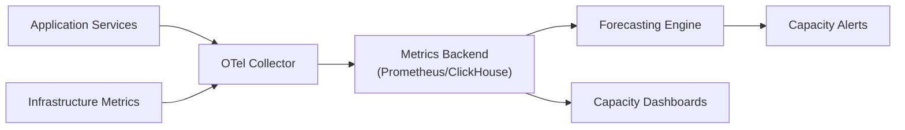
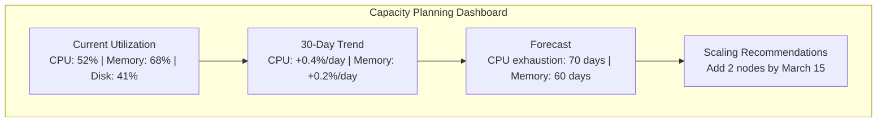

# How to Implement Capacity Planning with OpenTelemetry Metrics

Author: [nawazdhandala](https://www.github.com/nawazdhandala)

Tags: OpenTelemetry, Capacity Planning, Metrics, Observability, Infrastructure, Scaling, Resource Management

Description: Learn how to implement data-driven capacity planning using OpenTelemetry metrics to forecast resource needs, prevent outages, and scale infrastructure efficiently.

---

Capacity planning is one of those things that teams tend to ignore until they get burned. Your service handles 500 requests per second just fine today, but what happens when that number doubles next quarter? If you do not have a clear picture of your resource usage trends, you are flying blind.

OpenTelemetry gives you the raw material to build a solid capacity planning practice. By collecting the right metrics, tracking them over time, and building forecasting models on top of them, you can stop guessing about when to scale and start making informed decisions.

This guide walks through how to instrument your systems with OpenTelemetry metrics specifically for capacity planning, how to aggregate and analyze that data, and how to build forecasts that actually help you plan ahead.

---

## Architecture Overview



---

## Defining the Right Metrics for Capacity Planning

Not every metric matters for capacity planning. You want to focus on resource utilization metrics that tell you how close you are to your limits. Here are the key categories.

### CPU and Memory Utilization

These are your bread-and-butter capacity metrics. Track them per service, per node, and in aggregate.

```python
# capacity_metrics.py
from opentelemetry import metrics
from opentelemetry.sdk.metrics import MeterProvider
from opentelemetry.sdk.metrics.export import PeriodicExportingMetricReader
from opentelemetry.exporter.otlp.proto.http.metric_exporter import OTLPMetricExporter
from opentelemetry.sdk.resources import Resource, SERVICE_NAME
import psutil

# Set up the meter provider with OTLP export
resource = Resource.create({SERVICE_NAME: "capacity-monitor"})
reader = PeriodicExportingMetricReader(
    OTLPMetricExporter(endpoint="https://otel.oneuptime.com/v1/metrics"),
    export_interval_millis=30000,  # Export every 30 seconds
)
provider = MeterProvider(resource=resource, metric_readers=[reader])
metrics.set_meter_provider(provider)

meter = metrics.get_meter("capacity.planning")

# Create gauges for system resource utilization
cpu_gauge = meter.create_observable_gauge(
    name="system.cpu.utilization",
    description="Current CPU utilization percentage",
    unit="percent",
    callbacks=[lambda options: [
        metrics.Observation(psutil.cpu_percent(interval=1))
    ]],
)

memory_gauge = meter.create_observable_gauge(
    name="system.memory.utilization",
    description="Current memory utilization percentage",
    unit="percent",
    callbacks=[lambda options: [
        metrics.Observation(psutil.virtual_memory().percent)
    ]],
)

disk_gauge = meter.create_observable_gauge(
    name="system.disk.utilization",
    description="Current disk utilization percentage",
    unit="percent",
    callbacks=[lambda options: [
        metrics.Observation(usage.percent, {"mount": mount})
        for mount in ["/", "/data", "/logs"]
        if (usage := psutil.disk_usage(mount))
    ]],
)
```

This code sets up observable gauges that automatically collect system-level resource metrics at regular intervals. The `psutil` library provides the actual system readings, while OpenTelemetry handles the export pipeline to your metrics backend.

---

### Application-Level Throughput Metrics

System metrics alone do not tell the whole story. You need to track how much work your application is actually doing, because that is what drives resource consumption.

```python
# app_throughput.py
from opentelemetry import metrics

meter = metrics.get_meter("capacity.planning")

# Track request throughput by endpoint
request_counter = meter.create_counter(
    name="app.requests.total",
    description="Total number of requests processed",
    unit="requests",
)

# Track active connections as a gauge
active_connections = meter.create_up_down_counter(
    name="app.connections.active",
    description="Number of currently active connections",
    unit="connections",
)

# Track queue depth for async workloads
queue_depth = meter.create_observable_gauge(
    name="app.queue.depth",
    description="Number of items waiting in the processing queue",
    unit="items",
    callbacks=[lambda options: [
        metrics.Observation(get_queue_length(), {"queue": "default"})
    ]],
)

def handle_request(endpoint: str):
    """Wrap your request handler to track throughput."""
    active_connections.add(1)
    request_counter.add(1, {"endpoint": endpoint})
    try:
        # Process the request
        process(endpoint)
    finally:
        active_connections.add(-1)
```

Tracking request throughput alongside resource utilization lets you establish the relationship between load and resource consumption. This relationship is the foundation of capacity forecasting.

---

## Configuring the Collector for Capacity Data

Your OpenTelemetry Collector configuration should aggregate metrics in a way that supports long-term trend analysis. Raw per-second data is too granular for capacity planning, but you do not want to lose important peaks either.

```yaml
# otel-collector-config.yaml
receivers:
  otlp:
    protocols:
      grpc:
        endpoint: 0.0.0.0:4317
      http:
        endpoint: 0.0.0.0:4318

  # Scrape host metrics directly from the collector host
  hostmetrics:
    collection_interval: 30s
    scrapers:
      cpu:
      memory:
      disk:
      network:
      load:

processors:
  # Batch metrics for efficient export
  batch:
    send_batch_size: 1000
    timeout: 30s

  # Add environment metadata for capacity segmentation
  resource:
    attributes:
      - key: deployment.environment
        value: production
        action: upsert
      - key: cloud.region
        value: us-east-1
        action: upsert

  # Aggregate metrics to reduce cardinality while preserving peaks
  metricstransform:
    transforms:
      - include: system.cpu.utilization
        action: update
        operations:
          - action: aggregate_labels
            label_set: ["host.name", "deployment.environment"]
            aggregation_type: mean

exporters:
  otlphttp:
    endpoint: https://otel.oneuptime.com

service:
  pipelines:
    metrics:
      receivers: [otlp, hostmetrics]
      processors: [resource, metricstransform, batch]
      exporters: [otlphttp]
```

The `hostmetrics` receiver collects infrastructure metrics directly without needing a separate agent. The `metricstransform` processor aggregates labels to keep cardinality manageable over long retention periods while preserving the dimensions you need for capacity analysis.

---

## Building a Capacity Forecasting Model

Once you have several weeks of metrics data, you can start building forecasts. A simple linear regression on resource utilization over time gives you a surprisingly useful estimate of when you will hit capacity limits.

```python
# forecast.py
import numpy as np
from datetime import datetime, timedelta

def linear_forecast(timestamps, values, target_utilization=80.0):
    """
    Forecast when resource utilization will hit the target threshold.

    Args:
        timestamps: List of Unix timestamps for data points
        values: List of utilization percentages
        target_utilization: The threshold to forecast against (default 80%)

    Returns:
        Estimated date when utilization will reach the target
    """
    # Convert timestamps to numeric days from start
    start_time = timestamps[0]
    days = np.array([(t - start_time) / 86400 for t in timestamps])
    utilization = np.array(values)

    # Fit a linear regression
    coefficients = np.polyfit(days, utilization, 1)
    slope = coefficients[0]  # Utilization change per day
    intercept = coefficients[1]

    if slope <= 0:
        return None  # Utilization is decreasing, no capacity concern

    # Calculate days until target is reached
    days_to_target = (target_utilization - intercept) / slope
    target_date = datetime.fromtimestamp(start_time) + timedelta(days=days_to_target)

    return target_date

# Example usage with metric data pulled from your backend
timestamps = [1706745600, 1706832000, 1706918400, 1707004800]  # Daily samples
cpu_values = [45.2, 47.8, 49.1, 51.3]

forecast_date = linear_forecast(timestamps, cpu_values, target_utilization=80.0)
if forecast_date:
    print(f"CPU will reach 80% utilization by: {forecast_date.strftime('%Y-%m-%d')}")
```

This is a basic linear model, but it works well for steady growth patterns. For workloads with strong seasonal patterns (like traffic spikes on weekdays versus weekends), consider using a more sophisticated approach like Holt-Winters exponential smoothing or Facebook Prophet.

---

## Setting Up Capacity Alerts

Capacity alerts should fire well before you actually run out of resources. The goal is to give your team enough lead time to provision additional capacity.

```python
# capacity_alerts.py
from opentelemetry import metrics

meter = metrics.get_meter("capacity.alerts")

# Track the forecasted days until capacity is exhausted
days_until_capacity = meter.create_observable_gauge(
    name="capacity.days_remaining",
    description="Forecasted days until resource capacity is exhausted",
    unit="days",
    callbacks=[lambda options: [
        metrics.Observation(
            calculate_days_remaining("cpu"),
            {"resource": "cpu"}
        ),
        metrics.Observation(
            calculate_days_remaining("memory"),
            {"resource": "memory"}
        ),
        metrics.Observation(
            calculate_days_remaining("disk"),
            {"resource": "disk"}
        ),
    ]],
)

# Track current headroom as a percentage
headroom_gauge = meter.create_observable_gauge(
    name="capacity.headroom",
    description="Current available headroom before hitting capacity limit",
    unit="percent",
    callbacks=[lambda options: [
        metrics.Observation(
            80.0 - get_current_utilization("cpu"),
            {"resource": "cpu"}
        ),
    ]],
)
```

These metrics feed directly into your alerting rules. Set alerts for different time horizons: a warning when you have 30 days of capacity remaining, and a critical alert at 7 days. This gives you enough time to react without creating unnecessary noise.

---

## Capacity Planning Dashboard

A good capacity planning dashboard shows three things: current utilization, historical trends, and forecasted exhaustion dates.



---

## Putting It All Together

Capacity planning with OpenTelemetry is not a one-time setup. It is an ongoing practice. Start by collecting the right metrics, establish baselines, and then build forecasts as you accumulate data. The key metrics to track are CPU, memory, disk, network bandwidth, request throughput, queue depths, and connection pool usage.

Review your capacity forecasts at least monthly. Compare your predictions against actual utilization to calibrate your models. Over time, you will develop an intuition for how your system behaves under different load patterns, and your forecasts will become increasingly accurate.

The most important thing is to start. Even a simple linear projection on CPU utilization is better than having no capacity planning at all. You can always add sophistication later as your needs grow.
