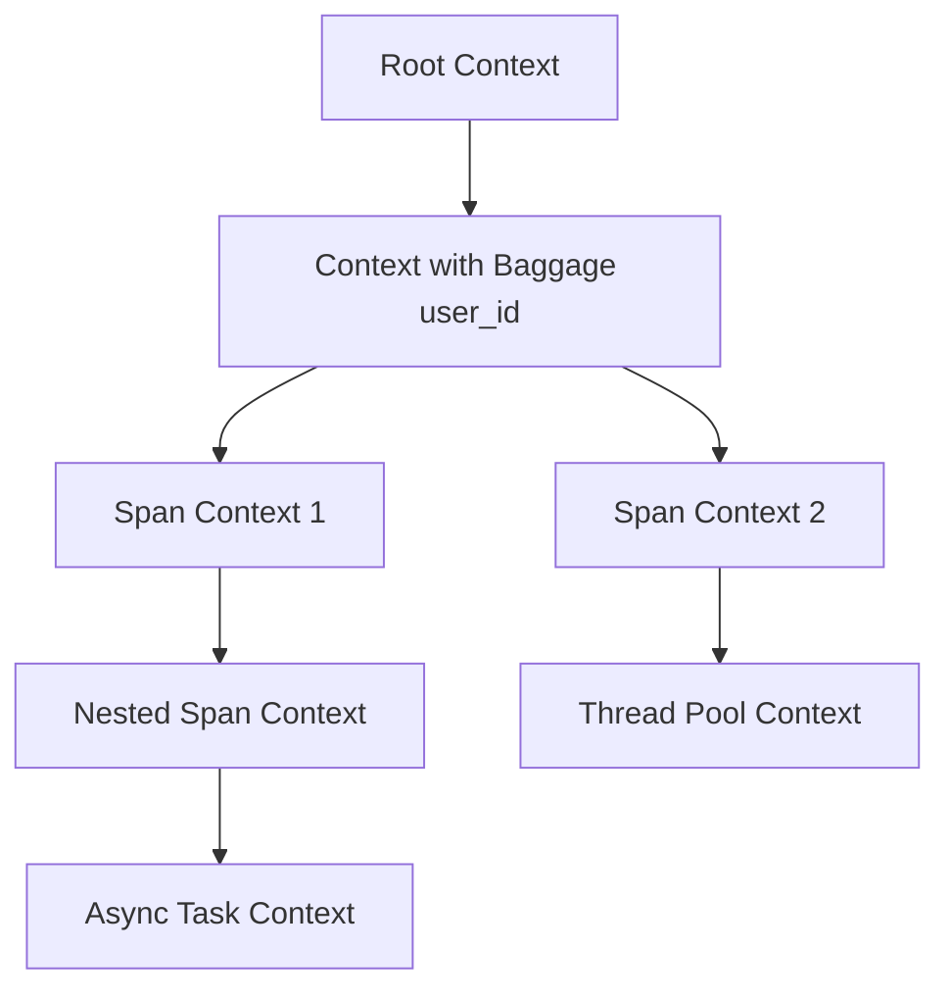

# How to Capture Baggage at Different Contexts in Python OpenTelemetry

Author: [nawazdhandala](https://www.github.com/nawazdhandala)

Tags: OpenTelemetry, Python, Baggage, Context, Propagation, Metadata

Description: Master the art of capturing and propagating baggage across different execution contexts in Python OpenTelemetry for enhanced distributed tracing capabilities.

Baggage in OpenTelemetry provides a powerful mechanism for propagating key-value pairs across service boundaries and execution contexts. Unlike span attributes that are local to a specific span, baggage travels with your requests through distributed systems, making it invaluable for carrying contextual information that multiple services need to access.

## The Power of Context Propagation

When building distributed systems, you often need to pass metadata that isn't directly related to tracing but is crucial for business logic or operational decisions. User IDs, tenant identifiers, feature flags, or experiment variants are perfect candidates for baggage. The challenge lies in capturing and accessing this baggage correctly across different execution contexts like async operations, thread pools, or inter-service calls.

The context system in OpenTelemetry Python is based on context variables, which are similar to thread-local storage but work across async boundaries. Understanding how contexts nest, fork, and propagate is fundamental to using baggage effectively.

## Understanding Context Hierarchy

OpenTelemetry maintains a stack-like structure of contexts. When you enter a new context (like starting a span or attaching baggage), a new context is created that inherits from the current one. This immutable context chain ensures that modifications in nested contexts don't affect parent contexts.



## Basic Baggage Operations

Before diving into complex scenarios, you need to understand the fundamental operations for working with baggage. OpenTelemetry provides a clean API for setting, getting, and removing baggage items.

```python
from opentelemetry import baggage, context, trace
from opentelemetry.sdk.trace import TracerProvider
from opentelemetry.sdk.trace.export import ConsoleSpanExporter, BatchSpanProcessor

# Set up basic tracing
provider = TracerProvider()
provider.add_span_processor(BatchSpanProcessor(ConsoleSpanExporter()))
trace.set_tracer_provider(provider)
tracer = trace.get_tracer(__name__)

def basic_baggage_example():
    """
    Demonstrates basic baggage operations: set, get, and remove.
    Baggage is attached to the current context.
    """
    # Set baggage in the current context
    # This creates a new context with the baggage attached
    ctx = baggage.set_baggage("user_id", "user_12345")
    ctx = baggage.set_baggage("tenant_id", "tenant_abc", context=ctx)
    ctx = baggage.set_baggage("request_id", "req_xyz", context=ctx)

    # Attach the context to make it current
    token = context.attach(ctx)

    try:
        # Retrieve baggage from current context
        user_id = baggage.get_baggage("user_id")
        tenant_id = baggage.get_baggage("tenant_id")

        print(f"User: {user_id}, Tenant: {tenant_id}")

        # Baggage is automatically included in spans created in this context
        with tracer.start_as_current_span("operation") as span:
            # The span context includes baggage
            span.set_attribute("operation.type", "data_processing")

            # Remove specific baggage item
            new_ctx = baggage.remove_baggage("request_id")
            token2 = context.attach(new_ctx)

            try:
                # request_id is no longer available
                request_id = baggage.get_baggage("request_id")
                print(f"Request ID after removal: {request_id}")  # None
            finally:
                context.detach(token2)

    finally:
        # Always detach to restore the previous context
        context.detach(token)

basic_baggage_example()
```

## Capturing Baggage in HTTP Requests

Web applications commonly need to propagate baggage across HTTP service calls. OpenTelemetry's propagators automatically inject and extract baggage from HTTP headers.

```python
from opentelemetry.propagate import inject, extract
from opentelemetry import baggage, context
from opentelemetry.propagators.composite import CompositePropagator
from opentelemetry.propagators.b3 import B3MultiFormat
from opentelemetry.trace.propagation.tracecontext import TraceContextTextMapPropagator
from opentelemetry.baggage.propagation import W3CBaggagePropagator
import requests

# Configure propagators to handle both trace context and baggage
# This ensures baggage is included in HTTP headers
from opentelemetry import propagate as global_propagate
global_propagate.set_global_textmap(
    CompositePropagator([
        TraceContextTextMapPropagator(),
        W3CBaggagePropagator(),
        B3MultiFormat()
    ])
)

def outgoing_request_with_baggage():
    """
    Demonstrates how to attach baggage to outgoing HTTP requests.
    The propagator automatically injects baggage into headers.
    """
    # Set baggage in current context
    ctx = baggage.set_baggage("user_id", "user_789")
    ctx = baggage.set_baggage("session_id", "session_abc123", context=ctx)
    ctx = baggage.set_baggage("feature_flag", "new_checkout_enabled", context=ctx)

    token = context.attach(ctx)

    try:
        with tracer.start_as_current_span("http_call") as span:
            # Prepare headers for the outgoing request
            headers = {}

            # Inject trace context and baggage into headers
            # This adds headers like 'baggage: user_id=user_789,session_id=session_abc123'
            inject(headers)

            span.set_attribute("http.method", "POST")
            span.set_attribute("http.url", "https://api.example.com/process")

            # Make the HTTP request with injected headers
            response = requests.post(
                "https://api.example.com/process",
                json={"data": "payload"},
                headers=headers
            )

            span.set_attribute("http.status_code", response.status_code)
            return response.json()

    finally:
        context.detach(token)

def incoming_request_handler(request_headers: dict):
    """
    Demonstrates how to extract baggage from incoming HTTP requests.
    The propagator automatically extracts baggage from headers.
    """
    # Extract context (including baggage) from incoming headers
    ctx = extract(request_headers)

    token = context.attach(ctx)

    try:
        # Baggage is now available in the current context
        user_id = baggage.get_baggage("user_id")
        session_id = baggage.get_baggage("session_id")
        feature_flag = baggage.get_baggage("feature_flag")

        with tracer.start_as_current_span("handle_request") as span:
            span.set_attribute("user.id", user_id)
            span.set_attribute("session.id", session_id)

            # Use feature flag for business logic
            if feature_flag == "new_checkout_enabled":
                span.set_attribute("checkout.version", "v2")
                return handle_new_checkout(user_id)
            else:
                span.set_attribute("checkout.version", "v1")
                return handle_legacy_checkout(user_id)

    finally:
        context.detach(token)

def handle_new_checkout(user_id: str):
    return {"status": "success", "version": "new"}

def handle_legacy_checkout(user_id: str):
    return {"status": "success", "version": "legacy"}
```

## Baggage in Async Contexts

Python's async/await syntax introduces challenges for context propagation. Fortunately, OpenTelemetry's context variables work seamlessly with asyncio, but you need to be aware of how contexts flow through async operations.

```python
import asyncio
from opentelemetry import baggage, context, trace

async def async_baggage_example():
    """
    Demonstrates baggage propagation in async contexts.
    Context variables automatically propagate through await boundaries.
    """
    # Set baggage in the current async context
    ctx = baggage.set_baggage("correlation_id", "corr_12345")
    ctx = baggage.set_baggage("tenant", "tenant_xyz", context=ctx)

    token = context.attach(ctx)

    try:
        with tracer.start_as_current_span("async_operation") as span:
            # Baggage is available here
            correlation_id = baggage.get_baggage("correlation_id")
            span.set_attribute("correlation.id", correlation_id)

            # Call async function - context propagates automatically
            result1 = await fetch_user_data()

            # Launch multiple concurrent tasks
            # Each task inherits the current context
            results = await asyncio.gather(
                process_order(),
                send_notification(),
                update_inventory()
            )

            return results

    finally:
        context.detach(token)

async def fetch_user_data():
    """
    Async function that accesses baggage from the propagated context.
    No explicit context passing required.
    """
    with tracer.start_as_current_span("fetch_user") as span:
        # Baggage is automatically available
        tenant = baggage.get_baggage("tenant")
        correlation_id = baggage.get_baggage("correlation_id")

        span.set_attribute("tenant", tenant)
        span.set_attribute("correlation.id", correlation_id)

        # Simulate async I/O
        await asyncio.sleep(0.1)

        return {"user": "data", "tenant": tenant}

async def process_order():
    """Each concurrent task has access to the same baggage."""
    correlation_id = baggage.get_baggage("correlation_id")
    with tracer.start_as_current_span("process_order") as span:
        span.set_attribute("correlation.id", correlation_id)
        await asyncio.sleep(0.05)
        return "order_processed"

async def send_notification():
    """Baggage propagates to all concurrent tasks."""
    tenant = baggage.get_baggage("tenant")
    with tracer.start_as_current_span("send_notification") as span:
        span.set_attribute("tenant", tenant)
        await asyncio.sleep(0.03)
        return "notification_sent"

async def update_inventory():
    """All tasks share the same context and baggage."""
    correlation_id = baggage.get_baggage("correlation_id")
    with tracer.start_as_current_span("update_inventory") as span:
        span.set_attribute("correlation.id", correlation_id)
        await asyncio.sleep(0.07)
        return "inventory_updated"

# Run the async example
asyncio.run(async_baggage_example())
```

## Baggage with Context Managers

Creating clean context boundaries is crucial for managing baggage lifetime. Context managers provide an elegant way to ensure baggage is properly scoped and cleaned up.

```python
from contextlib import contextmanager
from typing import Dict, Any

@contextmanager
def baggage_scope(**baggage_items: str):
    """
    Context manager that sets multiple baggage items
    and automatically restores the previous context on exit.
    """
    # Create a new context with all baggage items
    ctx = context.get_current()
    for key, value in baggage_items.items():
        ctx = baggage.set_baggage(key, value, context=ctx)

    token = context.attach(ctx)
    try:
        yield ctx
    finally:
        context.detach(token)

@contextmanager
def request_context(user_id: str, request_id: str, metadata: Dict[str, Any]):
    """
    Higher-level context manager for request-scoped baggage.
    Combines multiple related baggage items into a single scope.
    """
    with baggage_scope(
        user_id=user_id,
        request_id=request_id,
        user_tier=metadata.get("tier", "standard"),
        region=metadata.get("region", "us-east"),
        client_version=metadata.get("client_version", "unknown")
    ):
        with tracer.start_as_current_span("request_handler") as span:
            span.set_attribute("request.id", request_id)
            span.set_attribute("user.id", user_id)
            yield span

def handle_api_request(user_id: str, request_data: dict):
    """
    Uses the request_context manager to automatically manage baggage.
    All operations within this scope have access to the baggage.
    """
    request_id = request_data.get("request_id", "unknown")
    metadata = request_data.get("metadata", {})

    with request_context(user_id, request_id, metadata) as span:
        # Baggage is automatically available here
        user_tier = baggage.get_baggage("user_tier")
        region = baggage.get_baggage("region")

        span.set_attribute("user.tier", user_tier)

        # Process based on user tier
        if user_tier == "premium":
            result = process_premium_request(request_data)
        else:
            result = process_standard_request(request_data)

        return result

    # Baggage is automatically cleaned up here

def process_premium_request(data: dict):
    # Nested operations still have access to baggage
    with tracer.start_as_current_span("premium_processing") as span:
        user_id = baggage.get_baggage("user_id")
        region = baggage.get_baggage("region")
        span.set_attribute("processing.type", "premium")
        span.set_attribute("region", region)
        return {"status": "processed", "tier": "premium"}

def process_standard_request(data: dict):
    with tracer.start_as_current_span("standard_processing") as span:
        span.set_attribute("processing.type", "standard")
        return {"status": "processed", "tier": "standard"}
```

## Baggage in Message Queue Consumers

Message queues break the automatic context propagation that works for synchronous HTTP calls. You need to explicitly serialize and deserialize baggage with messages.

```python
from typing import Dict
import json

def publish_message_with_baggage(queue_name: str, message_data: dict):
    """
    Publishes a message to a queue with baggage serialized in the message.
    The consumer can reconstruct the context from this data.
    """
    with tracer.start_as_current_span("publish_message") as span:
        span.set_attribute("queue.name", queue_name)

        # Serialize current baggage into message headers
        baggage_data = {}
        carrier = {}
        inject(carrier)  # This injects both trace context and baggage

        # Prepare message with embedded context
        message = {
            "data": message_data,
            "context": carrier,  # Include propagation headers
            "timestamp": "2026-02-06T10:30:00Z"
        }

        # Publish to queue (simplified)
        publish_to_queue(queue_name, message)

        span.set_attribute("message.published", True)
        return message

def consume_message_with_baggage(message: dict):
    """
    Consumes a message from a queue and reconstructs the baggage context.
    This restores the distributed trace and baggage.
    """
    # Extract context from message headers
    carrier = message.get("context", {})
    ctx = extract(carrier)

    token = context.attach(ctx)

    try:
        with tracer.start_as_current_span("consume_message") as span:
            # Baggage is now available from the original publisher
            user_id = baggage.get_baggage("user_id")
            request_id = baggage.get_baggage("request_id")

            span.set_attribute("user.id", user_id)
            span.set_attribute("request.id", request_id)
            span.set_attribute("message.type", "queue_consumer")

            # Process message data
            message_data = message.get("data", {})
            result = process_message_data(message_data)

            return result

    finally:
        context.detach(token)

def publish_to_queue(queue_name: str, message: dict):
    # Simulated queue publish
    print(f"Publishing to {queue_name}: {json.dumps(message, indent=2)}")

def process_message_data(data: dict):
    # Nested processing still has access to baggage
    tenant = baggage.get_baggage("tenant")
    return {"processed": True, "tenant": tenant}
```

## Dynamic Baggage Based on Span Events

Sometimes you need to add baggage dynamically based on what happens during request processing. This pattern shows how to enrich baggage as your application discovers new context.

```python
def dynamic_baggage_enrichment(user_id: str):
    """
    Demonstrates adding baggage dynamically as more context becomes available.
    This is useful when initial requests lack full context.
    """
    # Start with minimal baggage
    ctx = baggage.set_baggage("user_id", user_id)
    token = context.attach(ctx)

    try:
        with tracer.start_as_current_span("user_operation") as span:
            span.set_attribute("user.id", user_id)

            # Fetch user details and enrich baggage
            user_details = fetch_user_details(user_id)

            # Add discovered context to baggage
            ctx = baggage.set_baggage("user_tier", user_details["tier"])
            ctx = baggage.set_baggage("account_type", user_details["account_type"], context=ctx)
            ctx = baggage.set_baggage("subscription_status", user_details["subscription"], context=ctx)

            # Update current context with enriched baggage
            token2 = context.attach(ctx)

            try:
                # Subsequent operations have access to enriched baggage
                if user_details["tier"] == "enterprise":
                    result = process_enterprise_user(user_id)
                else:
                    result = process_regular_user(user_id)

                return result

            finally:
                context.detach(token2)

    finally:
        context.detach(token)

def fetch_user_details(user_id: str) -> dict:
    """Simulates fetching user details from a database."""
    return {
        "tier": "enterprise",
        "account_type": "business",
        "subscription": "active"
    }

def process_enterprise_user(user_id: str):
    with tracer.start_as_current_span("enterprise_processing") as span:
        # Access enriched baggage
        account_type = baggage.get_baggage("account_type")
        subscription = baggage.get_baggage("subscription_status")

        span.set_attribute("account.type", account_type)
        span.set_attribute("subscription.status", subscription)

        return {"status": "processed", "tier": "enterprise"}

def process_regular_user(user_id: str):
    with tracer.start_as_current_span("regular_processing") as span:
        return {"status": "processed", "tier": "regular"}
```

## Baggage Size and Performance Considerations

Baggage travels with every span and crosses service boundaries, so size matters. Each baggage entry adds to HTTP headers and increases serialization overhead.

```python
from opentelemetry import baggage

def efficient_baggage_usage():
    """
    Demonstrates best practices for baggage to minimize performance impact.
    Keep baggage small and only include what's truly needed across services.
    """
    # GOOD: Small, essential values
    ctx = baggage.set_baggage("user_id", "usr_12345")  # 14 bytes
    ctx = baggage.set_baggage("tenant", "acme_corp", context=ctx)  # 14 bytes
    ctx = baggage.set_baggage("region", "us-west", context=ctx)  # 12 bytes

    # AVOID: Large values that bloat headers
    # Don't put entire objects or large strings in baggage
    # ctx = baggage.set_baggage("user_profile", json.dumps(large_user_object))  # BAD

    # AVOID: Sensitive data (PII, credentials)
    # Baggage may be logged or exposed in headers
    # ctx = baggage.set_baggage("password", "secret123")  # NEVER DO THIS
    # ctx = baggage.set_baggage("email", "user@example.com")  # AVOID

    # GOOD: Use identifiers instead of full data
    # Services can look up details using the ID
    ctx = baggage.set_baggage("session_id", "sess_abc123", context=ctx)

    token = context.attach(ctx)

    try:
        with tracer.start_as_current_span("operation"):
            # Use baggage for routing and correlation
            tenant = baggage.get_baggage("tenant")
            # Fetch full details from cache or database using the ID
            user_profile = fetch_from_cache(baggage.get_baggage("user_id"))

    finally:
        context.detach(token)

def fetch_from_cache(user_id: str):
    return {"name": "User Name", "email": "cached@example.com"}
```

Baggage provides a powerful way to propagate context across your distributed system. By understanding how contexts work in different execution environments and following best practices for size and security, you can leverage baggage to build more observable and maintainable applications. The key is treating baggage as a lightweight correlation mechanism rather than a data transport layer.
