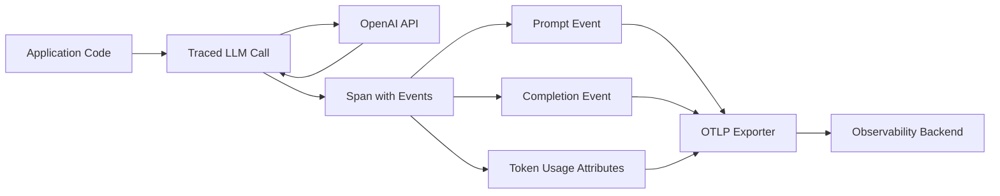

# How to Capture GenAI Prompt and Completion Events in OpenTelemetry Traces

Author: [nawazdhandala](https://www.github.com/nawazdhandala)

Tags: OpenTelemetry, GenAI, LLM Observability, Tracing, Prompt Engineering

Description: Learn how to capture and trace generative AI prompt and completion events using OpenTelemetry semantic conventions for full LLM observability.

---

If you're running generative AI workloads in production, you already know that debugging a bad completion is nothing like debugging a 500 error from a REST API. The inputs are fuzzy, the outputs are nondeterministic, and there's no status code that tells you "the model hallucinated." That's why capturing prompt and completion events inside your OpenTelemetry traces is so valuable. It gives you a structured, searchable record of every interaction with your LLM, tied directly to the rest of your application's telemetry.

In this guide, we'll walk through the OpenTelemetry GenAI semantic conventions, set up tracing for prompt/completion pairs, and show you how to build a pipeline that captures this data without leaking sensitive information.

## Why Trace Prompts and Completions?

Traditional application monitoring focuses on latency, error rates, and throughput. Those metrics still matter for GenAI workloads, but they miss the biggest source of bugs: the content itself. A model can return a 200 OK response in 400ms and still produce completely wrong output.

By capturing prompt and completion events as part of your OpenTelemetry traces, you get:

- **Debugging context** - When a user reports a bad answer, you can look up the exact prompt that produced it.
- **Prompt regression detection** - If you change a system prompt, you can compare before/after completions across traces.
- **Cost attribution** - Token counts attached to events let you track spend per feature, per user, or per team.
- **Compliance auditing** - Regulated industries need records of what the model was asked and what it said.

## Understanding the OpenTelemetry GenAI Semantic Conventions

OpenTelemetry has published semantic conventions specifically for generative AI. These conventions define standard attribute names so that traces from different LLM providers (OpenAI, Anthropic, Cohere, etc.) look consistent in your observability backend.

Here are the key attributes you'll work with:

| Attribute | Description |
|-----------|-------------|
| `gen_ai.system` | The AI provider (e.g., `openai`, `anthropic`) |
| `gen_ai.request.model` | The model name (e.g., `gpt-4`, `claude-3-opus`) |
| `gen_ai.request.max_tokens` | Max tokens requested |
| `gen_ai.request.temperature` | Sampling temperature |
| `gen_ai.usage.input_tokens` | Tokens consumed by the prompt |
| `gen_ai.usage.output_tokens` | Tokens in the completion |
| `gen_ai.prompt` | The prompt event content |
| `gen_ai.completion` | The completion event content |

These follow the OpenTelemetry specification for GenAI spans, and using them means any OTLP-compatible backend can parse your traces correctly.

## Setting Up the Project

Let's start with a Python project that calls OpenAI and captures full prompt/completion traces. First, install the dependencies.

```bash
# Install OpenTelemetry SDK, OTLP exporter, and OpenAI client
pip install opentelemetry-api opentelemetry-sdk opentelemetry-exporter-otlp openai
```

## Configuring the Tracer Provider

Before we instrument any LLM calls, we need a properly configured tracer provider that exports spans over OTLP. This setup sends traces to any OTLP-compatible backend like OneUptime.

```python
# configure_tracing.py - Sets up the OpenTelemetry tracer provider with OTLP export
from opentelemetry import trace
from opentelemetry.sdk.trace import TracerProvider
from opentelemetry.sdk.trace.export import BatchSpanProcessor
from opentelemetry.exporter.otlp.proto.grpc.trace_exporter import OTLPSpanExporter
from opentelemetry.sdk.resources import Resource

def setup_tracing(service_name: str) -> trace.Tracer:
    # Define the service resource so spans are grouped correctly
    resource = Resource.create({
        "service.name": service_name,
        "service.version": "1.0.0",
    })

    # Create the tracer provider with our resource
    provider = TracerProvider(resource=resource)

    # Configure the OTLP exporter - endpoint comes from environment variables
    # Set OTEL_EXPORTER_OTLP_ENDPOINT and OTEL_EXPORTER_OTLP_HEADERS in your env
    exporter = OTLPSpanExporter()

    # Use batch processing to avoid blocking on every span
    provider.add_span_processor(BatchSpanProcessor(exporter))

    # Register this provider globally
    trace.set_tracer_provider(provider)

    return trace.get_tracer(service_name)
```

## Capturing Prompt and Completion Events

Now here's the core piece. We'll create a wrapper function that calls OpenAI and records the prompt and completion as span events following the GenAI semantic conventions.

```python
# genai_tracing.py - Wraps OpenAI calls with full prompt/completion tracing
import openai
from opentelemetry import trace

tracer = trace.get_tracer("genai-service")

def traced_chat_completion(messages: list, model: str = "gpt-4", temperature: float = 0.7, max_tokens: int = 1024):
    """Call OpenAI chat completion and record prompt/completion as span events."""

    # Start a new span for this LLM call
    with tracer.start_as_current_span("gen_ai.chat.completion") as span:
        # Set standard GenAI attributes on the span
        span.set_attribute("gen_ai.system", "openai")
        span.set_attribute("gen_ai.request.model", model)
        span.set_attribute("gen_ai.request.temperature", temperature)
        span.set_attribute("gen_ai.request.max_tokens", max_tokens)

        # Record the prompt as a span event
        # Each message in the conversation gets its own event
        for i, message in enumerate(messages):
            span.add_event(
                "gen_ai.prompt",
                attributes={
                    "gen_ai.prompt.role": message["role"],
                    "gen_ai.prompt.content": message["content"],
                    "gen_ai.prompt.index": i,
                },
            )

        # Make the actual API call
        response = openai.chat.completions.create(
            model=model,
            messages=messages,
            temperature=temperature,
            max_tokens=max_tokens,
        )

        # Extract the completion
        completion = response.choices[0].message.content

        # Record the completion as a span event
        span.add_event(
            "gen_ai.completion",
            attributes={
                "gen_ai.completion.role": "assistant",
                "gen_ai.completion.content": completion,
                "gen_ai.completion.finish_reason": response.choices[0].finish_reason,
            },
        )

        # Record token usage for cost tracking
        span.set_attribute("gen_ai.usage.input_tokens", response.usage.prompt_tokens)
        span.set_attribute("gen_ai.usage.output_tokens", response.usage.completion_tokens)

        return completion
```

## Data Flow Architecture

Here's how the prompt and completion data flows through the system, from your application all the way to your observability backend.



## Handling Sensitive Data with Sanitization

In production, you probably don't want raw user prompts sitting in your trace storage forever. PII, proprietary data, and other sensitive content will end up in those prompt events. Here's a simple sanitization layer you can add.

```python
# sanitize.py - Strips or masks sensitive content before recording it in traces
import re

# Patterns to redact from prompts and completions
PII_PATTERNS = [
    (r'\b\d{3}-\d{2}-\d{4}\b', '[SSN_REDACTED]'),          # Social Security Numbers
    (r'\b[A-Za-z0-9._%+-]+@[A-Za-z0-9.-]+\.[A-Z|a-z]{2,}\b', '[EMAIL_REDACTED]'),  # Email addresses
    (r'\b\d{16}\b', '[CARD_REDACTED]'),                       # Credit card numbers
]

def sanitize_content(text: str) -> str:
    """Remove PII patterns from text before storing in spans."""
    sanitized = text
    for pattern, replacement in PII_PATTERNS:
        sanitized = re.sub(pattern, replacement, sanitized)
    return sanitized

def traced_chat_completion_safe(messages: list, model: str = "gpt-4", **kwargs):
    """Same as traced_chat_completion but sanitizes prompt/completion content."""
    with tracer.start_as_current_span("gen_ai.chat.completion") as span:
        span.set_attribute("gen_ai.system", "openai")
        span.set_attribute("gen_ai.request.model", model)

        # Record sanitized prompts only
        for i, message in enumerate(messages):
            span.add_event(
                "gen_ai.prompt",
                attributes={
                    "gen_ai.prompt.role": message["role"],
                    "gen_ai.prompt.content": sanitize_content(message["content"]),
                    "gen_ai.prompt.index": i,
                },
            )

        response = openai.chat.completions.create(model=model, messages=messages, **kwargs)
        completion = response.choices[0].message.content

        # Sanitize the completion too
        span.add_event(
            "gen_ai.completion",
            attributes={
                "gen_ai.completion.content": sanitize_content(completion),
            },
        )

        span.set_attribute("gen_ai.usage.input_tokens", response.usage.prompt_tokens)
        span.set_attribute("gen_ai.usage.output_tokens", response.usage.completion_tokens)

        return completion
```

## Putting It All Together

Here's a complete example that initializes tracing, makes a GenAI call, and properly shuts down the tracer.

```python
# main.py - Complete example of GenAI tracing with OpenTelemetry
import os
from configure_tracing import setup_tracing
from genai_tracing import traced_chat_completion

# Set your OpenTelemetry endpoint before running
# export OTEL_EXPORTER_OTLP_ENDPOINT="https://otlp.oneuptime.com"
# export OTEL_EXPORTER_OTLP_HEADERS="x-oneuptime-token=YOUR_TOKEN"

def main():
    # Initialize the tracer
    tracer = setup_tracing("my-genai-service")

    # Define the conversation
    messages = [
        {"role": "system", "content": "You are a helpful coding assistant."},
        {"role": "user", "content": "Write a Python function to reverse a linked list."},
    ]

    # Make the traced LLM call
    result = traced_chat_completion(messages, model="gpt-4", temperature=0.3)
    print(result)

    # Flush remaining spans before exit
    from opentelemetry import trace
    trace.get_tracer_provider().shutdown()

if __name__ == "__main__":
    main()
```

## Querying Your Traces

Once your traces are flowing into your backend, you can search for specific patterns. For example, in OneUptime's trace explorer, you can filter by:

- `gen_ai.request.model = "gpt-4"` to see all GPT-4 calls
- `gen_ai.usage.output_tokens > 500` to find expensive completions
- Event content containing specific keywords to track prompt patterns

This makes it straightforward to debug issues like "why did the chatbot give a wrong answer at 3:42 PM yesterday?" - just find the trace, open the span, and read the prompt and completion events.

## Best Practices

1. **Always record token counts.** Even if you skip recording prompt content, token usage is essential for cost tracking and anomaly detection.

2. **Use span events, not span attributes, for prompt content.** Events are timestamped and ordered, which matters when you have multi-turn conversations.

3. **Sanitize before recording.** Build the sanitization into your tracing wrapper so developers can't accidentally skip it.

4. **Set sampling rates for high-volume services.** You might not need every single prompt/completion pair. A 10% sample rate can still give you great debugging coverage while cutting storage costs.

5. **Include the finish reason.** Knowing whether a completion ended because of `stop`, `length`, or `content_filter` is critical for debugging truncated or blocked responses.

## Conclusion

Capturing GenAI prompt and completion events in OpenTelemetry traces turns your LLM interactions from a black box into a fully observable system. By following the GenAI semantic conventions, you get consistent, queryable data that works across providers and backends. The key is building this into your application from day one, with proper sanitization and sampling, rather than trying to bolt it on after something goes wrong in production.
