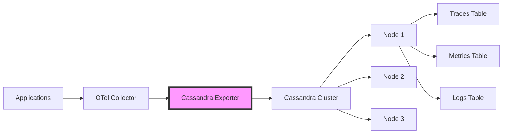

# How to Configure the Cassandra Exporter in the OpenTelemetry Collector

Author: [nawazdhandala](https://www.github.com/nawazdhandala)

Tags: OpenTelemetry, Collector, Exporters, Cassandra, Database, NoSQL, Time Series

Description: Learn how to configure the Cassandra exporter in the OpenTelemetry Collector to store telemetry data in Apache Cassandra for scalable, distributed long-term data retention.

The Cassandra exporter enables the OpenTelemetry Collector to store telemetry data in Apache Cassandra, a highly scalable, distributed NoSQL database. This integration is ideal for organizations that need to store large volumes of telemetry data with high write throughput, built-in replication, and flexible data modeling capabilities.

## Understanding the Cassandra Exporter

Apache Cassandra is a distributed database designed for handling large amounts of data across many commodity servers with no single point of failure. Its masterless architecture and tunable consistency make it well-suited for storing time-series telemetry data that requires high write throughput and horizontal scalability.

The Cassandra exporter writes traces, metrics, and logs to Cassandra tables using the CQL (Cassandra Query Language) protocol. You can design schemas optimized for your query patterns, leverage Cassandra's time-to-live (TTL) features for automatic data expiration, and scale storage capacity by adding nodes to the cluster.



## Why Use Cassandra for Telemetry Storage

Cassandra offers several advantages for telemetry data storage:

**High Write Throughput**: Cassandra excels at handling high volumes of write operations, making it ideal for ingesting telemetry data from many sources.

**Linear Scalability**: Add nodes to the cluster to increase storage capacity and throughput without downtime or complex reconfiguration.

**Fault Tolerance**: Data is automatically replicated across multiple nodes, ensuring availability even when nodes fail.

**Tunable Consistency**: Choose consistency levels per query to balance between consistency, availability, and latency based on your requirements.

**Flexible Data Modeling**: Design tables optimized for your specific query patterns, with support for wide rows, collections, and secondary indexes.

**Automatic Data Expiration**: Use TTL to automatically expire old telemetry data without manual cleanup jobs.

## Basic Configuration

Here is a basic configuration for storing telemetry data in Cassandra:

```yaml
receivers:
  # Receive telemetry via OTLP
  otlp:
    protocols:
      grpc:
        endpoint: 0.0.0.0:4317
      http:
        endpoint: 0.0.0.0:4318

processors:
  # Batch telemetry for efficiency
  batch:
    timeout: 10s
    send_batch_size: 512

exporters:
  # Configure Cassandra exporter
  cassandra:
    # Cassandra contact points
    endpoints:
      - 127.0.0.1:9042
    # Keyspace for telemetry data
    keyspace: observability
    # Table for storing data
    table: traces
    # Consistency level for writes
    consistency: ONE
    # Connection timeout
    timeout: 30s
    # Number of connections per host
    num_connections: 2

service:
  pipelines:
    traces:
      receivers: [otlp]
      processors: [batch]
      exporters: [cassandra]
```

This configuration connects to a local Cassandra instance and writes trace data to the "traces" table in the "observability" keyspace. The consistency level ONE provides fast writes with eventual consistency.

## Keyspace and Table Schema

Before using the Cassandra exporter, create the keyspace and tables. Here is an example schema for traces:

```cql
-- Create keyspace with replication
CREATE KEYSPACE IF NOT EXISTS observability
WITH replication = {
  'class': 'NetworkTopologyStrategy',
  'datacenter1': 3
};

-- Create traces table
CREATE TABLE IF NOT EXISTS observability.traces (
  trace_id text,
  span_id text,
  parent_span_id text,
  service_name text,
  operation_name text,
  start_time timestamp,
  duration bigint,
  tags map<text, text>,
  logs list<frozen<map<text, text>>>,
  PRIMARY KEY ((trace_id), start_time, span_id)
) WITH CLUSTERING ORDER BY (start_time DESC)
  AND default_time_to_live = 604800  -- 7 days TTL
  AND gc_grace_seconds = 86400;

-- Create index for service queries
CREATE INDEX IF NOT EXISTS traces_service_idx
ON observability.traces (service_name);

-- Create metrics table
CREATE TABLE IF NOT EXISTS observability.metrics (
  metric_name text,
  timestamp timestamp,
  service_name text,
  value double,
  tags map<text, text>,
  PRIMARY KEY ((metric_name, service_name), timestamp)
) WITH CLUSTERING ORDER BY (timestamp DESC)
  AND default_time_to_live = 2592000  -- 30 days TTL
  AND gc_grace_seconds = 86400;

-- Create logs table
CREATE TABLE IF NOT EXISTS observability.logs (
  log_id timeuuid,
  timestamp timestamp,
  service_name text,
  severity text,
  message text,
  attributes map<text, text>,
  PRIMARY KEY ((service_name), timestamp, log_id)
) WITH CLUSTERING ORDER BY (timestamp DESC, log_id DESC)
  AND default_time_to_live = 2592000  -- 30 days TTL
  AND gc_grace_seconds = 86400;
```

This schema partitions data by trace ID for traces, by metric name and service for metrics, and by service for logs. The clustering order allows efficient time-range queries. TTL automatically expires old data.

## Multiple Tables Configuration

Configure different exporters for different telemetry signals with optimized table schemas:

```yaml
receivers:
  otlp:
    protocols:
      grpc:
        endpoint: 0.0.0.0:4317

processors:
  batch/traces:
    timeout: 10s
    send_batch_size: 512

  batch/metrics:
    timeout: 30s
    send_batch_size: 1024

  batch/logs:
    timeout: 10s
    send_batch_size: 512

exporters:
  # Traces to Cassandra
  cassandra/traces:
    endpoints:
      - cassandra-1.example.com:9042
      - cassandra-2.example.com:9042
      - cassandra-3.example.com:9042
    keyspace: observability
    table: traces
    consistency: LOCAL_QUORUM
    timeout: 30s
    num_connections: 4
    # Map OTel fields to Cassandra columns
    mapping:
      trace_id: trace_id
      span_id: span_id
      parent_span_id: parent_span_id
      service_name: resource.service.name
      operation_name: name
      start_time: start_time_unix_nano
      duration: duration
      tags: attributes

  # Metrics to Cassandra
  cassandra/metrics:
    endpoints:
      - cassandra-1.example.com:9042
      - cassandra-2.example.com:9042
      - cassandra-3.example.com:9042
    keyspace: observability
    table: metrics
    consistency: LOCAL_QUORUM
    timeout: 30s
    num_connections: 4
    mapping:
      metric_name: name
      timestamp: time_unix_nano
      service_name: resource.service.name
      value: gauge.value
      tags: attributes

  # Logs to Cassandra
  cassandra/logs:
    endpoints:
      - cassandra-1.example.com:9042
      - cassandra-2.example.com:9042
      - cassandra-3.example.com:9042
    keyspace: observability
    table: logs
    consistency: LOCAL_QUORUM
    timeout: 30s
    num_connections: 4
    mapping:
      log_id: observed_time_unix_nano
      timestamp: time_unix_nano
      service_name: resource.service.name
      severity: severity_text
      message: body
      attributes: attributes

service:
  pipelines:
    traces:
      receivers: [otlp]
      processors: [batch/traces]
      exporters: [cassandra/traces]

    metrics:
      receivers: [otlp]
      processors: [batch/metrics]
      exporters: [cassandra/metrics]

    logs:
      receivers: [otlp]
      processors: [batch/logs]
      exporters: [cassandra/logs]
```

Multiple exporters with field mappings allow you to store different telemetry types in tables optimized for their specific query patterns. The LOCAL_QUORUM consistency level provides good durability while maintaining performance.

## Secure Configuration with Authentication

For production deployments, secure the connection to Cassandra using authentication and TLS:

```yaml
receivers:
  otlp:
    protocols:
      grpc:
        endpoint: 0.0.0.0:4317

processors:
  batch:
    timeout: 10s

exporters:
  cassandra:
    endpoints:
      - cassandra-1.example.com:9042
      - cassandra-2.example.com:9042
    keyspace: observability
    table: traces

    # Authentication configuration
    auth:
      # Username and password authentication
      type: plain
      username: otel_collector
      password: ${CASSANDRA_PASSWORD}

    # TLS configuration
    tls:
      enabled: true
      insecure: false
      ca_file: /etc/ssl/certs/cassandra-ca.crt
      cert_file: /etc/ssl/certs/client.crt
      key_file: /etc/ssl/private/client.key
      server_name_override: cassandra.example.com

    consistency: LOCAL_QUORUM
    timeout: 30s
    num_connections: 4

service:
  pipelines:
    traces:
      receivers: [otlp]
      processors: [batch]
      exporters: [cassandra]
```

TLS encryption protects telemetry data in transit. Store authentication credentials in environment variables rather than configuration files. Cassandra also supports certificate-based authentication for stronger security.

## Consistency Level Configuration

Configure consistency levels to balance between performance, durability, and availability:

```yaml
receivers:
  otlp:
    protocols:
      grpc:
        endpoint: 0.0.0.0:4317

processors:
  batch:
    timeout: 10s

exporters:
  # Critical traces with strong consistency
  cassandra/critical:
    endpoints:
      - cassandra-1.example.com:9042
      - cassandra-2.example.com:9042
      - cassandra-3.example.com:9042
    keyspace: observability
    table: critical_traces
    # QUORUM requires majority of replicas
    consistency: QUORUM
    timeout: 30s
    num_connections: 4

  # High-volume metrics with eventual consistency
  cassandra/metrics:
    endpoints:
      - cassandra-1.example.com:9042
      - cassandra-2.example.com:9042
      - cassandra-3.example.com:9042
    keyspace: observability
    table: metrics
    # ONE provides fastest writes
    consistency: ONE
    timeout: 30s
    num_connections: 8

  # Logs with local datacenter consistency
  cassandra/logs:
    endpoints:
      - cassandra-1.example.com:9042
      - cassandra-2.example.com:9042
      - cassandra-3.example.com:9042
    keyspace: observability
    table: logs
    # LOCAL_QUORUM for multi-datacenter deployments
    consistency: LOCAL_QUORUM
    timeout: 30s
    num_connections: 4

service:
  pipelines:
    traces/critical:
      receivers: [otlp]
      processors: [batch]
      exporters: [cassandra/critical]

    metrics:
      receivers: [otlp]
      processors: [batch]
      exporters: [cassandra/metrics]

    logs:
      receivers: [otlp]
      processors: [batch]
      exporters: [cassandra/logs]
```

**ONE**: Fastest writes, lowest durability. Use for high-volume, less critical data.

**QUORUM**: Majority of replicas must acknowledge. Good balance of performance and durability.

**LOCAL_QUORUM**: Majority of replicas in local datacenter. Best for multi-datacenter deployments.

**ALL**: All replicas must acknowledge. Highest durability, slowest writes.

## Time-to-Live Configuration

Configure TTL to automatically expire old telemetry data:

```yaml
receivers:
  otlp:
    protocols:
      grpc:
        endpoint: 0.0.0.0:4317

processors:
  # Add TTL attribute based on data type
  attributes:
    actions:
      - key: cassandra.ttl
        value: 604800  # 7 days for traces
        action: insert

  batch:
    timeout: 10s

exporters:
  cassandra:
    endpoints:
      - cassandra-1.example.com:9042
    keyspace: observability
    table: traces
    consistency: LOCAL_QUORUM
    timeout: 30s

    # TTL configuration
    ttl:
      # Use TTL from attribute
      from_attribute: cassandra.ttl
      # Default TTL if attribute not present (seconds)
      default: 604800  # 7 days

service:
  pipelines:
    traces:
      receivers: [otlp]
      processors: [attributes, batch]
      exporters: [cassandra]
```

TTL automatically deletes expired data without manual cleanup. Set appropriate TTL values based on your retention requirements and storage capacity. Shorter TTL reduces storage costs but limits historical analysis capabilities.

## Prepared Statements and Batching

Configure prepared statements and batching for optimal performance:

```yaml
receivers:
  otlp:
    protocols:
      grpc:
        endpoint: 0.0.0.0:4317

processors:
  # Batch aggressively for better performance
  batch:
    timeout: 30s
    send_batch_size: 2048
    send_batch_max_size: 4096

exporters:
  cassandra:
    endpoints:
      - cassandra-1.example.com:9042
      - cassandra-2.example.com:9042
    keyspace: observability
    table: traces
    consistency: ONE
    timeout: 60s

    # Connection pool configuration
    num_connections: 8
    max_connections_per_host: 16

    # Prepared statement configuration
    prepared_statements:
      enabled: true
      # Cache size for prepared statements
      cache_size: 1000

    # Batch configuration
    batch:
      # Use unlogged batches for better performance
      type: unlogged
      # Max statements per batch
      max_statements: 100
      # Batch size threshold (bytes)
      max_size: 65536

    # Retry configuration
    retry_policy:
      max_attempts: 3
      min_backoff: 100ms
      max_backoff: 10s

service:
  pipelines:
    traces:
      receivers: [otlp]
      processors: [batch]
      exporters: [cassandra]
```

Prepared statements improve performance by pre-parsing and caching queries. Unlogged batches provide better write throughput than logged batches but do not guarantee atomicity across partitions. Use aggressive batching to reduce network overhead.

## Multi-Datacenter Configuration

Configure the exporter for multi-datacenter Cassandra deployments:

```yaml
receivers:
  otlp:
    protocols:
      grpc:
        endpoint: 0.0.0.0:4317

processors:
  batch:
    timeout: 10s

exporters:
  cassandra:
    # Contact points in local datacenter
    endpoints:
      - cassandra-dc1-1.example.com:9042
      - cassandra-dc1-2.example.com:9042
      - cassandra-dc1-3.example.com:9042
    keyspace: observability
    table: traces

    # Datacenter-aware load balancing
    load_balancing:
      policy: DCAwareRoundRobin
      local_datacenter: dc1
      # Number of remote hosts to use as fallback
      used_hosts_per_remote_dc: 2

    # Use LOCAL_QUORUM for multi-DC consistency
    consistency: LOCAL_QUORUM

    # Retry policy for multi-DC
    retry_policy:
      max_attempts: 3
      min_backoff: 100ms
      max_backoff: 10s

    timeout: 30s
    num_connections: 4

service:
  pipelines:
    traces:
      receivers: [otlp]
      processors: [batch]
      exporters: [cassandra]
```

DCAwareRoundRobin load balancing prefers nodes in the local datacenter, reducing latency and cross-datacenter traffic. LOCAL_QUORUM ensures consistency within the datacenter without waiting for remote replicas.

## Data Compression

Enable compression to reduce network bandwidth and storage:

```yaml
receivers:
  otlp:
    protocols:
      grpc:
        endpoint: 0.0.0.0:4317

processors:
  batch:
    timeout: 10s

exporters:
  cassandra:
    endpoints:
      - cassandra-1.example.com:9042
    keyspace: observability
    table: traces
    consistency: LOCAL_QUORUM
    timeout: 30s

    # Compression configuration
    compression:
      # Compression algorithm (snappy, lz4, or none)
      algorithm: lz4
      # Compression level (1-9 for lz4)
      level: 3

    num_connections: 4

service:
  pipelines:
    traces:
      receivers: [otlp]
      processors: [batch]
      exporters: [cassandra]
```

Compression reduces network bandwidth usage between the collector and Cassandra. LZ4 provides good compression with minimal CPU overhead. Snappy offers faster compression with slightly lower compression ratios.

## Token-Aware Routing

Configure token-aware routing to optimize data distribution:

```yaml
receivers:
  otlp:
    protocols:
      grpc:
        endpoint: 0.0.0.0:4317

processors:
  batch:
    timeout: 10s

exporters:
  cassandra:
    endpoints:
      - cassandra-1.example.com:9042
      - cassandra-2.example.com:9042
      - cassandra-3.example.com:9042
    keyspace: observability
    table: traces
    consistency: LOCAL_QUORUM
    timeout: 30s

    # Enable token-aware routing
    load_balancing:
      policy: TokenAware
      # Wrap with DC-aware policy
      child_policy: DCAwareRoundRobin
      local_datacenter: dc1

    num_connections: 4

service:
  pipelines:
    traces:
      receivers: [otlp]
      processors: [batch]
      exporters: [cassandra]
```

Token-aware routing sends write requests directly to the nodes that own the data based on the partition key. This reduces latency by avoiding coordinator hops and improves overall cluster efficiency.

## Query Example

Here is a Python example of querying telemetry data from Cassandra:

```python
from cassandra.cluster import Cluster
from cassandra.auth import PlainTextAuthProvider
from datetime import datetime, timedelta

# Configure authentication
auth_provider = PlainTextAuthProvider(
    username='query_user',
    password='password'
)

# Connect to Cassandra
cluster = Cluster(
    contact_points=['cassandra-1.example.com', 'cassandra-2.example.com'],
    port=9042,
    auth_provider=auth_provider
)
session = cluster.connect('observability')

# Query traces by trace_id
trace_id = 'abc123'
query = """
    SELECT * FROM traces
    WHERE trace_id = ?
    ORDER BY start_time DESC
"""
prepared = session.prepare(query)
rows = session.execute(prepared, [trace_id])

for row in rows:
    print(f"Span: {row.span_id}, Operation: {row.operation_name}")

# Query metrics by service and time range
service_name = 'checkout-service'
start_time = datetime.now() - timedelta(hours=1)
metric_name = 'http.server.duration'

query = """
    SELECT * FROM metrics
    WHERE metric_name = ? AND service_name = ? AND timestamp >= ?
    ORDER BY timestamp DESC
"""
prepared = session.prepare(query)
rows = session.execute(prepared, [metric_name, service_name, start_time])

for row in rows:
    print(f"Timestamp: {row.timestamp}, Value: {row.value}")

# Query logs by service and time range
query = """
    SELECT * FROM logs
    WHERE service_name = ? AND timestamp >= ?
    ORDER BY timestamp DESC
    LIMIT 100
"""
prepared = session.prepare(query)
rows = session.execute(prepared, [service_name, start_time])

for row in rows:
    print(f"[{row.severity}] {row.message}")

cluster.shutdown()
```

This example demonstrates querying traces by trace ID, metrics by service and time range, and recent logs for a service. Design queries to match your table partition keys and clustering columns for optimal performance.

## Monitoring and Performance

Monitor the Cassandra exporter to ensure reliable data storage:

```yaml
receivers:
  otlp:
    protocols:
      grpc:
        endpoint: 0.0.0.0:4317

processors:
  batch:
    timeout: 10s

exporters:
  cassandra:
    endpoints:
      - cassandra-1.example.com:9042
    keyspace: observability
    table: traces
    consistency: LOCAL_QUORUM
    timeout: 30s

  # Export collector metrics
  prometheus:
    endpoint: "0.0.0.0:8888"

service:
  pipelines:
    traces:
      receivers: [otlp]
      processors: [batch]
      exporters: [cassandra]

  telemetry:
    logs:
      level: info
    metrics:
      level: detailed
      address: ":8888"
```

Monitor these key metrics:

- Writes completed and failed counts
- Write latency percentiles
- Connection pool utilization
- Batch sizes and flush rates
- Timeout and retry counts

Also monitor Cassandra cluster metrics including write throughput, compaction rates, disk usage, and read/write latencies. For more information, see our guide on [monitoring the OpenTelemetry Collector](https://oneuptime.com/blog/post/monitoring-opentelemetry-collector/view).

## Best Practices

Follow these best practices when using the Cassandra exporter:

**Design Schemas for Query Patterns**: Structure partition keys and clustering columns to match your query patterns for optimal performance.

**Use Appropriate Consistency Levels**: Balance durability, performance, and availability by choosing the right consistency level for each use case.

**Configure TTL**: Automatically expire old data to manage storage costs and prevent unbounded growth.

**Enable Compression**: Reduce network bandwidth and storage usage with compression algorithms like LZ4.

**Use Prepared Statements**: Improve performance by caching prepared statements for frequently executed queries.

**Batch Writes**: Group multiple writes into batches to reduce network overhead and improve throughput.

**Monitor Cluster Health**: Track Cassandra cluster metrics to identify performance issues and capacity constraints.

**Use Token-Aware Routing**: Optimize data placement by routing writes directly to owning nodes.

**Secure Connections**: Use authentication and TLS encryption to protect telemetry data.

## Integration with Time-Series Data

Cassandra excels at storing time-series telemetry data. For more information on time-series patterns, see our posts on [time-series data modeling](https://oneuptime.com/blog/post/timeseries-data-modeling/view) and [long-term telemetry storage](https://oneuptime.com/blog/post/longterm-telemetry-storage/view).

## Conclusion

The Cassandra exporter enables scalable, distributed storage of telemetry data in Apache Cassandra. Cassandra's high write throughput, linear scalability, and fault tolerance make it well-suited for storing large volumes of observability data with strong durability guarantees.

Configure the exporter based on your requirements, designing schemas optimized for your query patterns and choosing appropriate consistency levels and TTL settings. With proper schema design and monitoring, the Cassandra exporter provides a robust foundation for long-term telemetry storage that scales horizontally and handles massive data volumes across multiple datacenters.
