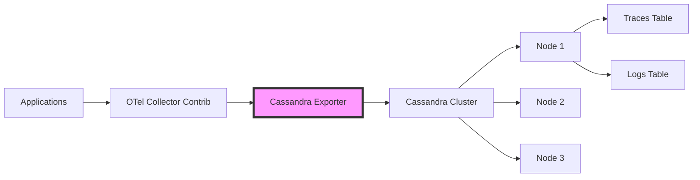

# How to Configure the Cassandra Exporter in the OpenTelemetry Collector

Author: [nawazdhandala](https://www.github.com/nawazdhandala)

Tags: OpenTelemetry, Collector, Exporter, Cassandra, Database, NoSQL, Time Series

Description: Learn how to configure the Cassandra exporter in the OpenTelemetry Collector to store telemetry data in Apache Cassandra for scalable, distributed long-term data retention.

The Cassandra exporter enables the OpenTelemetry Collector Contrib distribution to store traces and logs in Apache Cassandra, a highly scalable, distributed NoSQL database. This integration is useful for organizations that need to store telemetry data with high write throughput, built-in replication, and flexible data modeling capabilities.

## Understanding the Cassandra Exporter

Apache Cassandra is a distributed database designed for handling large amounts of data across many commodity servers with no single point of failure. Its masterless architecture and tunable consistency make it well-suited for workloads that require high write throughput and horizontal scalability.

The Cassandra exporter writes traces and logs to Cassandra tables using the CQL (Cassandra Query Language) protocol. The exporter is available in the OpenTelemetry Collector Contrib distribution and is currently alpha for traces and logs. It does not currently export metrics.


```mermaid
graph LR
    A[Applications] --> B[OTel Collector Contrib]
    B --> C[Cassandra Exporter]
    C --> D[Cassandra Cluster]
    D --> E[Node 1]
    D --> F[Node 2]
    D --> G[Node 3]
    E --> H[Traces Table]
    E --> I[Logs Table]
    style C fill:#f9f,stroke:#333,stroke-width:4px
```

## Why Use Cassandra for Telemetry Storage

Cassandra offers several advantages for telemetry data storage:

**High Write Throughput**: Cassandra excels at handling high volumes of write operations, making it suitable for ingesting telemetry data from many sources.

**Linear Scalability**: Add nodes to the cluster to increase storage capacity and throughput without downtime or complex reconfiguration.

**Fault Tolerance**: Data is automatically replicated across multiple nodes, ensuring availability even when nodes fail.

**Tunable Consistency**: Cassandra supports consistency levels per query to balance consistency, availability, and latency. The current OpenTelemetry Cassandra exporter uses QUORUM internally for its writes.

**Flexible Data Modeling**: Cassandra supports wide rows, collections, secondary indexes, and table layouts designed around query patterns. The OpenTelemetry Cassandra exporter creates its own trace and log tables.

**Automatic Data Expiration**: Cassandra table TTL settings can automatically expire old telemetry data without manual cleanup jobs.

## Basic Configuration

Here is a basic configuration for storing traces and logs in Cassandra:

```yaml
receivers:
  # Receive telemetry via OTLP
  otlp:
    protocols:
      grpc:
        endpoint: 0.0.0.0:4317
      http:
        endpoint: 0.0.0.0:4318

processors:
  # Batch telemetry for efficiency
  batch:
    timeout: 10s
    send_batch_size: 512

exporters:
  # Configure Cassandra exporter
  cassandra:
    # Cassandra server host or DSN
    dsn: 127.0.0.1
    # Cassandra native transport port
    port: 9042
    # Connection timeout
    timeout: 10s
    # Keyspace for telemetry data
    keyspace: otel
    # Tables created and used by the exporter
    trace_table: otel_spans
    logs_table: otel_logs

service:
  pipelines:
    traces:
      receivers: [otlp]
      processors: [batch]
      exporters: [cassandra]
    logs:
      receivers: [otlp]
      processors: [batch]
      exporters: [cassandra]
```

This configuration connects to a local Cassandra instance and writes trace data to the `otel_spans` table and log data to the `otel_logs` table in the `otel` keyspace. The exporter initialization includes schema creation statements, but production deployments should pre-create or verify the Cassandra schema before relying on it.

## Keyspace and Table Schema

The Cassandra exporter includes startup logic for creating the keyspace and tables. Configure the keyspace replication and table names in the exporter configuration:

```yaml
exporters:
  cassandra:
    dsn: 127.0.0.1
    port: 9042
    timeout: 10s
    keyspace: observability
    trace_table: otel_spans
    logs_table: otel_logs
    replication:
      class: SimpleStrategy
      replication_factor: 3
    compression:
      algorithm: LZ4Compressor
```

The exporter creates Cassandra objects equivalent to the following simplified layout:

```cql
CREATE KEYSPACE IF NOT EXISTS observability
WITH REPLICATION = {
  'class': 'SimpleStrategy',
  'replication_factor': 3
};

CREATE TYPE IF NOT EXISTS observability.Events (
  Timestamp Date,
  Name text,
  Attributes map<text, text>
);

CREATE TYPE IF NOT EXISTS observability.Links (
  TraceId text,
  SpanId text,
  TraceState text,
  Attributes map<text, text>
);

CREATE TABLE IF NOT EXISTS observability.otel_spans (
  TimeStamp DATE,
  TraceId text,
  SpanId text,
  ParentSpanId text,
  TraceState text,
  SpanName text,
  SpanKind text,
  ResourceAttributes map<text, text>,
  SpanAttributes map<text, text>,
  Duration int,
  StatusCode text,
  StatusMessage text,
  Events frozen<Events>,
  Links frozen<Links>,
  PRIMARY KEY (SpanId)
) WITH COMPRESSION = {'class': 'LZ4Compressor'};

CREATE TABLE IF NOT EXISTS observability.otel_logs (
  TimeStamp timestamp,
  TraceId text,
  SpanId text,
  TraceFlags int,
  SeverityText text,
  SeverityNumber int,
  Body text,
  ResourceAttributes map<text, text>,
  LogAttributes map<text, text>,
  PRIMARY KEY (SpanId, SeverityNumber)
) WITH COMPRESSION = {'class': 'LZ4Compressor'};
```

The current exporter schema is optimized around the tables it creates, not around arbitrary field mappings. If you need a different schema, use a custom exporter, a downstream processing job, or another storage backend that supports your query pattern directly.

## Multiple Tables Configuration

Configure separate Cassandra exporter instances when you need different table names or keyspaces for traces and logs:

```yaml
receivers:
  otlp:
    protocols:
      grpc:
        endpoint: 0.0.0.0:4317

processors:
  batch/traces:
    timeout: 10s
    send_batch_size: 512

  batch/logs:
    timeout: 10s
    send_batch_size: 512

exporters:
  # Traces to Cassandra
  cassandra/traces:
    dsn: cassandra-1.example.com
    port: 9042
    keyspace: observability
    trace_table: otel_spans
    logs_table: unused_logs
    timeout: 10s

  # Logs to Cassandra
  cassandra/logs:
    dsn: cassandra-1.example.com
    port: 9042
    keyspace: observability
    trace_table: unused_spans
    logs_table: otel_logs
    timeout: 10s

service:
  pipelines:
    traces:
      receivers: [otlp]
      processors: [batch/traces]
      exporters: [cassandra/traces]

    logs:
      receivers: [otlp]
      processors: [batch/logs]
      exporters: [cassandra/logs]
```

The Cassandra exporter does not support metrics or a custom field `mapping` block. Use another OpenTelemetry exporter for metrics, such as OTLP, Prometheus Remote Write, or a backend-specific metrics exporter.

## Secure Configuration with Authentication

For production deployments, configure Cassandra username and password authentication:

```yaml
receivers:
  otlp:
    protocols:
      grpc:
        endpoint: 0.0.0.0:4317

processors:
  batch:
    timeout: 10s

exporters:
  cassandra:
    dsn: cassandra-1.example.com
    port: 9042
    keyspace: observability
    trace_table: otel_spans
    logs_table: otel_logs

    # Username and password authentication
    auth:
      username: otel_collector
      password: ${env:CASSANDRA_PASSWORD}

    timeout: 10s

service:
  pipelines:
    traces:
      receivers: [otlp]
      processors: [batch]
      exporters: [cassandra]
    logs:
      receivers: [otlp]
      processors: [batch]
      exporters: [cassandra]
```

Store authentication credentials in environment variables rather than configuration files. The current Cassandra exporter configuration supports username/password authentication; it does not expose a TLS configuration block.

## Consistency Level Configuration

Cassandra consistency levels balance performance, durability, and availability:

**ONE**: Fastest writes, lowest durability. Use for high-volume, less critical data when your application controls the query consistency.

**QUORUM**: Majority of replicas must acknowledge. Good balance of performance and durability.

**LOCAL_QUORUM**: Majority of replicas in the local datacenter. Useful for multi-datacenter deployments.

**ALL**: All replicas must acknowledge. Highest durability, slowest writes.

The current OpenTelemetry Cassandra exporter does not expose a `consistency` configuration setting. Its implementation sets Cassandra write consistency to QUORUM.

## Time-to-Live Configuration

Configure TTL at the Cassandra table level when you need automatic expiration:

```cql
ALTER TABLE observability.otel_spans
WITH default_time_to_live = 604800;

ALTER TABLE observability.otel_logs
WITH default_time_to_live = 2592000;
```

TTL automatically deletes expired data without manual cleanup. Set appropriate TTL values based on your retention requirements and storage capacity. The Cassandra exporter does not support a `ttl` configuration block or a `cassandra.ttl` telemetry attribute.

## Prepared Statements and Batching

Use the Collector `batch` processor to group telemetry before the exporter sends it to Cassandra:

```yaml
receivers:
  otlp:
    protocols:
      grpc:
        endpoint: 0.0.0.0:4317

processors:
  # Batch aggressively for better throughput
  batch:
    timeout: 30s
    send_batch_size: 2048
    send_batch_max_size: 4096

exporters:
  cassandra:
    dsn: cassandra-1.example.com
    port: 9042
    keyspace: observability
    trace_table: otel_spans
    logs_table: otel_logs
    timeout: 10s

service:
  pipelines:
    traces:
      receivers: [otlp]
      processors: [batch]
      exporters: [cassandra]
    logs:
      receivers: [otlp]
      processors: [batch]
      exporters: [cassandra]
```

The Cassandra exporter does not expose exporter-specific prepared statement, connection pool, retry policy, or Cassandra batch settings. Keep batching in the Collector processor layer and tune Cassandra server capacity separately.

## Multi-Datacenter Configuration

For multi-datacenter deployments, create or alter the Cassandra keyspace with a replication strategy appropriate for your cluster before starting the Collector:

```cql
CREATE KEYSPACE IF NOT EXISTS observability
WITH REPLICATION = {
  'class': 'NetworkTopologyStrategy',
  'dc1': 3,
  'dc2': 3
};
```

Then point the exporter at that keyspace:

```yaml
exporters:
  cassandra:
    dsn: cassandra-dc1-1.example.com
    port: 9042
    keyspace: observability
    trace_table: otel_spans
    logs_table: otel_logs
    timeout: 10s
```

The exporter only exposes `class` and `replication_factor` fields for keyspace creation, which is enough for `SimpleStrategy` but not enough to express per-datacenter `NetworkTopologyStrategy` replication factors. It also does not expose a datacenter-aware load balancing policy, token-aware routing option, or LOCAL_QUORUM setting. For multi-datacenter production use, verify the keyspace strategy and the Cassandra driver behavior against your topology before relying on it for critical data.

## Data Compression

Enable Cassandra table compression by configuring the compression class:

```yaml
receivers:
  otlp:
    protocols:
      grpc:
        endpoint: 0.0.0.0:4317

processors:
  batch:
    timeout: 10s

exporters:
  cassandra:
    dsn: cassandra-1.example.com
    port: 9042
    keyspace: observability
    trace_table: otel_spans
    logs_table: otel_logs
    timeout: 10s

    # Cassandra table compression class
    compression:
      algorithm: LZ4Compressor

service:
  pipelines:
    traces:
      receivers: [otlp]
      processors: [batch]
      exporters: [cassandra]
    logs:
      receivers: [otlp]
      processors: [batch]
      exporters: [cassandra]
```

Compression reduces storage usage in Cassandra tables. Use Cassandra compression class names such as `LZ4Compressor` or `ZstdCompressor`; the exporter does not support a compression level setting.

## Token-Aware Routing

Token-aware routing is a Cassandra driver feature that can reduce latency by sending requests to nodes that own the relevant partition key. The current Cassandra exporter does not expose a token-aware routing configuration block.

Use Cassandra's normal cluster configuration and monitor coordinator behavior in production. If token-aware routing or datacenter-aware load balancing is a hard requirement, validate whether the current exporter and its Cassandra driver configuration meet your needs before adopting it.

## Query Example

Here is a Python example of querying telemetry data from the Cassandra tables created by the exporter:

```python
from cassandra.auth import PlainTextAuthProvider
from cassandra.cluster import Cluster

# Configure authentication
auth_provider = PlainTextAuthProvider(
    username="query_user",
    password="password",
)

# Connect to Cassandra
cluster = Cluster(
    contact_points=["cassandra-1.example.com", "cassandra-2.example.com"],
    port=9042,
    auth_provider=auth_provider,
)
session = cluster.connect("observability")

# Query a span by span ID. The generated trace table uses SpanId as its primary key.
span_id = "9f3c2a1b4d5e6f70"
query = """
    SELECT traceid, spanid, parentspanid, spanname, spankind, duration, statuscode
    FROM otel_spans
    WHERE spanid = ?
"""
prepared = session.prepare(query)
rows = session.execute(prepared, [span_id])

for row in rows:
    print(f"Span: {row.spanid}, Name: {row.spanname}, Duration: {row.duration}")

# Query logs associated with a span ID.
query = """
    SELECT timestamp, traceid, spanid, severitytext, body
    FROM otel_logs
    WHERE spanid = ?
"""
prepared = session.prepare(query)
rows = session.execute(prepared, [span_id])

for row in rows:
    print(f"[{row.severitytext}] {row.body}")

cluster.shutdown()
```

This example demonstrates querying traces and logs by span ID. Design additional queries to match Cassandra partition keys and clustering columns for optimal performance.

## Monitoring and Performance

Monitor the Cassandra exporter to ensure reliable data storage:

```yaml
receivers:
  otlp:
    protocols:
      grpc:
        endpoint: 0.0.0.0:4317

processors:
  batch:
    timeout: 10s

exporters:
  cassandra:
    dsn: cassandra-1.example.com
    port: 9042
    keyspace: observability
    trace_table: otel_spans
    logs_table: otel_logs
    timeout: 10s

service:
  pipelines:
    traces:
      receivers: [otlp]
      processors: [batch]
      exporters: [cassandra]
    logs:
      receivers: [otlp]
      processors: [batch]
      exporters: [cassandra]

  telemetry:
    logs:
      level: info
    metrics:
      level: detailed
```

Monitor these key areas:

- Exporter send counts and failures
- Collector process and pipeline latency
- Cassandra write throughput, compaction rates, disk usage, and read/write latencies
- Cassandra timeouts and unavailable exceptions

Also monitor Cassandra cluster metrics including write throughput, compaction rates, disk usage, and read/write latencies. For more information, see our guide on [monitoring the OpenTelemetry Collector](https://oneuptime.com/blog/post/2026-02-06-google-cloud-monitoring-receiver-opentelemetry-collector/view).

## Best Practices

Follow these best practices when using the Cassandra exporter:

**Use the Contrib Distribution**: The Cassandra exporter is part of the OpenTelemetry Collector Contrib distribution.

**Understand Signal Support**: The exporter supports traces and logs, not metrics.

**Use Appropriate Replication**: Configure Cassandra replication based on your deployment topology and durability requirements.

**Configure TTL in Cassandra**: Use Cassandra table TTL settings to manage retention and prevent unbounded growth.

**Enable Compression**: Reduce storage usage with Cassandra compression classes like `LZ4Compressor`.

**Batch in the Collector**: Use the Collector `batch` processor to reduce per-record overhead.

**Monitor Cluster Health**: Track Cassandra cluster metrics to identify performance issues and capacity constraints.

**Secure Connections**: Use Cassandra username/password authentication and store credentials in environment variables.

## Integration with Time-Series Data

Cassandra can store time-oriented telemetry data, but efficient time-series querying depends on table design. The current Cassandra exporter's generated trace and log tables are fixed, so evaluate whether that schema matches your query and retention needs before using it as a long-term telemetry store. For more information on time-series patterns, see our posts on [time-series data modeling](https://oneuptime.com/blog/post/2026-01-25-mongodb-data-modeling-relationships/view) and [long-term telemetry storage](https://oneuptime.com/blog/post/2026-02-06-monitor-predict-storage-capacity-opentelemetry-telemetry-volume/view).

## Conclusion

The Cassandra exporter enables distributed storage of OpenTelemetry traces and logs in Apache Cassandra. Cassandra's high write throughput, scalability, and fault tolerance can make it useful for observability data, but the current exporter is alpha and has a limited configuration surface.

Configure the exporter with the supported `dsn`, `port`, `timeout`, `keyspace`, `trace_table`, `logs_table`, `replication`, `compression`, and `auth` settings. Validate the generated schema, retention behavior, and operational characteristics against your production requirements before relying on it for long-term telemetry storage.
