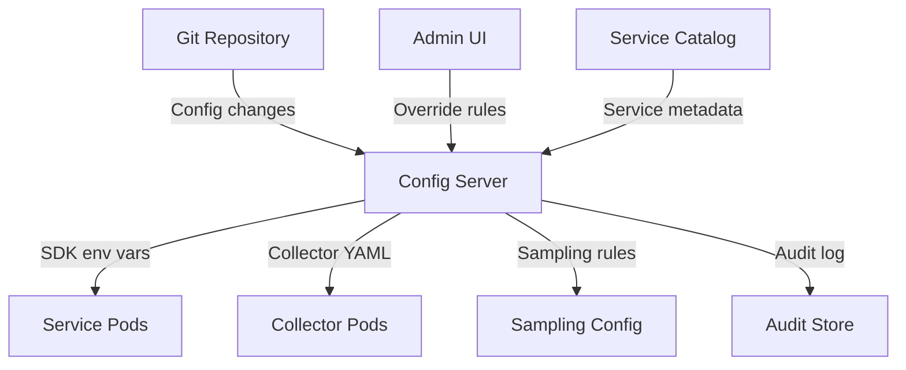

# How to Set Up a Centralized OpenTelemetry Configuration Management System

Author: [nawazdhandala](https://www.github.com/nawazdhandala)

Tags: OpenTelemetry, Configuration Management, Centralized, Platform Engineering, DevOps

Description: Learn how to build a centralized configuration management system for OpenTelemetry that ensures consistent settings across all services and environments.

---

As your OpenTelemetry deployment grows beyond a few services, configuration management becomes a real challenge. Each service needs SDK settings (exporter endpoint, sampling rate, resource attributes). Each collector needs pipeline configuration. Each environment (dev, staging, production) needs different values for the same settings. Without centralization, you end up with configuration scattered across Dockerfiles, Kubernetes manifests, CI/CD pipelines, and application code. A simple change like updating the collector endpoint requires touching dozens of places.

A centralized configuration management system provides a single source of truth for all OpenTelemetry settings. Services and collectors pull their configuration from this central system, and changes propagate automatically. This post covers how to design and implement such a system.

## Architecture

The centralized configuration system sits between your configuration source (Git repository) and your runtime environment (Kubernetes, VMs, serverless):



The config server knows about every service, its language, its team, and its environment. It generates the appropriate configuration for each context.

## Configuration Hierarchy

Design your configuration with a clear hierarchy. More specific settings override less specific ones:

```yaml
# config-hierarchy.yaml
# Configuration is resolved in order from least to most specific.
# Later entries override earlier ones.
levels:
  1_global:
    # Applies to all services in all environments
    OTEL_EXPORTER_OTLP_PROTOCOL: "http/protobuf"
    OTEL_TRACES_SAMPLER: "parentbased_traceidratio"
    OTEL_TRACES_SAMPLER_ARG: "0.1"

  2_environment:
    # Overrides per environment
    staging:
      OTEL_TRACES_SAMPLER_ARG: "1.0"
      OTEL_EXPORTER_OTLP_ENDPOINT: "http://otel-collector.staging:4318"
    production:
      OTEL_TRACES_SAMPLER_ARG: "0.1"
      OTEL_EXPORTER_OTLP_ENDPOINT: "http://otel-collector.production:4318"

  3_team:
    # Overrides per team
    payments:
      OTEL_TRACES_SAMPLER_ARG: "0.5"  # Higher sampling for critical team

  4_service:
    # Overrides per individual service
    payment-gateway:
      OTEL_TRACES_SAMPLER_ARG: "1.0"  # Full sampling for this specific service
```

## Implementation with Kubernetes ConfigMaps

The simplest approach uses a hierarchy of Kubernetes ConfigMaps:

```yaml
# Global configuration applied to all services
apiVersion: v1
kind: ConfigMap
metadata:
  name: otel-global-config
  namespace: default
data:
  OTEL_EXPORTER_OTLP_PROTOCOL: "http/protobuf"
  OTEL_TRACES_SAMPLER: "parentbased_traceidratio"
  OTEL_TRACES_SAMPLER_ARG: "0.1"
  OTEL_RESOURCE_ATTRIBUTES: "deployment.environment=production"
```

```yaml
# Team-level configuration for the payments team
apiVersion: v1
kind: ConfigMap
metadata:
  name: otel-team-payments
  namespace: default
data:
  OTEL_TRACES_SAMPLER_ARG: "0.5"
  OTEL_RESOURCE_ATTRIBUTES: "deployment.environment=production,service.team=payments"
```

Services reference both ConfigMaps, with the more specific one taking precedence:

```yaml
# Service deployment referencing both global and team ConfigMaps.
# Environment variables from the team ConfigMap override the global ones.
apiVersion: apps/v1
kind: Deployment
metadata:
  name: payment-service
spec:
  template:
    spec:
      containers:
        - name: payment-service
          image: mycompany/payment-service:latest
          envFrom:
            # Global config (lowest priority)
            - configMapRef:
                name: otel-global-config
            # Team config (overrides global)
            - configMapRef:
                name: otel-team-payments
          env:
            # Service-specific config (highest priority)
            - name: OTEL_SERVICE_NAME
              value: "payment-service"
            - name: OTEL_TRACES_SAMPLER_ARG
              value: "1.0"
```

## Dynamic Configuration with a Config Server

For more sophisticated needs, build a config server that generates configuration dynamically:

```python
# config_server.py
# HTTP server that generates OpenTelemetry configuration for each service.
# Services query this at startup to get their configuration.
from flask import Flask, request, jsonify
import yaml

app = Flask(__name__)

# Load the configuration hierarchy
with open("config-hierarchy.yaml") as f:
    hierarchy = yaml.safe_load(f)

def resolve_config(service_name, environment, team):
    """Resolve the configuration for a specific service by merging
    all levels of the hierarchy."""
    config = {}

    # Level 1: Global defaults
    config.update(hierarchy.get("1_global", {}))

    # Level 2: Environment overrides
    env_config = hierarchy.get("2_environment", {}).get(environment, {})
    config.update(env_config)

    # Level 3: Team overrides
    team_config = hierarchy.get("3_team", {}).get(team, {})
    config.update(team_config)

    # Level 4: Service overrides
    service_config = hierarchy.get("4_service", {}).get(service_name, {})
    config.update(service_config)

    # Always set the service name
    config["OTEL_SERVICE_NAME"] = service_name

    return config

@app.route("/config/<service_name>")
def get_config(service_name):
    """Return the resolved configuration for a service."""
    environment = request.args.get("env", "production")
    team = request.args.get("team", "default")

    config = resolve_config(service_name, environment, team)
    return jsonify(config)

# Example: GET /config/payment-service?env=production&team=payments
# Returns: {"OTEL_SERVICE_NAME": "payment-service", "OTEL_TRACES_SAMPLER_ARG": "1.0", ...}
```

Services query the config server at startup using an init container:

```yaml
# Init container that fetches OTel config from the config server
# and writes it as environment variables for the main container.
apiVersion: apps/v1
kind: Deployment
metadata:
  name: payment-service
spec:
  template:
    spec:
      initContainers:
        - name: otel-config-loader
          image: curlimages/curl:latest
          command:
            - sh
            - -c
            - |
              # Fetch configuration from the config server
              curl -s "http://otel-config-server.observability:8080/config/payment-service?env=production&team=payments" \
                | jq -r 'to_entries[] | "\(.key)=\(.value)"' \
                > /shared/otel.env
          volumeMounts:
            - name: otel-env
              mountPath: /shared

      containers:
        - name: payment-service
          image: mycompany/payment-service:latest
          # Source the environment variables from the config file
          command: ["sh", "-c", "set -a && source /shared/otel.env && set +a && exec java -jar app.jar"]
          volumeMounts:
            - name: otel-env
              mountPath: /shared

      volumes:
        - name: otel-env
          emptyDir: {}
```

## Collector Configuration Management

The same centralized approach works for collector configurations. Instead of maintaining separate ConfigMaps for each collector instance, generate them from a template:

```python
# collector_config_generator.py
# Generates collector configurations from a template and service catalog.
import yaml

def generate_collector_config(services, environment):
    """Generate a collector configuration that handles all registered services."""

    # Build filter processors for each team
    processors = {
        "memory_limiter": {
            "check_interval": "1s",
            "limit_mib": 2048,
        },
        "batch": {
            "timeout": "5s",
            "send_batch_size": 1024,
        },
    }

    # Add team-specific processors
    teams = set(s["team"] for s in services)
    for team in teams:
        team_services = [s for s in services if s["team"] == team]
        processors[f"filter/{team}"] = {
            "traces": {
                "span": [
                    f'attributes["service.team"] != "{team}"'
                ]
            }
        }

    config = {
        "receivers": {
            "otlp": {
                "protocols": {
                    "grpc": {"endpoint": "0.0.0.0:4317"},
                    "http": {"endpoint": "0.0.0.0:4318"},
                }
            }
        },
        "processors": processors,
        "exporters": {
            "otlphttp": {
                "endpoint": get_backend_endpoint(environment),
            }
        },
        "service": {
            "pipelines": {
                "traces": {
                    "receivers": ["otlp"],
                    "processors": ["memory_limiter", "batch"],
                    "exporters": ["otlphttp"],
                }
            }
        },
    }

    return yaml.dump(config)
```

## Audit Trail

Every configuration change should be logged for compliance and debugging:

```python
# Every configuration resolution is logged with full context.
# This creates an audit trail of what config each service received.
import logging
import json
from datetime import datetime

audit_logger = logging.getLogger("otel-config-audit")

def log_config_resolution(service_name, environment, team, resolved_config):
    """Log a configuration resolution event for audit purposes."""
    audit_logger.info(json.dumps({
        "timestamp": datetime.utcnow().isoformat(),
        "event": "config_resolved",
        "service": service_name,
        "environment": environment,
        "team": team,
        "config": resolved_config,
        "config_hash": hashlib.sha256(
            json.dumps(resolved_config, sort_keys=True).encode()
        ).hexdigest(),
    }))
```

## Change Propagation

When a configuration changes, services need to pick up the new values. There are two approaches:

**Restart-based propagation:** Update the ConfigMap and trigger a rolling restart. This is the simplest approach and works well for infrequent changes:

```bash
# Update the ConfigMap and restart affected pods
kubectl apply -f otel-global-config.yaml
kubectl rollout restart deployment -l otel-config=global
```

**Live reload for collectors:** The OpenTelemetry Collector supports configuration reload through a file watcher. Mount the config as a volume and the collector picks up changes automatically:

```yaml
# Collector deployment with config file watching enabled
containers:
  - name: collector
    image: otel/opentelemetry-collector-contrib:0.96.0
    # The --config flag with a file path enables automatic reload
    args: ["--config=/etc/otel/config.yaml"]
    volumeMounts:
      - name: config
        mountPath: /etc/otel
```

## Conclusion

A centralized configuration management system for OpenTelemetry eliminates the scattered, inconsistent configuration that plagues large deployments. By defining a clear hierarchy (global, environment, team, service), building a config server or using layered ConfigMaps, and maintaining an audit trail, you get predictable and manageable OpenTelemetry configuration across all your services. Changes propagate from a single source of truth, and every service gets the right settings for its context.
