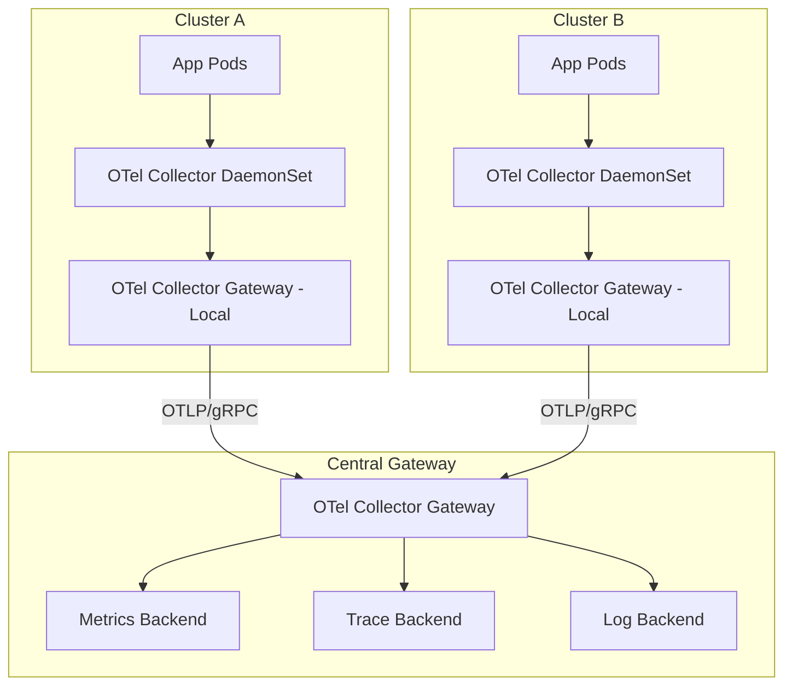

# How to Build a Centralized Telemetry Gateway for Multi-Cluster Platform Environments

Author: [nawazdhandala](https://www.github.com/nawazdhandala)

Tags: OpenTelemetry, Platform Engineering, Multi-Cluster, Telemetry Gateway

Description: Build a centralized OpenTelemetry Collector gateway that aggregates telemetry from multiple Kubernetes clusters into a unified observability pipeline.

Running multiple Kubernetes clusters is common - separate clusters for staging, production, different regions, or different business units. The problem is that each cluster generates its own telemetry, and without a centralized gateway, you end up with fragmented observability data spread across backends.

A telemetry gateway is a centralized OpenTelemetry Collector deployment that receives data from per-cluster collectors and routes it to your backends. It gives you a single point for applying cross-cluster policies like sampling, enrichment, and access control.

## Architecture Overview

The architecture follows a two-tier model: local collectors in each cluster forward to a central gateway.



Each cluster has a local gateway that handles buffering and initial processing. The central gateway handles cross-cluster concerns like unified sampling decisions and routing.

## Per-Cluster Collector Configuration

Each cluster runs a DaemonSet collector that forwards to a local gateway. The local gateway adds cluster identity metadata before forwarding upstream.

This is the local gateway config that enriches telemetry with cluster metadata:

```yaml
# cluster-gateway-config.yaml - Deployed in each Kubernetes cluster
receivers:
  otlp:
    protocols:
      grpc:
        endpoint: 0.0.0.0:4317
      http:
        endpoint: 0.0.0.0:4318

processors:
  # Tag every signal with the cluster it came from
  resource:
    attributes:
      - key: k8s.cluster.name
        value: "us-east-prod-01"  # Change per cluster
        action: upsert
      - key: deployment.environment
        value: "production"
        action: upsert

  # Buffer data to handle network blips to the central gateway
  batch:
    timeout: 5s
    send_batch_size: 512
    send_batch_max_size: 1024

exporters:
  # Forward everything to the central gateway
  otlp/central:
    endpoint: "telemetry-gateway.central.svc.cluster.local:4317"
    tls:
      insecure: false
      ca_file: /etc/tls/ca.crt
    retry_on_failure:
      enabled: true
      initial_interval: 5s
      max_interval: 30s
    sending_queue:
      enabled: true
      num_consumers: 10
      queue_size: 5000

service:
  pipelines:
    traces:
      receivers: [otlp]
      processors: [resource, batch]
      exporters: [otlp/central]
    metrics:
      receivers: [otlp]
      processors: [resource, batch]
      exporters: [otlp/central]
    logs:
      receivers: [otlp]
      processors: [resource, batch]
      exporters: [otlp/central]
```

## Central Gateway Configuration

The central gateway receives from all clusters and applies unified processing before routing to backends.

This config implements the central gateway with signal-type routing and cross-cluster processing:

```yaml
# central-gateway-config.yaml - Single centralized deployment
receivers:
  otlp:
    protocols:
      grpc:
        endpoint: 0.0.0.0:4317

processors:
  # Tail-based sampling across all clusters
  # This ensures consistent sampling for traces that span clusters
  tail_sampling:
    decision_wait: 10s
    policies:
      - name: error-traces
        type: status_code
        status_code:
          status_codes: [ERROR]
      - name: slow-traces
        type: latency
        latency:
          threshold_ms: 2000
      - name: baseline-sampling
        type: probabilistic
        probabilistic:
          sampling_percentage: 10

  # Normalize metric names across clusters that might use
  # slightly different naming conventions
  transform/metrics:
    metric_statements:
      - context: metric
        statements:
          - set(description, "") where description == "UNSET"

  batch:
    timeout: 10s
    send_batch_size: 1024

exporters:
  otlphttp/traces:
    endpoint: https://traces-backend.internal:4318
  otlphttp/metrics:
    endpoint: https://metrics-backend.internal:4318
  otlphttp/logs:
    endpoint: https://logs-backend.internal:4318

service:
  pipelines:
    traces:
      receivers: [otlp]
      processors: [tail_sampling, batch]
      exporters: [otlphttp/traces]
    metrics:
      receivers: [otlp]
      processors: [transform/metrics, batch]
      exporters: [otlphttp/metrics]
    logs:
      receivers: [otlp]
      processors: [batch]
      exporters: [otlphttp/logs]
```

## Deploying the Central Gateway on Kubernetes

The gateway needs to be highly available since all clusters depend on it. Deploy it as a Kubernetes Deployment with multiple replicas behind a load balancer.

This Kubernetes manifest deploys the central gateway with high availability:

```yaml
# central-gateway-deployment.yaml
apiVersion: apps/v1
kind: Deployment
metadata:
  name: otel-central-gateway
  namespace: observability
spec:
  replicas: 3
  selector:
    matchLabels:
      app: otel-central-gateway
  template:
    metadata:
      labels:
        app: otel-central-gateway
    spec:
      affinity:
        # Spread replicas across availability zones
        podAntiAffinity:
          requiredDuringSchedulingIgnoredDuringExecution:
            - labelSelector:
                matchLabels:
                  app: otel-central-gateway
              topologyKey: topology.kubernetes.io/zone
      containers:
        - name: otel-collector
          image: otel/opentelemetry-collector-contrib:0.96.0
          args: ["--config=/etc/otel/config.yaml"]
          ports:
            - containerPort: 4317
              name: otlp-grpc
          resources:
            requests:
              cpu: "2"
              memory: 4Gi
            limits:
              cpu: "4"
              memory: 8Gi
          volumeMounts:
            - name: config
              mountPath: /etc/otel
      volumes:
        - name: config
          configMap:
            name: otel-central-gateway-config
---
apiVersion: v1
kind: Service
metadata:
  name: telemetry-gateway
  namespace: observability
spec:
  type: LoadBalancer
  ports:
    - port: 4317
      targetPort: otlp-grpc
      protocol: TCP
  selector:
    app: otel-central-gateway
```

## Handling Backpressure

When the central gateway gets overwhelmed, you need backpressure to propagate gracefully back to the cluster-level collectors rather than dropping data silently.

The sending queue and retry configuration in the per-cluster exporters handle transient issues. For sustained overload, the central gateway should use the `memory_limiter` processor:

```yaml
# Add to the central gateway processors
processors:
  memory_limiter:
    check_interval: 1s
    limit_mib: 6144        # Hard limit at 6 GB
    spike_limit_mib: 1024  # Allow 1 GB spike above soft limit
```

Place `memory_limiter` first in every pipeline so it can reject data before it gets processed further. The per-cluster collectors will retry automatically thanks to their retry configuration.

## Operational Considerations

**Authentication between clusters.** Use mTLS for the gRPC connections between cluster gateways and the central gateway. Each cluster gets its own client certificate, which also lets you identify which cluster sent which data at the network level.

**Monitor the gateway itself.** The OpenTelemetry Collector exposes Prometheus metrics at `/metrics` on port 8888 by default. Track `otelcol_exporter_queue_size`, `otelcol_receiver_refused_spans`, and `otelcol_processor_dropped_spans` to catch problems early.

**Plan for failure.** If the central gateway goes down, per-cluster gateways will queue data up to their configured limits. Size those queues based on your expected downtime tolerance. For a 5-minute outage window, calculate your throughput and set `queue_size` accordingly.

A centralized telemetry gateway is essential infrastructure for any multi-cluster platform. It turns fragmented cluster-level observability into a unified view of your entire platform.
