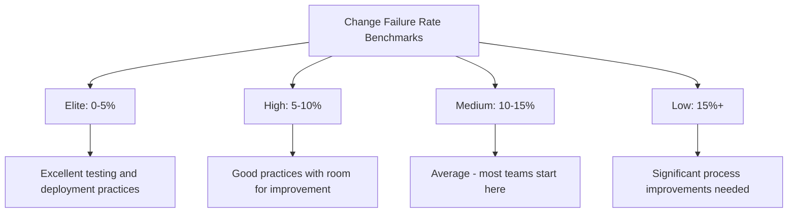

# How to Implement Change Failure Rate Tracking with OpenTelemetry and DORA Metrics

Author: [nawazdhandala](https://www.github.com/nawazdhandala)

Tags: OpenTelemetry, DORA Metrics, Change Failure Rate, DevOps

Description: Build automated Change Failure Rate measurement using OpenTelemetry to track one of the four key DORA metrics for engineering performance.

Change Failure Rate (CFR) is one of the four DORA metrics that measure software delivery performance. It answers a specific question: what percentage of deployments result in a degraded service that requires remediation? Tracking this metric manually through spreadsheets or ticket labels is unreliable. OpenTelemetry provides the instrumentation to capture both sides of the equation - deployments and their outcomes - automatically and accurately.

## What Counts as a "Failed Change"

Before measuring CFR, your team needs a clear definition. The DORA research defines a failed change as one that results in degraded service requiring remediation (hotfix, rollback, patch, or workaround). In OpenTelemetry terms, a change is "failed" if any of these conditions occur within a defined window after deployment:

- Error rate increases by more than a threshold (e.g., 2x baseline)
- A rollback is triggered
- Latency p99 degrades by more than a defined percentage
- An incident is opened and linked to the deployment

## Recording Deployment Events

Every deployment must be recorded as a structured event in your telemetry pipeline. This is the numerator denominator source for CFR.

```python
# Record every deployment with outcome tracking
from opentelemetry import metrics
from datetime import datetime

meter = metrics.get_meter("dora.metrics")

# Counter for total deployments
deployments_total = meter.create_counter(
    "dora.deployments.total",
    description="Total number of deployments",
    unit="1"
)

# Counter for failed deployments
deployments_failed = meter.create_counter(
    "dora.deployments.failed",
    description="Deployments that resulted in degraded service",
    unit="1"
)

class DeploymentRecorder:
    def __init__(self):
        self.pending_deployments = {}

    def record_deployment(self, deploy_id, service, version, environment):
        """Called when a deployment completes."""
        deployments_total.add(1, attributes={
            "service.name": service,
            "deployment.environment": environment,
            "deployment.version": version,
        })

        # Track this deployment for outcome evaluation
        self.pending_deployments[deploy_id] = {
            "service": service,
            "version": version,
            "environment": environment,
            "deployed_at": datetime.utcnow(),
            "outcome": "pending"
        }

    def mark_failed(self, deploy_id, failure_reason):
        """Called when a deployment is determined to have failed."""
        deploy = self.pending_deployments.get(deploy_id)
        if deploy and deploy["outcome"] == "pending":
            deploy["outcome"] = "failed"
            deploy["failure_reason"] = failure_reason

            deployments_failed.add(1, attributes={
                "service.name": deploy["service"],
                "deployment.environment": deploy["environment"],
                "failure.reason": failure_reason,
            })

    def mark_successful(self, deploy_id):
        """Called when a deployment passes the evaluation window without issues."""
        deploy = self.pending_deployments.get(deploy_id)
        if deploy and deploy["outcome"] == "pending":
            deploy["outcome"] = "successful"
```

## Automated Failure Detection

The core challenge is automatically determining whether a deployment failed. This evaluator watches OpenTelemetry metrics after each deployment and classifies the outcome.

```python
# Automated deployment outcome evaluator
import requests
from datetime import timedelta

class DeploymentEvaluator:
    # How long to monitor after a deployment before declaring success
    EVALUATION_WINDOW = timedelta(minutes=30)

    # Thresholds for declaring failure
    ERROR_RATE_MULTIPLIER = 2.0    # 2x increase in error rate
    LATENCY_P99_MULTIPLIER = 1.5   # 50% increase in p99 latency

    def evaluate(self, deployment, prometheus_url):
        """
        Compare post-deploy metrics against pre-deploy baseline.
        Returns 'failed' or 'successful'.
        """
        service = deployment["service"]
        deploy_time = deployment["deployed_at"]

        # Define time windows
        pre_start = deploy_time - timedelta(hours=1)
        pre_end = deploy_time
        post_start = deploy_time
        post_end = deploy_time + self.EVALUATION_WINDOW

        # Check error rate change
        pre_error_rate = self._query_error_rate(
            prometheus_url, service, pre_start, pre_end
        )
        post_error_rate = self._query_error_rate(
            prometheus_url, service, post_start, post_end
        )

        if pre_error_rate > 0 and post_error_rate / pre_error_rate > self.ERROR_RATE_MULTIPLIER:
            return "failed", "error_rate_increase"

        # Check latency degradation
        pre_latency = self._query_p99_latency(
            prometheus_url, service, pre_start, pre_end
        )
        post_latency = self._query_p99_latency(
            prometheus_url, service, post_start, post_end
        )

        if pre_latency > 0 and post_latency / pre_latency > self.LATENCY_P99_MULTIPLIER:
            return "failed", "latency_degradation"

        # Check if a rollback occurred
        if self._rollback_detected(service, post_start, post_end):
            return "failed", "rollback"

        return "successful", None

    def _query_error_rate(self, prometheus_url, service, start, end):
        query = (
            f'sum(rate(http_server_request_count_total'
            f'{{service_name="{service}",status_code=~"5.."}}[5m]))'
            f' / sum(rate(http_server_request_count_total'
            f'{{service_name="{service}"}}[5m]))'
        )
        # Execute against Prometheus and return average over window
        return self._avg_over_range(prometheus_url, query, start, end)
```

## Collector Configuration

Route deployment and application metrics through the same pipeline so they share consistent timestamps and resource attributes.

```yaml
# otel-collector-dora.yaml
receivers:
  otlp:
    protocols:
      grpc:
        endpoint: 0.0.0.0:4317

processors:
  # Enrich all telemetry with DORA tracking context
  resource:
    attributes:
      - key: dora.tracking
        value: "enabled"
        action: upsert

  batch:
    send_batch_size: 512
    timeout: 5s

exporters:
  otlp/metrics:
    endpoint: "prometheus-remote-write:4317"
  otlp/dora-evaluator:
    endpoint: "dora-evaluator-service:4317"

service:
  pipelines:
    metrics:
      receivers: [otlp]
      processors: [resource, batch]
      exporters: [otlp/metrics, otlp/dora-evaluator]
```

## Computing and Visualizing CFR

With deployment and failure data flowing through OpenTelemetry, compute the Change Failure Rate with a simple query.

```promql
# Change Failure Rate over the last 30 days
sum(increase(dora_deployments_failed_total[30d]))
/
sum(increase(dora_deployments_total[30d]))

# CFR by service - identify which services are most risky
sum by (service_name) (increase(dora_deployments_failed_total[30d]))
/
sum by (service_name) (increase(dora_deployments_total[30d]))

# CFR trend - weekly rolling window
sum(increase(dora_deployments_failed_total[7d]))
/
sum(increase(dora_deployments_total[7d]))
```

## DORA Performance Benchmarks

The DORA research classifies teams into four performance tiers based on their CFR:



## Breaking Down CFR for Actionable Insights

The top-level CFR number is useful for benchmarking, but it does not tell you what to fix. Break it down by failure reason to identify where investments will have the most impact.

```promql
# Failure breakdown by reason
sum by (failure_reason) (increase(dora_deployments_failed_total[30d]))
```

Common patterns you will discover:

- If most failures are "error_rate_increase", invest in better integration testing and canary deployments.
- If most failures are "rollback", your deployment pipeline may lack adequate pre-deploy validation.
- If most failures are "latency_degradation", focus on performance testing in CI.

The goal is not to reach zero CFR. Some failure rate is expected in any organization that deploys frequently. The goal is to understand your current rate, track it over time, and systematically reduce it through targeted improvements. OpenTelemetry provides the automated, reliable measurement that makes this possible.
