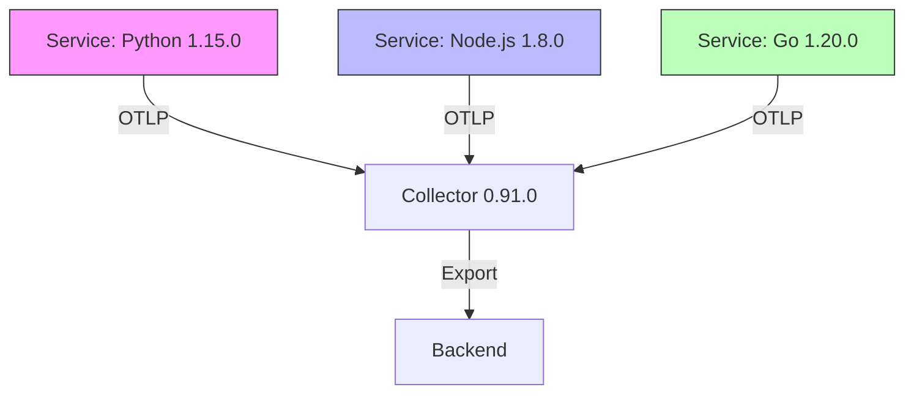

# How to Choose the Right OpenTelemetry SDK Version for Your Project

Author: [nawazdhandala](https://www.github.com/nawazdhandala)

Tags: OpenTelemetry, SDK, Versioning, Dependencies, Compatibility

Description: A practical guide to selecting the correct OpenTelemetry SDK version for your project based on language runtime, stability requirements, and compatibility needs.

Picking the right OpenTelemetry SDK version can make the difference between smooth sailing and debugging nightmares. After working with OpenTelemetry across multiple projects, I've learned that version selection requires more thought than just grabbing the latest release.

## Understanding OpenTelemetry Versioning

OpenTelemetry follows semantic versioning (semver), but with a twist. The project maintains separate versioning for its specification, API, and SDK implementations across different languages. A Python SDK at version 1.15.0 isn't equivalent to a Java SDK at 1.15.0 in terms of features or stability.

Each language implementation progresses at its own pace. The Go SDK might have experimental support for a feature that's already stable in JavaScript, or vice versa. This independence allows each language community to optimize for their ecosystem without blocking others.

The version number format follows MAJOR.MINOR.PATCH:

- MAJOR: Breaking changes to the API
- MINOR: New features, backward compatible
- PATCH: Bug fixes, backward compatible

Since OpenTelemetry reached 1.0, the API has maintained backward compatibility. However, SDK implementations can introduce breaking changes in their own versioning.

## Evaluating Your Project Requirements

Before choosing a version, map out what you actually need. Are you building a new microservice that needs traces, metrics, and logs? Or adding instrumentation to a legacy monolith where stability is paramount?

Production systems demand stable, well-tested versions. Early-stage projects or internal tools can tolerate experimental features. The key is being honest about where your project sits on this spectrum.

Consider your runtime environment. If you're running Node.js 14, you can't use an SDK that requires Node.js 18 features. Similarly, Java 8 applications can't leverage SDK versions that target Java 11+.

Dependency conflicts matter more than most developers realize. Your application probably already includes observability libraries, logging frameworks, or HTTP clients. The OpenTelemetry SDK version you choose must coexist with these dependencies without version clashes.

## Checking Language-Specific Compatibility

Each OpenTelemetry language implementation publishes compatibility matrices. These documents are goldmines for version selection.

For Java, check the supported Java versions, application servers, and frameworks. A project using Spring Boot 2.x needs a different SDK version than one on Spring Boot 3.x.

Python developers must consider both CPython version support and async framework compatibility. If you're using FastAPI or Starlette, verify that the SDK version supports ASGI instrumentation properly.

Node.js moves fast. An SDK version from six months ago might not support the latest Node.js LTS release. Conversely, newer SDK versions might drop support for older Node.js versions your infrastructure still runs.

Here's how to check compatibility for different languages:

```bash
# For Python, check the setup.py or pyproject.toml
# Clone the repo and check the version you're considering
git clone https://github.com/open-telemetry/opentelemetry-python.git
cd opentelemetry-python
git checkout v1.15.0
cat setup.py | grep python_requires
```

```bash
# For Node.js, check package.json engines field
git clone https://github.com/open-telemetry/opentelemetry-js.git
cd opentelemetry-js
git checkout v1.8.0
cat package.json | grep -A 2 engines
```

```bash
# For Java, check the README or pom.xml
git clone https://github.com/open-telemetry/opentelemetry-java.git
cd opentelemetry-java
git checkout v1.24.0
grep -r "java.version" pom.xml
```

## Matching SDK Version to Specification Version

The OpenTelemetry specification evolves independently from SDK implementations. Each SDK version implements specific specification versions for traces, metrics, and logs.

Check the SDK release notes to see which specification versions are supported. An SDK might fully implement the trace specification v1.10 while only partially supporting the metrics specification v1.8.

This matters when you're using multiple SDKs in a polyglot architecture. If your Go services use an SDK supporting specification v1.12 and your Python services use one supporting v1.10, you need to ensure the data formats remain compatible through your collection pipeline.

The OpenTelemetry Collector version also plays a role. Newer SDK versions might emit data formats that older Collector versions can't process correctly. Always verify that your Collector version supports the data formats from your chosen SDK versions.

## Evaluating Instrumentation Library Compatibility

Instrumentation libraries (for frameworks like Express, Django, or Spring) have their own version requirements. These libraries depend on specific SDK versions and won't work outside their supported range.

A common mistake is updating the core SDK without checking instrumentation library compatibility. You might upgrade to SDK v1.20 only to find that your Flask instrumentation library still requires v1.15.

Here's a practical approach:

```python
# Bad: Installing latest SDK and older instrumentation
pip install opentelemetry-api==1.20.0
pip install opentelemetry-instrumentation-flask==0.35b0

# This might cause runtime errors or missing telemetry
```

```python
# Good: Check compatibility first
# Look at the instrumentation library's requirements
pip show opentelemetry-instrumentation-flask | grep Requires
# Then install compatible versions together
pip install opentelemetry-api==1.15.0 \
  opentelemetry-sdk==1.15.0 \
  opentelemetry-instrumentation-flask==0.36b0
```

For JavaScript:

```javascript
// Check peer dependencies in package.json
// The instrumentation library specifies compatible SDK versions
{
  "peerDependencies": {
    "@opentelemetry/api": "^1.0.0",
    "@opentelemetry/core": "^1.8.0"
  }
}
```

## Balancing Stability and Features

Every SDK release includes a mix of stable features, beta functionality, and experimental additions. Understanding these stability levels helps you decide which version fits your risk tolerance.

Stable features have undergone thorough testing and won't change without a major version bump. These are safe for production. Beta features are functionally complete but might see API changes based on feedback. Experimental features can change or disappear entirely.

If you need a specific feature that's only in beta, you have two choices: wait for stability or accept the risk of future changes. For production systems, I recommend waiting unless the feature solves a critical problem.

Security updates complicate this balance. A newer version might patch a vulnerability but also introduce beta features you didn't want. Review the changelog carefully to understand what changed beyond the security fix.

## Testing Across SDK Versions

Before committing to an SDK version, test it against your actual workload. Synthetic tests don't catch all issues.

Set up a staging environment that mirrors production. Deploy your application with the candidate SDK version and run realistic traffic through it. Monitor for:

- Memory usage changes
- CPU overhead from instrumentation
- Missing or incorrect telemetry data
- Dependency conflicts at runtime
- Framework compatibility issues

```yaml
# Example Docker Compose setup for testing
version: '3.8'
services:
  app-sdk-v1-15:
    build:
      context: .
      dockerfile: Dockerfile
      args:
        OTEL_SDK_VERSION: 1.15.0
    environment:
      - OTEL_EXPORTER_OTLP_ENDPOINT=http://collector:4318

  app-sdk-v1-20:
    build:
      context: .
      dockerfile: Dockerfile
      args:
        OTEL_SDK_VERSION: 1.20.0
    environment:
      - OTEL_EXPORTER_OTLP_ENDPOINT=http://collector:4318

  collector:
    image: otel/opentelemetry-collector:0.91.0
    volumes:
      - ./collector-config.yaml:/etc/otel/config.yaml
```

Load test both versions and compare the results. Sometimes a newer version introduces performance regressions that only appear under load.

## Managing Version Updates

Staying on a single version forever isn't viable. Security patches and bug fixes require updates. Establish a strategy for version management from the start.

Pin exact versions in your dependency files. Never use "latest" or loose version ranges for OpenTelemetry packages. This prevents surprise updates during builds.

```json
// package.json - Good practice
{
  "dependencies": {
    "@opentelemetry/sdk-node": "0.45.0",
    "@opentelemetry/auto-instrumentations-node": "0.39.0"
  }
}
```

```json
// package.json - Bad practice
{
  "dependencies": {
    "@opentelemetry/sdk-node": "^0.45.0",
    "@opentelemetry/auto-instrumentations-node": "latest"
  }
}
```

Schedule regular reviews of OpenTelemetry releases. Check the changelog quarterly to see if updates are necessary. Not every release requires action, but you should make an informed decision.

When you do update, change one major component at a time. Don't simultaneously update the SDK, instrumentation libraries, and Collector. Update the SDK first, verify everything works, then move to instrumentation libraries, then the Collector.

## Handling Multi-Language Environments

Polyglot architectures add complexity. Each language's SDK versions independently, but they must produce compatible telemetry.

Create a compatibility matrix for your organization. Document which SDK versions are approved for each language and verify they work together through your collection pipeline.



The OTLP protocol provides the common ground. As long as each SDK version supports the same OTLP version, they can coexist. However, verify this explicitly rather than assuming compatibility.

## Making the Final Decision

With all factors considered, choose the version that best matches your needs. For most production systems, prefer stable releases that are at least one minor version behind the bleeding edge. This gives time for community feedback to surface any issues.

For new projects, use the latest stable release unless you have specific reasons not to. You'll benefit from bug fixes and performance improvements without taking on unnecessary risk.

Document your decision and reasoning. When someone asks why you're using v1.15 instead of v1.20, having a written explanation saves time and prevents second-guessing.

The right SDK version isn't always the newest one. It's the version that matches your project's maturity, stability requirements, and technical constraints. Take time to evaluate these factors thoroughly, and your instrumentation will be far more reliable.