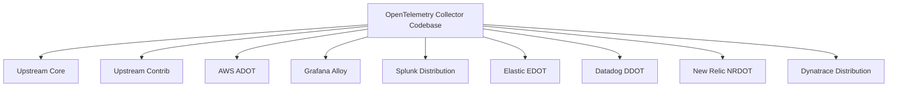
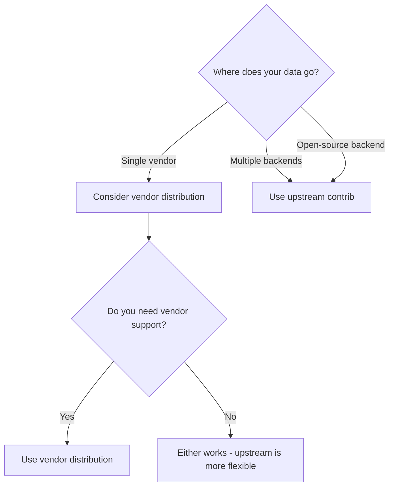
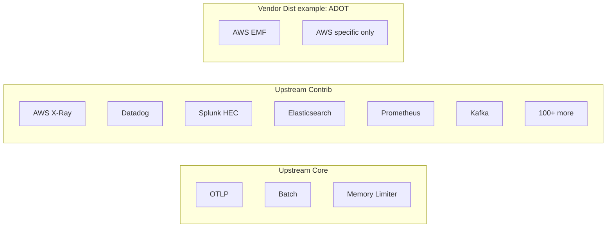
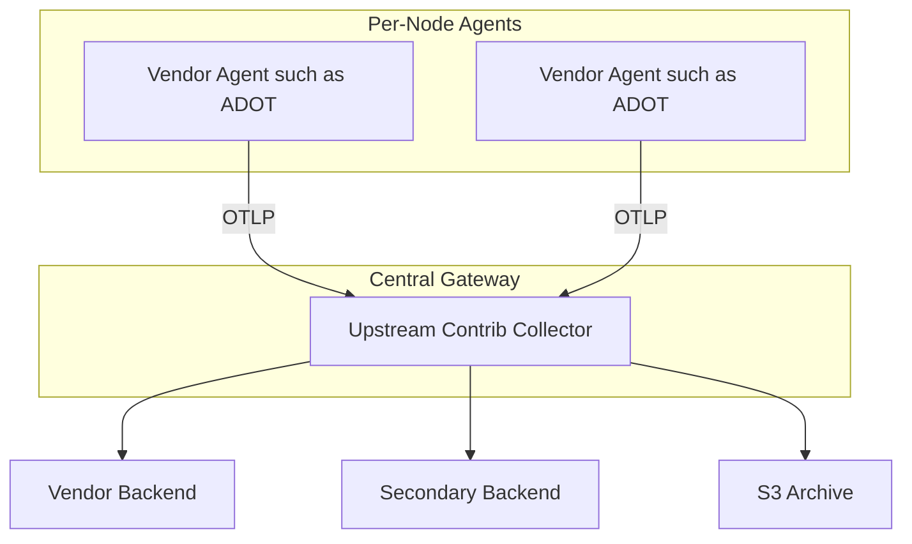

# How to Choose Between Upstream and Vendor OpenTelemetry Collector Distributions

Author: [nawazdhandala](https://www.github.com/nawazdhandala)

Tags: OpenTelemetry, Observability, Monitoring, Architecture, DevOps, Collector

Description: A practical decision guide for choosing between the upstream OpenTelemetry Collector and vendor-specific distributions like ADOT, Splunk, Elastic, Datadog, New Relic, and Dynatrace.

---

The OpenTelemetry Collector is the backbone of most OTel deployments. It receives, processes, and exports telemetry data. But when you go to deploy one, you are faced with a choice: do you use the upstream community collector, or do you pick a vendor distribution from AWS, Grafana, Splunk, Elastic, Datadog, New Relic, or Dynatrace?

Each vendor distribution is built from the same OTel Collector codebase. They add vendor-specific components, defaults, and testing. Some add entirely new features. This guide helps you make the right call for your situation.

## The Landscape

Here is how the options break down:



**Upstream Core** has a minimal set of components: OTLP receiver/exporter, basic processors, and a few extensions. It is small and fast but limited.

**Upstream Contrib** includes hundreds of community-contributed components. Most vendor-specific exporters live here. It is the Swiss army knife option.

**Vendor distributions** pick components from core and contrib, add their own, and ship a tested package with defaults optimized for their platform.

## Decision Framework

Here are the key factors to consider:

### 1. Where is your data going?

If you are sending data to a single vendor platform, their distribution usually gives you the smoothest experience. Pre-configured endpoints, optimized batching settings, and tested pipelines save you from reading docs and tweaking configs.

If you are sending to multiple backends or to an open-source backend, the upstream contrib collector is the safer bet.



### 2. Do you need vendor support?

This is often the deciding factor in enterprise environments. If your organization requires a support contract for every piece of infrastructure, the vendor distribution is your only real option. Community support through GitHub issues and Slack is good, but it is not the same as an SLA-backed support plan.

| Distribution | Support Option |
|-------------|---------------|
| Upstream | Community (GitHub, Slack) |
| AWS ADOT | AWS Premium Support |
| Grafana Alloy | Grafana Cloud support |
| Splunk | Splunk support plan |
| Elastic EDOT | Elastic subscription |
| Datadog DDOT | Datadog support |
| New Relic NRDOT | New Relic support |
| Dynatrace | Dynatrace support |

### 3. What components do you need?

This is where the rubber meets the road. Look at what receivers, processors, and exporters your pipeline needs.

**Upstream core** includes:
- OTLP receiver and exporter
- Batch, memory limiter, and attribute processors
- Logging and debug exporters

**Upstream contrib** adds hundreds more, including most vendor exporters.

**Vendor distributions** include a subset. Some exporters are only in certain distributions.

Here is a comparison of what each distribution includes:



### 4. How important is the latest features?

Upstream releases happen monthly. Vendor distributions often lag by weeks or months because they need to test and validate each release against their platform.

If you need a component that just landed in upstream, the vendor distribution might not have it yet.

| Distribution | Typical lag behind upstream |
|-------------|---------------------------|
| Upstream | N/A (source of truth) |
| AWS ADOT | 1-3 months |
| Grafana Alloy | Separate release cycle |
| Splunk | 1-2 months |
| Elastic EDOT | 1-2 months |
| Datadog DDOT | 1-2 months |
| New Relic NRDOT | 1-2 months |
| Dynatrace | 1-2 months |

### 5. Configuration complexity

Most vendor distributions use the same YAML configuration format as upstream. The big exception is Grafana Alloy, which uses a completely different HCL-like syntax.

Standard OTel Collector YAML config:

```yaml
# Standard YAML config used by most distributions
receivers:
  otlp:
    protocols:
      grpc:
        endpoint: 0.0.0.0:4317

processors:
  batch:
    timeout: 5s

exporters:
  otlphttp:
    endpoint: https://your-backend.com

service:
  pipelines:
    traces:
      receivers: [otlp]
      processors: [batch]
      exporters: [otlphttp]
```

Grafana Alloy config for the same pipeline:

```hcl
// Alloy uses a different syntax entirely
otelcol.receiver.otlp "default" {
  grpc {
    endpoint = "0.0.0.0:4317"
  }
  output {
    traces = [otelcol.processor.batch.default.input]
  }
}

otelcol.processor.batch "default" {
  timeout = "5s"
  output {
    traces = [otelcol.exporter.otlphttp.backend.input]
  }
}

otelcol.exporter.otlphttp "backend" {
  client {
    endpoint = "https://your-backend.com"
  }
}
```

If you want configuration portability across different collector choices, YAML-based distributions are interchangeable. Alloy locks you into its syntax.

## Comparison Matrix

Here is a side-by-side comparison of all distributions:

| Feature | Upstream Core | Upstream Contrib | ADOT | Alloy | Splunk | EDOT | DDOT | NRDOT | Dynatrace |
|---------|:---:|:---:|:---:|:---:|:---:|:---:|:---:|:---:|:---:|
| Component count | Low | Very high | Medium | Medium | Medium | Medium | Medium | Medium | Medium |
| Config format | YAML | YAML | YAML | HCL-like | YAML | YAML | YAML | YAML | YAML |
| Vendor support | No | No | Yes | Yes | Yes | Yes | Yes | Yes | Yes |
| Multi-backend | Yes | Yes | Yes | Yes | Yes | Yes | Yes | Yes | Yes |
| Managed add-on | No | No | EKS | No | No | No | No | No | No |
| Built-in UI | zpages | zpages | zpages | Yes | No | No | No | No | No |
| Prometheus native | No | Receiver | Receiver | Yes | Receiver | Receiver | Receiver | Receiver | Receiver |
| Installer script | No | No | No | No | Yes | No | No | Yes | No |
| Supervised mode | No | No | No | No | No | No | No | Yes | No |

## Common Deployment Patterns

### Pattern 1: Single Vendor, Simple Setup

If all your telemetry goes to one vendor, use their distribution:

```yaml
# Simple single-vendor pipeline
# Use the vendor's pre-configured exporter
receivers:
  otlp:
    protocols:
      grpc:
        endpoint: 0.0.0.0:4317

processors:
  batch:
    timeout: 5s

exporters:
  # This exporter comes pre-configured in the vendor distribution
  vendor_specific_exporter:
    api_key: "${API_KEY}"
    region: us-east-1

service:
  pipelines:
    traces:
      receivers: [otlp]
      processors: [batch]
      exporters: [vendor_specific_exporter]
```

### Pattern 2: Multi-Backend, Use Upstream Contrib

When you need to send data to multiple places, upstream contrib has the broadest set of exporters:

```yaml
# Multi-backend pipeline using upstream contrib
receivers:
  otlp:
    protocols:
      grpc:
        endpoint: 0.0.0.0:4317

processors:
  batch:
    timeout: 5s

exporters:
  # Send to your primary vendor
  otlphttp/primary:
    endpoint: https://primary-vendor.com/otlp
    headers:
      authorization: "Bearer ${PRIMARY_TOKEN}"

  # Also send to a secondary backend
  otlphttp/secondary:
    endpoint: https://otlp.oneuptime.com
    headers:
      x-oneuptime-token: "${ONEUPTIME_TOKEN}"

  # And archive to S3 for long-term storage
  awss3:
    s3uploader:
      region: us-east-1
      s3_bucket: telemetry-archive

service:
  pipelines:
    traces:
      receivers: [otlp]
      processors: [batch]
      exporters: [otlphttp/primary, otlphttp/secondary, awss3]
```

### Pattern 3: Agent + Gateway with Mixed Distributions

You can even mix distributions. Run a vendor distribution as the agent and upstream contrib as the gateway:



This works because all distributions speak OTLP. The agent sends OTLP to the gateway, and it does not matter what collector is on each side.

### Pattern 4: Build Your Own Collector

If none of the distributions include exactly the components you need, you can build a custom collector using the OpenTelemetry Collector Builder (ocb):

```yaml
# builder-config.yaml
# Defines which components to include in your custom build
dist:
  name: my-custom-collector
  output_path: ./build

receivers:
  - gomod: go.opentelemetry.io/collector/receiver/otlpreceiver v0.96.0
  - gomod: github.com/open-telemetry/opentelemetry-collector-contrib/receiver/hostmetricsreceiver v0.96.0

processors:
  - gomod: go.opentelemetry.io/collector/processor/batchprocessor v0.96.0
  - gomod: go.opentelemetry.io/collector/processor/memorylimiterprocessor v0.96.0

exporters:
  - gomod: go.opentelemetry.io/collector/exporter/otlphttpexporter v0.96.0
  - gomod: github.com/open-telemetry/opentelemetry-collector-contrib/exporter/awsxrayexporter v0.96.0
```

Build it with:

```bash
# Install the OpenTelemetry Collector Builder
go install go.opentelemetry.io/collector/cmd/builder@latest

# Build your custom collector
builder --config builder-config.yaml
```

## Making the Decision

Here is a quick decision tree:

1. **Are you locked into a single vendor?** Use their distribution. It is the path of least resistance.

2. **Do you need vendor support?** If yes, use the vendor distribution. If community support is fine, use upstream contrib.

3. **Are you multi-cloud or multi-vendor?** Use upstream contrib. It has the broadest compatibility.

4. **Do you want the smallest binary?** Use upstream core or build a custom collector with only what you need.

5. **Are you in the Grafana ecosystem?** Consider Alloy for its native Prometheus and Loki integration, but know that you are taking on a different config language.

6. **Do you need to switch vendors later?** Start with upstream contrib. Vendor distributions can make switching harder because of vendor-specific defaults you might come to rely on.

## The Pragmatic Answer

For most teams, start with the upstream contrib collector. It gives you the most flexibility, the broadest component set, and no vendor lock-in. If you later find that a vendor distribution offers something you really need (like managed add-ons, supervised mode, or pre-built dashboards), you can switch. The config format is the same (except Alloy), so migration is usually just changing the container image.

The vendor distributions are not bad choices. They are good choices for specific situations. But the upstream collector is the safe default that works everywhere.
