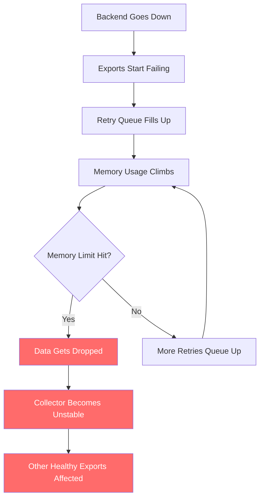
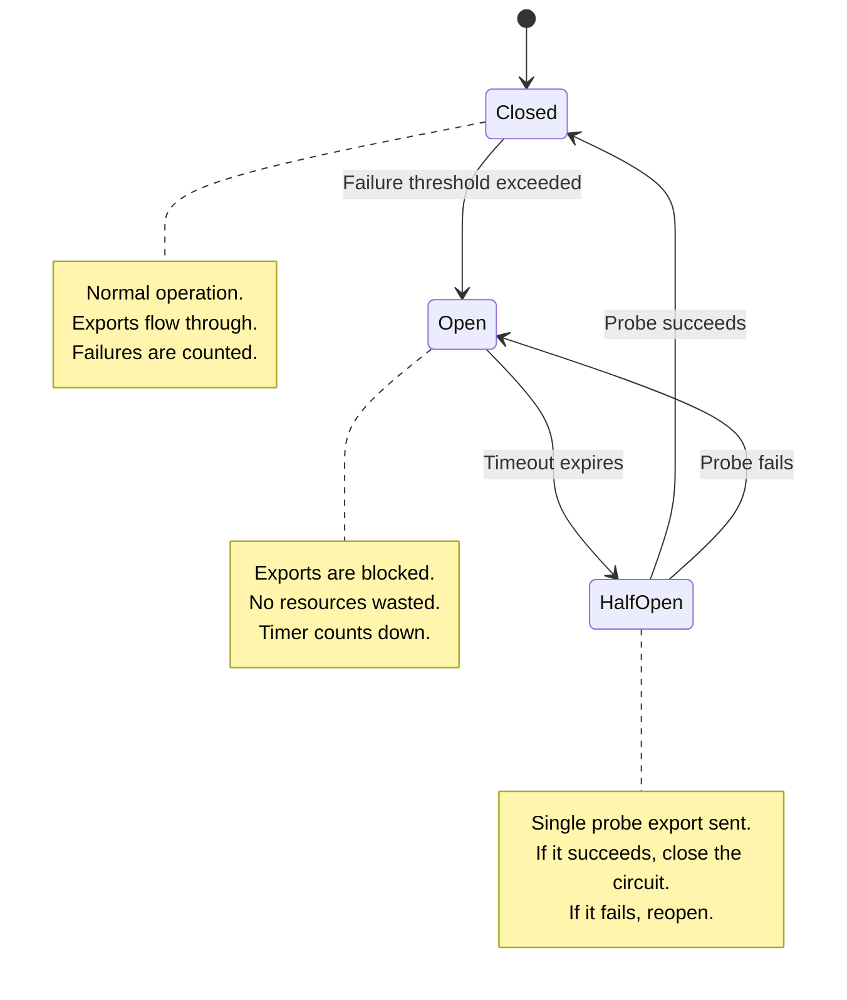
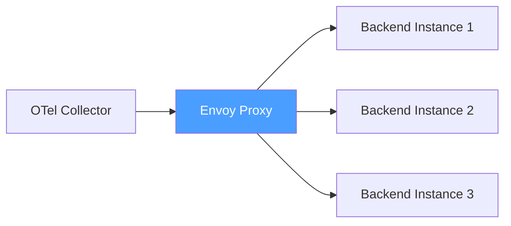
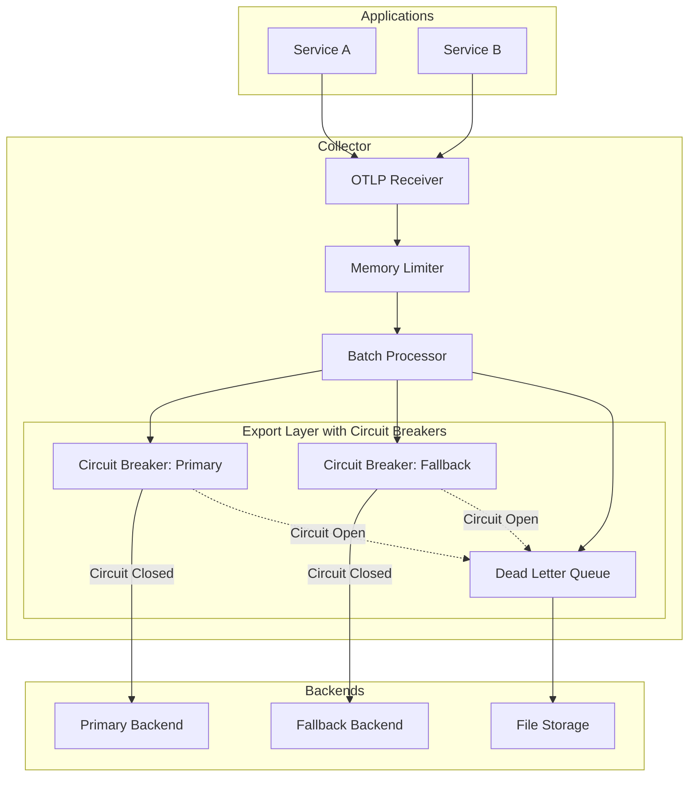

# How to Implement Circuit Breaker Patterns in OpenTelemetry Export Pipelines

Author: [nawazdhandala](https://www.github.com/nawazdhandala)

Tags: OpenTelemetry, Circuit Breaker, Resilience, Export Pipeline, Observability

Description: Implement circuit breaker patterns in OpenTelemetry export pipelines to prevent cascading failures and protect your collectors from unhealthy backends.

---

When an OpenTelemetry backend goes unhealthy, collectors keep trying to send data to it. Each failed export attempt consumes resources, fills up queues, and can cause the collector itself to become unstable. Circuit breakers solve this by detecting persistent failures and temporarily stopping exports to the broken backend, giving it time to recover.

This guide covers how to build circuit breaker behavior into your OpenTelemetry export pipelines using built-in collector features, custom processors, and proxy-level patterns.

## The Problem with Unbounded Retries

Without a circuit breaker, here is what happens when a backend goes down:



The retry mechanism, which normally protects against transient failures, becomes the problem during a sustained outage. It consumes memory and CPU trying to reach a backend that is not going to respond.

## Circuit Breaker Basics

A circuit breaker has three states:



- **Closed**: Everything is normal. Exports go through. The circuit breaker counts consecutive failures.
- **Open**: Too many failures in a row. The circuit breaker stops all exports and starts a cooldown timer. This prevents wasting resources on a dead backend.
- **Half-Open**: The cooldown timer expired. The circuit breaker lets a single test export through. If it succeeds, the circuit closes and normal operation resumes. If it fails, the circuit opens again.

## Using Sending Queue and Retry as a Basic Circuit Breaker

The OpenTelemetry Collector does not have a built-in circuit breaker processor, but you can get similar behavior by tuning the retry and sending queue configurations.

The key setting is `max_elapsed_time` in the retry configuration. This acts like a circuit breaker timeout by limiting how long the exporter tries to reach a failing backend:

```yaml
exporters:
  otlp/primary:
    endpoint: primary-backend.example.com:4317
    retry_on_failure:
      enabled: true
      # Start retrying after 1 second
      initial_interval: 1s
      # Double the interval each retry, up to 30 seconds
      max_interval: 30s
      # Stop retrying after 2 minutes total
      # This is the "circuit open" equivalent -- after 2 minutes
      # of failure, the batch is dropped and the next one gets a fresh start
      max_elapsed_time: 120s

    sending_queue:
      enabled: true
      # Limit queue size to bound memory usage during outages
      # A smaller queue means data gets dropped sooner, which is
      # actually what you want -- it prevents the collector from
      # becoming unstable
      queue_size: 500
      num_consumers: 5

    # Short timeout per export attempt so failures are detected quickly
    timeout: 10s
```

This gives you basic protection, but it is not a true circuit breaker because each batch independently goes through the full retry cycle. For real circuit breaker behavior, you need to track failure state across batches.

## Building a Circuit Breaker with the Routing Connector

A more sophisticated approach uses the routing connector to switch between a primary and fallback exporter based on the health of the primary backend. You combine this with a health check that probes the backend:

```yaml
# Circuit breaker pattern using routing connector and health checks
receivers:
  otlp:
    protocols:
      grpc:
        endpoint: 0.0.0.0:4317

processors:
  memory_limiter:
    check_interval: 1s
    limit_mib: 1024
    spike_limit_mib: 256

  batch:
    send_batch_size: 1024
    timeout: 5s

exporters:
  # Primary backend -- the one that might go down
  otlp/primary:
    endpoint: primary-backend.example.com:4317
    retry_on_failure:
      enabled: true
      initial_interval: 1s
      max_interval: 10s
      # Short max_elapsed_time since we have a fallback
      max_elapsed_time: 30s
    sending_queue:
      enabled: true
      queue_size: 200
    timeout: 5s

  # Fallback backend -- receives data when primary is down
  otlp/fallback:
    endpoint: fallback-backend.example.com:4317
    retry_on_failure:
      enabled: true
      initial_interval: 5s
      max_interval: 60s
      max_elapsed_time: 300s
    sending_queue:
      enabled: true
      queue_size: 2000
      storage: file_storage
    timeout: 15s

  # Write to local file as a last resort dead letter queue
  file/dlq:
    path: /var/lib/otel/dlq/traces.jsonl
    rotation:
      max_megabytes: 1024
      max_days: 7

extensions:
  file_storage:
    directory: /var/lib/otel/queue

service:
  extensions: [file_storage]
  pipelines:
    traces:
      receivers: [otlp]
      processors: [memory_limiter, batch]
      # Send to both primary and fallback
      # The fallback has a larger queue and longer timeouts
      exporters: [otlp/primary, otlp/fallback]
```

## Implementing a Circuit Breaker with an Envoy Sidecar

For a true circuit breaker with proper state management, put an Envoy proxy in front of your backend and configure its outlier detection. The collector talks to Envoy, and Envoy manages the circuit breaking:



Here is the Envoy configuration:

```yaml
# envoy-config.yaml
# Envoy sidecar with circuit breaking for OTel backend
static_resources:
  listeners:
    - name: otel_listener
      address:
        socket_address:
          address: 0.0.0.0
          port_value: 4317
      filter_chains:
        - filters:
            - name: envoy.filters.network.tcp_proxy
              typed_config:
                "@type": type.googleapis.com/envoy.extensions.filters.network.tcp_proxy.v3.TcpProxy
                stat_prefix: otel_backend
                cluster: otel_backend

  clusters:
    - name: otel_backend
      connect_timeout: 5s
      type: STRICT_DNS
      lb_policy: ROUND_ROBIN
      load_assignment:
        cluster_name: otel_backend
        endpoints:
          - lb_endpoints:
              - endpoint:
                  address:
                    socket_address:
                      address: backend.example.com
                      port_value: 4317

      # Circuit breaker thresholds
      circuit_breakers:
        thresholds:
          - priority: DEFAULT
            # Maximum number of concurrent connections
            max_connections: 100
            # Maximum number of pending requests
            max_pending_requests: 500
            # Maximum number of concurrent requests
            max_requests: 1000
            # Maximum number of retries
            max_retries: 3

      # Outlier detection -- this is the real circuit breaker
      outlier_detection:
        # Check for outliers every 10 seconds
        interval: 10s
        # Eject a host after 5 consecutive failures
        consecutive_5xx: 5
        # Keep the host ejected for 30 seconds
        base_ejection_time: 30s
        # Never eject more than 50% of hosts
        max_ejection_percent: 50
        # After ejection, start with a single probe request
        # If it succeeds, the host is readmitted
        enforcing_consecutive_5xx: 100
```

Then point your collector at the Envoy sidecar:

```yaml
exporters:
  otlp:
    # Point at the local Envoy sidecar instead of the backend directly
    endpoint: localhost:4317
    tls:
      insecure: true
    # Keep retries minimal since Envoy handles circuit breaking
    retry_on_failure:
      enabled: true
      initial_interval: 1s
      max_interval: 5s
      max_elapsed_time: 15s
    timeout: 10s
```

## Custom Circuit Breaker with a Go Processor

If you need full control, you can write a custom processor in Go that implements the circuit breaker pattern. Here is the core logic:

```go
// circuitbreaker.go
// A custom OpenTelemetry processor that implements the circuit breaker pattern.
// It tracks export failures and stops forwarding data when the failure rate
// exceeds a threshold.
package circuitbreaker

import (
	"context"
	"sync"
	"time"

	"go.opentelemetry.io/collector/pdata/ptrace"
)

// State represents the current state of the circuit breaker
type State int

const (
	StateClosed   State = iota // Normal operation
	StateOpen                   // Blocking exports
	StateHalfOpen              // Testing with a single request
)

// CircuitBreaker tracks failures and manages state transitions
type CircuitBreaker struct {
	mu sync.Mutex

	state            State
	failureCount     int
	failureThreshold int           // Number of failures before opening
	resetTimeout     time.Duration // How long to stay open
	lastFailure      time.Time
	halfOpenMax      int           // Max requests in half-open state
	halfOpenCount    int
}

// NewCircuitBreaker creates a circuit breaker with the given thresholds
func NewCircuitBreaker(failureThreshold int, resetTimeout time.Duration) *CircuitBreaker {
	return &CircuitBreaker{
		state:            StateClosed,
		failureThreshold: failureThreshold,
		resetTimeout:     resetTimeout,
		halfOpenMax:      1,
	}
}

// Allow checks whether a request should be allowed through
func (cb *CircuitBreaker) Allow() bool {
	cb.mu.Lock()
	defer cb.mu.Unlock()

	switch cb.state {
	case StateClosed:
		// Circuit is closed, allow all requests
		return true

	case StateOpen:
		// Check if the reset timeout has elapsed
		if time.Since(cb.lastFailure) > cb.resetTimeout {
			// Transition to half-open and allow a probe request
			cb.state = StateHalfOpen
			cb.halfOpenCount = 0
			return true
		}
		// Still in cooldown, block the request
		return false

	case StateHalfOpen:
		// Only allow a limited number of probe requests
		if cb.halfOpenCount < cb.halfOpenMax {
			cb.halfOpenCount++
			return true
		}
		return false
	}

	return false
}

// RecordSuccess records a successful export
func (cb *CircuitBreaker) RecordSuccess() {
	cb.mu.Lock()
	defer cb.mu.Unlock()

	if cb.state == StateHalfOpen {
		// Probe succeeded, close the circuit
		cb.state = StateClosed
		cb.failureCount = 0
	}
	// Reset failure count on any success in closed state
	cb.failureCount = 0
}

// RecordFailure records a failed export
func (cb *CircuitBreaker) RecordFailure() {
	cb.mu.Lock()
	defer cb.mu.Unlock()

	cb.failureCount++
	cb.lastFailure = time.Now()

	switch cb.state {
	case StateClosed:
		if cb.failureCount >= cb.failureThreshold {
			// Too many failures, open the circuit
			cb.state = StateOpen
		}
	case StateHalfOpen:
		// Probe failed, reopen the circuit
		cb.state = StateOpen
		cb.halfOpenCount = 0
	}
}
```

## Monitoring Circuit Breaker State

Whatever approach you use, you need to monitor the circuit breaker state. Here are the key metrics to track:

```promql
# Track how many times the circuit has opened
# A high rate means your backend is consistently unhealthy
rate(circuit_breaker_state_transitions_total{to_state="open"}[1h])

# Track data dropped while the circuit is open
# This tells you how much telemetry you are losing during outages
rate(circuit_breaker_dropped_spans_total[5m])

# Track the queue depth -- if it is at max while the circuit
# is open, you are losing data
otelcol_exporter_queue_size{exporter="otlp/primary"}

# Track export failure rate -- this is the signal that
# triggers the circuit breaker
rate(otelcol_exporter_send_failed_spans[5m]) /
rate(otelcol_exporter_sent_spans[5m])
```

Set up alerts that fire when the circuit opens:

```yaml
# Alertmanager rule for circuit breaker state changes
groups:
  - name: circuit-breaker
    rules:
      - alert: CircuitBreakerOpen
        expr: circuit_breaker_state == 2
        for: 1m
        labels:
          severity: warning
        annotations:
          summary: "Circuit breaker is open for {{ $labels.exporter }}"
          description: "The circuit breaker has been open for more than 1 minute. Data is being dropped or routed to fallback."

      - alert: HighExportFailureRate
        # Alert when more than 10% of exports are failing
        expr: >
          rate(otelcol_exporter_send_failed_spans[5m]) /
          rate(otelcol_exporter_sent_spans[5m]) > 0.1
        for: 5m
        labels:
          severity: warning
        annotations:
          summary: "High export failure rate for {{ $labels.exporter }}"
```

## Putting It All Together

Here is the complete architecture with circuit breakers at multiple levels:



The circuit breaker pattern turns your telemetry pipeline from a system that degrades unpredictably during outages into one that fails gracefully. When a backend is down, the circuit opens, resources are freed, and data goes to a fallback or dead letter queue. When the backend recovers, the circuit closes and normal operation resumes automatically.
