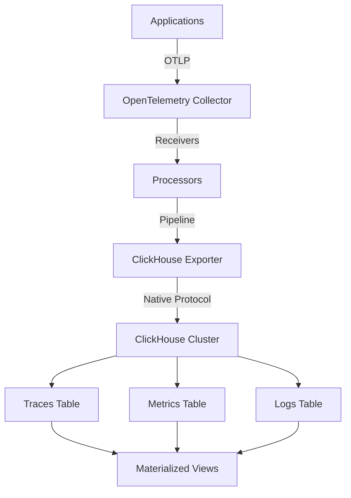

# How to Configure the ClickHouse Exporter in the OpenTelemetry Collector

Author: [nawazdhandala](https://www.github.com/nawazdhandala)

Tags: OpenTelemetry, Collector, Exporters, ClickHouse, Observability, Analytics, OLAP

Description: Complete guide to configuring the ClickHouse exporter in OpenTelemetry Collector for high-performance telemetry data storage with real-world examples and optimization tips.

ClickHouse is a high-performance columnar database management system designed for online analytical processing (OLAP). Its exceptional query performance on large datasets makes it an ideal backend for storing and analyzing telemetry data collected by the OpenTelemetry Collector. The ClickHouse exporter enables you to leverage this powerful database for your observability infrastructure.

## Why ClickHouse for Observability Data

ClickHouse offers several advantages for storing telemetry data:

- **Columnar storage** provides excellent compression ratios, reducing storage costs by 10-100x compared to row-based databases
- **Vectorized query execution** delivers sub-second query performance on billions of rows
- **Native time-series support** with specialized functions for temporal analysis
- **Cost-effective scaling** through efficient resource utilization
- **SQL compatibility** allows familiar querying patterns

Organizations processing millions of spans, metrics, and log entries per second benefit from ClickHouse's ability to ingest and query this data efficiently.

## Architecture Overview

The ClickHouse exporter transforms OpenTelemetry Protocol (OTLP) data into ClickHouse table schemas:



## Prerequisites

Before configuring the exporter, ensure you have:

- OpenTelemetry Collector Contrib distribution (version 0.88.0 or later)
- ClickHouse server (version 22.x or later recommended)
- Network connectivity on port 9000 (native protocol) or 8123 (HTTP protocol)
- Appropriate database credentials with write permissions

## Basic Configuration

Start with a minimal configuration to establish connectivity:

```yaml
# Basic ClickHouse exporter configuration
exporters:
  clickhouse:
    # Database connection string
    # Format: tcp://host:port?database=dbname
    endpoint: tcp://localhost:9000?database=otel

    # Connection timeout
    timeout: 10s

receivers:
  otlp:
    protocols:
      grpc:
        endpoint: 0.0.0.0:4317

processors:
  batch:
    timeout: 10s
    send_batch_size: 10000

service:
  pipelines:
    traces:
      receivers: [otlp]
      processors: [batch]
      exporters: [clickhouse]

    logs:
      receivers: [otlp]
      processors: [batch]
      exporters: [clickhouse]
```

This configuration connects to a local ClickHouse instance and writes telemetry data to the `otel` database using the native TCP protocol on port 9000.

## Database Schema Preparation

Before sending data, create the necessary tables in ClickHouse. The exporter expects specific table structures:

### Traces Table Schema

```sql
CREATE TABLE IF NOT EXISTS otel.otel_traces (
    Timestamp DateTime64(9) CODEC(Delta, ZSTD(1)),
    TraceId String CODEC(ZSTD(1)),
    SpanId String CODEC(ZSTD(1)),
    ParentSpanId String CODEC(ZSTD(1)),
    TraceState String CODEC(ZSTD(1)),
    SpanName LowCardinality(String) CODEC(ZSTD(1)),
    SpanKind LowCardinality(String) CODEC(ZSTD(1)),
    ServiceName LowCardinality(String) CODEC(ZSTD(1)),
    ResourceAttributes Map(LowCardinality(String), String) CODEC(ZSTD(1)),
    ScopeName String CODEC(ZSTD(1)),
    ScopeVersion String CODEC(ZSTD(1)),
    SpanAttributes Map(LowCardinality(String), String) CODEC(ZSTD(1)),
    Duration Int64 CODEC(ZSTD(1)),
    StatusCode LowCardinality(String) CODEC(ZSTD(1)),
    StatusMessage String CODEC(ZSTD(1)),
    Events Nested (
        Timestamp DateTime64(9),
        Name LowCardinality(String),
        Attributes Map(LowCardinality(String), String)
    ) CODEC(ZSTD(1)),
    Links Nested (
        TraceId String,
        SpanId String,
        TraceState String,
        Attributes Map(LowCardinality(String), String)
    ) CODEC(ZSTD(1)),
    INDEX idx_trace_id TraceId TYPE bloom_filter(0.001) GRANULARITY 1,
    INDEX idx_service_name ServiceName TYPE bloom_filter(0.01) GRANULARITY 1,
    INDEX idx_span_name SpanName TYPE bloom_filter(0.01) GRANULARITY 1
) ENGINE = MergeTree()
PARTITION BY toDate(Timestamp)
ORDER BY (ServiceName, SpanName, toUnixTimestamp(Timestamp), TraceId)
TTL toDateTime(Timestamp) + INTERVAL 30 DAY DELETE
SETTINGS index_granularity = 8192, ttl_only_drop_parts = 1;
```

### Logs Table Schema

```sql
CREATE TABLE IF NOT EXISTS otel.otel_logs (
    Timestamp DateTime64(9) CODEC(Delta, ZSTD(1)),
    TraceId String CODEC(ZSTD(1)),
    SpanId String CODEC(ZSTD(1)),
    TraceFlags UInt32 CODEC(ZSTD(1)),
    SeverityText LowCardinality(String) CODEC(ZSTD(1)),
    SeverityNumber Int32 CODEC(ZSTD(1)),
    ServiceName LowCardinality(String) CODEC(ZSTD(1)),
    Body String CODEC(ZSTD(1)),
    ResourceSchemaUrl String CODEC(ZSTD(1)),
    ResourceAttributes Map(LowCardinality(String), String) CODEC(ZSTD(1)),
    ScopeSchemaUrl String CODEC(ZSTD(1)),
    ScopeName String CODEC(ZSTD(1)),
    ScopeVersion String CODEC(ZSTD(1)),
    ScopeAttributes Map(LowCardinality(String), String) CODEC(ZSTD(1)),
    LogAttributes Map(LowCardinality(String), String) CODEC(ZSTD(1)),
    INDEX idx_trace_id TraceId TYPE bloom_filter(0.001) GRANULARITY 1,
    INDEX idx_service_name ServiceName TYPE bloom_filter(0.01) GRANULARITY 1,
    INDEX idx_body Body TYPE tokenbf_v1(32768, 3, 0) GRANULARITY 1
) ENGINE = MergeTree()
PARTITION BY toDate(Timestamp)
ORDER BY (ServiceName, SeverityText, toUnixTimestamp(Timestamp), TraceId)
TTL toDateTime(Timestamp) + INTERVAL 30 DAY DELETE
SETTINGS index_granularity = 8192, ttl_only_drop_parts = 1;
```

These schemas use several ClickHouse optimizations:

- **CODEC(ZSTD(1))**: Compression codec reduces storage by 70-90%
- **LowCardinality**: Optimizes columns with fewer than 10,000 unique values
- **Bloom filters**: Enable fast filtering on high-cardinality columns
- **Partitioning by date**: Improves query performance and enables efficient data management
- **TTL**: Automatically deletes data older than 30 days

## Authentication Configuration

Configure authentication for secure connections:

```yaml
exporters:
  clickhouse:
    endpoint: tcp://clickhouse.example.com:9000?database=otel

    # Authentication credentials
    username: ${CLICKHOUSE_USERNAME}
    password: ${CLICKHOUSE_PASSWORD}

    timeout: 10s

    # Connection pool settings
    connection_open_strategy: lifo
    max_open_conns: 10
    max_idle_conns: 5
    conn_max_lifetime: 60s
```

The exporter supports environment variable substitution using `${VARIABLE_NAME}` syntax, which is recommended for sensitive credentials.

## Advanced Configuration with Custom Table Names

Customize table names and enable additional features:

```yaml
exporters:
  clickhouse:
    endpoint: tcp://clickhouse.example.com:9000?database=otel

    username: ${CLICKHOUSE_USERNAME}
    password: ${CLICKHOUSE_PASSWORD}

    # Custom table names
    traces_table_name: otel_traces
    logs_table_name: otel_logs
    metrics_table_name: otel_metrics

    # Enable async insert for better performance
    # This batches inserts on the ClickHouse side
    async_insert: true

    # Wait for async insert to complete
    wait_for_async_insert: true

    # Timeout settings
    timeout: 30s
    ttl: 72h

    # Retry configuration
    retry_on_failure:
      enabled: true
      initial_interval: 5s
      max_interval: 30s
      max_elapsed_time: 300s

    # Queue settings for buffering
    sending_queue:
      enabled: true
      num_consumers: 10
      queue_size: 5000

processors:
  batch:
    timeout: 10s
    send_batch_size: 10000
    send_batch_max_size: 50000

service:
  pipelines:
    traces:
      receivers: [otlp]
      processors: [batch]
      exporters: [clickhouse]
```

## TLS Configuration

Enable TLS for encrypted communication:

```yaml
exporters:
  clickhouse:
    # Use clickhouses:// protocol for TLS
    endpoint: clickhouses://clickhouse.example.com:9440?database=otel

    username: ${CLICKHOUSE_USERNAME}
    password: ${CLICKHOUSE_PASSWORD}

    # TLS settings
    tls:
      insecure: false
      insecure_skip_verify: false

      # CA certificate for server verification
      ca_file: /etc/otel/certs/ca.crt

      # Client certificates (for mutual TLS)
      cert_file: /etc/otel/certs/client.crt
      key_file: /etc/otel/certs/client.key

      # Minimum TLS version
      min_version: "1.2"

    traces_table_name: otel_traces
    logs_table_name: otel_logs
```

Note the `clickhouses://` protocol and port 9440, which are standard for TLS connections to ClickHouse.

## HTTP Protocol Configuration

Alternative configuration using HTTP protocol instead of native TCP:

```yaml
exporters:
  clickhouse:
    # HTTP endpoint
    endpoint: https://clickhouse.example.com:8123?database=otel

    username: ${CLICKHOUSE_USERNAME}
    password: ${CLICKHOUSE_PASSWORD}

    # HTTP-specific settings
    compression: gzip

    # Custom HTTP headers
    headers:
      X-ClickHouse-User: ${CLICKHOUSE_USERNAME}
      X-ClickHouse-Key: ${CLICKHOUSE_API_KEY}

    traces_table_name: otel_traces
    logs_table_name: otel_logs

    timeout: 30s
```

HTTP protocol provides better compatibility with load balancers and proxies but may have slightly lower performance compared to the native protocol.

## High-Throughput Production Configuration

Complete configuration optimized for high-volume production environments:

```yaml
extensions:
  health_check:
    endpoint: 0.0.0.0:13133

receivers:
  otlp:
    protocols:
      grpc:
        endpoint: 0.0.0.0:4317
        max_recv_msg_size_mib: 32
        max_concurrent_streams: 100

processors:
  # Memory limiter prevents OOM crashes
  memory_limiter:
    check_interval: 1s
    limit_mib: 2048
    spike_limit_mib: 512

  # Add resource attributes for better querying
  resource:
    attributes:
      - key: collector.name
        value: ${HOSTNAME}
        action: insert
      - key: collector.version
        value: v0.88.0
        action: insert

  # Batch processor for efficient exporting
  batch:
    timeout: 5s
    send_batch_size: 10000
    send_batch_max_size: 50000

  # Resource detection adds cloud metadata
  resourcedetection:
    detectors: [env, system, docker]
    timeout: 5s

exporters:
  clickhouse:
    endpoint: tcp://clickhouse-01.prod.example.com:9000,clickhouse-02.prod.example.com:9000?database=otel

    username: ${CLICKHOUSE_USERNAME}
    password: ${CLICKHOUSE_PASSWORD}

    # Table configuration
    traces_table_name: otel_traces
    logs_table_name: otel_logs

    # Enable async insert for maximum throughput
    async_insert: true
    wait_for_async_insert: false

    # Connection pooling
    connection_open_strategy: lifo
    max_open_conns: 20
    max_idle_conns: 10
    conn_max_lifetime: 120s

    # Timeouts
    timeout: 30s
    ttl: 96h

    # Retry configuration
    retry_on_failure:
      enabled: true
      initial_interval: 5s
      max_interval: 60s
      max_elapsed_time: 600s

    # Sending queue for buffering during outages
    sending_queue:
      enabled: true
      num_consumers: 20
      queue_size: 10000
      storage: file_storage

extensions:
  file_storage:
    directory: /var/lib/otel/storage
    timeout: 10s

service:
  extensions: [health_check, file_storage]

  telemetry:
    logs:
      level: info
    metrics:
      level: detailed
      address: 0.0.0.0:8888

  pipelines:
    traces:
      receivers: [otlp]
      processors: [memory_limiter, resourcedetection, resource, batch]
      exporters: [clickhouse]

    logs:
      receivers: [otlp]
      processors: [memory_limiter, resourcedetection, resource, batch]
      exporters: [clickhouse]
```

## ClickHouse Cluster Configuration

For distributed ClickHouse deployments, configure sharding and replication:

```sql
-- Create distributed table for traces
CREATE TABLE IF NOT EXISTS otel.otel_traces_distributed AS otel.otel_traces
ENGINE = Distributed('cluster_name', 'otel', 'otel_traces', rand());

-- Create materialized view for common queries
CREATE MATERIALIZED VIEW IF NOT EXISTS otel.otel_traces_by_service
ENGINE = SummingMergeTree()
PARTITION BY toDate(Timestamp)
ORDER BY (ServiceName, toStartOfHour(Timestamp))
AS SELECT
    ServiceName,
    toStartOfHour(Timestamp) as Hour,
    count() as TraceCount,
    avg(Duration) as AvgDuration,
    quantile(0.95)(Duration) as P95Duration,
    quantile(0.99)(Duration) as P99Duration
FROM otel.otel_traces
GROUP BY ServiceName, Hour;
```

Update the exporter configuration to use the distributed table:

```yaml
exporters:
  clickhouse:
    endpoint: tcp://clickhouse.example.com:9000?database=otel
    username: ${CLICKHOUSE_USERNAME}
    password: ${CLICKHOUSE_PASSWORD}
    traces_table_name: otel_traces_distributed
    logs_table_name: otel_logs_distributed
```

## Monitoring and Performance Tuning

Monitor the exporter's performance using these metrics exposed on port 8888:

- `otel_exporter_sent_spans`: Number of spans successfully sent
- `otel_exporter_send_failed_spans`: Number of spans that failed to send
- `otel_exporter_queue_size`: Current queue size

Query ClickHouse system tables to monitor ingestion:

```sql
-- Check table sizes
SELECT
    table,
    formatReadableSize(sum(bytes)) as size,
    sum(rows) as rows
FROM system.parts
WHERE database = 'otel' AND active
GROUP BY table;

-- Monitor query performance
SELECT
    type,
    query_duration_ms,
    read_rows,
    result_rows,
    query
FROM system.query_log
WHERE query LIKE '%otel_traces%'
ORDER BY event_time DESC
LIMIT 10;
```

## Common Troubleshooting

**Connection refused errors**: Verify ClickHouse is listening on the configured port and check firewall rules.

**Memory errors**: Increase the `memory_limiter` settings or reduce batch sizes in the batch processor.

**Slow inserts**: Enable `async_insert` and increase `send_batch_size` for better throughput.

**Table not found**: Ensure tables are created before starting the collector using the schemas provided earlier.

## Query Examples

Once data is flowing, query your telemetry data:

```sql
-- Find slow traces (duration > 1 second)
SELECT
    TraceId,
    SpanName,
    ServiceName,
    Duration / 1000000 as DurationMs
FROM otel.otel_traces
WHERE Duration > 1000000000
ORDER BY Duration DESC
LIMIT 10;

-- Error rate by service
SELECT
    ServiceName,
    countIf(StatusCode = 'ERROR') / count() * 100 as ErrorRate
FROM otel.otel_traces
WHERE Timestamp >= now() - INTERVAL 1 HOUR
GROUP BY ServiceName
ORDER BY ErrorRate DESC;

-- Log patterns
SELECT
    Body,
    count() as Count
FROM otel.otel_logs
WHERE Timestamp >= now() - INTERVAL 1 HOUR
AND SeverityText = 'ERROR'
GROUP BY Body
ORDER BY Count DESC
LIMIT 20;
```

## Conclusion

The ClickHouse exporter transforms the OpenTelemetry Collector into a high-performance telemetry data ingestion system. By leveraging ClickHouse's columnar storage and query optimization, you can store and analyze massive volumes of observability data cost-effectively. The configuration patterns shown here provide a solid foundation for building scalable observability infrastructure.

The combination of OpenTelemetry's standardized data collection and ClickHouse's analytical capabilities creates a powerful observability platform suitable for organizations of any size. Remember to optimize your table schemas, enable compression, and use materialized views for frequently accessed aggregations.

For more information on other exporters, see our guides on the [Elasticsearch exporter](https://oneuptime.com/blog/post/elasticsearch-exporter-opentelemetry-collector/view) and [AWS X-Ray exporter](https://oneuptime.com/blog/post/aws-xray-exporter-opentelemetry-collector/view).
