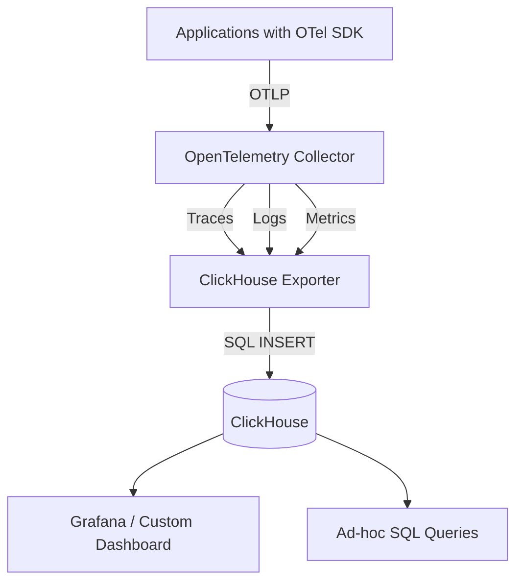

# How to Use ClickHouse as a High-Performance OpenTelemetry Backend

Author: [nawazdhandala](https://www.github.com/nawazdhandala)

Tags: OpenTelemetry, ClickHouse, Observability, Backend, Traces, Logs, Metrics, Performance

Description: Learn how to configure ClickHouse as a high-performance backend for OpenTelemetry traces, logs, and metrics with practical setup instructions and schema design.

---

ClickHouse is a columnar database built for analytical workloads, and it turns out to be an excellent fit for storing observability data. When you think about what observability data actually looks like (high-volume append-only writes, queries that scan large time ranges, aggregations over specific columns), it maps perfectly to what columnar databases are optimized for. Teams that have moved their OpenTelemetry data to ClickHouse regularly report 5x to 10x compression improvements over row-oriented databases and query performance that scales well even at billions of spans per day.

This guide covers how to set up ClickHouse as a backend for all three OpenTelemetry signals: traces, logs, and metrics. We will go through deployment, schema design, Collector configuration, and performance tuning.

## Why ClickHouse for Observability

Before we get into the setup, it is worth understanding why ClickHouse works so well for this use case.

Observability data has a few characteristics that play to ClickHouse's strengths. The data is almost always written once and read many times. Queries usually filter by time range first and then by specific attributes like service name or error code. Aggregation queries (like P99 latency over the last hour) are extremely common. And the data volumes can be massive, often hundreds of gigabytes per day for a medium-sized microservices deployment.

ClickHouse handles all of this efficiently because it stores data in columns rather than rows. When a query only needs the timestamp and duration columns from a table with 50 columns, ClickHouse only reads those two columns from disk. Combined with aggressive compression (observability data compresses exceptionally well due to repetitive patterns), you get fast queries with minimal I/O.



## Deploying ClickHouse

Getting ClickHouse running is straightforward. The following Docker command starts a single-node instance suitable for development and moderate production workloads.

```bash
# Start ClickHouse with persistent storage
docker run -d \
  --name clickhouse \
  -p 8123:8123 \
  -p 9000:9000 \
  -v clickhouse-data:/var/lib/clickhouse \
  -v clickhouse-logs:/var/log/clickhouse-server \
  -e CLICKHOUSE_DB=otel \
  -e CLICKHOUSE_USER=otel \
  -e CLICKHOUSE_PASSWORD=otel_password \
  clickhouse/clickhouse-server:latest
```

Port 8123 is the HTTP interface (used by the ClickHouse exporter), and port 9000 is the native TCP protocol (used by the clickhouse-client CLI). For production, you will want to look at ClickHouse Keeper for clustering, but a single node can handle a surprising amount of data.

## Creating the Schema

The ClickHouse exporter for the OpenTelemetry Collector can auto-create tables, but defining your own schema gives you control over partitioning, ordering, and TTL policies. Here are schemas for traces, logs, and metrics.

The traces table uses the MergeTree engine with time-based partitioning and is ordered by service name and timestamp for fast lookups.

```sql
-- Schema for storing OpenTelemetry trace spans
-- Partitioned by day, ordered by service name and timestamp
CREATE TABLE IF NOT EXISTS otel.traces (
    Timestamp DateTime64(9) CODEC(Delta, ZSTD(1)),
    TraceId String CODEC(ZSTD(1)),
    SpanId String CODEC(ZSTD(1)),
    ParentSpanId String CODEC(ZSTD(1)),
    TraceState String CODEC(ZSTD(1)),
    SpanName LowCardinality(String) CODEC(ZSTD(1)),
    SpanKind LowCardinality(String) CODEC(ZSTD(1)),
    ServiceName LowCardinality(String) CODEC(ZSTD(1)),
    ResourceAttributes Map(LowCardinality(String), String) CODEC(ZSTD(1)),
    ScopeName String CODEC(ZSTD(1)),
    ScopeVersion String CODEC(ZSTD(1)),
    SpanAttributes Map(LowCardinality(String), String) CODEC(ZSTD(1)),
    Duration Int64 CODEC(Delta, ZSTD(1)),
    StatusCode LowCardinality(String) CODEC(ZSTD(1)),
    StatusMessage String CODEC(ZSTD(1)),
    Events Nested (
        Timestamp DateTime64(9),
        Name LowCardinality(String),
        Attributes Map(LowCardinality(String), String)
    ) CODEC(ZSTD(1)),
    Links Nested (
        TraceId String,
        SpanId String,
        TraceState String,
        Attributes Map(LowCardinality(String), String)
    ) CODEC(ZSTD(1))
) ENGINE = MergeTree()
PARTITION BY toDate(Timestamp)
ORDER BY (ServiceName, SpanName, toUnixTimestamp(Timestamp))
TTL toDateTime(Timestamp) + INTERVAL 30 DAY
SETTINGS index_granularity = 8192;
```

The logs table follows a similar structure optimized for log data patterns.

```sql
-- Schema for storing OpenTelemetry log records
CREATE TABLE IF NOT EXISTS otel.logs (
    Timestamp DateTime64(9) CODEC(Delta, ZSTD(1)),
    TraceId String CODEC(ZSTD(1)),
    SpanId String CODEC(ZSTD(1)),
    TraceFlags UInt32 CODEC(ZSTD(1)),
    SeverityText LowCardinality(String) CODEC(ZSTD(1)),
    SeverityNumber Int32 CODEC(ZSTD(1)),
    ServiceName LowCardinality(String) CODEC(ZSTD(1)),
    Body String CODEC(ZSTD(1)),
    ResourceAttributes Map(LowCardinality(String), String) CODEC(ZSTD(1)),
    LogAttributes Map(LowCardinality(String), String) CODEC(ZSTD(1))
) ENGINE = MergeTree()
PARTITION BY toDate(Timestamp)
ORDER BY (ServiceName, SeverityText, toUnixTimestamp(Timestamp))
TTL toDateTime(Timestamp) + INTERVAL 14 DAY
SETTINGS index_granularity = 8192;
```

## Configuring the OpenTelemetry Collector

The Collector needs the ClickHouse exporter to send data to your ClickHouse instance. This exporter is available in the OpenTelemetry Collector Contrib distribution.

Here is a complete Collector configuration that handles all three signals.

```yaml
# otel-collector-config.yaml
# Full pipeline: traces, logs, and metrics to ClickHouse

receivers:
  otlp:
    protocols:
      grpc:
        endpoint: 0.0.0.0:4317
      http:
        endpoint: 0.0.0.0:4318

processors:
  # Batch spans/logs/metrics for efficient bulk inserts
  batch:
    send_batch_size: 10000
    send_batch_max_size: 20000
    timeout: 10s

  # Protect the Collector from memory pressure
  memory_limiter:
    check_interval: 1s
    limit_mib: 1024
    spike_limit_mib: 256

  # Add useful resource attributes
  resource:
    attributes:
      - key: environment
        value: production
        action: upsert

exporters:
  clickhouse:
    # ClickHouse HTTP endpoint with credentials
    endpoint: tcp://clickhouse:9000?dial_timeout=10s&compress=lz4
    database: otel
    username: otel
    password: otel_password

    # Table name configuration
    traces_table_name: traces
    logs_table_name: logs
    metrics_table_name: metrics

    # Connection pool settings for high throughput
    connection_params:
      max_open_conns: 10
      max_idle_conns: 5
      conn_max_lifetime: 10m

    # Retry configuration
    retry_on_failure:
      enabled: true
      initial_interval: 5s
      max_interval: 30s
      max_elapsed_time: 300s

    # Queue settings for buffering during ClickHouse slowdowns
    sending_queue:
      enabled: true
      num_consumers: 4
      queue_size: 5000

service:
  pipelines:
    traces:
      receivers: [otlp]
      processors: [memory_limiter, resource, batch]
      exporters: [clickhouse]
    logs:
      receivers: [otlp]
      processors: [memory_limiter, resource, batch]
      exporters: [clickhouse]
    metrics:
      receivers: [otlp]
      processors: [memory_limiter, resource, batch]
      exporters: [clickhouse]
```

The batch size is set higher than typical configurations (10,000 instead of 512) because ClickHouse performs best with larger batch inserts. Small inserts create too many parts that ClickHouse then has to merge, which can lead to the dreaded "too many parts" error under heavy load.

## Querying Your Data

One of the best things about ClickHouse is that you query it with SQL. No special query language to learn, no proprietary API. Here are some useful queries for exploring your observability data.

This query finds the slowest traces in the last hour, useful for identifying performance bottlenecks.

```sql
-- Find the top 10 slowest traces in the last hour
SELECT
    TraceId,
    SpanName,
    ServiceName,
    Duration / 1000000 AS duration_ms,
    StatusCode,
    SpanAttributes
FROM otel.traces
WHERE Timestamp > now() - INTERVAL 1 HOUR
ORDER BY Duration DESC
LIMIT 10;
```

This query calculates P50, P95, and P99 latency percentiles by service, which is one of the most common observability questions.

```sql
-- Calculate latency percentiles per service over the last 24 hours
SELECT
    ServiceName,
    count() AS span_count,
    quantile(0.50)(Duration / 1000000) AS p50_ms,
    quantile(0.95)(Duration / 1000000) AS p95_ms,
    quantile(0.99)(Duration / 1000000) AS p99_ms
FROM otel.traces
WHERE Timestamp > now() - INTERVAL 24 HOUR
    AND SpanKind = 'SPAN_KIND_SERVER'
GROUP BY ServiceName
ORDER BY p99_ms DESC;
```

## Performance Tuning

To get the most out of ClickHouse for observability workloads, there are a few settings worth tuning.

First, increase the batch size in the Collector as shown above. ClickHouse is optimized for bulk inserts, and sending spans one at a time will bottleneck your pipeline.

Second, use the `LowCardinality` type for columns with a limited set of values (like service names, span kinds, and severity levels). This provides dictionary encoding that dramatically reduces storage and speeds up filtering.

Third, set appropriate TTL policies on your tables. Observability data loses value over time, and keeping traces from six months ago rarely helps anyone. The schemas above set 30-day retention for traces and 14-day retention for logs. Adjust these based on your needs and storage budget.

Fourth, if you are running ClickHouse on dedicated hardware, allocate plenty of memory for the filesystem cache. ClickHouse uses the OS page cache heavily, and more cache means fewer disk reads for recent data.

## Visualization with Grafana

ClickHouse pairs naturally with Grafana for dashboards and exploration. Install the official ClickHouse data source plugin for Grafana, point it at your ClickHouse instance, and you can build dashboards using SQL queries. The Grafana plugin supports variables, annotations, and all the standard panel types, making it straightforward to build service-level dashboards showing request rates, error rates, and latency distributions straight from your OpenTelemetry data.

## Wrapping Up

ClickHouse gives you a high-performance, cost-effective backend for OpenTelemetry data that you can query with familiar SQL. The combination of columnar storage, aggressive compression, and fast aggregation makes it well suited for the kinds of queries observability teams run every day. Whether you are processing thousands or billions of spans per day, ClickHouse can handle it with the right configuration.
