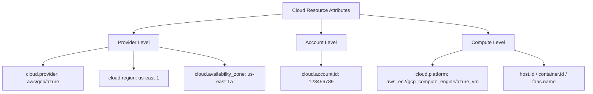

# How to Use Cloud Resource Semantic Conventions (AWS, GCP, Azure)

Author: [nawazdhandala](https://www.github.com/nawazdhandala)

Tags: OpenTelemetry, Cloud, AWS, GCP, Azure, Semantic Conventions, Resource Attributes, Observability, Infrastructure

Description: Learn how to apply OpenTelemetry cloud resource semantic conventions for AWS, GCP, and Azure to enrich your telemetry with infrastructure context that makes debugging and capacity planning easier.

---

When your application runs on a cloud provider, knowing which region, account, and compute instance produced a given trace or metric is essential for debugging and capacity planning. OpenTelemetry's cloud resource semantic conventions define a standard way to attach this infrastructure context to all your telemetry data. Instead of every team inventing their own attribute names for things like region or instance ID, the conventions give you a common vocabulary that works across AWS, GCP, and Azure.

This guide walks through the cloud resource semantic conventions with practical examples for all three major cloud providers.

## What Cloud Resource Conventions Cover

Cloud resource conventions are a subset of the broader OpenTelemetry resource semantic conventions. They describe the cloud environment where your application is running, including the provider, account, region, availability zone, and the specific compute platform.



These attributes are set once on the `Resource` object during SDK initialization. Every span, metric, and log produced by that SDK instance will carry these attributes, giving you infrastructure context on all your telemetry data without any per-request overhead.

## AWS Resource Detection

AWS has the richest set of compute platforms, and OpenTelemetry provides resource detectors for EC2, ECS, EKS, Lambda, and Elastic Beanstalk. The detectors query the instance metadata service and environment variables to automatically populate resource attributes.

### Automatic Detection for EC2

```javascript
// aws-ec2-resource.js - Automatic AWS EC2 resource detection
const { NodeSDK } = require('@opentelemetry/sdk-node');
const { OTLPTraceExporter } = require('@opentelemetry/exporter-trace-otlp-http');
const { AwsEc2DetectorSync } = require('@opentelemetry/resource-detector-aws');
const { Resource } = require('@opentelemetry/resources');

// The EC2 detector queries the instance metadata service (IMDS)
// to automatically populate cloud and host attributes
const sdk = new NodeSDK({
  resource: new Resource({
    'service.name': 'payment-api',
    'service.version': '4.1.0',
  }),
  resourceDetectors: [
    new AwsEc2DetectorSync(),
  ],
  traceExporter: new OTLPTraceExporter({
    url: 'https://otel-collector.internal/v1/traces',
  }),
});

sdk.start();

// After initialization, the resource will contain attributes like:
// cloud.provider: "aws"
// cloud.platform: "aws_ec2"
// cloud.region: "us-east-1"
// cloud.availability_zone: "us-east-1a"
// cloud.account.id: "123456789012"
// host.id: "i-0abc123def456"
// host.type: "m5.xlarge"
// host.name: "ip-10-0-1-42.ec2.internal"
```

The EC2 detector hits the instance metadata endpoint at `169.254.169.254` to retrieve the instance ID, instance type, region, availability zone, and account ID. You do not need to hardcode any of these values. If your EC2 instances have IMDSv2 configured (which they should for security), the detector handles the token-based authentication automatically.

### AWS Lambda Resource Detection

Lambda functions have a different set of resource attributes because they are serverless. The detector reads from Lambda environment variables instead of IMDS.

```python
# lambda_resource.py - AWS Lambda resource detection in Python
from opentelemetry import trace
from opentelemetry.sdk.trace import TracerProvider
from opentelemetry.sdk.trace.export import BatchSpanProcessor
from opentelemetry.exporter.otlp.proto.grpc.trace_exporter import OTLPSpanExporter
from opentelemetry.sdk.resources import Resource
from opentelemetry.resource.detector.aws import (
    AwsLambdaResourceDetector,
)

# The Lambda detector reads from environment variables set by the runtime:
# AWS_LAMBDA_FUNCTION_NAME, AWS_REGION, AWS_LAMBDA_FUNCTION_VERSION, etc.
lambda_resource = AwsLambdaResourceDetector().detect()

# Merge with your service-level resource attributes
service_resource = Resource.create({
    "service.name": "order-processor-lambda",
    "service.version": "2.0.1",
})

merged_resource = service_resource.merge(lambda_resource)

provider = TracerProvider(resource=merged_resource)
provider.add_span_processor(
    BatchSpanProcessor(OTLPSpanExporter(endpoint="otel-collector:4317"))
)
trace.set_tracer_provider(provider)

# The merged resource will contain:
# cloud.provider: "aws"
# cloud.platform: "aws_lambda"
# cloud.region: "us-west-2"
# cloud.account.id: "123456789012"
# faas.name: "order-processor"
# faas.version: "$LATEST"
# faas.instance: "2024/01/15/[$LATEST]abc123"
# faas.max_memory: 512  (in MB)
```

The key difference for Lambda is the `faas.*` attributes (Function as a Service). These replace the `host.*` attributes used by EC2 because Lambda functions do not have persistent hosts. The `faas.name`, `faas.version`, and `faas.instance` attributes give you the context needed to debug cold starts, version mismatches, and memory issues.

### AWS ECS and EKS Detection

For containerized workloads on ECS or EKS, the detectors capture both the cloud infrastructure context and the container/orchestration context.

```javascript
// aws-ecs-resource.js - ECS resource detection with container attributes
const {
  AwsEcsDetectorSync,
} = require('@opentelemetry/resource-detector-aws');
const { containerDetectorSync } = require('@opentelemetry/resource-detector-container');

const sdk = new NodeSDK({
  resource: new Resource({
    'service.name': 'user-api',
  }),
  resourceDetectors: [
    new AwsEcsDetectorSync(),
    containerDetectorSync,
  ],
  traceExporter: new OTLPTraceExporter({ url: collectorUrl }),
});

// ECS detector populates:
// cloud.provider: "aws"
// cloud.platform: "aws_ecs"
// cloud.region: "us-east-1"
// cloud.account.id: "123456789012"
// aws.ecs.cluster.arn: "arn:aws:ecs:us-east-1:123456789012:cluster/production"
// aws.ecs.task.arn: "arn:aws:ecs:us-east-1:123456789012:task/production/abc123"
// aws.ecs.task.family: "user-api-task"
// aws.ecs.task.revision: "42"
// aws.ecs.launchtype: "FARGATE"
//
// Container detector adds:
// container.id: "abc123def456..."
// container.name: "user-api"
```

This combination of cloud and container attributes lets you pinpoint exactly which task, container, and cluster produced a given trace.

## GCP Resource Detection

Google Cloud Platform provides similar resource detectors for Compute Engine, GKE, Cloud Run, and Cloud Functions.

```python
# gcp_resource.py - GCP resource detection in Python
from opentelemetry import trace
from opentelemetry.sdk.trace import TracerProvider
from opentelemetry.sdk.resources import Resource
from opentelemetry.resourcedetector.gcp_resource_detector import (
    GoogleCloudResourceDetector,
)

# The GCP detector queries the metadata server at metadata.google.internal
# to populate cloud and compute attributes
gcp_resource = GoogleCloudResourceDetector().detect()

service_resource = Resource.create({
    "service.name": "inventory-service",
    "service.version": "3.0.0",
})

merged_resource = service_resource.merge(gcp_resource)

provider = TracerProvider(resource=merged_resource)
trace.set_tracer_provider(provider)

# For a GCE instance, the resource will contain:
# cloud.provider: "gcp"
# cloud.platform: "gcp_compute_engine"
# cloud.region: "us-central1"
# cloud.availability_zone: "us-central1-a"
# cloud.account.id: "my-project-123456"
# host.id: "1234567890123456789"
# host.type: "n2-standard-4"
# host.name: "inventory-vm-01"
```

For GKE workloads, the detector captures both the GCP infrastructure context and Kubernetes-specific attributes.

```python
# gke_resource.py - GKE resource detection
from opentelemetry.resourcedetector.gcp_resource_detector import (
    GoogleCloudResourceDetector,
)

gke_resource = GoogleCloudResourceDetector().detect()

# For a GKE pod, the resource contains both cloud and k8s attributes:
# cloud.provider: "gcp"
# cloud.platform: "gcp_kubernetes_engine"
# cloud.region: "us-central1"
# cloud.account.id: "my-project-123456"
# k8s.cluster.name: "production-cluster"
# k8s.namespace.name: "default"
# k8s.pod.name: "inventory-service-7f8b9c-xyz12"
# k8s.deployment.name: "inventory-service"
# container.name: "inventory"
```

Cloud Run and Cloud Functions work similarly to AWS Lambda, using `faas.*` attributes for the serverless context.

```python
# cloud_run_resource.py - Cloud Run resource detection
# For a Cloud Run service, the resource contains:
# cloud.provider: "gcp"
# cloud.platform: "gcp_cloud_run"
# cloud.region: "us-central1"
# cloud.account.id: "my-project-123456"
# faas.name: "inventory-service"
# faas.version: "revision-12"
# faas.instance: "00bf4bf02dc5e..."
```

## Azure Resource Detection

Azure provides resource detectors for Virtual Machines, AKS, App Service, and Azure Functions.

```javascript
// azure-resource.js - Azure resource detection in Node.js
const { NodeSDK } = require('@opentelemetry/sdk-node');
const {
  AzureVmDetector,
} = require('@opentelemetry/resource-detector-azure');
const { Resource } = require('@opentelemetry/resources');

const sdk = new NodeSDK({
  resource: new Resource({
    'service.name': 'billing-service',
    'service.version': '1.2.0',
  }),
  resourceDetectors: [
    new AzureVmDetector(),
  ],
  traceExporter: exporter,
});

sdk.start();

// For an Azure VM, the resource will contain:
// cloud.provider: "azure"
// cloud.platform: "azure_vm"
// cloud.region: "eastus"
// cloud.account.id: "subscription-uuid-here"
// host.id: "vm-uuid-here"
// host.type: "Standard_D4s_v3"
// host.name: "billing-vm-01"
// azure.vm.scaleset.name: "billing-vmss"  (if in a scale set)
```

Azure App Service and Azure Functions use their own detectors that read from the App Service environment variables.

```javascript
// azure-functions-resource.js - Azure Functions resource detection
const { AzureFunctionsDetector } = require('@opentelemetry/resource-detector-azure');

// Azure Functions detector reads from environment variables:
// WEBSITE_SITE_NAME, REGION_NAME, WEBSITE_INSTANCE_ID, etc.

// Detected attributes:
// cloud.provider: "azure"
// cloud.platform: "azure_functions"
// cloud.region: "eastus"
// faas.name: "process-orders"
// faas.version: "20240115.1"
// faas.instance: "instance-abc123"
```

## Multi-Cloud Resource Configuration

If you operate across multiple cloud providers, you can create a resource detection setup that works everywhere by chaining detectors. The first detector that successfully identifies the environment wins.

```javascript
// multi-cloud-resource.js - Resource detection that works across clouds
const { NodeSDK } = require('@opentelemetry/sdk-node');
const { AwsEc2DetectorSync, AwsEcsDetectorSync, AwsLambdaDetectorSync } = require('@opentelemetry/resource-detector-aws');
const { gcpDetectorSync } = require('@opentelemetry/resource-detector-gcp');
const { AzureVmDetector } = require('@opentelemetry/resource-detector-azure');
const { envDetectorSync, hostDetectorSync, processDetectorSync } = require('@opentelemetry/resources');
const { Resource } = require('@opentelemetry/resources');

const sdk = new NodeSDK({
  resource: new Resource({
    'service.name': process.env.SERVICE_NAME || 'unknown',
    'service.version': process.env.SERVICE_VERSION || '0.0.0',
    'deployment.environment.name': process.env.DEPLOY_ENV || 'development',
  }),
  // Detectors are tried in order; those that fail silently return empty resources
  resourceDetectors: [
    // AWS detectors
    new AwsLambdaDetectorSync(),
    new AwsEcsDetectorSync(),
    new AwsEc2DetectorSync(),
    // GCP detector
    gcpDetectorSync,
    // Azure detector
    new AzureVmDetector(),
    // Fallback: basic host and process info
    envDetectorSync,
    hostDetectorSync,
    processDetectorSync,
  ],
  traceExporter: exporter,
});

sdk.start();
```

Each detector checks whether it is running in its respective environment. If it is not (for example, the AWS EC2 detector runs on a GCP instance), it returns an empty resource and the next detector gets a chance. This means you can use the same instrumentation code across all your deployments.

## Querying Cloud Resource Telemetry

With cloud resource attributes attached to all your telemetry, you can slice and dice your data by infrastructure dimensions.

```sql
-- Latency by cloud region for a specific service
SELECT
    cloud.region,
    cloud.availability_zone,
    avg(duration_ms) as avg_latency_ms,
    p99(duration_ms) as p99_latency_ms,
    count(*) as request_count
FROM spans
WHERE resource.service.name = 'payment-api'
  AND cloud.provider IS NOT NULL
GROUP BY cloud.region, cloud.availability_zone
ORDER BY p99_latency_ms DESC;

-- Error rates by cloud provider and platform
SELECT
    cloud.provider,
    cloud.platform,
    resource.service.name,
    count(*) as total_spans,
    countIf(status_code = 'ERROR') as error_count,
    round(error_count / total_spans * 100, 2) as error_rate
FROM spans
WHERE cloud.provider IS NOT NULL
GROUP BY cloud.provider, cloud.platform, resource.service.name
HAVING error_rate > 0.5
ORDER BY error_rate DESC;

-- Resource utilization by instance type
SELECT
    cloud.provider,
    host.type,
    count(distinct host.id) as instance_count,
    avg(duration_ms) as avg_latency_ms
FROM spans
WHERE host.type IS NOT NULL
GROUP BY cloud.provider, host.type
ORDER BY instance_count DESC;
```

These queries work across all three cloud providers because the attribute names are standardized. You can build a single dashboard that shows latency by region regardless of whether that region is `us-east-1` on AWS, `us-central1` on GCP, or `eastus` on Azure.

## Best Practices for Cloud Resource Attributes

There are a few things to keep in mind when working with cloud resource conventions.

First, always merge your service-level resource with the cloud-detected resource. The auto-detected attributes tell you where the service is running, but you still need `service.name` and `service.version` to identify what is running.

Second, set `deployment.environment.name` to distinguish between production, staging, and development. This is not a cloud-specific attribute, but it is critical for filtering telemetry data.

Third, be careful with resource detection in local development. The cloud detectors will timeout or fail when running on a developer laptop. Use environment variable overrides or conditional detector configuration to handle this gracefully.

```javascript
// conditional-detection.js - Only use cloud detectors in cloud environments
const detectors = [envDetectorSync, hostDetectorSync, processDetectorSync];

// Only add cloud detectors when running in a cloud environment
if (process.env.CLOUD_PROVIDER === 'aws') {
  detectors.unshift(new AwsEc2DetectorSync());
} else if (process.env.CLOUD_PROVIDER === 'gcp') {
  detectors.unshift(gcpDetectorSync);
} else if (process.env.CLOUD_PROVIDER === 'azure') {
  detectors.unshift(new AzureVmDetector());
}
```

## Wrapping Up

Cloud resource semantic conventions turn your telemetry into infrastructure-aware data. By attaching attributes like `cloud.provider`, `cloud.region`, `cloud.platform`, and `host.id` to every span and metric, you gain the ability to analyze performance by region, debug issues on specific instances, and track capacity across cloud providers.

Start with the auto-detection resource detectors for your cloud platform. They handle the metadata queries and environment variable parsing for you. Merge the detected resource with your service-level attributes, add the deployment environment, and you will have rich infrastructure context on all your telemetry data with minimal code.
