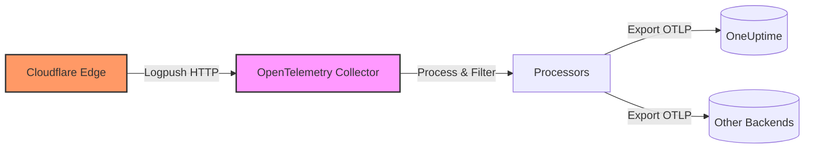

# How to Configure the Cloudflare Receiver in the OpenTelemetry Collector

Author: [nawazdhandala](https://www.github.com/nawazdhandala)

Tags: OpenTelemetry, Collector, Cloudflare, Logs, HTTP Logs, Webhooks

Description: Learn how to configure the Cloudflare receiver in OpenTelemetry Collector to ingest HTTP logs from Cloudflare Logpush service, including authentication, data transformation, and routing to observability backends.

---

The Cloudflare receiver in the OpenTelemetry Collector enables you to ingest HTTP logs from Cloudflare's Logpush service directly into your observability pipeline. This receiver acts as an HTTP endpoint that accepts log data from Cloudflare, parses it, and converts it into OpenTelemetry log records for processing and export.

If you're running services behind Cloudflare and want to centralize your observability data without vendor lock-in, the Cloudflare receiver provides a straightforward path to bring your edge logs into your OpenTelemetry-based stack.

---

## What is the Cloudflare Receiver?

The Cloudflare receiver is an OpenTelemetry Collector component that receives logs from Cloudflare's Logpush service via HTTP. Cloudflare Logpush is a service that pushes detailed logs about HTTP requests, firewall events, and other edge activities to a destination of your choice.

Instead of sending these logs to Cloudflare's partner destinations or S3 buckets, you can configure Logpush to send data directly to your OpenTelemetry Collector. The receiver then converts these logs into the OpenTelemetry log data model, making them available for processing, filtering, enrichment, and export to any backend that supports OTLP.

**Key capabilities:**
- Receives logs via HTTP POST from Cloudflare Logpush
- Supports authentication via secret tokens
- Parses Cloudflare's log format into OpenTelemetry log records
- Extracts structured fields from Cloudflare logs as attributes
- Works with all Cloudflare log datasets (HTTP requests, firewall events, spectrum events, etc.)

---

## Architecture Overview

The following diagram shows how Cloudflare logs flow into your observability stack through the OpenTelemetry Collector:



Cloudflare continuously generates logs at the edge and uses Logpush to send batches of log data to your Collector. The Cloudflare receiver listens on an HTTP endpoint, authenticates incoming requests, and converts the log data into OpenTelemetry log records. These records then flow through your configured processors and exporters.

---

## Prerequisites

Before configuring the Cloudflare receiver, ensure you have:

1. **An OpenTelemetry Collector instance** running (version 0.80.0 or later recommended)
2. **Cloudflare Logpush enabled** on your Cloudflare account (available on Pro, Business, and Enterprise plans)
3. **Network access** from Cloudflare to your Collector endpoint (publicly accessible or via Cloudflare Tunnel)
4. **A secret token** for authenticating Cloudflare requests

---

## Basic Configuration

The Cloudflare receiver configuration requires defining an HTTP endpoint and authentication method. Here's a minimal configuration:

```yaml
# RECEIVERS: Define how telemetry enters the Collector
receivers:
  # Cloudflare receiver listens for HTTP logs from Cloudflare Logpush
  cloudflare:
    # HTTP endpoint configuration
    endpoint: 0.0.0.0:8080

    # Secret token for authentication (Cloudflare includes this in headers)
    secret: ${CLOUDFLARE_SECRET}

# EXPORTERS: Define where logs are sent
exporters:
  # Export logs to OneUptime using OTLP over HTTP
  otlphttp:
    endpoint: https://oneuptime.com/otlp
    headers:
      x-oneuptime-token: ${ONEUPTIME_TOKEN}

# SERVICE: Wire receivers to exporters
service:
  pipelines:
    # Logs pipeline: receive from Cloudflare, export to OneUptime
    logs:
      receivers: [cloudflare]
      exporters: [otlphttp]
```

**Configuration breakdown:**

- `endpoint`: The address and port where the receiver listens for incoming Cloudflare logs. Use `0.0.0.0` to listen on all interfaces.
- `secret`: A shared secret that Cloudflare includes in the `X-Auth-Token` header. The receiver validates this token to ensure requests are authentic.

---

## Authentication and Security

The Cloudflare receiver uses a simple token-based authentication mechanism to verify that incoming requests originate from Cloudflare Logpush.

When you configure Cloudflare Logpush, you provide a secret token. Cloudflare includes this token in the `X-Auth-Token` header of every HTTP request. The receiver compares this header value against the configured `secret`. If they don't match, the request is rejected with a 401 Unauthorized response.

**Best practices for security:**

1. **Use environment variables** for the secret (never hardcode in configuration files)
2. **Generate a strong, random secret** (minimum 32 characters)
3. **Enable TLS** by placing the receiver behind a reverse proxy or load balancer with HTTPS
4. **Restrict network access** to your Collector endpoint using firewall rules
5. **Rotate secrets periodically** and update both Cloudflare and Collector configurations

Example of generating a secure token:

```bash
# Generate a 32-character random token
openssl rand -base64 32
```

---

## Production Configuration with Processing

In production environments, you'll want to add processors for batching, memory management, and data enrichment. Here's a more complete configuration:

```yaml
receivers:
  # Cloudflare receiver with authentication
  cloudflare:
    endpoint: 0.0.0.0:8080
    secret: ${CLOUDFLARE_SECRET}

processors:
  # Protect Collector from memory exhaustion
  memory_limiter:
    limit_mib: 512
    spike_limit_mib: 128
    check_interval: 2s

  # Batch logs to reduce network overhead
  batch:
    send_batch_max_size: 1024
    timeout: 10s

  # Add resource attributes to identify the source
  resource:
    attributes:
      - key: service.name
        value: cloudflare-edge
        action: upsert
      - key: deployment.environment
        value: production
        action: upsert

  # Transform specific attributes for better querying
  attributes:
    actions:
      # Rename Cloudflare-specific fields to standard semantic conventions
      - key: ClientIP
        action: insert
        from_attribute: http.client_ip
      - key: ClientCountry
        action: insert
        from_attribute: geo.country_iso_code

exporters:
  # Export to OneUptime with retry and timeout configuration
  otlphttp:
    endpoint: https://oneuptime.com/otlp
    headers:
      x-oneuptime-token: ${ONEUPTIME_TOKEN}
    retry_on_failure:
      enabled: true
      initial_interval: 5s
      max_interval: 30s
      max_elapsed_time: 300s
    timeout: 30s

  # Also export to local file for debugging (optional)
  file:
    path: /var/log/cloudflare-logs.json

service:
  # Enable telemetry for the Collector itself
  telemetry:
    logs:
      level: info
    metrics:
      address: localhost:8888

  pipelines:
    logs:
      receivers: [cloudflare]
      processors: [memory_limiter, resource, attributes, batch]
      exporters: [otlphttp]
```

**Key processing steps:**

1. **Memory limiter** prevents the Collector from consuming too much memory under high load
2. **Resource processor** adds identifying attributes to all logs (service name, environment)
3. **Attributes processor** transforms Cloudflare-specific field names to standard semantic conventions
4. **Batch processor** groups logs into batches to reduce network overhead and improve throughput

---

## Configuring Cloudflare Logpush

After configuring your Collector, you need to set up Cloudflare Logpush to send data to it. You can do this via the Cloudflare dashboard or API.

**Using the Cloudflare API:**

```bash
# Create a Logpush job that sends HTTP request logs to your Collector
curl -X POST "https://api.cloudflare.com/client/v4/zones/${ZONE_ID}/logpush/jobs" \
  -H "X-Auth-Email: ${CLOUDFLARE_EMAIL}" \
  -H "X-Auth-Key: ${CLOUDFLARE_API_KEY}" \
  -H "Content-Type: application/json" \
  -d '{
    "name": "otel-collector-http-logs",
    "destination_conf": "https://your-collector-endpoint.com:8080?header_X-Auth-Token=${CLOUDFLARE_SECRET}",
    "dataset": "http_requests",
    "logpull_options": "fields=ClientIP,ClientRequestHost,ClientRequestMethod,ClientRequestURI,EdgeStartTimestamp,EdgeEndTimestamp,EdgeResponseStatus,EdgeResponseBytes,RayID",
    "enabled": true
  }'
```

**Configuration parameters:**

- `destination_conf`: Your Collector endpoint URL with the secret token in the query string
- `dataset`: The type of logs to push (http_requests, firewall_events, spectrum_events, etc.)
- `logpull_options`: Comma-separated list of fields to include in the logs
- `enabled`: Set to true to start sending logs immediately

**Via Cloudflare Dashboard:**

1. Navigate to your zone in the Cloudflare dashboard
2. Go to Analytics > Logs > Logpush
3. Click "Add Logpush job"
4. Select "HTTP destination" and enter your Collector endpoint URL
5. Add the secret token as a header parameter
6. Choose the dataset and fields you want to receive
7. Enable the job

---

## Data Flow and Log Structure

When Cloudflare sends logs to your receiver, each HTTP request contains a JSON array of log records. The receiver parses each record and converts it into an OpenTelemetry log record.

**Example Cloudflare log entry:**

```json
{
  "ClientIP": "192.0.2.1",
  "ClientRequestHost": "example.com",
  "ClientRequestMethod": "GET",
  "ClientRequestURI": "/api/users",
  "EdgeStartTimestamp": 1675270800000000000,
  "EdgeEndTimestamp": 1675270800123000000,
  "EdgeResponseStatus": 200,
  "EdgeResponseBytes": 1234,
  "RayID": "7d1f2a3b4c5d6e7f"
}
```

**Converted to OpenTelemetry log record:**

The receiver maps these fields to OpenTelemetry log attributes:

- `ClientIP` becomes `http.client_ip`
- `ClientRequestMethod` becomes `http.request.method`
- `EdgeResponseStatus` becomes `http.response.status_code`
- `EdgeStartTimestamp` becomes the log record's timestamp
- All other fields are preserved as attributes

This conversion allows you to query and analyze Cloudflare logs using standard OpenTelemetry tooling and semantic conventions.

---

## Monitoring and Troubleshooting

To ensure your Cloudflare receiver is working correctly, monitor these key indicators:

**Collector internal metrics:**

The Collector exposes metrics about the receiver's operation. Enable the Prometheus exporter to scrape these metrics:

```yaml
receivers:
  cloudflare:
    endpoint: 0.0.0.0:8080
    secret: ${CLOUDFLARE_SECRET}

exporters:
  prometheus:
    endpoint: 0.0.0.0:8889

service:
  telemetry:
    metrics:
      address: localhost:8888

  pipelines:
    logs:
      receivers: [cloudflare]
      exporters: [otlphttp]

    metrics:
      receivers: [prometheus]
      exporters: [prometheus]
```

**Key metrics to watch:**

- `otelcol_receiver_accepted_log_records`: Number of log records successfully received
- `otelcol_receiver_refused_log_records`: Number of log records rejected (authentication failures)
- `otelcol_exporter_send_failed_log_records`: Number of log records that failed to export

**Common issues and solutions:**

1. **Authentication failures (401 errors):**
   - Verify the secret matches in both Cloudflare Logpush configuration and Collector configuration
   - Check that Cloudflare is sending the `X-Auth-Token` header

2. **Connection timeouts:**
   - Ensure your Collector endpoint is publicly accessible or accessible via Cloudflare Tunnel
   - Check firewall rules and network security groups

3. **Missing logs:**
   - Verify the Logpush job is enabled in Cloudflare
   - Check Collector logs for parsing errors
   - Confirm the dataset and fields match your expectations

4. **High memory usage:**
   - Reduce `send_batch_max_size` in the batch processor
   - Lower the `limit_mib` in the memory limiter
   - Consider scaling horizontally with multiple Collector instances

**Debug configuration:**

Enable debug logging to troubleshoot issues:

```yaml
service:
  telemetry:
    logs:
      level: debug
      output_paths:
        - stdout
        - /var/log/otel-collector.log
```

---

## Multi-Dataset Configuration

You can receive multiple types of Cloudflare logs by creating separate Logpush jobs that all point to the same receiver endpoint. The receiver will process all datasets identically.

If you want to route different datasets to different backends, use the filter processor:

```yaml
receivers:
  cloudflare:
    endpoint: 0.0.0.0:8080
    secret: ${CLOUDFLARE_SECRET}

processors:
  # Filter for HTTP request logs
  filter/http:
    logs:
      include:
        match_type: strict
        resource_attributes:
          - key: cloudflare.dataset
            value: http_requests

  # Filter for firewall event logs
  filter/firewall:
    logs:
      include:
        match_type: strict
        resource_attributes:
          - key: cloudflare.dataset
            value: firewall_events

exporters:
  otlphttp/security:
    endpoint: https://siem.example.com/otlp
    headers:
      authorization: Bearer ${SIEM_TOKEN}

  otlphttp/analytics:
    endpoint: https://oneuptime.com/otlp
    headers:
      x-oneuptime-token: ${ONEUPTIME_TOKEN}

service:
  pipelines:
    # Route HTTP logs to analytics backend
    logs/http:
      receivers: [cloudflare]
      processors: [filter/http, batch]
      exporters: [otlphttp/analytics]

    # Route firewall logs to security backend
    logs/firewall:
      receivers: [cloudflare]
      processors: [filter/firewall, batch]
      exporters: [otlphttp/security]
```

This configuration demonstrates how to use filtering to route different log types to specialized backends based on your requirements.

---

## Performance Considerations

When running the Cloudflare receiver in production, consider these performance factors:

**Batching:**
Cloudflare sends logs in batches every few seconds. Adjust your batch processor timeout to match Cloudflare's cadence:

```yaml
processors:
  batch:
    send_batch_max_size: 2048
    timeout: 5s
```

**Scaling:**
If you're receiving high volumes of logs, run multiple Collector instances behind a load balancer. Cloudflare Logpush supports sending to multiple endpoints for redundancy.

**Memory management:**
Cloudflare logs can be large. Set appropriate memory limits to prevent OOM kills:

```yaml
processors:
  memory_limiter:
    limit_mib: 1024
    spike_limit_mib: 256
    check_interval: 1s
```

**Network bandwidth:**
Monitor egress bandwidth from your Collector. If costs are a concern, use sampling or filtering processors to reduce data volume before export.

---

## Integration with OneUptime

OneUptime natively supports OpenTelemetry logs, making it an ideal destination for your Cloudflare logs. The OTLP HTTP exporter configuration is straightforward:

```yaml
exporters:
  otlphttp:
    endpoint: https://oneuptime.com/otlp
    headers:
      x-oneuptime-token: ${ONEUPTIME_TOKEN}
    compression: gzip
```

Once logs are in OneUptime, you can:
- Query logs using the built-in log explorer
- Create alerts based on log patterns (rate limiting, error rates, geographic anomalies)
- Correlate logs with traces and metrics from your application
- Build dashboards to visualize edge traffic patterns

---

## Related Topics

For more information on OpenTelemetry Collector configuration and related receivers:

- [OpenTelemetry Collector: What It Is, When You Need It, and When You Don't](https://oneuptime.com/blog/post/2025-09-18-what-is-opentelemetry-collector-and-why-use-one/view)
- [How to Configure the Datadog Receiver in the OpenTelemetry Collector](https://oneuptime.com/blog/post/2026-02-06-datadog-receiver-opentelemetry-collector/view)
- [How to Configure the Splunk HEC Receiver in the OpenTelemetry Collector](https://oneuptime.com/blog/post/2026-02-06-splunk-hec-receiver-opentelemetry-collector/view)
- [How to Structure Logs Properly in OpenTelemetry](https://oneuptime.com/blog/post/2025-08-28-how-to-structure-logs-properly-in-opentelemetry/view)

---

## Conclusion

The Cloudflare receiver provides a vendor-neutral way to ingest edge logs into your OpenTelemetry-based observability stack. By centralizing Cloudflare logs alongside application telemetry, you gain a complete view of user requests from edge to backend.

Configure the receiver with proper authentication, add processors for batching and enrichment, and export to any OTLP-compatible backend. This approach eliminates vendor lock-in and gives you full control over your edge telemetry.

For production deployments with OneUptime, this combination provides a powerful, cost-effective observability solution that scales with your infrastructure without the constraints of proprietary formats or expensive per-GB pricing.
