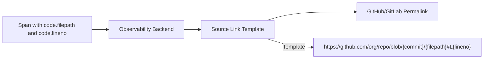

# How to Apply Code Attribute Semantic Conventions for Source Location

Author: [nawazdhandala](https://www.github.com/nawazdhandala)

Tags: OpenTelemetry, Semantic Conventions, Code Attributes, Source Location, Debugging, Observability

Description: Learn how to use OpenTelemetry code attribute semantic conventions to attach source file, function, and line number information to your telemetry data for faster debugging.

---

When a production alert fires at 3 AM, the first question is always "where in the code is this happening?" Trace spans and log entries tell you what happened, but without source location information you are left grep-searching through the codebase trying to find the relevant function. OpenTelemetry's code attribute semantic conventions solve this by attaching source file paths, function names, line numbers, and namespace information directly to your telemetry. This lets you jump straight from an alert or trace to the exact line of code responsible.

This guide covers the code attribute conventions, shows practical instrumentation patterns across languages, and discusses when and how to apply them effectively.

## The Code Attribute Namespace

The code attributes live under the `code` namespace in the OpenTelemetry semantic conventions. Here are the key attributes.

```text
# Code semantic convention attributes

code.function.name    - The name of the function or method
code.namespace        - The namespace or fully qualified class name
code.filepath         - The source file path
code.lineno           - The line number in the source file
code.column           - The column number in the source file
code.stacktrace       - A full stacktrace as a string
```

These attributes are typically added to spans, but they can also appear on log records and exception events. Together, they give you a precise pointer from your telemetry back to your source code.

## Basic Instrumentation in Python

Python's introspection capabilities make it straightforward to capture code attributes automatically.

```python
# code_attrs.py
# Helper functions to capture source location information
# and attach it to OpenTelemetry spans automatically.

import inspect
from opentelemetry import trace

tracer = trace.get_tracer("my-service", "1.0.0")

def add_code_attributes(span: trace.Span, stack_level: int = 1):
    """Add code location attributes to a span using the caller's frame.

    Args:
        span: The span to annotate
        stack_level: How many frames to walk up (1 = caller of this function)
    """
    # Get the caller's stack frame
    frame = inspect.stack()[stack_level]

    # Set the standard code attributes
    span.set_attribute("code.function.name", frame.function)
    span.set_attribute("code.filepath", frame.filename)
    span.set_attribute("code.lineno", frame.lineno)

    # If inside a class, capture the namespace
    if "self" in frame[0].f_locals:
        cls = frame[0].f_locals["self"].__class__
        span.set_attribute("code.namespace", f"{cls.__module__}.{cls.__name__}")
    elif "cls" in frame[0].f_locals:
        cls = frame[0].f_locals["cls"]
        span.set_attribute("code.namespace", f"{cls.__module__}.{cls.__name__}")
    else:
        # For module-level functions, use the module name
        span.set_attribute("code.namespace", frame[0].f_globals.get("__name__", ""))
```

This utility function inspects the call stack to find the caller's file, function name, and line number. Let us see it in action.

```python
# order_service.py
# Example service that uses code attributes for source location tracking.

from code_attrs import add_code_attributes, tracer

class OrderService:
    """Handles order processing with code-attributed spans."""

    def process_order(self, order_id: str, items: list) -> dict:
        """Process an order and return the result."""
        with tracer.start_as_current_span("process_order") as span:
            # Attach source location to this span
            # stack_level=2 because we are inside a context manager
            add_code_attributes(span, stack_level=2)

            # This span will now have:
            #   code.function.name = "process_order"
            #   code.namespace = "order_service.OrderService"
            #   code.filepath = "/app/order_service.py"
            #   code.lineno = 10

            result = self._validate_items(items)
            self._reserve_inventory(items)
            return self._create_order(order_id, items)

    def _validate_items(self, items: list) -> bool:
        """Validate that all items are available."""
        with tracer.start_as_current_span("validate_items") as span:
            add_code_attributes(span, stack_level=2)
            # Validation logic here
            return True
```

Every span now carries a pointer back to the exact function and line that created it. When you view this trace in your observability backend, you can click through to the source code directly.

## A Decorator Approach

Manually calling `add_code_attributes` in every function is tedious and easy to forget. A decorator makes it automatic.

```python
# traced.py
# Decorator that creates spans with code attributes automatically.
# This is the recommended approach for most applications.

import functools
import inspect
from opentelemetry import trace

tracer = trace.get_tracer("my-service", "1.0.0")

def traced(span_name: str = None):
    """Decorator that wraps a function with a span including code attributes.

    Args:
        span_name: Optional custom span name. Defaults to the function name.
    """
    def decorator(func):
        @functools.wraps(func)
        def wrapper(*args, **kwargs):
            # Use the provided name or fall back to the function name
            name = span_name or func.__name__

            with tracer.start_as_current_span(name) as span:
                # Get source information from the decorated function itself
                source_file = inspect.getfile(func)
                source_lines = inspect.getsourcelines(func)

                span.set_attribute("code.function.name", func.__name__)
                span.set_attribute("code.filepath", source_file)
                span.set_attribute("code.lineno", source_lines[1])

                # Determine namespace from the function's qualname
                if "." in func.__qualname__:
                    # Method inside a class
                    namespace = func.__module__ + "." + func.__qualname__.rsplit(".", 1)[0]
                else:
                    # Module-level function
                    namespace = func.__module__

                span.set_attribute("code.namespace", namespace)

                return func(*args, **kwargs)
        return wrapper
    return decorator

# Usage example
class PaymentService:

    @traced()
    def charge_card(self, card_token: str, amount: float) -> dict:
        """Charge a credit card. Span will automatically include code attributes."""
        # The span will have:
        #   code.function.name = "charge_card"
        #   code.namespace = "payment_service.PaymentService"
        #   code.filepath = "/app/payment_service.py"
        #   code.lineno = <line number of the function definition>
        return process_payment(card_token, amount)

    @traced("payment.refund")
    def refund_payment(self, payment_id: str) -> dict:
        """Refund a payment. Uses a custom span name but still has code attrs."""
        return process_refund(payment_id)
```

The decorator extracts all code location information from the decorated function's metadata. This works reliably because Python stores the source file and line number for every function object.

## Code Attributes in Go

Go does not have the same runtime introspection as Python, but the `runtime` package provides the necessary information.

```go
// codeattrs.go
// Utility for adding code semantic convention attributes to spans in Go.
// Uses the runtime package to inspect the call stack.

package tracing

import (
    "runtime"
    "strings"

    "go.opentelemetry.io/otel/attribute"
    "go.opentelemetry.io/otel/trace"
)

// AddCodeAttributes adds source location attributes to a span.
// The skip parameter controls how many stack frames to skip
// (0 = this function, 1 = caller, 2 = caller's caller).
func AddCodeAttributes(span trace.Span, skip int) {
    // runtime.Caller returns program counter, file, line, and ok
    pc, file, line, ok := runtime.Caller(skip + 1)
    if !ok {
        return
    }

    // Get the function details from the program counter
    fn := runtime.FuncForPC(pc)
    if fn == nil {
        return
    }

    fullName := fn.Name()

    // Split the full function name into namespace and function
    // Example: "github.com/myorg/myapp/services.OrderService.ProcessOrder"
    lastDot := strings.LastIndex(fullName, ".")
    var namespace, funcName string
    if lastDot >= 0 {
        namespace = fullName[:lastDot]
        funcName = fullName[lastDot+1:]
    } else {
        funcName = fullName
    }

    span.SetAttributes(
        attribute.String("code.function.name", funcName),
        attribute.String("code.namespace", namespace),
        attribute.String("code.filepath", file),
        attribute.Int("code.lineno", line),
    )
}
```

And here is how you use it in a Go service.

```go
// order_handler.go
// HTTP handler with code attributes on spans.

package handlers

import (
    "net/http"

    "go.opentelemetry.io/otel"
    "github.com/myorg/myapp/tracing"
)

var orderTracer = otel.Tracer("order-service")

func HandleCreateOrder(w http.ResponseWriter, r *http.Request) {
    ctx, span := orderTracer.Start(r.Context(), "create_order")
    defer span.End()

    // Add code attributes pointing to this function
    // skip=0 means "this function" (HandleCreateOrder)
    tracing.AddCodeAttributes(span, 0)

    // Business logic
    // ...
}
```

## Code Attributes in JavaScript/TypeScript

Node.js provides stack trace information through Error objects, which you can use to capture source locations.

```typescript
// codeAttrs.ts
// Adds code semantic convention attributes to OpenTelemetry spans.
// Works in Node.js by parsing Error stack traces.

import { Span } from '@opentelemetry/api';

interface CodeLocation {
  functionName: string;
  filePath: string;
  lineNumber: number;
  columnNumber: number;
}

function getCallerLocation(stackLevel: number = 1): CodeLocation | null {
  // Create an Error to capture the current stack trace
  const err = new Error();
  const stack = err.stack?.split('\n');

  if (!stack || stack.length < stackLevel + 2) {
    return null;
  }

  // Parse the stack frame at the desired level
  // Stack format: "    at FunctionName (filepath:line:column)"
  const frame = stack[stackLevel + 1];
  const match = frame.match(/at\s+(.+?)\s+\((.+?):(\d+):(\d+)\)/);

  if (!match) {
    return null;
  }

  return {
    functionName: match[1],
    filePath: match[2],
    lineNumber: parseInt(match[3], 10),
    columnNumber: parseInt(match[4], 10),
  };
}

export function addCodeAttributes(span: Span, stackLevel: number = 1): void {
  const location = getCallerLocation(stackLevel + 1);
  if (!location) return;

  span.setAttribute('code.function.name', location.functionName);
  span.setAttribute('code.filepath', location.filePath);
  span.setAttribute('code.lineno', location.lineNumber);
  span.setAttribute('code.column', location.columnNumber);

  // Extract namespace from function name if it contains a dot
  const lastDot = location.functionName.lastIndexOf('.');
  if (lastDot >= 0) {
    span.setAttribute(
      'code.namespace',
      location.functionName.substring(0, lastDot)
    );
  }
}
```

Note that JavaScript stack trace parsing is somewhat fragile because the format varies between engines. In production, consider using source maps in combination with these attributes when running transpiled code.

## Exception Events with Code Attributes

Code attributes are especially valuable on exception events. When an error occurs, you want to know exactly where in the code it originated.

```python
# exception_attrs.py
# Records exceptions with full code location context.
# The stacktrace attribute provides complete call chain information.

import traceback
from opentelemetry import trace

tracer = trace.get_tracer("my-service", "1.0.0")

def handle_with_code_context(func):
    """Decorator that captures exceptions with code location attributes."""

    @functools.wraps(func)
    def wrapper(*args, **kwargs):
        with tracer.start_as_current_span(func.__name__) as span:
            try:
                return func(*args, **kwargs)
            except Exception as e:
                # Record the exception event with code attributes
                span.set_status(trace.StatusCode.ERROR, str(e))

                # The stacktrace attribute captures the full call chain
                span.set_attribute(
                    "code.stacktrace",
                    traceback.format_exc()
                )

                # Also set the specific location where the error was caught
                span.set_attribute("code.function.name", func.__name__)
                span.set_attribute("code.filepath", inspect.getfile(func))
                span.set_attribute("code.lineno", inspect.getsourcelines(func)[1])

                # Record as a span event for structured exception data
                span.record_exception(e, attributes={
                    "code.function.name": func.__name__,
                    "code.filepath": inspect.getfile(func),
                })

                raise
    return wrapper
```

When this exception shows up in your observability backend, you immediately see the full stacktrace, the function name, the file path, and the line number. No more guessing which code path led to the error.

## Integration with Source Code Linking

The real power of code attributes comes when your observability platform can link directly to your source code repository. Many backends support configuring a source link template.



Configure your backend to generate links using a pattern like `https://github.com/myorg/myrepo/blob/main/{code.filepath}#L{code.lineno}`. When an engineer views a span or error, they get a clickable link that opens the exact file and line in their source repository.

## Performance Considerations

Capturing code attributes has a small but measurable performance cost. Stack introspection and frame inspection are not free operations. Here are some guidelines.

For hot paths that execute thousands of times per second, avoid capturing code attributes on every invocation. The overhead of `inspect.stack()` in Python or `runtime.Caller()` in Go adds up at high volumes. Instead, capture code attributes on entry-point spans and error paths where the debugging value is highest.

For background jobs, batch processors, and lower-throughput operations, the overhead is negligible. Add code attributes liberally in these contexts.

```python
# selective_attrs.py
# Demonstrates selective application of code attributes
# based on the span's importance and the operation's throughput.

from opentelemetry import trace

tracer = trace.get_tracer("my-service", "1.0.0")

# High-throughput path: skip code attributes on inner spans
def process_message_batch(messages: list):
    with tracer.start_as_current_span("process_batch") as batch_span:
        # Add code attributes to the batch span (called once)
        add_code_attributes(batch_span, stack_level=2)

        for msg in messages:
            with tracer.start_as_current_span("process_message") as msg_span:
                # Skip code attributes on per-message spans (called many times)
                msg_span.set_attribute("messaging.message.id", msg.id)
                handle_message(msg)

# Error path: always add code attributes for debugging
def handle_message(msg):
    try:
        process(msg)
    except Exception as e:
        span = trace.get_current_span()
        # Errors are rare but high-value for debugging
        add_code_attributes(span, stack_level=1)
        span.record_exception(e)
        raise
```

This selective approach gives you code location data where it matters most without paying the cost on every single span.

## Practical Advice

Start by adding code attributes to your top-level service entry points and error handling paths. These are the places where source location information provides the most value during incident response. As you build confidence in the pattern, expand to internal service boundaries and complex business logic functions. Avoid adding code attributes to trivial utility functions or framework-internal spans where the source location is not useful for debugging.

Code attributes bridge the gap between your telemetry data and your source code. They turn abstract span names into concrete pointers that engineers can follow during incidents. Combined with source code linking in your observability backend, they create a workflow where going from alert to root cause takes seconds instead of minutes.
